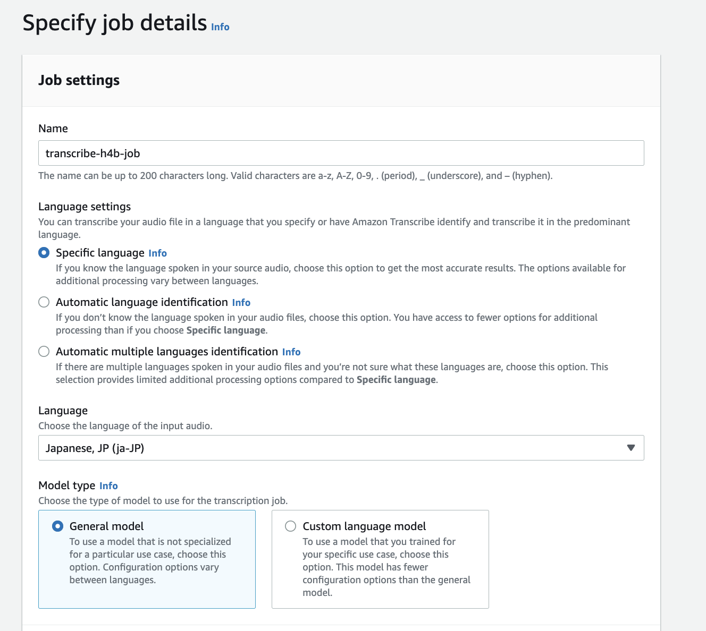
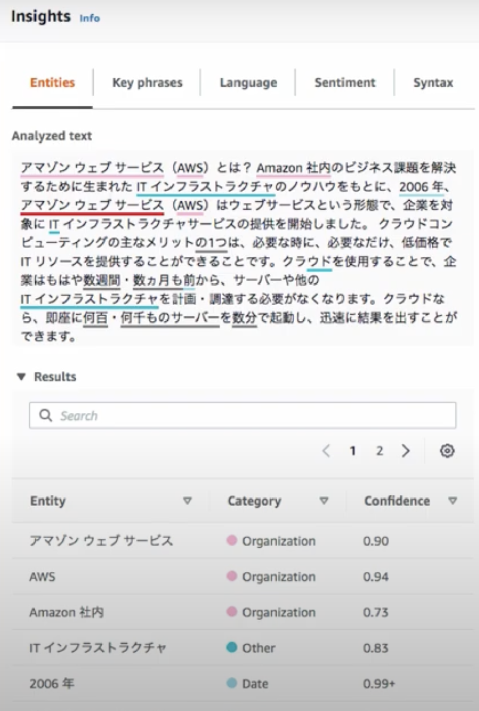

# AIサービス
## Amazon Transcribe
音声をテキストに変換する文字起こしサービス
日本語に対応しているが、リアルタイム変換は日本語未対応

### 使い方
amazon transcribeのページからjobを作成
- Name:ジョブの名前(ユニークにする必要がある)
- Language:扱う言語
- Input data:s3にあるオブジェクトのURI
- Output data:Customer specifedを選択して、s3オブジェクトのURI




Inputで指定した音声ファイルを文字起こししてOutputのフォルダにjsonファイルを出力する。

```
{
	"jobName": "transcribe-h4b-job",
	"accountId": "448323740997",
	"results": {
		"transcripts": [
			{
				"transcript": "ハンズオン順調ですか手を動かすの楽しいですよね"
			}
		],
		"items": [
			{
				"start_time": "0.0",
				"end_time": "0.72",
				"alternatives": [
					{
						"confidence": "0.9941",
						"content": "ハンズオン"
					}
				],
				"type": "pronunciation"
			},
			{
				"start_time": "0.72",
				"end_time": "1.23",
				"alternatives": [
					{
						"confidence": "1.0",
						"content": "順調"
					}
				],
				"type": "pronunciation"
			},
			{
				"start_time": "1.23",
				"end_time": "1.5",
				"alternatives": [
					{
						"confidence": "1.0",
						"content": "です"
					}
				],
				"type": "pronunciation"
			},
			{
				"start_time": "1.5",
				"end_time": "1.74",
				"alternatives": [
					{
						"confidence": "1.0",
						"content": "か"
					}
				],
				"type": "pronunciation"
			},
			{
				"start_time": "2.16",
				"end_time": "2.32",
				"alternatives": [
					{
						"confidence": "0.9835",
						"content": "手"
					}
				],
				"type": "pronunciation"
			},
			{
				"start_time": "2.32",
				"end_time": "2.53",
				"alternatives": [
					{
						"confidence": "1.0",
						"content": "を"
					}
				],
				"type": "pronunciation"
			},
			{
				"start_time": "2.53",
				"end_time": "3.02",
				"alternatives": [
					{
						"confidence": "1.0",
						"content": "動かす"
					}
				],
				"type": "pronunciation"
			},
			{
				"start_time": "3.02",
				"end_time": "3.2",
				"alternatives": [
					{
						"confidence": "1.0",
						"content": "の"
					}
				],
				"type": "pronunciation"
			},
			{
				"start_time": "3.39",
				"end_time": "3.94",
				"alternatives": [
					{
						"confidence": "0.8797",
						"content": "楽しい"
					}
				],
				"type": "pronunciation"
			},
			{
				"start_time": "3.94",
				"end_time": "4.22",
				"alternatives": [
					{
						"confidence": "1.0",
						"content": "です"
					}
				],
				"type": "pronunciation"
			},
			{
				"start_time": "4.22",
				"end_time": "4.39",
				"alternatives": [
					{
						"confidence": "1.0",
						"content": "よ"
					}
				],
				"type": "pronunciation"
			},
			{
				"start_time": "4.39",
				"end_time": "4.62",
				"alternatives": [
					{
						"confidence": "0.9965",
						"content": "ね"
					}
				],
				"type": "pronunciation"
			}
		]
	},
	"status": "COMPLETED"
}
```


## Amazon Polly
テキストを音声に変換するサービス  
SSMLというマークアップ言語で指定すると、音声に変換してくれる。  
アクセントの変更はLexiconで設定できる。

SSMLの例文、タグで囲むことで囁きや声量を変更できる。
```
<speak>
   <amazon:effect name="whispered" >こんにちは</amazon:effect>
   ミズキです。
   <prosody volume="x-loud">読みたいテキストをここに入力してください。</prosody>
</speak>
```
作成した音声ファイルは、画面の「S3に保存」からS3に格納できる


## Amazon Comprehend
キーフレーズの取得やエンティティ取得、感情分析(Sentiment)を行う。




Lambdaから呼び出す時の関数の設定方法は[リファレンス](https://boto3.amazonaws.com/v1/documentation/api/latest/reference/services/comprehend.html#Comprehend.Client.detect_sentiment)参照  
今回は感情を分析する`detect_sentiment`の例


インプットの形式
```
response = client.detect_sentiment(
    Text='string',
    LanguageCode='en'|'es'|'fr'|'de'|'it'|'pt'|'ar'|'hi'|'ja'|'ko'|'zh'|'zh-TW'
)
```

アウトプットの形式
```
{
    'Sentiment': 'POSITIVE'|'NEGATIVE'|'NEUTRAL'|'MIXED',
    'SentimentScore': {
        'Positive': ...,
        'Negative': ...,
        'Neutral': ...,
        'Mixed': ...
    }
}
```


