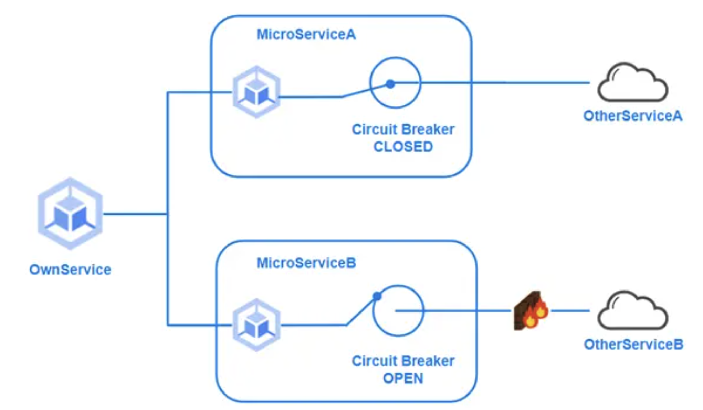
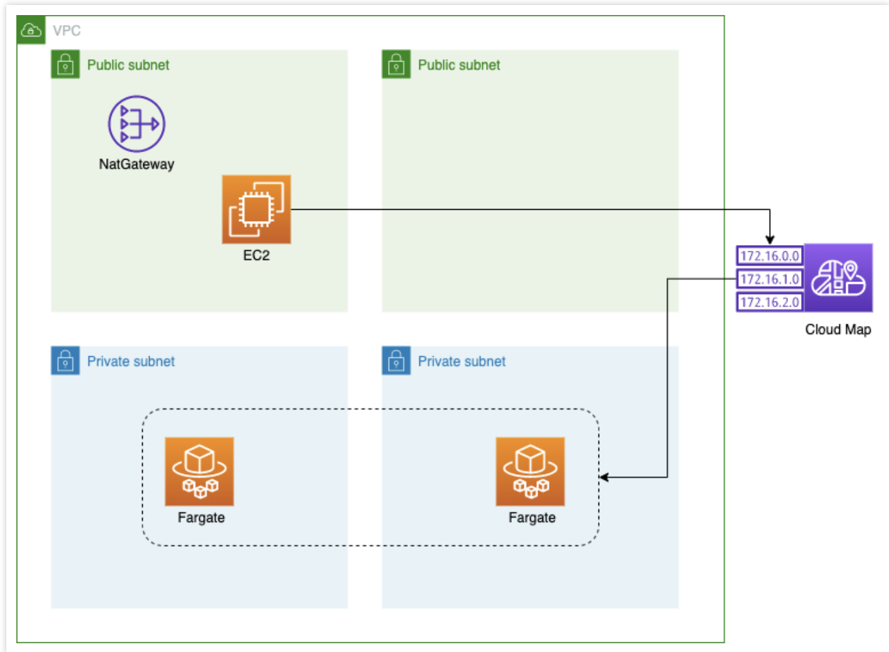
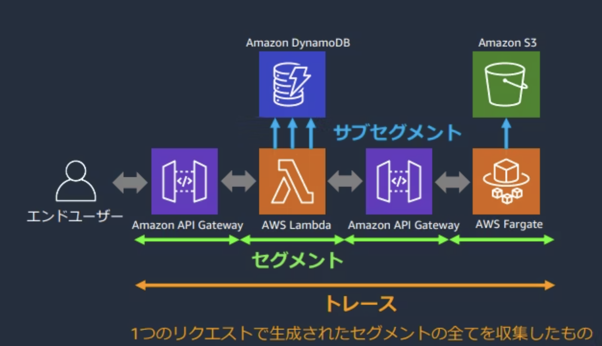

# AWS 

## モダンアプリケーション
モダンアプリケーションとは、`Appの設計構築管理を継続的に見直して、常に変化を受け入れられる準備をした開発戦略`である。
これによって、イノベーションのためのAppに対して、開発がボトルネックになることを避ける。

サーバーレスなアプリケーションやマイクロサービスアーキテクチャもモダンなアプリケーションの一つと言える。

AWSなどのパブリッククラウドを利用することで、モダンアプリケーションを構築することができる。

### モダンアプリケーションのメリット
モダンアプリケーションにより、以下のようなメリットを得ることができる。
- 何を作るか  
    マイクロサービスなど変化に強くイノベーションを促進するサービス
- どう提供するか  
    CICDなど自動化された高速な市場投入
- いくらかかるか  
    必要な料金だけ払う従量課金

### モダンなアプリケーションのベストプラクティス
2016年にPivotalが提唱した、クラウド開発における15のベストプラクティスである`Beyond the Twelve-Factor App`を踏まえたAppを開発することがベストプラクティスなモダンアプリケーション開発の一歩。15のベストプラクティスは以下で、詳細は[別記事](https://blog.flinters.co.jp/entry/2023/02/20/120000)を参照。

1. One codebase, one application （1コードベース、1アプリケーション）
1. API first（APIファースト）
1. Dependency management（依存関係管理）
1. Design, build, release, and run（デザイン、ビルド、リリース、実行）
1. Configuration, credentials, and code（設定、機密情報、コード）
1. Logs（ログ）
1. Disposability（廃棄容易性）
1. APIBacking services（バックエンドサービス）
1. Environment parity（環境一致）
1. Administrative processes（管理プロセス）
1. Port binding（ポートバインディング）
1. Stateless processes（ステートレスプロセス）
1. Concurrency（並行性）
1. Teremetry（テレメトリ）
1. Authentication and authorization（認証、認可）

### データの可視化
モダンアプリケーションに限らず、App開発において、`何を収集して、何を可視化するか`という可視化戦略は非常に重要。データを収集することで、システム内部で何が起きているか説明でき、今後のAppの方針を検討することができることが重要。

特にモダンアプリケーションはApp全体や特定サービスごとに取得するサービスも異なる。

収集するべきデータの種別としては以下の3つに分類できる。
- ビジネスデータ
- 運用データ
- システムデータ

■ビジネスデータ  
経営陣が経営方針を判断するために必要なデータであり、何を収集するかについては、経営陣にヒアリングして決まる。ログを一箇所に集めておき、必要なデータをフィルタリングして収集するようなパターンが挙げられる。

■運用データ  
サービスの運用状況を把握するために収集されるデータであり、開発と運用チームがサービスを改善していくために利用するデータ（アラームの発砲数など）

■システムデータ  
インフラやAppの状況を可視化するためのデータであり、リクエスト駆動やキューイングサービスごとに収集するべき指標が異なる。リクエスト駆動であればRED（R:Request/処理数)(E:Errors/エラー数)(D:Duration/処理時間)を収集することが多く、キューイングサービスであれば[USE](https://www.brendangregg.com/usemethod.html)(U:Utilization:タスク処理数)(S:Saturation:キューイング数)(E:Errors/エラー数)を利用することが多い。

## モダンアプリケーションパターン
モダンAppを開発、構築する上での課題を解決するようなベストプラクティスパターンを紹介する

### SPA(Single Page Application)
バックエンドがAPI化されたことを利用して、フロントエンドの画面描画を短縮するための技術。
静的コンテンツ(frontend)と動的コンテンツ(backend)を分割することで、

### BFF
APIを集約して、単一の問合せにすると問合せが複雑になってしまう課題が存在する。
それに対して、問合せと返り値を整形して返してくれる集約してくれるBFFを適用する。

### メッセージング
キューイングサービスを利用することで、サービス間を疎結合にする。

### Saga
非同期通信における`サービスにまたがったデータの整合性を維持する`  

モノリスの場合は、データベースに対して、ロールバックをすれば良いがマイクロサービスなどの複数サービスが関わる場合、DBもそれぞれのサービスが扱うため、データの整合性を担保する仕組みが必要となる。

この課題に対して、補償トランザクション用のエンドポイントを用意しておき、別サービスからコミットを取り消せるようにしておく。
保証の方法は、中央集権的に管理するオーケストレーション方式と、各サービスが独立的に保証するコレオグラフィ方式（ダンスの振付）がある。
- オーケストレーション   
    オーケストレーター（指揮者）がサービスの実行を中堅集権的に監視して処理の判断を進める  
    例えば、Step-Functionを利用した管理はオーケストレーションの方式の一例
- コレオグラフィ  
    それぞれのサービスを指揮する役割はなく、各自が独立しして自律的に協調的な処理を行う。
    ロールバックが必要な場合はサービスが責任を持って、別サービスに対してロールバックの処理を依頼する。

### CQRS
アクセスパターンやユースケースの違いに対応するために、データ登録(Command)とデータ参照(Query)の責任を分離する（Responsibility Segregation）考え方。
分離することで、それぞれの特徴に合った別のDBを選択するような選択肢を取ることもできる。

CQRSの例として、データ登録先はDynamoDBにしておき、そのデータをDynamoDB StreamsでRDSに登録して、データ参照はRDSから刺せるような方式が挙げられる。

### イベントソーシング
イベントをログとして耐久性のあるストレージに保存して、他のサービスから参照できるようにしておく。

### サーキットブレーカー
同期的な通信において、障害が発生した場合に全体への影響を抑えるための機能。
例えば、連携先のサービスがサービスストップしていた場合に、検知できていないと呼び出し元がリトライをしたり、処理を待ってしまう。

連携先のサービスを監視しておいて、連携先の挙動に対して怪しければサーキットブレーカーが通信を止めて、元々設定していたエラー処理を返す。
あたかもブレーカーを落としたかのように処理を止めるのでサーキットブレーカーと呼ぶ。

### サービスディスカバリ
サービスが増えてきたときに、毎回ALBを設定すると大変なので、サービスが立ち上がったときに「サービスレジストリ」に対して、接続先を登録する。
接続をしたいときには、サービスレジストリに問い合わせをして、接続先を調べる。

AWSで言うとCloud Mapというサービスディスカバリサービスを利用することで、ALBのようなリッチなサービスを利用せずに、シンプルにアプリケーションを構成することができる。

### サービスメッシュ
前提として、ネットワークは信頼できないものである、という考えがある。
APIを呼び出すためには、リトライやヘルスチェック先ほど話したサーキットブレーカー、サービスディスカバリ、ログ機能などが必要となる。

サービスメッシュとは、これらの通信向けの共通機能を各アプリケーションに持たせるのではなくインフラ側が制御する方式である。

AWSではApp Meshと呼ばれるサービスがあり、OSSのEnvoyのフルマネージドサービスとなる。

### フィーチャーフラグ
CICDの環境を構築するなどして、リリースの回数を増やしていき、提供スピードを上げることはモダンアプリケーションでは重要である。
リリースとブランチ戦略は密接に関連しており、mainブランチへの統合は短ければ短いほど、コンフリクトを減らし、整合性を高めることができる。
長命なブランチを許さないトランクベース開発が推奨されている。

フィーチャーフラグとは、リリースのタイミングで、サービスの変更を忍ばしておいて、フラグでコードを変更するだけで変更分をリリースするような方法で、ソースコード変更とリリースタイミングを調整する方法

AWSではAWS CloudWatch Evidentlyでフィーチャーフラグを管理することができる

### 分散トレーシング
マイクロサービスでは複数のサービスを跨いで、リクエストに紐づいた追跡が必要となる。

AWS X-RayやOpenTelemetryといったサービスがあり、以下のような単位でトレーシングを行う
- トレース：リクエストの一貫したトレーシング
- セグメント：Appの処理した詳細
- サブセグメント：Appがさらに他のサービスを呼び出した時のログ

