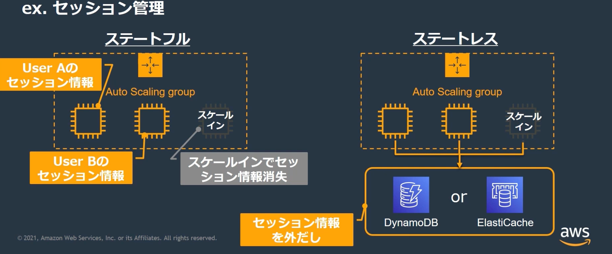
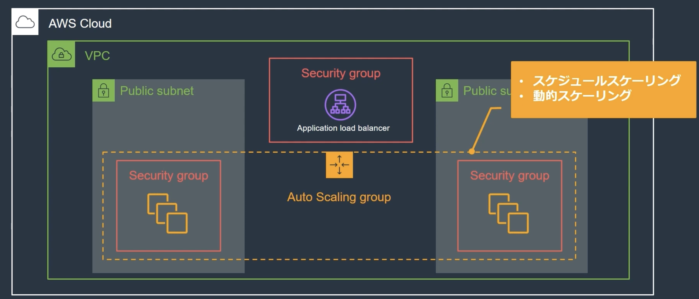
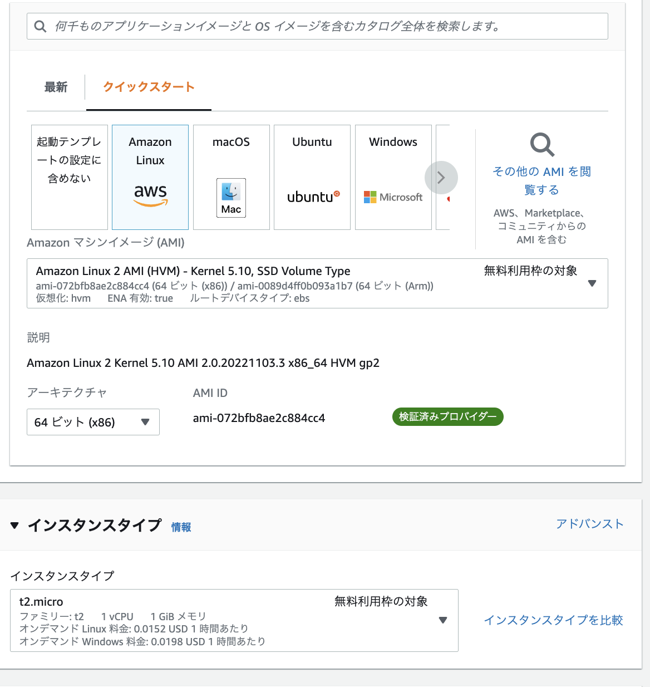
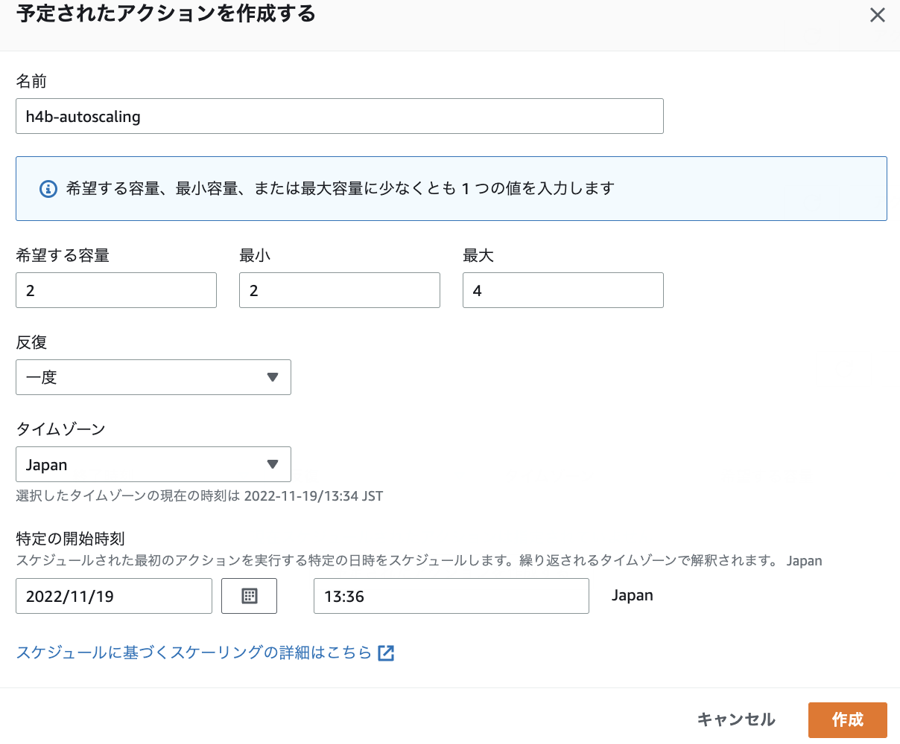
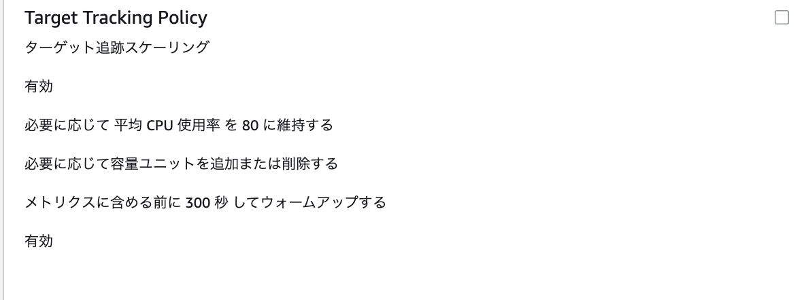
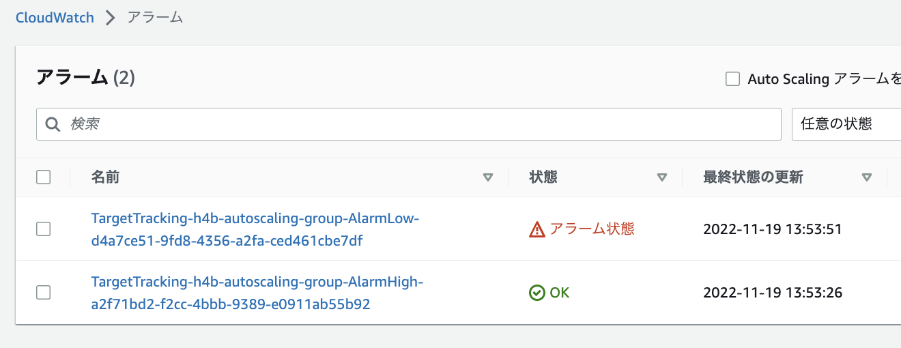

# AutoScaling
スケーリングの目的は、ビジネスにおける機会損失を防ぎつつ、余剰リソースによるコスト増大を防ぐこと

リソースが少なすぎるとユーザビリティが低下して機会損失になり、リソースが多すぎると金銭的コストの損失となる


## EC2におけるオートスケーリング
### オートスケーリング設定のメリット
リソースの状況を踏まえて、台数の増減を自動で調整してくれるスケールアウトやスケールインを実行してくれることともに、 
異常なインスタンスの置き換えを行なって、可用性を担保してくれる。

Amazon EC2 AutoscalingはEC2のステータスチェックやELBのヘルスチェックに応じて、インスタンスの自動更新機能まで提供している。 
「希望する台数」に満たないような異常が発生した場合は、AutoScalingの設定が自動でインスタンスを作成してくれる。


### 設定項目
起動情報とAutoScaling情報を設定する。

起動情報は、起動するインスタンスに関する情報を設定（AMIなど）
- AMI
- インスタンスタイプ
- ネットワーク設定 etc

AutoScaing情報は監視するメトリクスやスケールインスケールアウトの台数などを設定する。
- どのテンプレートを利用するか
- 何台構成にするか
- スケールアウト・スケールインの台数
- トリガーの設定

### AutoScalingのトリガー種別
EC2を自動で追加や削除するための契機のパターン  
- スケジュールスケーリング：スケジュールに基いて、オートスケーリング
- 動的スケジューリング：需要の変化に動的に対応するようにオートスケーリング


## スケジュールスケーリング
予測ができる需要変化に対する対策。設定されたスケジュールに基づいてスケーリングする。


一度きりの実行や定期的なイベントとして、開始と終了の設定が可能。  
イメージとしては、決められた時間にAutoScalingのルールを上書きするイメージ


## 動的スケーリング
予測ができない需要への対策。設定した敷居位置に基づいて動的にスケーリングを行う。
注意としては、スケーリングには数分かかるので、リアルタイム性を求められる、スパイクアクセスへの対策時。


スケーリングポリシーには３種類存在する
- ターゲット追跡スケーリング
- ステップスケーリング
- シンプルなスケーリング

### ターゲット追跡スケーリング
設定したターゲット値を維持するようにスケールアウト・スケールインを行う


### ステップスケーリング
CloudWatchのメトリクスからえられる値の閾値を超えて発せられるアラームに対して、値ベースでスケーリングアクションを個別設定する。


## AutoScalingを設定する際の注意点
スケーリングによって、インスタンスが増減するので、特定のサーバーに依存するようなステートフルなアプリではなくて、ステートレスな作りが求められる。




## ECSにおけるオートスケーリング
起動テンプレートはタスク定義で作成されているので、設定不要。  
ECSのサービス設定の中で、何をメトリクスとして、スケーリングを行うのかを設定して、あとは台数などのスケールアウト設定をするだけで、実装できてしまう。

1. CloudWatchからalarmを設定する。
2. サービスのAutoScalingタブから設定を行う。
    - チェックするアラームを設定
    - スケーリングポリシーを設定

### スケールインにおけるタスクの保護
注意点で挙げたように、ステートレスなアプリにする必要があるが、タスクが処理中にスケールインされる問題はタスクが落ちないようにする保護の設定を入れることもできる。

ECSはアラームを監視して、スケールアウト、スケールインを実行する。  
タスクが処理を行なっているか否かを確認していないため、処理中のタスクが落ちてしまう可能性がある。  
対策として、[ECS タスクのスケールイン保護](https://aws.amazon.com/jp/blogs/news/announcing-amazon-ecs-task-scale-in-protection/)の処理を組み込む。

コンテナ内部からprotectionEnabled属性を設定することで、ECSタスクの停止を止めることができる。  
具体的には、[以下のコマンド](https://docs.aws.amazon.com/ja_jp/AmazonECS/latest/developerguide/task-scale-in-protection-endpoint.html)を処理の実行前と実行後に記述することで、処理中はタスクが落ちなくなる

$ECS_AGENT_URIは環境変数として、自動で設定されているのでユーザー側での設定は不要  
コンテナ内部のアプリケーション実行の前後に書き込むイメージ

```
PUT $ECS_AGENT_URI/task-protection/v1/state -d 
'{"ProtectionEnabled":true,"ExpiresInMinutes":60}'

#---
main()
#---

PUT $ECS_AGENT_URI/task-protection/v1/state -d 
'{"ProtectionEnabled":false,"ExpiresInMinutes":60}'

```

## H4B
AWSのハンズオン[Amazon EC2 Auto Scaling](https://pages.awscloud.com/JAPAN-event-OE-Hands-on-for-Beginners-Auto_Scaling-2022-confirmation_842.html)の内容




### 環境の準備
CloudFormationのテンプレートを使って、環境を構築する
- VPC
- サブネット
- ALB

### 起動テンプレートの作成
AWSのコンソールから、EC2へ移動して、ナビゲーションペインから「起動テンプレート」を選択  
AMIやインスタンスタイプを選択する。  



AutoScalingグループの設定で、起動するインスタンスの名前になるので、Nameタグはつけておく


オートスケーリングの設定をするため、高度な設定で、CloudWatchの有効かをONにしておく。  


ユーザーデータに、インスタンスを立てた時に実行するコマンドを渡せるので、apacheの設定を入れておく
```
#!/bin/bash
sudo yum update -y
sudo yum install -y httpd
sudo amazon-linux-extras install epel -y
sudo yum install stress -y
sudo systemctl start httpd
sudo echo `hostname` > /var/www/html/index.html
sudo echo "ClientAliveInterval 60" >> /etc/ssh/sshd_config
sudo echo "ClientAliveCountMax 120" >> /etc/ssh/sshd_config
sudo systemctl restart sshd.service
```


起動バージョンの修正について はバージョンが更新される形をとる。
デフォルトの起動バージョンは１になっているので、アクションから変更する。


### AutoScalingグループの作成
AWSのコンソールから、EC2へ移動して、ナビゲーションペインから「Auto Scalingグループ」を選択  
以下の設定を順次行なっていく
- 起動テンプレートの選択
- VPCおよびセキュリティグループの選択
- ロードバランサーの設定
- グループ際の設定：常時起動数、最小最大キャパシティ（今回は最小1、最大4、必要1）

AutoScalingのグループを作成すると、EC2が自動で起動する


#### スケジュールの設定
AutoScalingの自動スケーリングのタブから、スケジュールの設定ができる。  


スケジュールは「予定されたアクション」から、設定する。
新しい起動ルールを設定してあげるので、最小2、最大4、必要2）とする。



こうすると、設定した時間に起動ルールが上書きされる。


### ターゲット追跡スケーリングの設定
AutoScalingの自動スケーリングのタブから、スケジュールの設定ができる。

動的スケーリングポリシーを選択する。



動的スケーリングポリシーを作成すると、自動でクラウドウォッチ側にCPUなどのメトリクスを対象としてアラームを作ってくれる  
スケールアウトとスケールインするためのアラームが設定されている。  
Highがスケールアウト用、Lowがスケールイン用のもので、「閾値の設定が、３分内の３データポイント」になっているので、３分連続して閾値を超えるとスケーリングが実行される。



インスタンスに接続して以下のコマンドを実行するとCPUが負荷が高まるので、オートスケールが実行される
```
stress -c 1
```
