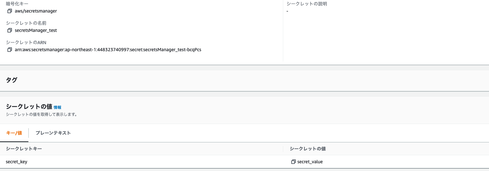
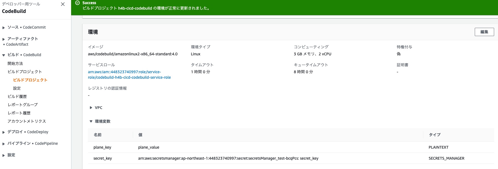
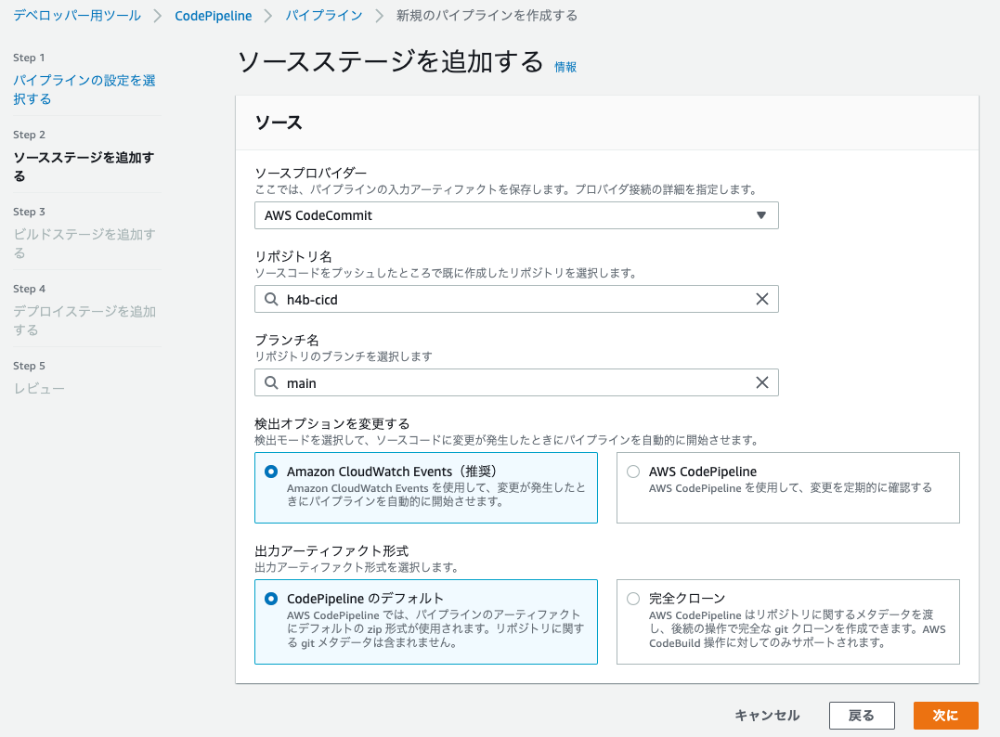
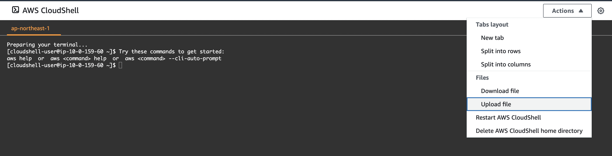
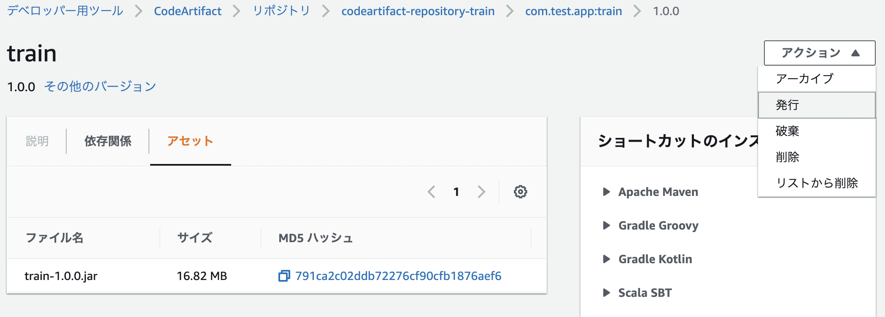
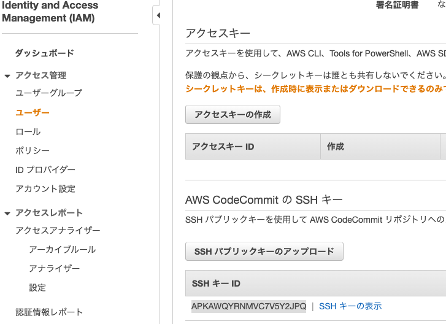

# Code Series
ソースコードの反映をトリガーとして、ビルドデプロイといった一連のデリバリーを支援するサービス群  
ソースコード管理サービスのCode Commit、ビルドサービスのCode Build、デプロイサービスのCode Deploy、これらの一連の処理を連携するデリバリーサービスのCodePipelineの総称

## Code Commit
フルマネージドなソース管理（git repository）サービス  
メリットとして、スケーラブルでセキュアであり、既存のgitツールともシームレスに連携
### 設定手順
1. リポジトリ名を作成
2. gitlabやgithubとの連携（別セクションで解説）


## Code Build
ソースコードをコンパイル・テスト実行して、デプロイ可能なSWパッケージを作成するフルマネージドなビルドサービス  
メリットとして、ビルド用のサーバのプロビジョニング・管理が不要となる  
codebuildの成果物はartifactと呼ばれる。

### 設定手順
1. codebuildプロジェクトの設定
   1. ソースプロバイダはcodecommitのリポジトリ
   2. build環境/ランタイムは適切なものを設定
   3. アーティファクトの設定
   4. ServiceRoleの設定 
2. buildspec.yamlの作成


buildspec.ymlの記載項目
  - version：buildspec.ymlファイルのバージョン指定0.2推奨
  - phases：ビルド実行時にCodeBuildが実行するコマンド
    - install：インストール時にCodeBuildが実行
    - pre_build：ビルド前にCodeBuildが実行（ECRへの認証など）
    - build：ビルド実行中にCodeBuildが実行
    - post_build：ビルド後にCodeBuildが実行(ECRへのpushなど)
  - artifacts：ビルドの出力結果の保存先
    - files：必須項目でデプロイする成果物を指定  
    '**/*'を指定するとディレクトリは以下全てをデプロイする資産として指定  
    - base-directory：デプロイ対象のルートディレクトリを指定

### buildspec.ymlにおける環境変数の設定
buildspec.ymlファイルに環境変数を設定する場合は、環境から環境変数を設定することができる。
また、secretsManagerと連携して、SecretsManagerの値を環境変数として渡すことができる。  
ただし、SecretManagerと連携するときはCodeBuildのServiceRoleにSecretManagerへのReadPolicyを追加する

SecretsManager側でSecretsを作成




codebuildで、環境変数を設定する。  
- planetext:key-valueを設定
- Secrets_Manager：secretmanager's arn:keyをvalueに設定




buildspec.yml内部では、設定した環境変数のkeyを${plane_key}や${secret_key}という形で指定すれば引用される。


## Code Deploy
EC2・Lambda・ECSに対してデプロイを行うサービス  
AutoScaling構成に対しても自動で反映してくれる

### 設定手順
1. codeDeploy用のRoleを作成する  
2. codeDeployのアプリケーション作成（詳細は各デプロイ先のセクション）


## Code Pipeline
フルマネージドな継続的デリバリーサービス  
ソースコードの変更をトリガーとして、ビルド・デプロイといった一連の流れを自動的に実行する
### 設定手順
1. ソースステージ設定  
CodeCommitとの連携を設定し、検知するリポジトリやブランチ名を設定する



2. ビルドステージ設定  
   - デプロイプロバイダーにCodeBuild
   - 設定済のアプリケーションやデプロイグループを選択

3. デプロイステージ設定  
デプロイ先を設定する。 S3への直接デプロイや、ECS/EC2へのデプロイが可能

## Code Artifact
アーティファクトを管理することができるリポジトリ   
AWS常にプライベートなリポジトリを作成して、自作のパッケージを共有できるという魅力がある  
ソースコードをビルドして生成されたパッケージを管理してくれる。  
対応はnpm(js),PyPI(python),maven(java)

### AWS CodeArtifactの設定
domainとdomain配下にrepositoryを作れば準備は完了。  
repositoryは各種アーティファクトのエンドポイントになる  
domainはrepositoryを集約する概念
- domainを作成（これは共通して１つで利用することが多い）
- repositoryを作成（これは機能ごとに作成する）


### Code Artifactへアーティファクトを登録する（curlから）
サードパーティのjarファイルなどをcodeArtifactで管理するしたい場合、localのjarファイルをcurlコマンドでcodeArtifactに登録できる

1. Cloud Shellを起動する
2. Cloud Shellへファイルをアップロードする



3. CodeArtifactの認証トークン取得（12時間期限あり
> export CODEARTIFACT_TOKEN=`aws codeartifact get-authorization-token --domain [MY_DOMAIN] --query authorizationToken --output text`

4. CodeArtifactへのアップロード  
以下の情報を設定する※登録するjarファイル名をアプリとバージョンの形にすること
    - MY_DOMAIN：CodeArtifactで作成したドメイン名
    - MY_REPOSITORY：CodeArtifactで作成したリポジトリ
    - MY_AWS_ID：自分のアカウントの12桁のID
    - MY-APP:登録するアプリのファイル名
    - VER：バージョン(1.0.0)
    - LOCAL-MY-APP：登録するファイル名
> curl --request PUT https://[MY_DOMAIN]-[MY_AWS_ID].d.codeartifact.ap-northeast-1.amazonaws.com/maven/[MY_REPOSITORY]/com/[MY_COMPANY]/app/[MY_APP]/[VER]/[MY_APP]-[VER].jar \
     --user "aws:$CODEARTIFACT_TOKEN" --header "Content-Type: application/octet-stream" \
     --data-binary @[LOCAL-MY-APP].jar

5. 公開設定  
curlコマンドで登録すると公開sれていないので、登録されたアーティファクトからアクションを選択して発行する。  
この発行をしないとアーティファクトを利用することができない点に注意





### Code Artifactへアーティファクトを登録する（mvnから）★実際にやりたい
mvnからライブラリをcodeArtifactに登録する場合、pom.xmlにdistributionManagerのセクションを追加して、codeartifactの情報を付与する。
codeartifactの認証情報はsettings.xmlに追記して、deploy時に指定する。

1. AWS CodeArtifactのTOKENの取得  
exportして環境変数として登録する（再掲）  
CICDの時はbuildspec.ymlのprebuildに記載
> export CODEARTIFACT_TOKEN=`aws codeartifact get-authorization-token --domain [MY_DOMAIN] --query authorizationToken --output text`


2. pom.xmlの修正  
distributionManagerにCodeArtifactの情報を記述。IDやNameは利用する際に使う。
```
<distributionManagement>
  <repository>
    <id>CODE_ARTIFACT_ID</id>
    <name>CODE_ARTIFACT_NAME</name>
    <url>https://[MY_DOMAIN]-[AWS_ID].d.codeartifact.ap-northeast-1.amazonaws.com/maven/[MY_REPOSITORY]/</url>
  </repository>
</distributionManagement>
```
3. settings.xmlの修正
CodeArtifactの認証情報を追加
```
<servers>
  <server>
    <id>CODE_ARTIFACT_ID</id>
    <username>aws</username>
    <password>${env.CODEARTIFACT_AUTH_TOKEN}</password>
  </server>
</servers>
```
4. mvn deploy
> mvn deploy -s settings.xml

5. AWSのマネジメントコンソールからアップロード資材を確認する


### Code Artifactの資材を呼び出してビルドする
codeArtifactに格納したライブラリの依存関係と接続先をpomに記述 

1. pom.xmlに接続先を記述
```
<profiles>
  <profile>
    <id>CODE_ARTIFACT_ID</id>
    <activation>
      <activeByDefault>true</activeByDefault>
    </activation>
    <repositories>
      <repository>
        <id>CODE_ARTIFACT_ID</id>
        <url>https://[MY_DOMAIN]-[AWS_ID].d.codeartifact.ap-northeast-1.amazonaws.com/maven/[MY_REPOSITORY]/</url>
      </repository>
    </repositories>
  </profile>
</profiles>

```
2. codeArtifactに依存関係を記述（codeArtifactのライブラリ)
AWSのConsoleを見ながら、設定する
```
<dependencies>
    <dependency>
        <groupId>com.[CodeArtifact].[App].[Path]</groupId>
        <artifactId>[Artifact]</artifactId>
        <version>[VER]</version>
    </dependency>
</dependencies>
```


## S3へのCICD
- S3に静的ウェブサイトホスティングを設定
- codecommitではビルドステージはスキップ
- デプロイステージでプロバイダーでS3を設定して、リージョンやバケットを選択


## EC2へのCICD
EC2の設定、buildspec.ymlではcodedeployのアプリケーションとの連携。
codedeployではappspec.ymlの作成が必要


### EC2の作成
1. artifactの格納場所作成(S3のバケット作成
2. タグ名でCICDの対象を設定できるので、タグ名を設定しておくと良い

3. EC2にcode deploy エージェントをインストールしておく  
[AWS Code Deploy エージェント](https://docs.aws.amazon.com/ja_jp/codedeploy/latest/userguide/codedeploy-agent-operations-install.html)のコマンドラインからのインストールを実行

> wget https://aws-codedeploy-ap-northeast-1.s3.ap-northeast-1.amazonaws.com/latest/install


### buildspec.ymlの作成
aws deploy pushでcodedeployのアプリケーションの対象設定をする。
```
version: 0.2

phases:
  build:
    commands:
      - aws deploy push --application-name [YOUT_CODEDEPLOY_APPLICATION_NAME] --s3-location s3://[YOUR_BUCKT_NAME]/artifact.zip --source src
artifacts:
  files:
    - '**/*'
  base-directory: src
```

### appspec.ymlの作成
フォルダ構成
```
|-src
|  |---index.html
|  |---appspec.yml
|
|-buidlspe.yaml
```

appspec.ymlの記載項目
- version：0.0のみ
- os：linux or Windows
- files：ビルドした結果をどこに配置するかの設定
- hook：インストール前後の処理

appspec.yml(httpdがEC2にインストールされている場合）
```
version: 0.0
os: linux
files:
  - source: index.html
    destination: /var/www/html/
```


### トラブルシューティング
- codeBuildを手動で実行するとエラー

> [Container] 2022/10/23 13:46:20 Phase context status code: COMMAND_EXECUTION_ERROR Message: Error while executing command: aws deploy push --application-name h4b-cicd-codedeploy-application --s3-location s3://h4b-cicd-artifact-fujisiroms/artifact.zip --source src. Reason: exit status 255

appspec.ymlがsrcディレクトリは以下になかったことが原因


- codeDeployを手動で実行するとエラー
> The overall deployment failed because too many individual instances failed deployment, too few healthy instances are available for deployment, or some instances in your deployment group are experiencing problems.

appspec.ymlの文法がミスったまま、Deployしていたのが原因。appspec.ymlを修正してからbuildとdeployを実行


## ECRへのCICD
buildspec.ymlではimagedefinitions.jsonを作成する設定が必要。
ECSにデプロイするための、Serviceロールの追加が必要。

### CodeBuildの設定
- buildspec.ymlの作成  
  - ECRへのpushまでを設定する
  - imagedefinitions.jsonはdeployの際にタスクやサービスを変更するときに利用する。
- サービスロールに`AmazonEC2ContainerRegistryPowerUser`を付与する
```
version: 0.2

phases:
pre_build:
commands:
- echo Logging in to Amazon ECR...
- aws --version
- $(aws ecr get-login --region ${AWS_DEFAULT_REGION})
- REPOSITORY_URI=${AWS_ACCOUNT_ID}.dkr.ecr.${AWS_DEFAULT_REGION}.amazonaws.com/${IMAGE_NAME}
- IMAGE_TAG=$(echo $CODEBUILD_RESOLVED_SOURCE_VERSION | cut -c 1-7)
build:
commands:
- echo Build started on `date`
- echo Building the Docker image...
- docker build -t $REPOSITORY_URI:latest .
- docker tag $REPOSITORY_URI:latest $REPOSITORY_URI:$IMAGE_TAG
post_build:
commands:
- echo Build completed on `date`
- echo Pushing the Docker images...
- docker push $REPOSITORY_URI:latest
- docker push $REPOSITORY_URI:$IMAGE_TAG
- echo Writing image definitions file...
- echo "[{\"name\":\"${IMAGE_NAME}\",\"imageUri\":\"${REPOSITORY_URI}:${IMAGE_TAG}\"}]" > imagedefinitions.json
artifacts:
files: imagedefinitions.json
```

#### javaをデプロイする場合の各種設定情報
- javaを利用する場合のOSはUbuntsuを選択。
- ランタイムはスタンダート
- イメージは4.0がUbuntsuのver18で、5.0がver20


### codedeployの設定
codepipelineから順次設定をして、デプロイステージにおいて、クラスター名やサービス名を選択するだけ。

### トラブルシューティング：Too Many Requests. でビルドが失敗する
> error pulling image configuration: toomanyrequests: Too Many Requests. Please see https://docs.docker.com/docker-hub/download-rate-limit/

#### 原因
2020年8月に Docker Hub ではコンテナイメージの Pull 回数にレート制限を設けることを発表している。  
CodeBuild を非 VPC 環境のプロジェクトとして作成している場合、CodeBuild のグローバル IP は共通アドレスが利用されているため、 自分のビルド環境が 6 時間以内で 1 回目の pull だったとしても、そのときに割り当てられていた CodeBuild のグローバル IP が 6時間以内で 101 回目の pull であった場合、そのリクエストは Too Many Requests. になります。


#### 対策:build中に、dockerhubにログインする
1. SecretsManagerにdockerhubのログインIDとPasswordを設定（例えばusernameとpassword)※ログインIDは一律で小文字にしないとエラーが出る
2. codebuildの環境変数でsecretManagerとの連携を設定する
3. buildspec.ymlで環境変数を受け取り、dockerhubにログインする
```
phases:
  pre_build:
    commands:
      # ECR へのログイン 
      - echo Logging in to Amazon ECR...
      - $(aws ecr get-login --no-include-email --region $AWS_DEFAULT_REGION)
      # Docker Hub へのログイン
      - echo Logging in to Docker Hub...
      - echo $DOCKERHUB_PASS | docker login -u $DOCKERHUB_USER --password-stdin
      # コミット ID をイメージタグに設定
      - IMAGE_TAG=$CODEBUILD_RESOLVED_SOURCE_VERSION
```


## githubとCodeCommitのミラーリング
- 公開鍵・秘密鍵の作成  
LocalPCで以下を実行
> ssh-keygen -t rsa -b 4096 -m PEM -C <メールアドレス>

作成された公開鍵と秘密鍵は以下コマンドでクリップボードにコピーすると扱いやすい
> pbcopy < ~/.ssh/id_rsa.pub

> pbcopy < ~/.ssh/id_rsa


- IAMユーザーに公開鍵を紐づける  
IAM>アクセス管理>ユーザー>AWS CodeCommitのSSHキーにパブリックキーをアップロード  
SSHキーの`ID`をメモしておく



- githubに秘密鍵をSecretes登録  
github>Setting>Secrets>Actions>New repository secrets  
以下の情報を登録
  - 秘密鍵
    - Name:CODECOMMIT_SSH_PRIVATE_KEY
    - Value:プライベートキーの中身
  - SSHキーID
    - Name：CODECOMMIT_SSH_PRIVATE_KEY_ID
    - Value：SSHキーのID


- githubとgitcommitを紐づける  
github>Actions>New Work Flow>set up a workflow

```
name: Mirroring

on: [ push, delete ]

jobs:
  to_codecommit:
    runs-on: ubuntu-20.04
    steps:
      - uses: actions/checkout@v1
      - uses: pixta-dev/repository-mirroring-action@v1
        with:
          target_repo_url:
            ssh://git-codecommit.ap-northeast-1.amazonaws.com/v1/repos/[YOUR REPOSITORY NAME]
          ssh_private_key:
            ${{ secrets.CODECOMMIT_SSH_PRIVATE_KEY }}
          ssh_username:
            ${{ secrets.CODECOMMIT_SSH_PRIVATE_KEY_ID }}
```

- 動作確認  
localにgithubのリポジトリをcloneして、新しいブランチを作ったり、ファイル編集してから、gitpushすると、codeCommitにまで反映されている  


## References
- [GitHubをCodeCommitにミラーリングする](https://chibinfra-techblog.com/github-with-aws-codecommit/)
- [buildspec.ymlコマンド](https://qiita.com/s_ryota/items/803b44caacac12fd2439)
- [Codebuild の buildspec.yaml](https://qiita.com/leomaro7/items/1eca2b814930f98f3ff9)
- [Codedeploy の 概要や appspec.yaml](https://qiita.com/leomaro7/items/40f126a4f0c23d511e88)
- [“Too Many Requests.” でビルドが失敗する](https://dev.classmethod.jp/articles/codebuild-has-to-use-dockerhub-login-to-avoid-ip-gacha/)
- [codeArtifactの利用方法](https://qiita.com/charon/items/057da67e810a0ba96fed)
- [codeArtifactのCICD](https://qiita.com/neruneruo/items/c231d64bb1eb52ca8fa9)
- [codeArtifactのcurlコマンド](https://docs.aws.amazon.com/ja_jp/codeartifact/latest/ug/maven-curl.html)