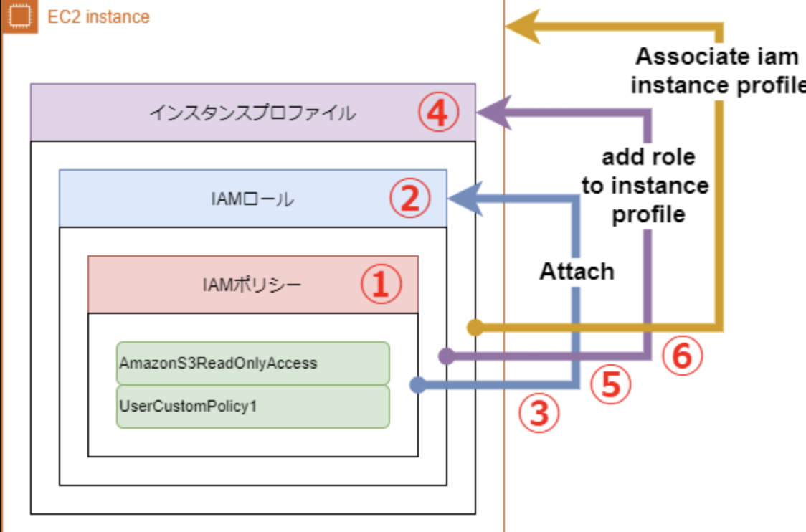

# EC2

## インスタンスメタデータ
`169.254.169.254`→`10.100.100`と`111.111.10`にアクセスするとEC2のホスト名などにアクセスすることができる。

## IAM関連
### インスタンスプロファイル
普段コンソール上からEC2にIAMロールを結びづけているが、内部的にはEC2とIAMロールを直接結びづけることはできない。
実態としては`インスタンスプロファイル`経由でIAMロールを結びづけている。

[ポリシーロールの整理](https://qiita.com/sakai00kou/items/a4b96dcfa6bb3e656cd9)この記事が全体を整理しているので、IAMと合わせてドキュメントに落とし込みたい。

## EC2フリート
通常のインスタンス群に設定するよりも柔軟な拡張性が担保される

## スポットフリート
スポットインスタンスのセットで、ニーズに合うスポットキャパシティプールを作成する

## EC2プレイスメントグループ
インスタンスのトラフィックを高速化するグルーーぷ