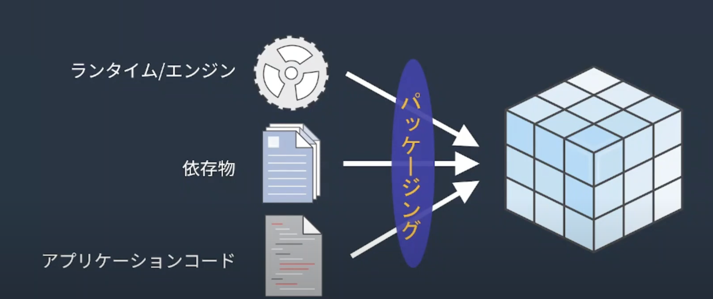
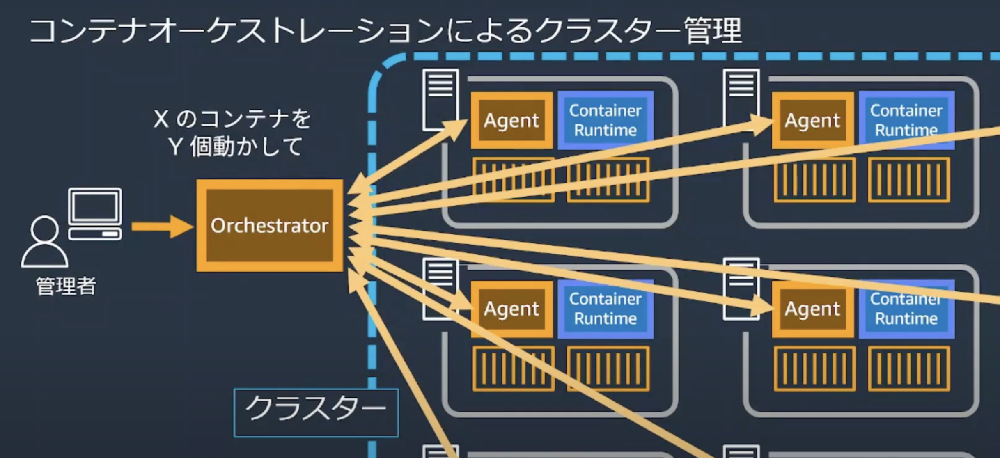
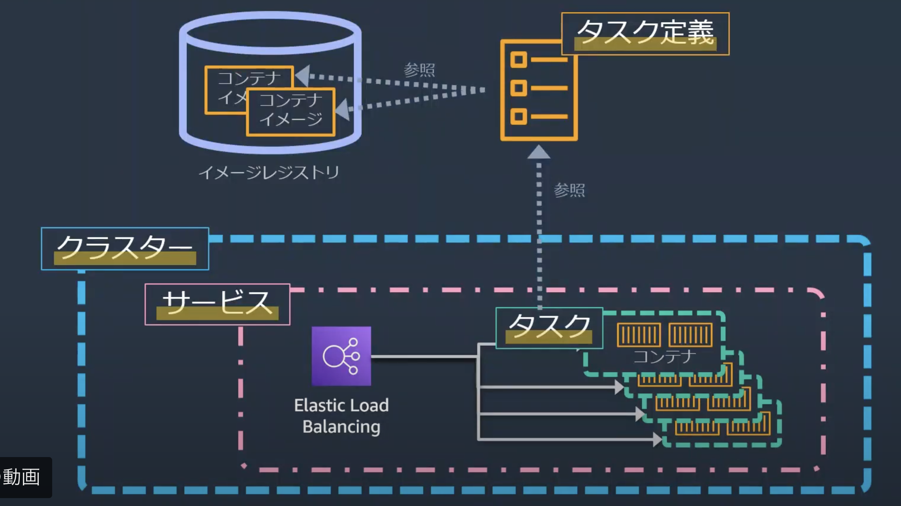
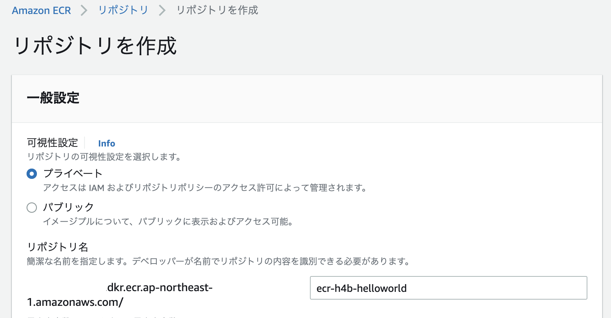
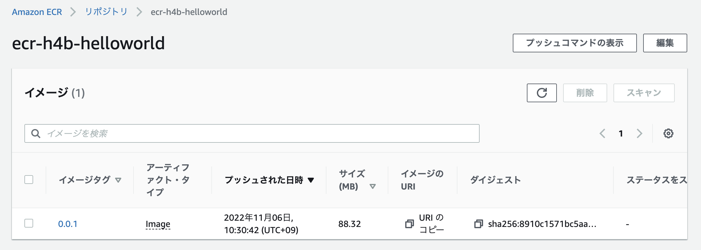
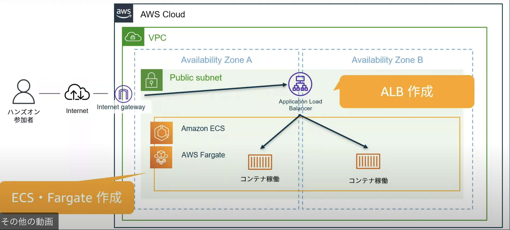
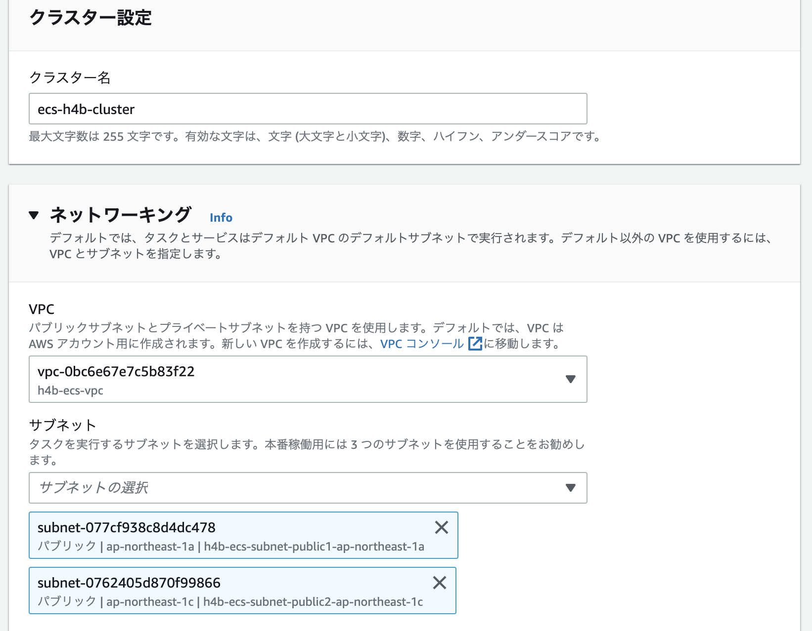
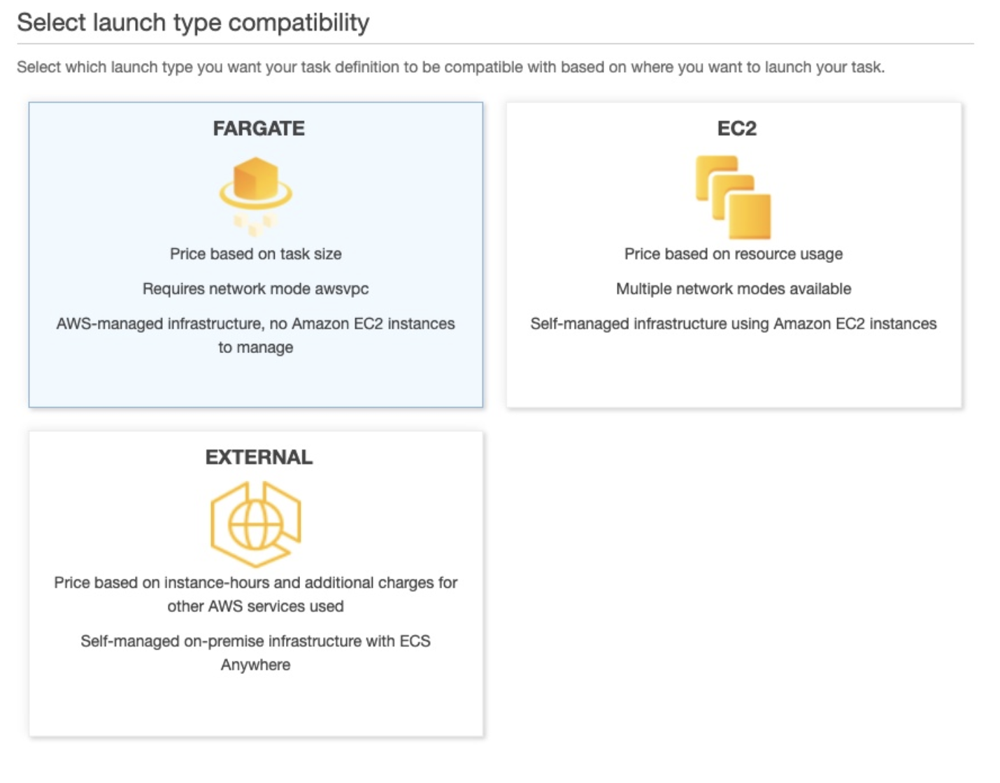
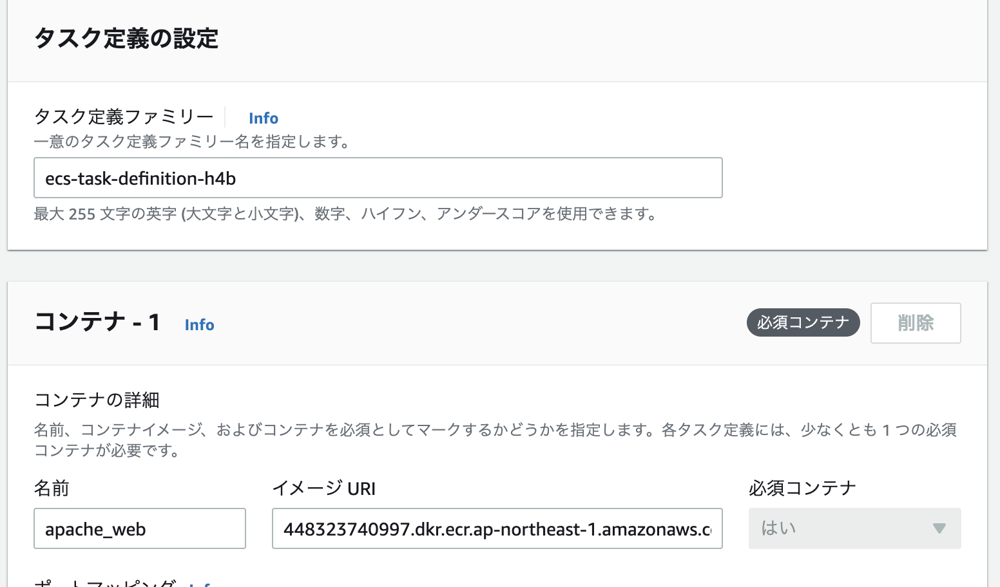

# ECS

## コンテナのメリット
価値の大きいサービス、プロダクトを提供するためには、環境の変化に対応する必要がある。
このニーズに応えるために、価値提供サイクルを早めること、すなわちリリースの速度の高速化が求められている。
開発者がアプリケーション開発に集中し、俊敏なリリースをする環境が重要である。

これらの課題を解決するのがコンテナである。
ランタイムや依存物といった環境間の差分をなくし、リリースを素早くすることができる。



さらに、オーケストレーターによってコンテナのデプロイやスケーリングといった作業は自動化することができる。



## ECS(Elastic Container Service)
コンテナオーケストレーションサービスで、なんのコンテナをどう動かすのか命令を出す。

ECSでは、４つの重要な構成要素がある
- クラスター
- タスク定義
- サービス
- タスク



### クラスター
コンテナを動かすための論理的なグループ  
ECSを作成する際に、最初に作成する。  

設定内容はクラスター名とクラスターが起動するVPCおよびサブネット。

### タスク定義
タスクを構成するコンテナ郡の定義  
コンテナとして利用するイメージや、割り当てるCPU/メモリ、タスクに割り当てるIAM Roleといった設定を行う。

設定内容はタスク定義名、利用するコンテナイメージのURI、タスクを立てる環境のインフラ設定など。
ECSでコンテナを稼働させる環境はEC2とFargateがあるが、今回はFargateを採用する。  
タスク定義でEC2かFargateを選択し、サービスでの起動タイプと一致させておく必要がある。

タスク定義は更新されるたびに新しいリビジョンが作成されて、サービスからタスク定義とリビジョンを選択することでどのようなタスク定義でタスクを作成するかを指定する。
### サービス
タスクの管理を行う。
こちらでも起動タイプを選択する。

タスクの実行数の定義や、実行中のタスク実行数の維持を行う。  
また、ELBとの連携もサービスが管理する。

### タスク
タスク定義に基づいて、起動されるコンテナ郡。

タスク内で指定されたコンテナは同一ホスト上で実行される。


## ECR(Elastic Container Resistory)
コンテナを保存・管理するマネージドサービス

基本的な使い方は、ECSでタスク定義を作成するときに利用するコンテナイメージを指定するが、その時にECRに保存したイメージを指定する。


## H4B
AWSが無料公開している、[ECSのH4B](https://pages.awscloud.com/JAPAN-event-OE-Hands-on-for-Beginners-ECS-2022-reg-event.html?trk=aws_introduction_page)の内容を実施する
### 全体アーキテクチャ
H4Bの実施内容


### コンテナイメージの作成
1. Dockerfileを作成して、コンテナイメージの定義を記述
2. docker buildコマンドでコンテナイメージを作成する


#### Dockerfileの作成
ubuntuをベースとして、apacheをインストールするコンテナ
```
# コンテナのベースイメージ
FROM ubuntu:18.04

# Install dependencies
RUN apt-get update && \
 apt-get -y install apache2

# Install apache and write hello world message
RUN echo 'Hello World!' > /var/www/html/index.html

# Configure apache
RUN echo '. /etc/apache2/envvars' > /root/run_apache.sh && \
 echo 'mkdir -p /var/run/apache2' >> /root/run_apache.sh && \
 echo 'mkdir -p /var/lock/apache2' >> /root/run_apache.sh && \ 
 echo '/usr/sbin/apache2 -D FOREGROUND' >> /root/run_apache.sh && \ 
 chmod 755 /root/run_apache.sh


# コンテナが利用するポート
EXPOSE 80

# コンテナ起動時の実行コマンド
CMD /root/run_apache.sh

```

詳細な解説


#### コンテナイメージの作成
DockerfileからDocker imageを作成する`docker build`の実行  
カレントディレクトリにあるDokcerfileを対象として、buildコマンドが走る。
- `-t`はタグのオプションで、作成されるコンテナイメージの名前はhello-worldになる
> docker build -t [IMAGE_NAME] .
> 
> docker build -t hello-world.  

作成されたイメージの確認
> docker images

hello-worldのイメージがあることを確認する。
```
REPOSITORY    TAG       IMAGE ID       CREATED         SIZE
hello-world   latest    f07f769497c4   2 minutes ago   202MB
```

#### コンテナの起動
docker imageからコンテナを起動するコマンド`docker run`の実行
- `-p`はクライアント側とコンテナ側のポートのマッピング8080がクライアントポート、80がコンテナ側のポート
- `-d`は作成されたコンテナが起動状態になる
- `--name`は起動するコンテナの名前の指定

> docker run -d -p 8080:80 --name [CONTAINER_NAME] [IMAGE_NAME]
> 
> docker run -d -p 8080:80 --name h4b-local-run hello-world

作成されたコンテナの確認
> docker ps

NAMEに指定した`h4b-local-run`があることを確認する
```
CONTAINER ID   IMAGE         COMMAND                  CREATED              STATUS              PORTS                                   NAMES
da0b37e94be8   hello-world   "/bin/sh -c /root/ru…"   About a minute ago   Up About a minute   0.0.0.0:8080->80/tcp, :::8080->80/tcp   h4b-local-run
```

curlコマンドで動作確認
> curl localhost:8080

Hellow world!が表示される。

#### コンテナへのログイン
dockerコンテナへログインするコマンド`docker exec`の実行
- `-i`標準入力を開く設定
- `-t`開いた標準出力を操作するための設定
> docker exec -it h4b-local-run bash


### ECRへのpush
#### リポジトリの作成
まずは、リポジトリを作成する。AWSコンソールからECRのページに移動して、リポジトリを作成する。
作成する際には`プライベート`を選択して、適切なリポジトリ名を入れる。



作成されたECRのURIを使って、ローカルのDockerImageとリポジトリの紐付けを行うので、メモしておく。


#### コンテナイメージのpush
コンテナのイメージに、リポジトリのURIを指定することで、イメージとリポジトリの関係性を定義する。

dockerfileからbuildする時に、リポジトリのURIを指定する場合は`docker build`でタグ名指定
> docker build -t [ECR_URL]:[VER]
> 
> docker build -t [AWS_ID].dkr.ecr.ap-northeast-1.amazonaws.com/ecr-h4b-helloworld:0.0.1 .

すでに作成されている、docker imageからリポジトリのURIを指定する場合は`docker tag`でタグ名指定
> docker tag [DOCKER_IMAGE] [ECR_URI]:[VER]
> 
> docker tag ecr-h4b-helloworld:latest [AWS_ID].dkr.ecr.ap-northeast-1.amazonaws.com/ecr-h4b-helloworld:0.0.1

ECRとの通信をするために認証を通す
> aws ecr get-login-password --region ap-northeast-1 | docker login --username AWS --password-stdin [AWS_ID].dkr.ecr.ap-northeast-1.amazonaws.com

ECRへpushする
> docker push  [AWS_ID].dkr.ecr.ap-northeast-1.amazonaws.com/ecr-h4b-helloworld:0.0.1

ECRから新しいImageが追加されていることを確認する



### VPCの設定
ECSを作成するために VPCを作成する。 具体的な手順はH4Bの手順書を参照する。




インターネットからALBを経由して、ECS上のコンテナにアクセスするアーキテクチャとする。

### ECSのクラスタ作成
AWSコンソールのECSから、クラスターの作成を選択。  
クラスター名と作成した VPCとサブネットを設定する。



container insightをONにするとCPUなどのメトリクスを収集してくれる。


### ECSのタスク定義
アプリケーション環境はFargateを指定


タスク定義名と、作成するコンテナのイメージを指定する。 今回はECRにあるコンテナを指定。




### ECSのサービス作成
作成したクラスターを選択して、サービスからデプロイを選択。

起動する、環境でFargateを指定する。
サービス名、起動するタスクのタスク定義とリビジョンを指定。


#### ALBの設定
ECSのサービス定義の中で、 ALBの設定を行う。


デプロイが完了すると、AWSのコンソールから、サービスの起動およびタスクの起動が確認できる。


サービスのネットワーキングタブから、ALBのオープンアドレスを確認して、アクセスすると動作確認ができる。

