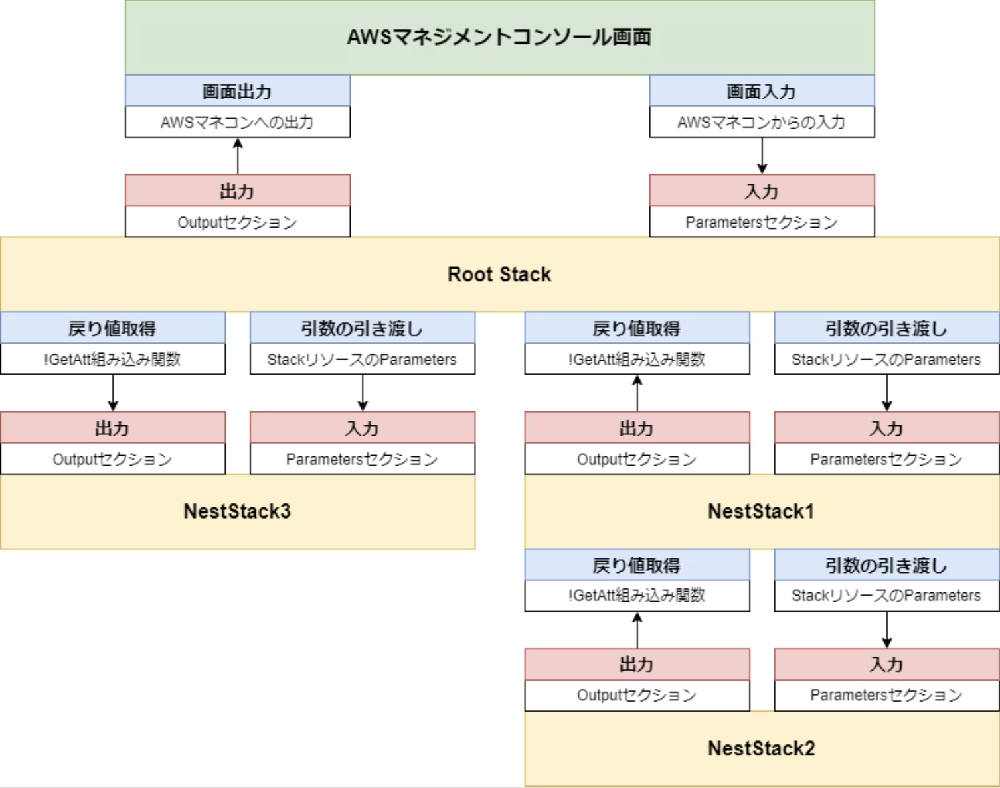
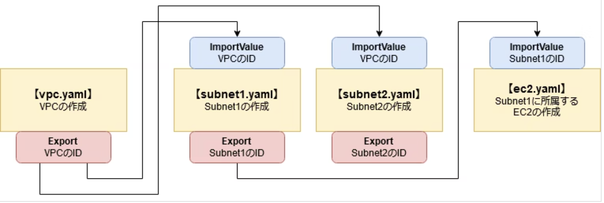
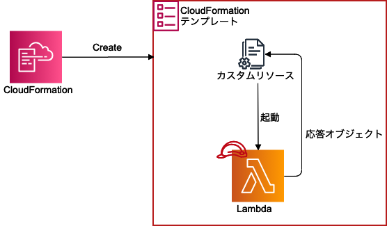
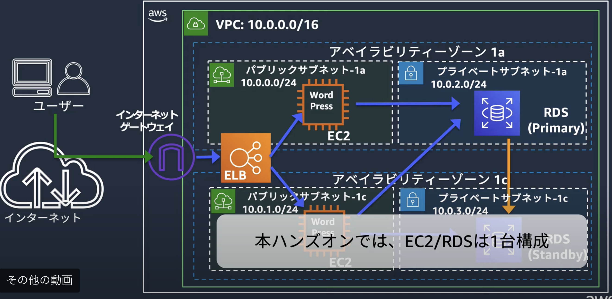
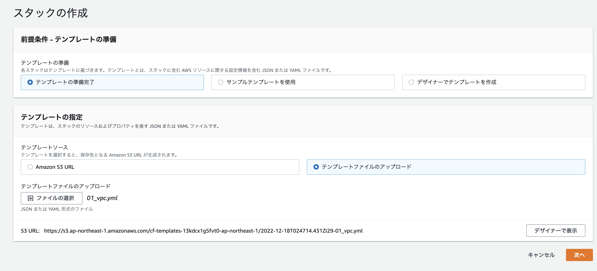
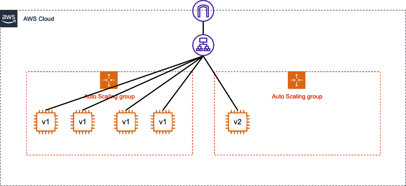

# 環境構築自動化
## CloudFormation
JSONやYML形式のテンプレートファイルを作成することで、AWSリソースの環境を自動で構築してくれる。
構築されたリソースの集合をスタックと呼ぶ

作成は設定したリソースを自動で作成することができ、依存関係は自動で解決してくれる。削除に関しても依存関係は自動で解決してロールバックしてくれる。

### 環境のコード管理のメリット
コード管理することで環境構築の時間的コストの削減や再現性の担保ができるまた、インフラの品質担保をすることができる。
バックアップやログ集計に関しても手作業ではなく、コード管理することで人為的ミスを防ぐことができる　

Well-Architectedであるという柱の中に「運用上の優秀性」があり、その中のポイントとして「運用をコードとして実行する」がある

### 環境のコード管理のメリット詳細
３つのポイントがある
- コードで全ての構成を定義  
同じ環境を、迅速に、繰り返し作成することができる。


- イベントに対してスクリプトで対処  
自動的に定期的、イベントドリブンで処理を実行することができる。  
トラブルが発生したとしても、初期対応を自動化することができる


- アプリと一緒の方法でインフラコードを管理  
品質をきちんと担保するために、Appと同様にテストなどを実行して品質を担保するべき


### 基本動作
#### テンプレートとスタック
JSONやYMLでテンプレートを作成することができ、CloudFormationによってリソースが作成される。
作成されたリソースはスタックと呼ばれる。
作成が失敗した場合、ロールバックする。

#### CLIからの実行
ローカルにあるテンプレートファイルを対象にして、S3にアップロードしてくれる。
> aws cloudformation package \
     --template-file [PATH_YOUR_TEMPLATE].yaml \
     --stack-name [YOUR_STACK_NAME] \


対象のymlファイルからCFNにデプロイしてくれる
> aws cloudformation deploy \
     --template-file [PATH_YOUR_TEMPLATE].yaml \
     --stack-name [YOUR_STACK_NAME] \


#### テンプレートの基本
必須項目は`Resources`のみ。Resourcesに作成するサービスの詳細を記述していく。
作成するサービスには論理名（表示名）を付与するが、一つのCFN内でユニークである必要がある。

#### 組み込みファンクションと擬似パラメータ
組み込みファンクションは、関数のようなもので文字列操作やリソースの属性値を取得する

擬似パラメータはリージョン名の取得などができる。

#### Conditionを利用した環境構築
CFNを利用する目的として、環境に応じてテンプレートを再利用して作業コストを軽減することが挙げらられる。
CFNでは、`Condition`を利用することによって、実行時に指定されたパラメータに応じて条件を変更し、作成する設定値や実行対象をコントロールすることができる。

環境ごとに作成するか否かの条件分岐を行う際には`Condistion`を利用する。
- Parametersセクションで設定するvalueを定義
- Conditionsセクションで条件の論理名と真偽判定
```
Conditions:
  IsProduction: !Equals [!Ref Env, "production"]
  IsEC2Role: !Not [!Equals [!Ref EC2Role, ""]]
  IsPublic: !Equals [!Ref Scope, "public"]
```
- Resourcesセクションで確認するConditionと作成するリソース情報を定義
```
Resources:
  MyEC2:
    Type: AWS::EC2::Instance
    Condition: IsProduction
    Properties:
      ...
```

[こちらのサイト](https://oreout.hatenablog.com/entry/aws/cloudformation/6)がわかりやすい


#### Mappings
Conditionsで条件に応じた、環境構築を行うことができる。
さらに、Mappingsを利用することで、リージョンやユーザーの入力情報に応じて条件設定をすることができる。

[AWS CloudFormationテンプレートでAWSアカウントごとにリソース作成有無を決定する](https://dev.classmethod.jp/articles/cfn-create-resources-depending-on-accounts/)

```
AWSTemplateFormatVersion: '2010-09-09'
Mappings: 
  AccountParams:
    "111111111111": { CreateResources: yes }
    "222222222222": { CreateResources: yes }
    "333333333333": { CreateResources: no  }
Conditions: 
  CreateResources: !Equals
    - !FindInMap [AccountParams, !Ref "AWS::AccountId", CreateResources]
    - yes
Resources:
  SNSTopic:
    Type: AWS::SNS::Topic
    Condition: CreateResources
    Properties:
      TopicName: hoge-topic
```


### 深掘り機能
CFNでは、テンプレート分割として、`ネステッドスタック`や`クロススタックリファレンス`、パラメータ取得を行う`ダイナミックリファレンス`、特殊なテンプレートを設定する`カスタムリソース`など様々な追加機能があるため、それぞれの特徴を理解しておく。

#### ネステッドスタック
テンプレートを分割した上でで親子関係を構成することができる。
クロススタックリファレンスとの違いとしては、親が実行される場合、子スタックも必ず実行される点である。  
※クロススタックリファレンスは、参照できるようにしておくところまでで、ネステッドスタックは親から子供がよばれるところまで宣言

環境に依存しない子テンプレートを作成しておき、環境情報をもつ親テンプレートから子テンプレートを呼び出すことで、再利用性を高めることができる。

プログラミング言語のように親関数から引数を渡して、子関数が実行され、返り値を親関数で利用するイメージ。子スタックの出力したリソースを親スタックで参照する場合は`!GetAtt`を利用する。




[CloudFormationをゼロから勉強する](https://qiita.com/sakai00kou/items/553aba6cc924aff3c9b8)
こちらを参考にすると理解が深まる


#### クロススタックリファレンス
テンプレートを分割する方法の一つであり、OUTPUTで`EXPORT`したリソースは、他のスタックから`!ImportValue`で参照することができるようになる機能。

注意しなくてはならないのは、スタック間でリソースを参照するので、同一アカウントの同一リージョンの中で、エクスポート名は一位である必要がある。

[CloudFormationのスタック間でリソースを参照する](https://dev.classmethod.jp/articles/cfn-cross-stack-reference/)

EXPORTする側
```
Outputs:
  EC2VPC1:
    Value: !Ref EC2VPC1
    Export:
      Name: CrossStackVpcId
```


IMPORTする側
```
Resources:
  EC2Subnet1:
    Type: 'AWS::EC2::Subnet'
    Properties:
      VpcId: !ImportValue CrossStackVpcId

```




#### ダイナミックリファレンス
RDSへの接続先や認証情報など、テンプレートにかけないパラメタをSecretsManagerから取得する際に利用する。

テンプレートに 以下の形式で記述する
```
{{resolve:ssm:parameter-name:version}}
```

#### カスタムリソース（Lambdaの実行）
CFNのテンプレートに存在しないリソース処理をLambdaやSNSを実行することで実行するための機能。



基本的な使い方としては
1. Lambdaで機能を作り込む
2. CustomのResource(AWS::CloudFormation::CustomResource or Custom::XXXX)リソースにLambdaのARNを指定


#### 差分チェック
テンプレート間を比較するチェンジセットとテンプレートと環境を比較するドリフト検出がある

■ チェンジセット  
`テンプレート間の差分検出`  
作成時のテンプレートと更新しようとしているテンプレートの差分を検出する。

■ ドリフト検出  
`テンプレートとリソースの差分検出`  
作成時のテンプレートと現状のリソースの差分を検出する。

手動で変更したことがあればドリフト検出で差分を把握するところから。
手動で変更したことがなく、更新デプロイしたい場合は変更セットを利用


#### マクロ
CloudFormationがサポートするリソースを作る際に、変換処理や繰り返し処理をLambdaで実現する機能


#### スタックセット
１つのテンプレートを複数のAWSアカウントおよびリージョンに展開する

### CloudFormation デザイナー
AWSコンソールからGUIでテンプレートを作成できる機能


### Hands on
以下の詳細説明については、[CFのHandsOnBeginners](https://pages.awscloud.com/JAPAN-event-OE-Hands-on-for-Beginners-cfn-2022-reg-event.html?trk=aws_introduction_page)
を参考にして、サンプルコードなどを例示する。  
作成する環境は以下



#### テンプレート
作成するスタックの設計図

細かい利用方法などは[テンプレートリファレンス](https://docs.aws.amazon.com/ja_jp/AWSCloudFormation/latest/UserGuide/template-reference.html)を参照する。

##### VPC作成のテンプレート例  
Resourcesは必須設定で、作成するリソースを記述し、その内部で必要な値を設定する
```
AWSTemplateFormatVersion: 2010-09-09 # versionは現在2010-09-09のみ
Description: Hands-on template for VPC # テンプレートのコメント

Resources: # 必須項目で作成するAWSリソースの概要
  CFnVPC: # CFNのリソースで表示する論理名
    Type: AWS::EC2::VPC # 作成するサービス
    Properties: # 各サービスごとに設定する設定値
      CidrBlock: 10.0.0.0/16
      InstanceTenancy: default
      EnableDnsSupport: true
      EnableDnsHostnames: true
      Tags: #名前など
        - Key: Name
          Value: handson-cfn
```

##### EC2作成のテンプレート例
EC2の設定では、vpcで作成したサブネットの設定やユーザーデータの設定もPropertiesから設定できる。
```
Resources:
  EC2WebServer01:
    Type: AWS::EC2::Instance
    Properties:
      ImageId: !Ref EC2AMI
      InstanceType: t2.micro
      SubnetId : subnet-0a53e2e7cee6f9153
      
      # UserDataの設定と、Base64の参照
      UserData : !Base64 |
        #! /bin/bash
        yum update -y
        ...
        systemctl start httpd.service
      
      # セキュリティグループとの紐付け
      SecurityGroupIds: 
        - !Ref EC2SG
```

##### SecurityGroup作成のテンプレート例
紐付けるVPCの設定やインバウンド・アウトバウンドの設定を記述する
```
  EC2SG:
    Type: AWS::EC2::SecurityGroup
    Properties: 
      GroupDescription: sg for web server
      VpcId: vpc-0696dbbf6a234b2ef
      SecurityGroupIngress: 
        - IpProtocol: tcp
          CidrIp: 10.0.0.0/16
          FromPort: 80
          ToPort: 80
  
```


#### テンプレートの詳細説明
##### 組み込み関数
```
  PublicSubnet1:
    Type: AWS::EC2::Subnet
    Properties:
      CidrBlock: 10.0.0.0/24
      VpcId: !Ref CFnVPC #!Refにより、論理名を参照する
      AvailabilityZone: !Select [ 0, !GetAZs ] # !GetAZsはアベイラビリティーゾーンの指定
      MapPublicIpOnLaunch: true
      Tags:
        - Key: Name
          Value: PublicSubnet1
```

##### Parameters
Resourcesで利用するための変数を設定しておく
```
Parameters:
  VPCStack:
    Type: String
    Default: handson-cfn
  EC2AMI:
    Type: AWS::SSM::Parameter::Value<AWS::EC2::Image::Id>
    Default: /aws/service/ami-amazon-linux-latest/amzn2-ami-hvm-x86_64-gp2
```
##### Outputs
他のテンプレート から呼び出される、リソースが出力する値を記述するのに使う。
あるテンプレートで作成したスタックの情報を別のテンプレートから参照する`クロススタックリファレンス`ではOUTPUTの定義が必須。
```
Outputs:
  EC2WebServer01:
    Value: !Ref EC2WebServer01
    Export:
      Name: !Sub ${AWS::StackName}-EC2WebServer01
```


#### 環境構築方法
##### AWSコンソールからの実行
GUIなので何をしているのかが分かり易いのがメリット、繰り返し実行や試行錯誤はし難い

作成したテンプレートをAWSのマネジメントコンソールからアップロードして利用  
cfnの「スタックを作成」から、「新しいリソースを利用（標準）」



作成されたスタックについてはリソースタブでまとめて確認できる。


##### AWS CLIからの実行
CLIなので、繰り返し実行や試行錯誤がやり易い  
H4Bでは、AWS-CLI設定済のCloud9からの実行している。


#### スタックの作成
>aws cloudformation create-stack --stack-name [YOUR_STACK_NAME] --template-body file://[YOUR_TEMPLATE_FILE]

#### 作成したスタックの更新
作成したテンプレートファイルの文法チェック
>aws cloudformation validate-template --template-body file://[YOUR_TEMPLATE_FILE]

文法に問題がないと以下が返却される
>{
    "Description": "Hands-on template for VPC", 
    "Parameters": []
}

更新の実行
> aws cloudformation update-stack --stack-name [YOUR_STACK_NAME] --template-body file://[YOUR_TEMPLATE_FILE]


## Serverless Application Model
CloudFormationの拡張機能で、サーバレスアプリケーションをより簡易的な記述で定義構築する。
LambdaやAPIGWなどのサーバーレスサービスについては、CloudFormationでも記述構築できるがSAMの方が記述量少なくスマートにテンプレートを記述できる


### SAM実行の流れ
1. コードの開発
2. パッケージング（この段階でappをS3にアップロードしている）
3. デプロイ（CFが実行されて、構築される）

### 具体的な差分
基本的な記述方法はCloudFormationとあまり変わらないが細かい部分で差分はある


#### SAMの宣言
最初の定義で、自分がCFNではなくて、SAMであることを宣言する
> Transform: AW::Serverless-2016-10-31

CFNと同様にResourcesが必須項目であるが、`Transformも必須項目`である。

#### Resource
Resourceに置いても、サーバレスに特化した記述方法がある  
SAM用のTypeが6つ準備されている
- AWS::Serverless::Function → Lambda
- AWS::Serverless::Api → APIGW
- AWS::Serverless::SimpleTable → DynamoDB

#### Globals
Globalsという複数リソースの設定をまとめて行う設定がある点が差分

#### ポリシーテンプレート
CFNでは長くなりがちだった、Lambda関数への権限付与を簡易化したもの。

ポリシーテンプレートを利用することで簡易にLambadaに権限を与えることができる
```
Resources:
  GetOrderFunction
    Type: AWS::Serverless:Function
    Properties:
    CodeUri: xxxx.jar
    Handler: xxx
    Runtime: java11
    Policies: # ここでポリシーテンプレート利用を先天
    - dynamoDBCrudPolicy: # 利用するポリシー
      TableName: !Ref xxx # ポリシーに対する引数
```


### Hands on
以下の詳細説明については、[SAMのHandsOnBeginners](https://pages.awscloud.com/JAPAN-event-OE-Hands-on-for-Beginners-Serverless-2-2022-reg-event.html?trk=aws_introduction_page)
を参考にして、サンプルコードなどを例示する。  
作成する環境は以下で、構成としてはAPIGWで公開されているAPIに対してリクエストした文字列（JP）を翻訳して（EN）返すアプリケーションを作成する。


#### S3バケットの作成
SAMではS3にある資材を利用する必要があるので、格納先のS3を作っておく

AWS CLIがあれば以下のコマンドで作成可能
> aws s3 mb s3://*your-backet-name*

#### samの作成
[SAMの公式リファレンス](https://docs.aws.amazon.com/serverless-application-model/latest/developerguide/sam-specification-resources-and-properties.html)を
参照しながらLambdaを作成するSAMを作成する。  

作成するのは、SAMのテンプレートコードと作成するLambdaの関数。  

SAMで利用する資材はS3に置いておく必要がある。今回で言うとCodeUriに記述されているLambda関数の中身。  
パッケージングをすることでSAM側で自動でS3に格納と、読み込み先の変換を処理してくれる
```
AWSTemplateFormatVersion: '2010-09-09'
Transform: AWS::Serverless-2016-10-31
Description: AWS Hands-on for Beginners - Serverless 2
Resources:
  
  # Lambdaを作成
  TranslateLambda: # 論理名
    Type: AWS::Serverless::Function # Lambdaを作成する
    Properties:
      FunctionName: translate-function-2
      CodeUri: ./translate-function # CodeUrlでLambda関数の格納場所を記載するか、InlineCoddeで直接コードを書く
      Handler: translate-function.lambda_handler
      Runtime: python3.7
      Timeout: 5
      MemorySize: 256
      Policies: # 付与するポリシー
        - TranslateFullAccess
        - AmazonDynamoDBFullAccess
      # Lambda側でAPI　GWとの連携について定義する
      Events:
        GetApi:
          Type: Api
          Properties:
            Path: /translate
            Method: get
            RestApiId: !Ref TranslateAPI
  
  # API GateWayを作成
  TranslateAPI: # 論理名 
    Type: AWS::Serverless::Api
    Properties:
      Name: translate-api-2
      StageName: dev # 必須項目
      EndpointConfiguration: REGIONAL
      
  # DynamoDBを作成
   TranslateDynamoDbTbl: # 論理名
    Type: AWS::Serverless::SimpleTable
    Properties:
      TableName: translate-history-2
      PrimaryKey:
        Name: timestamp
        Type: String
      ProvisionedThroughput:
        ReadCapacityUnits: 1
        WriteCapacityUnits: 1
```

#### SAMのpackage
- template-fileでSAMファイルを指定
- s3-bucketでappの出力先のs3を指定
- output-template-fileでappの読み込み先を変換したSAMファイルの出力名を指定
```
aws cloudformation package \
     --template-file template.yaml \ 
     --s3-bucket *your-backet-name* \
     --output-template-file packaged-template.yaml
```

`aws cloudformation package` ではなく、`sam package`でもOK

#### SAMのdeploy
- stack-name：cfnの作成されるスタック名
- capabilities：IAM関連の操作を許す
```
aws cloudformation deploy \
     --template-file ./packaged-template.yaml \
     --stack-name hands-on-serverless-2 \
     --capabilities CAPABILITY_IAM
```

`aws cloudformation deploy` ではなく、`sam deploy`でもOK


## Elastic Beanstalk 
Web三層モデルAppやキューを用いたバッチ処理などの典型的なシステム構成をテンプレートから選択して、自動でアプリケーション環境を構築するサービス。
PaaSを実現するサービス

### 設定対象
アプリケーションの言語や環境、インスタンスの構成、利用するサービスの設定、オートスケーリングの設定、ネットワークやDBの設定

### デプロイ戦略
5種類のデプロイ戦略が準備されている

[図解でわかりやすい[AWS Elastic Beanstalkで使えるデプロイポリシーを理解する](https://dev.classmethod.jp/articles/elastic-beanstalk-deploy-policy/)


#### All at once
アプロケーションインスタンスをすべて同時に更新する

#### Rolling
実行中のインスタンスを一定の単位で差し替えていく。
３個中２つを停止して、差し替えて、最後に１つを差し替える

#### Rolling with additional batch
Rollingは最大数が決まっていて、その中でRolling Deployしていたが、バッチ分だけインスタンス数を一部追加してDeoloyする。

実行中のインスタンスに、加える形で新規のインスタンスをバッチ分だけ追加する。
差し変わったら、古いインスタンスを落とす

#### Immutable
一時的なオートスケーリングのグループを作成。
一時的なグループ内で１台分のヘルスチェックや台数の拡張を実施。
そのため、差し戻す場合も簡単に差し戻せる。
動作確認が済んだら、既存のオートスケーリンググループに新規のサーバーを割り当て直す
一時的なオートスケーリンググループと古いサーバーを落とす。




#### Traffic Splitting（Canary方式）
既存と新規を同時に立ち上がる状態にして、どちらにも割り振る状態を経ながら、だんだん新規に流していく

### コンテナサポート
Elastic BeanstalkでもDockerおよびDocker Composeを使用したコンテナ実行がサポートされている。

Docker Composeを利用しない場合は３パターンでコンテナ実行できる
- Docker Fileを作成してコンソールからアップロード
- コンテナイメージをビルドして、リポジトリにプッシュ  
Dockerrun.aws.jsonファイルを作成して、コンソールへアップロードする
- Zip形式のAppファイルを作成して、コンソール上からアップロードする。
アーカイブファイルのルートディレクトリにDockerFileとDockerrun.aws.jsonを配置する。


### 設定ファイル
`.ebextensions`は、設定ファイル群を格納するディレクトリです。
プロジェクトルートの直下に.ebextensionsディレクトリを作り、その中に拡張子が`.config`のyaml形式かjson形式のファイルを置くことで、自動的に読み取って設定してくれる。

### cron.yaml
Elastic Beanstalkに置いて、定期実行のワーカーを設定する場合は、cron.yamlファイルを作成しておく

### env.yaml
AWS Elastic Beanstalkの環境に使用されるパラメータを特定します