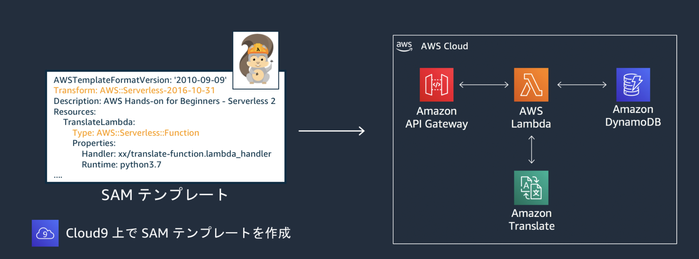

# 環境構築自動化
## CloudFormation
JSONやYML形式のテンプレートファイルを作成することで、AWSリソースの環境を自動で構築してくれる。
構築されたリソースの集合をスタックと呼ぶ

### 環境のコード管理のメリット
コード管理することで環境構築の時間的コストの削減や再現性の担保ができるまた、インフラの品質担保をすることができる。
バックアップやログ集計に関しても手作業ではなく、コード管理することで人為的ミスを防ぐことができる　

Well-Architectedであるという柱の中に「運用上の優秀性」があり、その中のポイントとして「運用をコードとして実行する」がある

### 運用をコードとして実行する
３つのポイントがある
- コードで全ての構成を定義  
同じ環境を、迅速に、繰り返し作成することができる。


- イベントに対してスクリプトで対処  
自動的に定期的、イベントドリブンで処理を実行することができる。  
トラブルが発生したとしても、初期対応を自動化することができる


- アプリと一緒の方法でインフラコードを管理  
品質をきちんと担保するために、Appと同様にテストなどを実行して品質を担保するべき


### 基本動作
作成は設定したリソースを自動で作成することができ、依存関係は自動で解決してくれる。
削除に関しても依存関係は自動で解決してくれる。

### Hands on
以下の詳細説明については、[CFのHandsOnBeginners](https://pages.awscloud.com/JAPAN-event-OE-Hands-on-for-Beginners-cfn-2022-reg-event.html?trk=aws_introduction_page)
を参考にして、サンプルコードなどを例示する。  
作成する環境は以下


#### テンプレートとスタック
JSONやYMLでテンプレートを作成することができ、CloudFormationによってリソースが作成される。
作成されたリソースはスタックと呼ばれる。
作成が失敗した場合、ロールバックする。

### テンプレート
作成するスタックの設計図

細かい利用方法などは[テンプレートリファレンス](https://docs.aws.amazon.com/ja_jp/AWSCloudFormation/latest/UserGuide/template-reference.html)を参照する。

#### VPC作成のテンプレート例  
Resourcesは必須設定で、作成するリソースを記述し、その内部で必要な値を設定する
```
AWSTemplateFormatVersion: 2010-09-09 # versionは現在2010-09-09のみ
Description: Hands-on template for VPC # テンプレートのコメント

Resources: # 必須項目で作成するAWSリソースの概要
  CFnVPC: # CFNのリソースで表示する論理名
    Type: AWS::EC2::VPC # 作成するサービス
    Properties: # 各サービスごとに設定する設定値
      CidrBlock: 10.0.0.0/16
      InstanceTenancy: default
      EnableDnsSupport: true
      EnableDnsHostnames: true
      Tags: #名前など
        - Key: Name
          Value: handson-cfn
```

#### EC2作成のテンプレート例
EC2の設定では、vpcで作成したサブネットの設定やユーザーデータの設定もPropertiesから設定できる。
```
Resources:
  EC2WebServer01:
    Type: AWS::EC2::Instance
    Properties:
      ImageId: !Ref EC2AMI
      InstanceType: t2.micro
      SubnetId : subnet-0a53e2e7cee6f9153
      
      # UserDataの設定と、Base64の参照
      UserData : !Base64 |
        #! /bin/bash
        yum update -y
        ...
        systemctl start httpd.service
      
      # セキュリティグループとの紐付け
      SecurityGroupIds: 
        - !Ref EC2SG
```

#### SecurityGroup作成のテンプレート例
紐付けるVPCの設定やインバウンド・アウトバウンドの設定を記述する
```
  EC2SG:
    Type: AWS::EC2::SecurityGroup
    Properties: 
      GroupDescription: sg for web server
      VpcId: vpc-0696dbbf6a234b2ef
      SecurityGroupIngress: 
        - IpProtocol: tcp
          CidrIp: 10.0.0.0/16
          FromPort: 80
          ToPort: 80
  
```


### テンプレートの詳細説明
#### 組み込み関数
```
  PublicSubnet1:
    Type: AWS::EC2::Subnet
    Properties:
      CidrBlock: 10.0.0.0/24
      VpcId: !Ref CFnVPC #!Refにより、論理名を参照する
      AvailabilityZone: !Select [ 0, !GetAZs ] # !GetAZsはアベイラビリティーゾーンの指定
      MapPublicIpOnLaunch: true
      Tags:
        - Key: Name
          Value: PublicSubnet1
```

#### Parameters
Resourcesで利用するための変数を設定しておく
```
Parameters:
  VPCStack:
    Type: String
    Default: handson-cfn
  EC2AMI:
    Type: AWS::SSM::Parameter::Value<AWS::EC2::Image::Id>
    Default: /aws/service/ami-amazon-linux-latest/amzn2-ami-hvm-x86_64-gp2
```
#### Outputs
他のテンプレート から呼び出される、リソースが出力する値を記述するのに使う
```
Outputs:
  EC2WebServer01:
    Value: !Ref EC2WebServer01
    Export:
      Name: !Sub ${AWS::StackName}-EC2WebServer01
```

### スタック
AWSリソースのコレクションで、スタックを削除するとコレクションのすべてのリソースが削除される

### 環境構築方法
#### AWSコンソールからの実行
GUIなので何をしているのかが分かり易いのがメリット、繰り返し実行や試行錯誤はし難い

作成したテンプレートをAWSのマネジメントコンソールからアップロードして利用  
cfnの「スタックを作成」から、「新しいリソースを利用（標準）」


作成されたスタックについてはリソースタブでまとめて確認できる。


### AWS CLIからの実行
CLIなので、繰り返し実行や試行錯誤がやり易い  
H4Bでは、AWS-CLI設定済のCloud9からの実行している。


#### スタックの作成
>aws cloudformation create-stack --stack-name [YOUR_STACK_NAME] --template-body file://[YOUR_TEMPLATE_FILE]

#### 作成したスタックの更新
作成したテンプレートファイルの文法チェック
>aws cloudformation validate-template --template-body file://[YOUR_TEMPLATE_FILE]

文法に問題がないと以下が返却される
>{
    "Description": "Hands-on template for VPC", 
    "Parameters": []
}

更新の実行
> aws cloudformation update-stack --stack-name [YOUR_STACK_NAME] --template-body file://[YOUR_TEMPLATE_FILE]


### 深掘り機能
#### ネストッドスタック
複数のテンプレートで親子関係を構成することができる。

#### ドリフト検出
現状のリソースとテンプレート定義の差分を検出する機能

#### スタックセット
１つのテンプレートを複数のAWSアカウントおよびリージョンに展開する

### CloudFormation デザイナー
AWSコンソールからGUIでテンプレートを作成できる機能


## Serverless Application Model
CloudFormationの拡張機能で、サーバレスアプリケーションをより簡易的な記述で定義構築する。
LambdaやAPIGWなどのサーバーレスサービスについては、CloudFormationでも記述構築できるがSAMの方が記述量少なくスマートにテンプレートを記述できる

### SAM実行の流れ
1. コードの開発
2. パッケージング（この段階でappをS3にアップロードしている）
3. デプロイ（CFが実行されて、構築される）

### 具体的な差分
基本的な記述方法はCloudFormationとあまり変わらないが細かい部分で差分はある

#### SAMの宣言
最初の定義で、自分がCFNではなくて、SAMであることを宣言する
> Transform: AW::Serverless-2016-10-31

#### Resource
Resourceに置いても、サーバレスに特化した記述方法がある  
SAM用のTypeが6つ準備されている
- AWS::Serverless::Function → Lambda
- AWS::Serverless::Api → APIGW
- AWS::Serverless::SimpleTable → DynamoDB

#### Globals
Globalsという複数リソースの設定をまとめて行う設定がある点が差分


### Hands on
以下の詳細説明については、[SAMのHandsOnBeginners](https://pages.awscloud.com/JAPAN-event-OE-Hands-on-for-Beginners-Serverless-2-2022-reg-event.html?trk=aws_introduction_page)
を参考にして、サンプルコードなどを例示する。  
作成する環境は以下




### ポリシーテンプレート
Lambda関数に付与するIAMについてのポリシーを不要するテンプレートを簡易化したもの


## Elastic Beanstalk 
典型的なシステム構成をテンプレートから選択して、自動でアプリケーション環境を構築するサービス。
PaaSを実現するサービス

### 設定対象
アプリケーションの言語や環境、インスタンスの構成、利用するサービスの設定、オートスケーリングの設定、ネットワークやDBの設定

### デプロイ戦略
5種類のデプロイ戦略が準備されている
#### All at once
アプロケーションインスタンスをすべて同時に更新する

#### Rolling
実行中のインスタンスを一定の単位で差し替えていく。
３個中２つを停止して、差し替えて、最後に１つを差し替える

#### Rolling with additional batch
実行中のインスタンスに、加える形で新規のインスタンスをバッチ分だけ追加する。
差し変わったら、古いインスタンスを落とす

#### Immutable
実行中のインスタンスと同数だけ、新しいインスタンスを立てて、一気に差し替える。
差し戻す場合も簡単に差し戻せる。

#### Traffic Splitting
既存と新規を同時に立ち上がる状態にして、どちらにも割り振る状態を経ながら、だんだん新規に流していく
