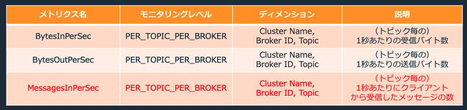

# MSK:Managed Streaming for Kafka
MSKはフルマネージドで可用性が高くセキュアなApache Kafka サービス  
以下のメリットがある。
- OSSのKafkaのAPIが利用可能
- BrokerやZookeeperインフラがマネージドで提供されている
- AWSサービスとの統合
    - IAM/権限管理
    - KMS/セキュアなデータのやり取り

## kafkaの概要
そもそもApache kafkaは、パブリッシュ・サブスクライブモデルの分散メッセージング基盤である。
LinkedInによって開発され、多くの導入実績があり、高スループット、リアルタイム性を有し、スケーラビリティに優れている。

### kafkaの役割
データソースから生成されるストリームデータを取り込んで永続化して、他のサービスへ連携することがkafkaの役割   

そもそもストリームデータとは、多数のデータソースによって継続的に生成されるデータであり、大量のデータを扱うためにkafkaには以下を満たす力がある。
- 拡張性
- スケーラビリティ
- 耐障害性
- 低遅延性

### kafkaの仕組み
Push型のキューシステムであり、pub-subモデルを採用している。  
ConsumerはPush型であり、ConsumerはPull型として動作する。

> Push型では、TopicからSubscriberへの配信は即時に行われる。
> Pull型では、キューからConsumerがメッセージを取り出す必要がある。

すなわち、Consumer側のタイミングでMessageを取得することができる。

kafkaでは、複数のサーバーでクラスタ構成をしており、スケーラビリティと可用性を確保している

#### kafka Cluster
kafkaのクラスターは以下の構成要素から成り立っている。
- ブローカー  
    クラスターとして動作してデータの受配信を担う
    クラスター構成のため、スケールアウトが可能
- パーティション  
    ブローカー上に分散配置されて、トピックのメッセージが実際に格納される分散キューにあたる  
    Topicは複数のPartitionから成り立っており、それぞれのPartitionはBrokerに分散して配置される。
    ※Partition-Aは１つのPartitionに見えていても、実態は複数のブローカーに分散されており、レプリケーションされている
- トピック  
    メッセージを種別で管理する概念的なストレージで、実態はpartitionをまとめたもの。
    Producer/Consumerはトピックを指定して、Meaageの送受信を行う
- ZooKeeper  
    トピックやパーティションのメタ情報を管理している
- Message  
    kafka内で扱うデータの最小単位で、メッセージにはkey-valueを持たせることができる。

#### トピックとパーティション
トピックは概念的なものであり、メッセージを種別でまとめたもの。
実態としてはパーティションが存在しているだけ。

パーティションは可用性のために、ブローカーにレプリケーションを作成している。
- BrokerからLeader Replicaが選定される
- Producerがパーティションに書き込みを行う場合は、Leader Replicaに対してデータを書き込む

-  Leader Replicaに書き込まれた内容はBrokerを超えてフォロワーレプリカに複製する（同期の確認はLeaderが行う）

-  Consumerのメッセージ読み込みもLeader Replicaに対して行う

#### オフセット
メッセージがパーティションに書き込まれた際に付与されるシーケンシャルな番号を`offset`と呼ぶ

パーティション単位で最後に取得したメッセージをzooKeeperもしくはkafka自体が保存して、Consumerにも連携しているこのオフセットにより、Consumerは継続的にメッセージのどこまでを読み出したかを管理している。

オフセットには以下の種類が存在し、Consumerが取得するメッセージの範囲やリトライ制御を行う
- Log-End-Offset  
    Partitionのデータの末尾（格納されたデータの数
- Current-Offset  
    Consumerが`どこまで読み込んだか`を示す
- Commit-Offset  
    Consumerが`どこまでコミットしたか`を示す

#### ハイウォーターマーク
レプリカによる複製が完了済みのオフセットのことを`ハイウォーターマーク`と呼び、Consumerはハイウォーターマークのデータのみを取得できる。
以下の図では、offset3までがConsumerが取得できるoffsetとなる。

#### Producer→Brokerの送信プロセス
At Least Oonceのために、Blockerは正しく受信できたことを示すためのAck（肯定応答）を行う。

また、どのパーティションに送信するかのパーティショニング機能が備わっている。

##### パーティショニング
Topicに対してメッセージを送付する際、Partitionに分散して、配置する。
ProducerからMessageを受け取る際に、Partitionerによって、どのようにMessageを配置するかを決定する
- ハッシュ：メッセージのkeyのハッシュを利用して配置する
- ラウンドロビン：順番にパーティションを配置する

#### Broker→Consumerの受信プロセス
成功した場合は以下のようにoffsetが更新される
1. ConsumerからBrokerにトランザクション開始のリクエスト
2. Consumerは取得対象のTopicに対してCurrent-Offsetを確認して、最新Messageを受信リクエストし、Current-Offsetを更新
3. 受信が無事成功
4. Commit-Offsetが更新され、Commit-OffsetとCurrent-Offsetが一致する

失敗した場合は以下のようにoffsetが更新される
1. ConsumerからBrokerにトランザクション開始のリクエスト
2. Consumerは取得対象のTopicに対してCurrent-Offsetを確認して、最新Messageを受信リクエストし、Current-Offsetを更新
3. 受信が失敗
4. Current-Offsetがロールバックされ、Commit-OffsetとCurrent-Offsetが一致する

## MSKの価値
■kafkaの課題  
kafkaは上記で述べてきたように非常に便利であるものの、分散メッセージ基盤であるため、環境構築において多くのサーバーに対する設定が必要となる。  
また、稼働後もブローカーやZookeeperの運用、スケールや監視などの作業が必要となる。

■MSKの価値  
MSKではこの問題に対応しており、MSKは一言で言うと
> MSKはフルマネージドで可用性が高くセキュアなApache Kafka サービス  

である。

MSKでは、以下を提供している
- MSKだからこそ容易に実行可能なコントロールプレーン  
    面倒なクラスターの作成、更新、削除をAPIやマネジメントコンソールから実行することができる  
    下図の紫色の枠をマネージドに作成・管理ができる

- Apache Kafkaを流用できるデータプレーン  
    トピックの作成、ProducerやConsumerからのデータのやり取りに関しては、Apache KafkaのAPIをそのままサポート  
    下図のオレンジ矢印の部分をApache kafkaを流用できる

これらを踏まえ、たとえば[EC2上にKafkaを導入](https://aws.amazon.com/jp/blogs/news/best-practices-for-running-apache-kafka-on-aws/)する場合とMSKを利用する場合では以下のような差がある

### MSKのデプロイメント
MSKでは、AZ間でブローカーを均等にデプロイすると言うベストプラクティスを自動で適用してくれる。  
作成時に以下を設定する
- 適用するAZ
- AZあたりのブローカー数

### MSKのネットワーク
MSKでは、自動で作成したクラスターに対する接続はエンドポイントが払い出されるので、そのエンドポイントに対して、クライアントから通信すれば良い。

セキュリティグループはMSKクラスターで指定したセキュリティグループが適用されるが、クライアントと同じセキュリティグループにしておくと比較的簡単に通信ができるようになる。

### MSKの監視
MSKではAWSのCloudWatchと統合されており、メトリクスを取得可能
以下のメトリクスレベルを選択可能
- 基本モニタリング（DEFAULT）  
    基本的なクラスターレベルとブローカーレベルのメトリクス

- 拡張ブローカーレベルモニタリング(PRE_BROKER)  
    基本モニタリングおよび拡張ブローカレベル(ブローカーごとも取得)

- 拡張トピックレベルモニタリング(PER_TOPIC_PER_BROKER)  
    拡張ブローカーレベルおよび拡張トピックレベル（トピックごとも取得）

### MSKのセキュリティ
大きく以下の４つの機能が存在し、今回は、データの保護、クライアント認証について整理
- ★データの保護
- ★クライアント認証
- IAMによる操作権限管理
- コンプライアンス

★データの保護  
データの保護については、大きく３つの対象が存在
1. 保存データの暗号化
2. ブローカー間の通信の暗号化
3. クライアントとブローカー間の通信

１、２に関しては、デフォルトでサーバー側暗号化が有効となる。  
３に関しては、TLSで暗号化した通信だけ許可することも可能だが、パフォーマンスが30%低下することに注意

★クライアント認証  
クライアント認証については、以下の手順を踏む
1. mskクラスターの作成時にACM Private Certificate AuthorityのプライベートCAを指定
2. クライアント側に証明書を設定する。
3. Kafka Autorization CLIを利用してトピックにアクセス権を設定

ブローカー側は
1. 先ほど説明したクライアントとブローカーの通信のTLS暗号化を有効化する
2. ブローカーはACMの証明書を利用
3. Amazon Trust Servicesを信頼する

### MSKによるクラスターの更新
カスタム構成で、既存のクラスターを更新することが可能
1. kafkaの設定ファイルを作成
2. MSKのCOnfigurationを作成
3. MSKクラスターの更新

注意点として、Configurationを一度作成すると削除するAPIがない点やConfigurationを更新する方法がなく、新しく作成するしかない。クラスターの更新時にブローカーと接続断が発生する

デフォルトでは、以下の構成が採用されている

カスタム構成では以下が設定可能

### MSKのスケーリング
大きく３つのスケーリングが可能
- ストレージの拡張:ブローカーのストレージを増やせる
- ブローカー数の拡張:AZあたりのブローカを増やせる
- ブローカーサイズの拡張:今後可能になる

## 別サービスとの比較
### Amazon kinesis Data Streamsとの比較
kinesis Data Streamsも大量のストリームをリアルタイムで収集して処理するためのデータストリーミングサービスとなっている。

■API  
MSKは、オープンソース互換のAPIなのでKafkaのエコシステムを利用することができる。  
一方で、kinesisはAWSが提供するAPIを利用するため、他のAWSサービスとの連携が密となっている

■スケーリング  
MSKは、クラスターをプロビジョニングするため、シームレスなスケーリングは困難。  
一方で、kinesisでは、スループットをプロビジョニングするので、シームレスなスケーリングが可能

以下のように対応概念を見てみると、クラスターやブローカーという概念が存在しない。

また、構成を見ても、エンドポイントを通じて通信を行うので、バックエンドを意識しないですむ。

■柔軟性  
MSKはkafkaのオープンソースを利用しているので、kafkaのエコシステムと互換性があるのがメリットになる。

MSKのメッセージ抽出について、以下のようにSchema Registryを利用して、スキーマに応じた自動的なシリアライゼーションが可能となる

## MSKの実装
### MSKの採用
MSKを採用するか否かは以下のポイントから判断する
1. オンプレのApache Kafkaを移行したい
2. EC2のApache Kafkaを移行したい
3. Apache Kafkaの周辺ツールを利用する必要がある

上記以外の場合は、サーバーレスのメリットがあるので、Amazon Kinesis Data Streamsの利用が推奨

### ベストプラクティス
MSKを利用する場合は、[ベストプラクティス](https://docs.aws.amazon.com/ja_jp/msk/latest/developerguide/bestpractices.html)を参考にする

#### クラスターサイズ
ブローカー１台あたりのパーティションの推奨数が定義されている

## MSK Serverles
2021年に新規発表された

## 参考サイト
- [black belt](https://aws.amazon.com/jp/events/aws-event-resource/archive/?cards.sort-by=item.additionalFields.SortDate&cards.sort-order=desc&awsf.tech-category=*all&cards.q=msk&cards.q_operator=AND)
- [qiita Apache Kafkaについてまとめる](https://qiita.com/hirooka0527/items/d15e479fa2ded428834d)
- [Apache Kafka の基本](https://tutuz-tech.hatenablog.com/entry/2019/03/16/155501)

