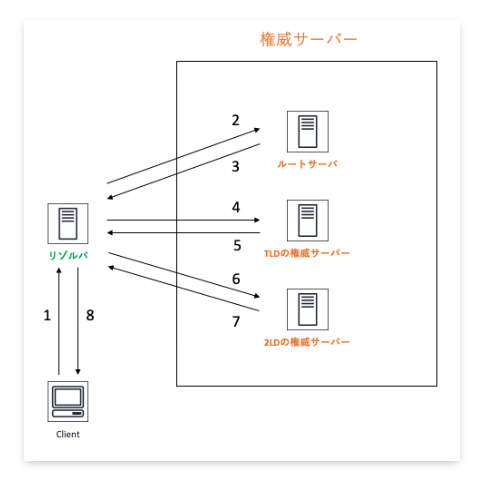
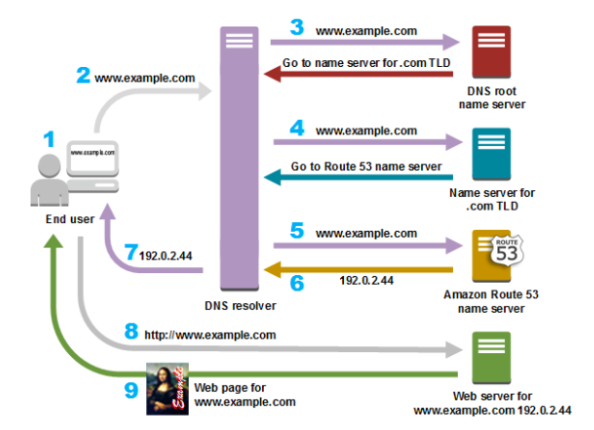
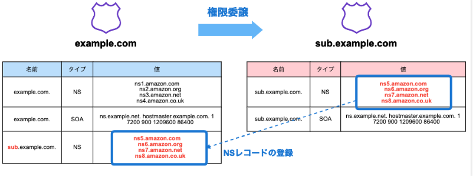

# AWSのネットワーク

## セキュリティグループとネットワークACL
以下の説明はよく聞くけどどういうことなのか
>セキュリティグループはステートフルで、１つの通信を設定すれば戻り値の設定は不要  
>ネットワークACLは送受信で個々の設定が必要

### ステートフルとは？
ステートフルパケットインスペクションの略であり、出入りするパケットの通信状態を把握して、動的に通信の可否を決めるということ

### セキュリティグループ
サブネットの中で定義することができる。

インバウンドとアウトバウンドを定義することができる。
ただし、ステートフルなので、インバウンドで許可したものは自動でアウトバウンドで許可される
>インバウンドでport22を許可  
>アウトバウンドですべて拒否  
>port22でアクセスすると成功する（自動的にアウトバウンドが許可される）

### ネットワークACL
サブネットに紐づけて定義をする。EC2などのインスタンスに設定することができる。

ステートレスなので、インバウンドもアウトバウンドも明示的にルール設定する
>インパウンドでport22を許可  
>アウトバウンドはEphemeralポートの49152 – 65535を許可  
>これで初めてsshが成功する。

## AWSとの通信
AWSとの通信には、ネットワークを通じた通信と専用回線による通信がある。
さらに、ネットワークを通じた通信は「HTTPS/SSH」と「VPN」がある。
- ネットワークを通じた通信
  - HTTPS/SSH
  - VPN
- 専用回線
### Direct Connect
専用回線による通信のソリューション
キャリアから調達した専用線の片端とAWS をDirect Connctionロケーションで接続するサービスを指す。

## Route53
AWSのDNS(Domain Name System)サービス。  
VPCで構築したリソースに、特定多数のユーザーをアクセスさせるためには、Route53を利用する。

### DNSの基本
#### DNSの種類
DNSサーバーには基本的に以下の２種類が存在する。
- 権威DNSサーバー  
権威DNSサーバーとは、DNS Resolverから問い合わせに応じて、自身が管理するのゾーン情報を返却する。
- DNS Resolver  
DNS Resolverとは、フルサービスリゾルバや再起リゾルバと呼ばれ、複数のサーバーに問い合わせして、名前解決をしていき最終的な結果をけえす

#### DNSの動き
DNSはグローバルIPアドレスとドメインを紐づける役割を持っている

具体的なDNSの動きを以下の図を見ながら確認する
1. ブラウザでドメインを記入して検索
2. リクエストが`DNS Resolver`にルーティングされる
3. DNS Resolverから`DNS root name server`に転送され、.comドメインを管理するサーバーの情報がレスポンスされる
4. DNS ResolverからNameサーバーへ問い合わせが繰り返される

### Route53
Route53では、ホストゾーンを設定することで、権威DNSサーバーを設定することができる。
DNS Resolverの働きはVPCを作成すると自動で構築されるRoute53 Resolverが行う。

### ホストゾーン
各権威DNSサーバーが保持する範囲  

Route53ではゾーンの範囲によって種類が２つ存在する。
- パブリックホストゾーン  
インターネットでのルーティングを指定する
- プライベートホストゾーン  
VPC内でのルーティングを指定する

以下の形式で接続先や権限移譲先のサーバーを保持している

> ドメイン名　TTL　CLASS　TYPE　RDATA

- ドメイン名：自分が管理しているドメイン名
- TTL：レコードが有効な期限
- CLASS：ネットワークプロトコルを示し、基本的にインターネットINになる
- TYPE：`レコードのタイプ`
- RDATA：レコードの実際の値

#### レコードタイプ
- SOA：Start Of Authority：ドメインやゾーンの基本情報
- NS：ゾーンを管理するネームサーバーのドメイン名。親子で同じNSコードを登録しておく
- A：ドメインに対応するIPv4アドレス
- AAA：ドメインに対応するIPv6アドレス
- CNAME：ドメイン名の別名
- MX：対象ドメイン宛のメール転送先

#### トラフィックルーティング
いくつかのオプションが準備されている。
- シンプルルーティング：紐づいたアドレスを返す
- 位置情報ルーティング：クライアントのIPアドレスから位置情報を特定して、ルーティング
- フェイルオーバールーティング：ヘルスチェックと合わせて、待機システムへの切り替えが可能
- 地理的近接性ルーティング：クライアントとサーバーの距離に基づいてルーティング
- レイテンシーベースルーティング：レイテンシーが短くなるように
- 加重ルーティング：特定の割合に基づいて
- 複数回答ルーティング：ランダムに選択されたアドレスを返す

### Route53 Resolver
VPCを構築した時に同時に作成される。
Route53 Resolverでは、フルサービスリゾルバとDNSフォワーダの機能を持っている。
フルサービスリゾルバの機能は上述した通り、各種ネームサーバーに対する再起的な問い合わせを行う。

#### DNSフォワーダ
企業内のネットワークなどを考えると、フルサービスリゾルバにさまざまなドメインの問い合わせが集中して負荷が大きくなる。
要求を振り分けるDNSフォワーダによりこの問題を解決する。
フォワーダは特定ドメインの名前解決要求に対して、ネームサーバーや別のDNSサーバーに集中するるルールを設定することができる。

## ELB