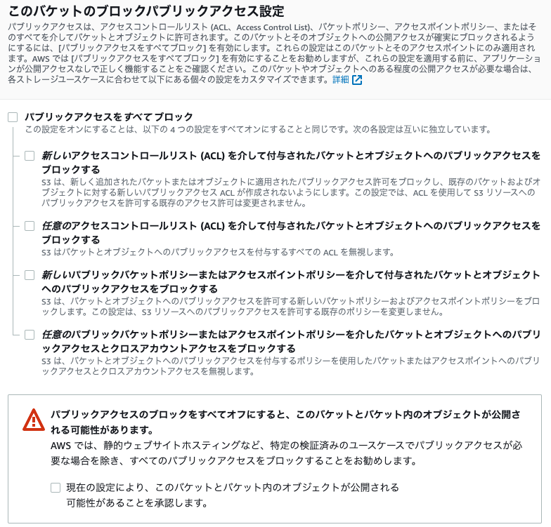
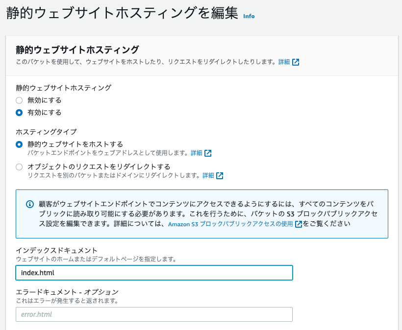
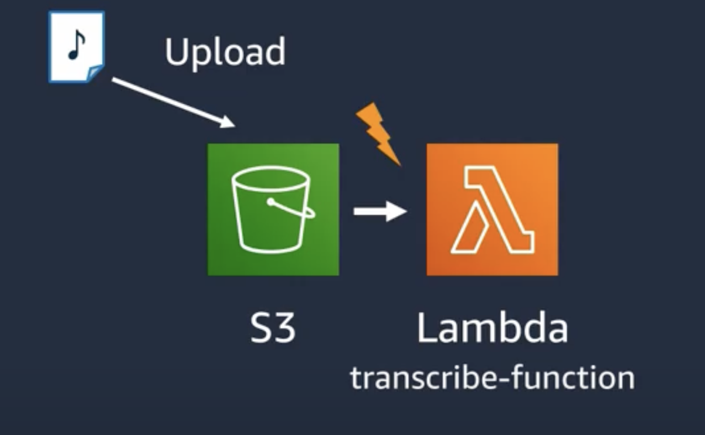
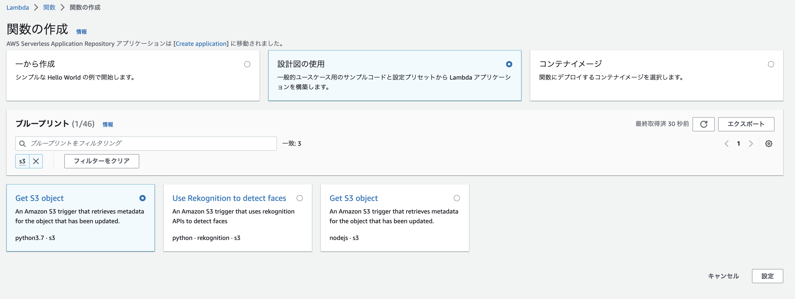
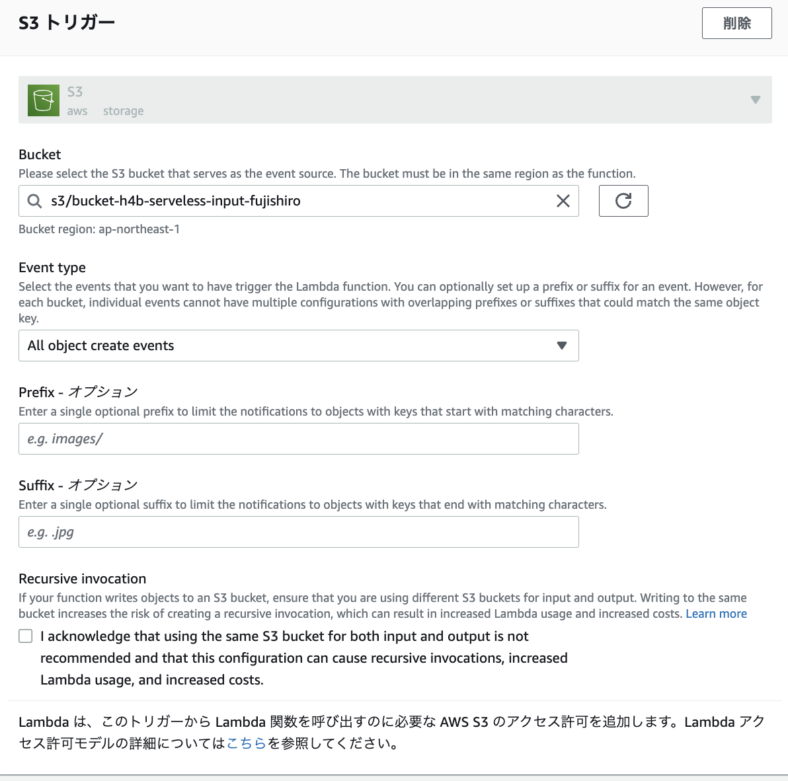
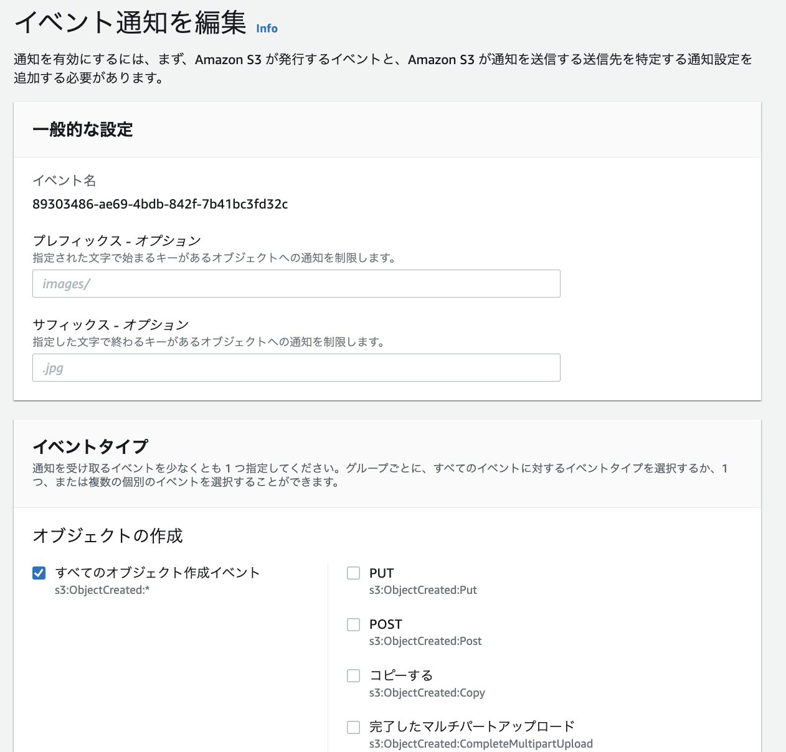

# S3

## 基本情報
高い耐久性で、イレブンナインの耐久性がある。（3つのAZにデータが格納される

バケット名はグローバルに一意にする必要がある。


## 静的ウェブサイトホスティング
S3にアップロードしたHTMLサイトなどの静的なウェブサイトを一般公開すること

### 手順
1. バケットのブロックパブリックアクセス設定で、ブロックをオフにする



2. 静的ウェブサイトホスティングを許可する  
バケット>プロパティ>静的ウェブサイトホスティング  
「有効にする」をせんてくして、最初に表示するインデックスドキュメントを選択




3. アクセスポリシー  
バケット>アクセス許可>バケットポリシーの設定
```
{
  "Version": "2012-10-17",
  "Statement": [
      {
          "Sid": "PublicReadGetObject",
          "Effect": "Allow",
          "Principal": "*",
          "Action": [
              "s3:GetObject"
          ],
          "Resource": [
              "arn:aws:s3:::[YOUR BUCKET NAME]/*"
          ]
      }
  ]
}
```

## S3のイベントとLambdaの連携
### H4bの全体像
[AWS Lambda と AWS AI Services を組み合わせて作る音声文字起こし & 感情分析パイプライン](https://pages.awscloud.com/JAPAN-event-OE-Hands-on-for-Beginners-Serverless-3-2022-confirmation_772.html)
にていおてS3のイベントを起因としたLambdaの呼び出しが実装されているので、こちらを参考に手順を整理する。



##### S3の作成
バケット名はユニークにする。

##### Lambdaの作成
関数の作成で、設計図の使用をして、pythonのGet-S3-Objectを選択する。



関数の詳細設定においてS3のトリガーの設定でバケットやイベントタイプを指定する。
- イベントタイプ：LambdaをキックすS3イベントを指定できる。
- Prefix：イベントの対象とする先頭の対象制限（ディレクトリ制限など）
- Suffix：イベントの対象とする後尾の対象制限（拡張子制限など）




Lambdaのコードでは、eventから、バケット名やオブジェクト名を取得している。
```
import json
import urllib.parse
import boto3

print('Loading function')

# PythonからAWSのサービスを連携できるboto3を使っている
s3 = boto3.client('s3')


def lambda_handler(event, context):
    #print("Received event: " + json.dumps(event, indent=2))

    # eventからbucket名を取得
    bucket = event['Records'][0]['s3']['bucket']['name']
    # eventからオブジェクト名を取得
    key = urllib.parse.unquote_plus(event['Records'][0]['s3']['object']['key'], encoding='utf-8')
    
    
    try:
        # ここの部分を要件に合わせて修正する。
        response = s3.get_object(Bucket=bucket, Key=key)
        print("CONTENT TYPE: " + response['ContentType'])
        return response['ContentType']
    except Exception as e:
        print(e)
        print('Error getting object {} from bucket {}. Make sure they exist and your bucket is in the same region as this function.'.format(key, bucket))
        raise e

```

試しに、S3にファイルをアップロードすると、CloudWatchのログにコンテントタイプが出力される。

##### S3イベントの変更
Lambdaの設定後、Lambdaを起動するイベントを変更したい場合、バケット、プロパティ、イベント通知から変更が可能




- [参考サイト](https://qiita.com/sugimount-a/items/bffb03f8882d5abd90f0)