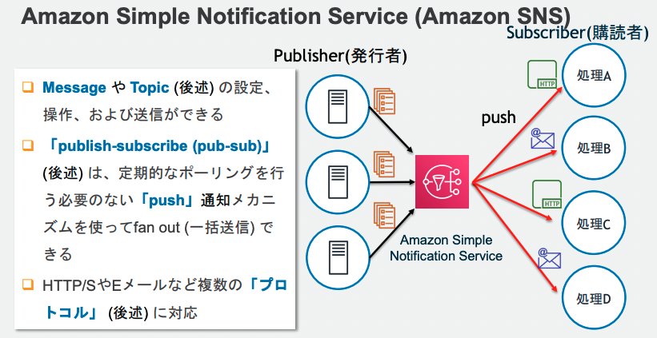

## SNS
SNS(Simple Notification Service)は、マネージド型の`メッセージ配信サービス`で非同期なメッセージ配信を実現することができる

利用のイメージとしては、SNSのコンソール上でTopicの作成およびSub側の設定をして、Pub側でSNSのTopicを指定してあげる。

### SNSの登場人物
- Publisher：メッセージを配信する発行者
- Subscriber：メッセージを受信する購買者
- Topic：PubとSubを仲介して疎結合にする

### Publisher
256キロバイトまでのメッセージをTopicに対して発行することができる。  

S3のイベントやCodePipelineやLambdaなどと連携することができる。

### Subscriber
事前に興味のあるTopicを購読設定しておくことで、メッセージが配信されるとSub側で受信することができる。

LambdaやSQS、Eメールなどが設定可能。
PubとしてCode PipelineをSubとしてEメールを設定しておけば、Deploy前にメールで承認依頼を出すといったことができる。

### Topic
通信チャネルとして機能する論理的なエンドポイント

TopicにはスタンダートとFIFOの２種類が存在し、順序性、重複性、スループットの面でメリデメがある。

- スタンダート  
順序性と重複性が保証がされない代わりにほぼ無制限のスループットが実現できる

- FIFO  
順序性と重複排除が保証されるが、スループットは300件/secとなる

#### 順序性
FIFOトピックではメッセージを発行時に、`メッセージグループID`を発行する。
同一のメッセージグループでは配信順序が保証され。すべてのメッセージで配信順序を担保するためには一つのメッセージグループIDとすれば良い。

#### 重複排除
リトライなどで、同じメッセージが配信されてしまうことは銀行業務などでは許されないので、重複排除の機能を利用する。

基本思想としては、特定の重複排除IDを持つメッセージが発行されてから５分間は同一IDを持つメッセージ配信を行わないようにする。
SNSではコンテンツベースの重複削除が機能として提供されており、SNSのコンテンツをSHA-256で暗号化して重複IDとする。

#### リトライ
TopicからSubへのメッセージ配信が失敗した場合に、４段階のリトライポリシーに従ってリトライ処理がされる
1. 即時再試行
2. バックオフ前段階
3. バックオフ段階
4. バックオフ後段階

バっクオフとは、配信が失敗した時に間隔を徐々に伸ばしながらリトライする手法。
すべてのリトライ処理が実行されても配信ができない場合は、メッセージが破棄されるが、SQSと組み合わせてデットレターキューに配信することも可能

#### セキュリティ
KMSによってTopic内のメッセージ（本文）を暗号化することができる。
ただし、Topic名などのメタデータは暗号化対象外であることに注意。

SNSはIAMによるアクセス制御に加えて、Topicに対して、独自のアクセスポリシーを付与することで、IAMと合わせてアクセス制御することができる。

