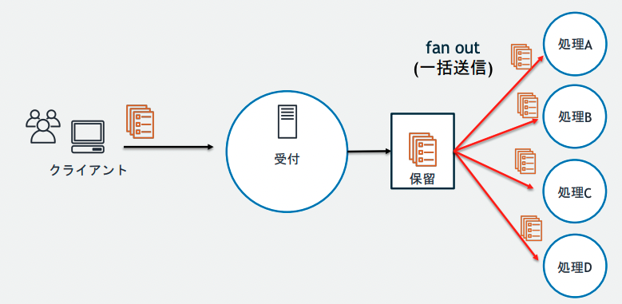
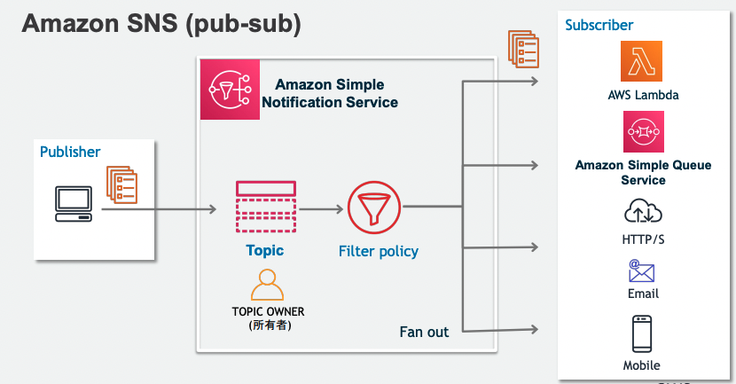
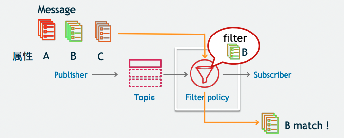
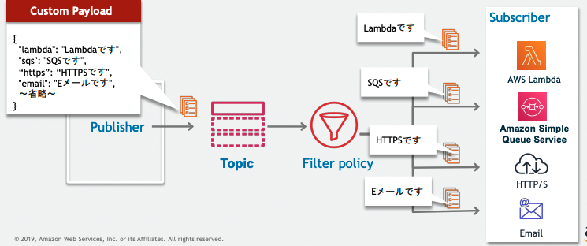
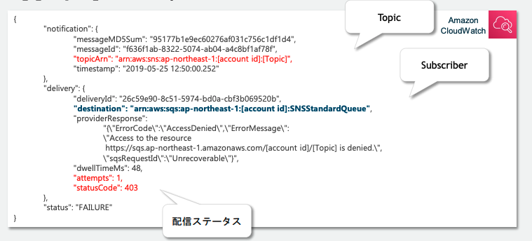
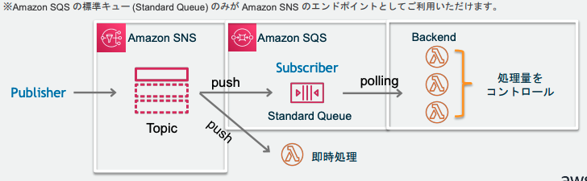
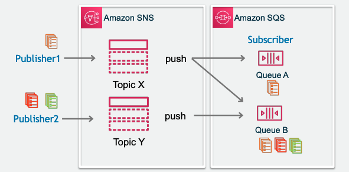

# SNS
- [blackbelt](https://pages.awscloud.com/rs/112-TZM-766/images/20190604_AWS-Blackbelt_AmazonSNS.pdf)
- [blackbelt_movie](https://www.youtube.com/watch?v=bPCjOG_jQlc)

## SNS概要

SNS(Simple Notification Service)は、マネージド型の`メッセージ配信サービス`で非同期なメッセージ配信を実現することができる

複数のSubscriberに対してpush型でメッセージを送信することが可能

特徴を整理すると以下
- pub-subモデル：1つのメッセージを複数のSubscriberに送信
- Push型：Sub側でpollingが不要でPub側が送りつける
- HTTPSやメールなど複数プロトコルに対応

### Push型のメリット
SNSは、push型であるため、Subscribe側でPollingの必要がない。

pull型である、SQSやMQでは、独立しているConsumerがpollingをする必要があり、Consumerが多くなるほど、コストがかかるという問題がある。また、キュー側も適切にpollingに対して解答が必要

## SNSの代表機能
大きく二つの機能が存在
- Mobile Push(プッシュ通知)  
    より一層マネージドなpippointを利用することが推奨されている。
    - モバイルアプリが起動していなくても、通知が可能
    - モバイル通知をきっかけにアプリを起動してもらえる  
- ★pub-sub  
    基本的には分散アプリケーションの統合用途に利用

### pub-subについて
SNSはpub-subの機能として、以下が可能
- 様々なSubscriberに対してメッセージ配信
    - Lambda
    - SQS
    - HTTP/S
    - Email
    - Mobile

- フィルタリング  
    Subscriberは購読するTopicごとにFilterを設定して、特定のメッセージだけを読み込むことができる

## SNSの登場人物
- Publisher：メッセージを配信する発行者
- Subscriber：メッセージを受信する購買者
- Topic：PubとSubを仲介して疎結合にする

### Publisher
256キロバイトまでのメッセージをTopicに対して発行することができる。  

S3のイベントやCodePipelineやLambdaから送信することができる。

### Subscriber
事前に興味のあるTopicを購読設定しておくことで、メッセージが配信されるとSub側で受信することができる。  
Filter機能を利用することで、Topicの中でも特定のメッセージを購読することができる。

LambdaやSQS、Eメールなどが設定可能。
PubとしてCode PipelineをSubとしてEメールを設定しておけば、Deploy前にメールで承認依頼を出すといったことができる。

## Topic
通信チャネルとして機能する論理的なエンドポイント

TopicにはスタンダートとFIFOの２種類が存在し、順序性、重複性、スループットの面でメリデメがある。

- スタンダート  
順序性と重複性が保証がされない代わりにほぼ無制限のスループットが実現できる

- FIFO  
順序性と重複排除が保証されるが、スループットは300件/secとなる

### 順序性
FIFOトピックではメッセージを発行時に、`メッセージグループID`を発行する。
同一のメッセージグループでは配信順序が保証され。すべてのメッセージで配信順序を担保するためには一つのメッセージグループIDとすれば良い。

### 重複排除
リトライなどで、同じメッセージが配信されてしまうことは銀行業務などでは許されないので、重複排除の機能を利用する。

基本思想としては、特定の重複排除IDを持つメッセージが発行されてから５分間は同一IDを持つメッセージ配信を行わないようにする。
SNSではコンテンツベースの重複削除が機能として提供されており、SNSのコンテンツをSHA-256で暗号化して重複IDとする。

### セキュリティ
#### メッセージの暗号化
KMSによってTopic内のメッセージ（本文）を暗号化することができる。
ただし、Topic名などのメタデータは暗号化対象外であることに注意。

SNSはIAMによるアクセス制御に加えて、Topicに対して、独自のアクセスポリシーを付与することで、IAMと合わせてアクセス制御することができる。

#### 通信経路のセキュリティ
Publisherから、Topicへのメッセージ送信はVPC endpointを利用することでAWSのVPC内部で通信を行うことができる。

## 高度な利用方法
### アクセスコントロール
Topicに対して、アクセスポリシーを発行することができる。

同じアカウント内であれば、基本的に設定は不要だが、オープンエンドポイントとして公開する場合はアクセスポリシーを設定する。

### フィルター
Publisherがメッセージを発行する際、MessageAttributes（メッセージ属性）を利用することで、メタデータを指定することができる。

SubscriberはFilter Policyをリヨすいて、購読中のTopicに送信されるmessageをフィルターして部分受信することができる。

Filterは複数条件の組み合わせやホワイトリスト・ブラックリストが可能

### 配信方法
送信するデータの形式を、エンドポイントごとに変更することが可能。
これによって、subscriberに応じた、メッセージ送信が可能

### リトライ
TopicからSubへのメッセージ配信が失敗した場合に、４段階のリトライポリシーに従ってリトライ処理がされる
1. 即時再試行
2. バックオフ前段階
3. バックオフ段階
4. バックオフ後段階

バっクオフとは、配信が失敗した時に間隔を徐々に伸ばしながらリトライする手法。
すべてのリトライ処理が実行されても配信ができない場合は、メッセージが破棄されるが、SQSと組み合わせてデットレターキューに配信することも可能

### ロギング
CloudWatchと統合されており、配信状況については、CloudWatch Log Groupに配信される。

設定を行うことにより、自動で成功用と失敗用の記録をするロググループが作成される。記録には以下が記録される
- 対象のトピック
- 受信できなかったSubscriber
- 配信ステータスやタイムスタンプ

## AWSサービスとの統合
### CloudWatchとの連携（Publisher）
CloudWatch EventsのEvent Sourceとして、任意のサービスを設定し、Eventのターゲットとして、SNS Topicを設定可能

### Step Function（Publisher）
Step FunctionのステートマシンとしてSNSを指定することができる。

### S3（Publisher）
S3のオブジェクトの操作に対してSNSを発行することができる

### SQS(subdcriber)
SNSとSQSの組み合わせは様々

例えば、SNSからSQSへメッセージ送信を噛ませることで、Consumer側からは、pull型として扱うことができる。

また、SNSに一度メッセージを送ってからSQSに配信することで、Publisherは一つのエンドポイントに送信しているだけなのに、１つのメッセージを複数のキューに配信することができる。

また、SQSは複数のSNSをSubscribeすることができる

### Lambda(subdcriber)
Lambdaを噛ませることによって、様々な作り込みに対応できる。例を挙げると、
- SNSでは標準接続できないAWSサービスに対しての処理
- 標準では準備されていないフィルタリング

