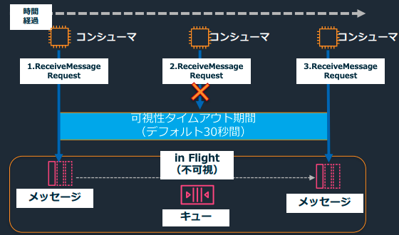
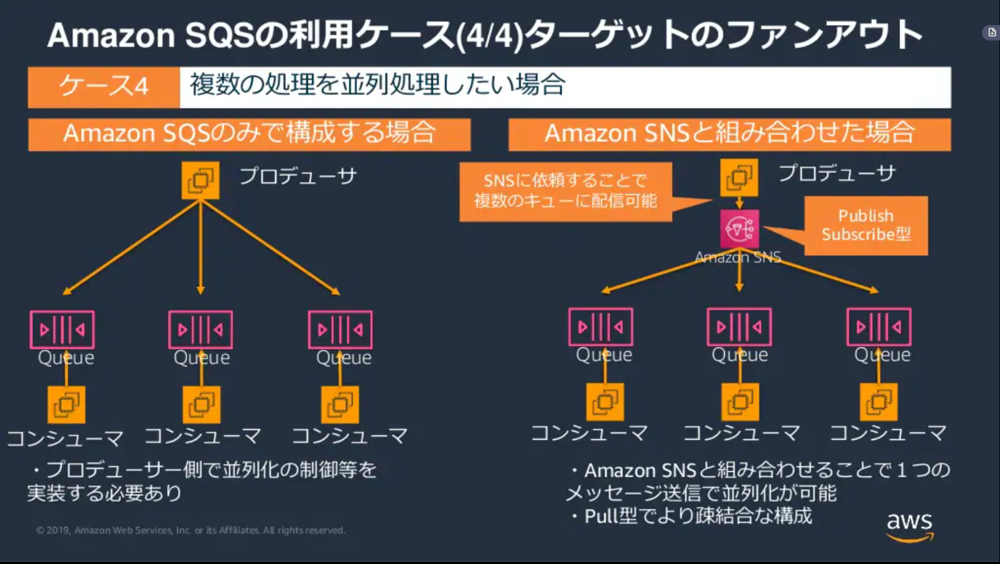

## SNS
SNS(Simple Notification Service)は、マネージド型の`メッセージ配信サービス`で非同期なメッセージ配信を実現することができる

利用のイメージとしては、SNSのコンソール上でTopicの作成およびSub側の設定をして、Pub側でSNSのTopicを指定してあげる。

### SNSの登場人物
- Publisher：メッセージを配信する発行者
- Subscriber：メッセージを受信する購買者
- Topic：PubとSubを仲介して疎結合にする

### Publisher
256キロバイトまでのメッセージをTopicに対して発行することができる。  

S3のイベントやCodePipelineやLambdaなどと連携することができる。

### Subscriber
事前に興味のあるTopicを購読設定しておくことで、メッセージが配信されるとSub側で受信することができる。

LambdaやSQS、Eメールなどが設定可能。
PubとしてCode PipelineをSubとしてEメールを設定しておけば、Deploy前にメールで承認依頼を出すといったことができる。

### Topic
通信チャネルとして機能する論理的なエンドポイント

TopicにはスタンダートとFIFOの２種類が存在し、順序性、重複性、スループットの面でメリデメがある。

- スタンダート  
順序性と重複性が保証がされない代わりにほぼ無制限のスループットが実現できる

- FIFO  
順序性と重複排除が保証されるが、スループットは300件/secとなる

#### 順序性
FIFOトピックではメッセージを発行時に、`メッセージグループID`を発行する。
同一のメッセージグループでは配信順序が保証され。すべてのメッセージで配信順序を担保するためには一つのメッセージグループIDとすれば良い。

#### 重複排除
リトライなどで、同じメッセージが配信されてしまうことは銀行業務などでは許されないので、重複排除の機能を利用する。

基本思想としては、特定の重複排除IDを持つメッセージが発行されてから５分間は同一IDを持つメッセージ配信を行わないようにする。
SNSではコンテンツベースの重複削除が機能として提供されており、SNSのコンテンツをSHA-256で暗号化して重複IDとする。

#### リトライ
TopicからSubへのメッセージ配信が失敗した場合に、４段階のリトライポリシーに従ってリトライ処理がされる
1. 即時再試行
2. バックオフ前段階
3. バックオフ段階
4. バックオフ後段階

バっクオフとは、配信が失敗した時に間隔を徐々に伸ばしながらリトライする手法。
すべてのリトライ処理が実行されても配信ができない場合は、メッセージが破棄されるが、SQSと組み合わせてデットレターキューに配信することも可能

#### セキュリティ
KMSによってTopic内のメッセージ（本文）を暗号化することができる。
ただし、Topic名などのメタデータは暗号化対象外であることに注意。

SNSはIAMによるアクセス制御に加えて、Topicに対して、独自のアクセスポリシーを付与することで、IAMと合わせてアクセス制御することができる。

## SQS
SQS(Simple Queue Service)は無制限のスケーラビリティを備えたフルマネージド型の`分散メッセージキューサービス`で疎結合なシステムを実現できる。

キューとは、データをFIFOに従ったデータ構造で、非同期にデータを受け渡す手法としてよく利用される。
SQSは、複数のAZにキューを構成することで可用性や耐久性を担保し、アクセス制御やKMSによる暗号化などを利用できるため、簡単に優れたキューイング構成を構築できる。

### SQSの登場人物
- Producer：メッセージを作成する生産者
- Consumer：メッセージを取り出して後続処理を行う消費者
- キュー：ProducerとConsumer両者を疎結合にする

SNSは`Push型`の仕組みであり、SQSは`Pull型`である点。  
Push型では、TopicからSubscriberへの配信は即時に行われるが、Pull型ではキューからConsumerがメッセージを取り出す必要がある。

### SQSのキュー
SNS同様にスタンダードとFIFOが準備されており、順序性、重複性、スループットの面でメリデメがある。

- スタンダート  
順序性と重複性が保証がされない代わりにほぼ無制限のスループットが実現できる

- FIFO  
順序性についてはベストエフォートで、配信方法については少なくとも1回配信されるが2回配信される可能性がある。
そのため、Consumer側で冪等性の仕組みなどを取り入れる必要がある。
スループットは300件/secとなる

##### キューの保存期間
デフォルトでは４日間が設定されており、最大で14日間まで変更可能

#### キューからのメッセージ取得
次の3ステップを踏む
1. Consumerがキューをポーリング（キューの監視）
2. Consumerがメッセージ取得（最大10件までまとめて取得可能）
3. Consumerが処理済みメッセージをキューから削除

特に注意が必要なのはメッセージの削除であり、Consumerがキューを取得したからといって、メッセージは自動削除されない。
メッセージ削除の際は取得したMessageのIDである「ReceiptHandle」を指定するが、他のConsumerがメッセージに触れると「ReceiptHandle」が書き換えられてエラーになるの可能性があるので、可視化タイムアウトなどの設定を使うようにする。

#### ポーリング
Consumerが一定間隔でSQSに対してメッセージを監視する仕組みをポーリングと呼ぶ。
ポーリング時にはメッセージ`受信待機時間`を設定することができ、キューに溜まったトピックを確認する間隔を設定できる。

- ショートポーリング  
    受信待機時間を0にすると設定できる。
    分散されたSQSのサーバーから一部をサンプリングして即時返答  
    即時返答のため、SNSのようにProducerが生産してからすぐConsumerが消費できる
- ロングポーリング（推奨)  
    受信待機時間を1-20にすると設定できる。
    分散配置されたSQSの全サーバーに対してポーリングを行い20secの待機時間を設ける  
    待機時間を設定することで、Producerが生産してからConsumerが消費するまでの待機時間を設定できる

#### キューの待機時間設定
Producerがキューに格納してからConsumerが取得するまでの時間を遅延させたり、
Consumerがキューを取得してから他のConsumerがメッセージを取得するまでの時間を遅延させたりすることができる。

以下の図は、後述する遅延キュー（メッセージタイマーと可視性タイムアウトの関係）

#### 遅延キューとメッセージタイマー
Producerからキューにメッセージを送信してからConsumerが取得できるようになるまでをずらすことができる機能。  
遅延キューでは、`配信遅延時間(DelaySecondsパラメータ)`を設定することでキュー全体に設定が反映され、メッセージタイマーでは特定メッセージに対して設定が反映される

#### 可視性タイムアウト
Consumerがメッセージを取得してから、他のメッセージを取得できるようにするまでの待ち時間を設定することができる機能。  
他のConsumerによる同一メッセージ処理を防止することができるが、重複性を完全排除はできない点に注意。

#### デットレターキュー
正常に処理できないメッセージがキューに滞留することを避ける機能。

Redriveポリシーで、移動させるルール（最大受信数）とメッセージ格納先（デットレターキュー）を指定する
デットレターキューでのメッセージ保存期間を設定できるが、デットレターキューに格納されてからの日数ではなく、メッセージ自体のタイムスタンプを参照する点に注意

#### 重複削除
FIFOキューでは重複を排除するための機能が備わっている。
あるメッセージが送付されてから`5分間`の間に同一のメッセージが送られてきた時に重複を削除することができる。

#### セキュリティ
SQSはKMSと統合されており、KMSによってメッセージを暗号化できる。
ProducerとConsumerがKMSの暗号化鍵へアクセスする必要がある。

SQSはIAMによるアクセス制御に加えて、キューに対して、独自のアクセスポリシーを付与することで、IAMと合わせてアクセス制御することができる。

### SQSの容量
SQSでやり取りすることができる容量は最大256kB

しかし、S3とJava拡張ライブラリを利用することで、SQSのメッセージサイズを超過して2GBまで対応することができる。

### SQSのキューの削除
`Purge Queue`を利用すると、指定したキューないのメッセージを削除することができる。

### SNSとSQSの連携（ファンアウト）
Producerが複数のキューにトピックを配信する際に、SQSだけではProducer側で並列側の制御が必要であった。
SNSとSQSを組み合わせたファンアウトでは、SNSを経由することで、１つのメッセージ送信で、全てのキューに並列配信される。

[ハンズオン](https://zenn.dev/mn87/articles/57fd79e985ca19)