## SQS
SQS(Simple Queue Service)は無制限のスケーラビリティを備えたフルマネージド型の`分散メッセージキューサービス`で疎結合なシステムを実現できる。

キューイングの種類としては、非同期、Pull型、P2P型となる。
すなわち、ProducerはConsumerの完了を待たず、Consumerがメッセージを拾いに行き、一対一のメッセージングとなる。

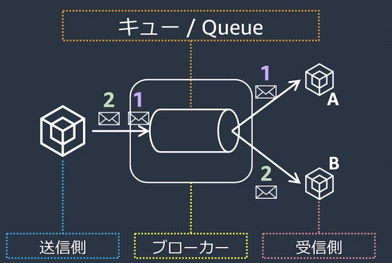

SQSは、ほぼ無制限のスケーラビリティを備えたフルマネージドな分散メッセージキューであり、代表的なメリットとしては以下が挙げられる

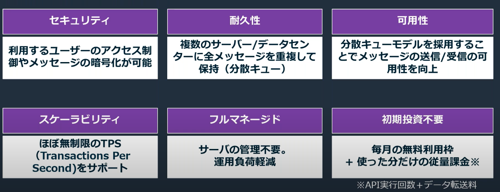

### SQSの登場人物
- Producer：メッセージを作成する生産者
- Consumer：メッセージを取り出して後続処理を行う消費者
- キュー：ProducerとConsumer両者を疎結合にする

SNSは`Push型`の仕組みであり、SQSは`Pull型`である点。  
Push型では、TopicからSubscriberへの配信は即時に行われるが、Pull型ではキューからConsumerがメッセージを取り出す必要がある。

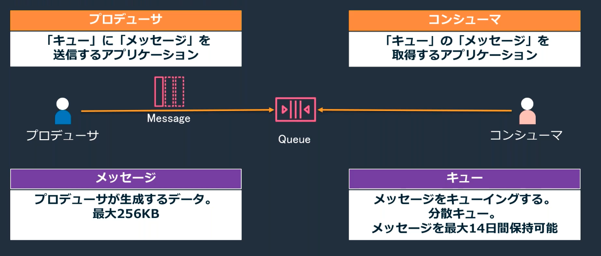

### SQSの利用ケース
SQSの利用ケースの代表として以下が挙げられる
1. 大量のリクエストの均一化

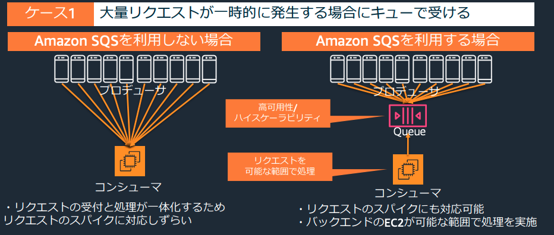

2. 依存関係の低減

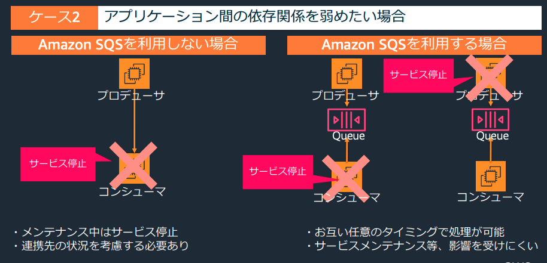

3. 処理の並列化（ファンアウト）→詳細は次節

#### SNSとSQSの連携（ファンアウト）
Producerが複数のキューにトピックを配信する際に、SQSだけではProducer側で並列側の制御が必要であった。
SNSとSQSを組み合わせたファンアウトでは、SNSを経由することで、１つのメッセージ送信で、全てのキューに並列配信される。

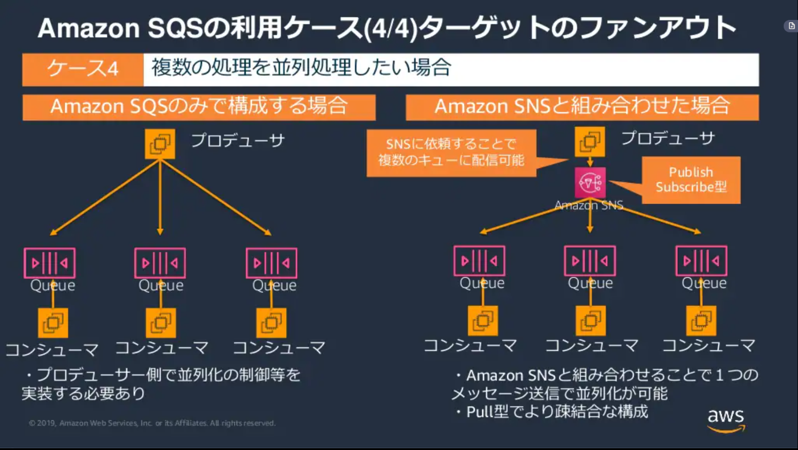

[ファンアウトのハンズオン](https://zenn.dev/mn87/articles/57fd79e985ca19)

### SQSのキュー詳細
SNS同様にスタンダードとFIFOが準備されており、順序性、重複性、スループットの面でメリデメがある。

- スタンダート  
順序性と重複性が保証がされない代わりにほぼ無制限のスループットが実現できる

- FIFO  
順序性についてはベストエフォートで、配信方法については少なくとも1回配信されるが2回配信される可能性がある。
そのため、Consumer側で冪等性の仕組みなどを取り入れる必要がある。
スループットは300件/secとなる  
リリースが2018年11月と比較的最近

##### キューの保存期間
デフォルトでは４日間が設定されており、最大で14日間まで変更可能
この設定は、`MessageRetentionPeriod`で設定する

#### SQSの容量
SQSでやり取りすることができる容量は最大256kB

しかし、S3とJava拡張ライブラリを利用することで、SQSのメッセージサイズを超過して2GBまで対応することができる。

#### SQSのキューの削除
`Purge Queue`を利用すると、指定したキューないのメッセージを削除することができる。

#### デットレターキュー
正常に処理できないメッセージがキューに滞留することを避ける機能。

Redriveポリシーで、移動させるルール（最大受信数）とメッセージ格納先（デットレターキュー）を指定する
デットレターキューでのメッセージ保存期間を設定できるが、デットレターキューに格納されてからの日数ではなく、メッセージ自体のタイムスタンプを参照する点に注意

#### 重複削除
FIFOキューでは重複を排除するための機能が備わっている。
あるメッセージが送付されてから`5分間`の間に同一のメッセージが送られてきた時に重複を削除することができる。

### キューからのメッセージ取得
次の3ステップを踏む
1. Consumerがキューをポーリング（キューの監視）
2. Consumerがメッセージ取得（最大10件までまとめて取得可能）
3. Consumerが処理済みメッセージをキューから削除

特に注意が必要なのはメッセージの削除であり、Consumerがキューを取得したからといって、メッセージは自動削除されない。
メッセージ削除の際は取得したMessageのIDである「ReceiptHandle」を指定するが、他のConsumerがメッセージに触れると「ReceiptHandle」が書き換えられてエラーになるの可能性があるので、可視化タイムアウトなどの設定を使うようにする。

#### ポーリング
Consumerが一定間隔でSQSに対してメッセージを監視する仕組みをポーリングと呼ぶ。
ポーリング時にはメッセージ`受信待機時間(ReciveMessageWaitTimeSeconds)`を設定することができ、キューに溜まったトピックを確認する間隔を設定できる。

- ショートポーリング  
    受信待機時間を0にすると設定できる。
    分散されたSQSのサーバーから一部をサンプリングして即時返答  
    即時返答のため、SNSのようにProducerが生産してからすぐConsumerが消費できる
- ロングポーリング（推奨)  
    受信待機時間を1-20にすると設定できる。
    分散配置されたSQSの全サーバーに対してポーリングを行い20secの待機時間を設ける  
    待機時間を設定することで、Producerが生産してからConsumerが消費するまでの待機時間を設定できる

#### キューの待機時間設定
Producerがキューに格納してからConsumerが取得するまでの時間を遅延させたり、
Consumerがキューを取得してから他のConsumerがメッセージを取得するまでの時間を遅延させたりすることができる。

以下の図は、後述する遅延キュー（メッセージタイマーと可視性タイムアウトの関係）

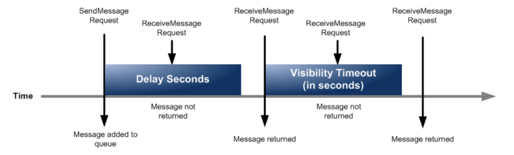

##### 遅延キューとメッセージタイマー
`Producer`からキューにメッセージを送信してからConsumerが取得できるようになるまでをずらすことができる機能。 
-  遅延キューはキュー全体に設定が反映される  
    `配信遅延時間(DelaySecondsパラメータ)`を設定する
- メッセージタイマーは特定メッセージに対して設定が反映される

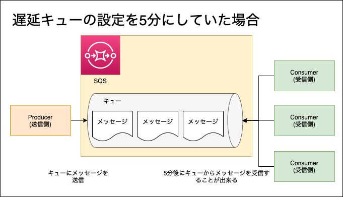

##### 可視性タイムアウト
`Consumer`がメッセージを取得してから、他のメッセージを取得できるようにするまでの待ち時間を設定することができる機能。  
他のConsumerによる同一メッセージ処理を`極力`防止することができる。
極力というのは、スタンダートキューの場合は重複性を完全排除はできない点に注意。

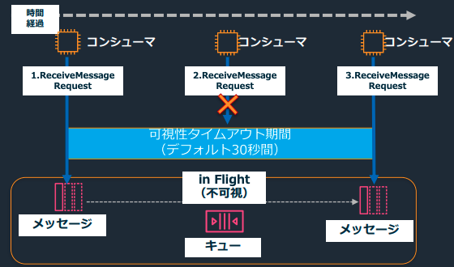

### セキュリティ
#### 暗号化
SQSはKMSと統合されており、KMSによってメッセージを暗号化できる。
ProducerとConsumerがKMSの暗号化鍵へアクセスする必要がある。

SQSはIAMによるアクセス制御に加えて、キューに対して、独自のアクセスポリシーを付与することで、IAMと合わせてアクセス制御することができる。

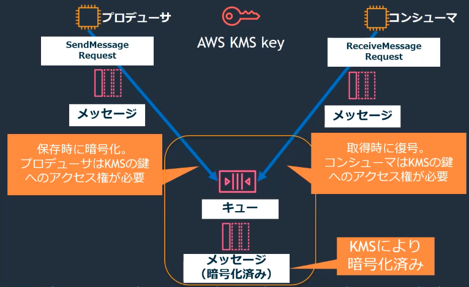

#### アクセス制御
以下で制御が可能
- IAMポリシー: 特定のユーザーやロールに対してキューへのアクセス制御が可能
- SQSポリシー: 特定のキューに対するアクセス制御が可能

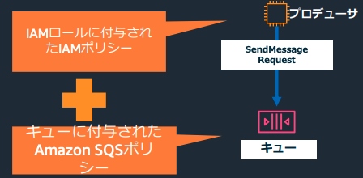

### SQSのメトリクス
Amazon CloudWatchと連携して、モニタリングが可能。
詳細は[公式ドキュメント](https://docs.aws.amazon.com/ja_jp/AWSSimpleQueueService/latest/SQSDeveloperGuide/sqs-available-cloudwatch-metrics.html)を参照されたい。

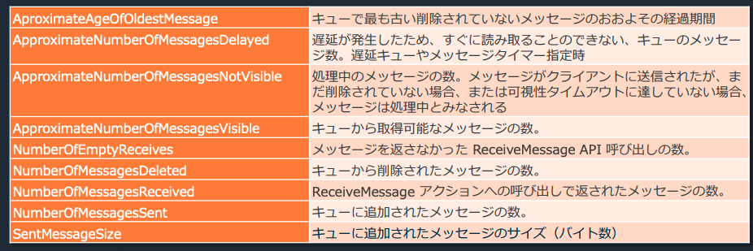

USEメソッド（利用度、飽和度、エラー数）とその他に分けて、メトリクスを紹介する。
その前に、メトリクスを理解する上でも重要なReceiveMessage APIについて解説する。

#### ReceiveMessage API
SQSで利用できるAPIであり、メトリクスの取得でも利用されている。

SQSでメッセージを取得するために利用するAPIである。アプリケーションはReceiveMessage APIを利用して、処理に必要な情報を取得する。
ReceiveMessage APIが提供する機能は以下
- キューに対するポーリング
- メッセージを処理するための情報の取得（メッセージID・本文・タイムスタンプ）
- メッセージ受信後のメッセージに対する更新

このAPIのパラメタ設定を行い、受信数などを調整する。

#### Utilization(使用度)
どれだけキューが利用されているかを確認するためのメトリクス
- NumberOfMessageSent:キューに追加されたメッセージ数
- SentMessageSize:キューに追加されたメッセージサイズ（バイト数）
- ApproximateNumberOfMessageVisible: キューから取得可能なメッセージ数
- ApproximateNumberOfMessageNotVisible: 処理中のメッセージ数。Consumerに受け取られてまだ削除されていないメッセージや可視性タイムアウト中のメッセージが対象

#### Satulation(飽和度)
どれだけキューにメッセージが溜まり、システムが正しく処理を捌き切れているかを確認するためのメトリクス
飽和度はシステムが詰まって、正しく処理をできていないことを図る指標であるのでApproximateNumberOfMessageVisibleやApproximateNumberOfMessageNotVisibleを含めるかは微妙。
- ApproximateNumberOfMessageVisible: キューから取得可能なメッセージ数
- ApproximateNumberOfMessageNotVisible: 処理中のメッセージ数。Consumerに受け取られてまだ削除されていないメッセージや可視性タイムアウト中のメッセージが対象
- ApproximateAgeOfOldestMessage:キューに入ってから、処理されていないキューの最大時間
- ApproximateNumberOfMessageDelayed:遅延キューやメッセージタイマーの対象となっているメッセージキューの数。

#### Errors(エラー数)
キューにおける失敗したメッセージを確認するメトリクス。
失敗したメッセージについては、DLQに移動させることが多いので、DLQでApproximateNumberOfMessageVisibleなどを取得する方法が挙げられる。単独のキューに対しては以下のようなメトリクスが取得できる。
- NumberOfMessagesReceived: Consumerが正しく`受信`をしたメッセ- NumberOfMessagesDeleted: キューから`削除`されたメッセージ数。すなわち正しく`処理`されたメッセージ数を把握できる。
- NumberOfEmptyReceives: AppがReceive Message APIを送信したが、取得できるメッセージがなかったという返り値が返却された回数。この回数が多いことは、タイミングや頻度が悪く、メッセージを効率よく取得できていないことを表す。

### SQSのメトリクスを利用したオートスケーリング
[公式ドキュメント](https://docs.aws.amazon.com/ja_jp/autoscaling/ec2/userguide/as-using-sqs-queue.html)にSQSを利用したオートスケーリングの記事があったので、その内容を整理する。

ドキュメント内で注意されているのは、SQSの処理可能なメッセージ数を表すApproximateNumberOfMessagesVisibleを利用してオートスケーリングを設定しても良いが、このメトリクスはキュー内のメッセージ数だけを取得しており、この値だけを利用してスケールアウトしても適切な処理台数を設定できないという課題を扱っている

オートスケールの台数は複数の要因に従って、用件を決め、それを満たせるようなルールを設定するべき。例えば以下の要件があることを考える。
- メッセージの処理時間
- 許容されるレイテンシー

許容されるレイテンシーが10secであり、メッセージの処理時間が0.1secであれば、1台あたり、100件のメッセージまでは処理することができる。ApproximateNumberOfMessagesVisibleに対して100で割ることで必要な台数を算出し、それを踏まえて台数を決定する。

### kinesisとの比較
ストリーミングデータであればkinesis一択。それ以外の場合は以下のデータの特性によって判断
- データの処理方法
- データサイズ
- 保持期間

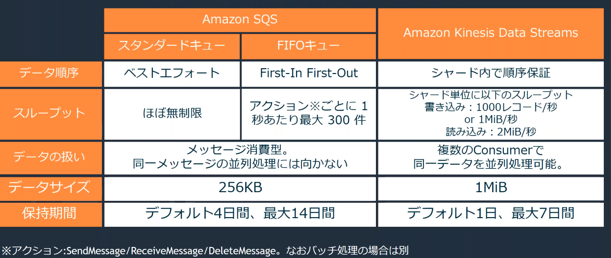

