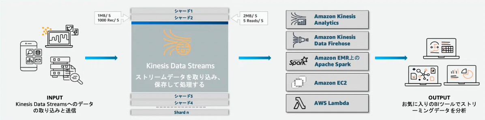

# Kinesis
`ストリーミングデータの配信機能`を提供するマネージドサービス

サーバーがAWS管理のため、ユーザーはストリームデータの処理に集中することができる。

そもそもストリーミングデータとは、データの連続的な変化によって意味を持つデータのことであり、
これらのデータは抽出（Extracet）変換(Transform)書き出し（Load）ETL処理をされて保管される。

Kinesisは、ストリーミングデータを扱うために４つのサービスが提供されている
- Kinesis Data Streams:各種AWSサービスにストリームデータをリアルタイムに配信
- Kinesis Data Firehose:ストリームデータを準リアルタイムでデータレイクや分析ツールに蓄積する
- Kinesis Data Analytics:Streams/Firehoseに配信されたデータをリアルタイムで分析変換
- Kinesis Video Streams:動画をストリームデータとしてAWSに取り込み、各種サービスに配信

## Kinesis Data Streams
異なるシステムやサーバー、デバイスから送信されるストリームデータを受信して、各種AWSサービスにリアルタイムに配信するサービス。

AWSのリソースに配信されるが、Consumer側で作り込みが必要になる点に注意。

### Data Streamsの登場人物
- Producer
- Consumer
- ストリーム: kafkaだとTopicに対応、データのグループ
- シャード: kafkaだとPartitionに対応、ストリームの分割単位

### Data Streamの暗号化
- HTTPSエンドポイントが準備されており、　HTTPSによるデータ通信でデータを暗号化することができる
- KMSを利用することでサーバーサイド暗号化を行うことが可能

### 保存期間
デフォルトでは24時間の保存期間が設定されており、最大で168 時間まで設定可能。

## Kinesis Data Firehose
S3、Redshift、OenSeearchなどのストレージサービスやDBにストリームデータをロードさせるサービス。
Redshiftに保存するためには一度S3に格納する必要がある点に注意

Kinesis Data FirehoseはLambdaと統合されており、受信したデータに変換をしてから、配信することが可能。

Data Streamsと比較して、Consumer側での作り込みが不要であるが、60secほどのラグがあるため、準リアルタイムな機能となる。

## Kinesis Data Analytics
Kinesis Data streamsとKinesis Data Firehoseに格納されたストリームデータに対して分析が可能なサービス

SQLなどを利用して、データ分析を行い、Lambdaと統合されているためデータ形式の変換を行なうことも可能。

Kinesis Data Analyticsで分析した後は、Firehoseで分析結果を蓄積したり、Streamsへ流してよりリッチな分析を行うことが可能。
処理の内容自体は、Streamsでも可能だが、Consumer側の作り込みをせずに分析をすることができる点が大きなメリット。

## kinesis Video Streams
ビデオカメラなどのデバイスから送られてくる動画データをストリームデータとしてAWSに取り込み、ストリーミング（データ転送）するサービス。

データ分析を行う際には、Kinesis Video Streams Parser Streams　Libraryを利用した動画解析や機械学習サービスであるAmazon Rekognition VideoやSage Makerとの連携が可能。

データ分析を行うほか、WebRTCを使用して、レイテンシーを短くすることで、オンライン会議のような双方向での配信も可能である。

