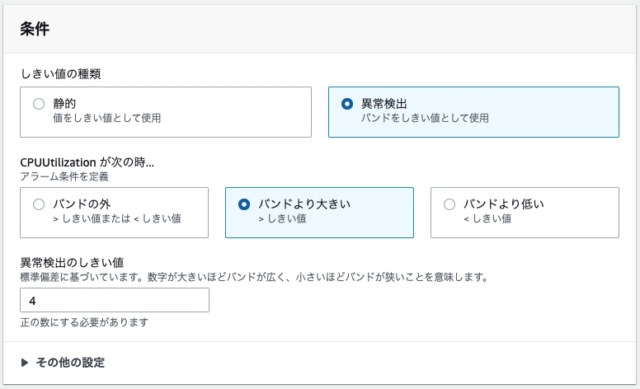
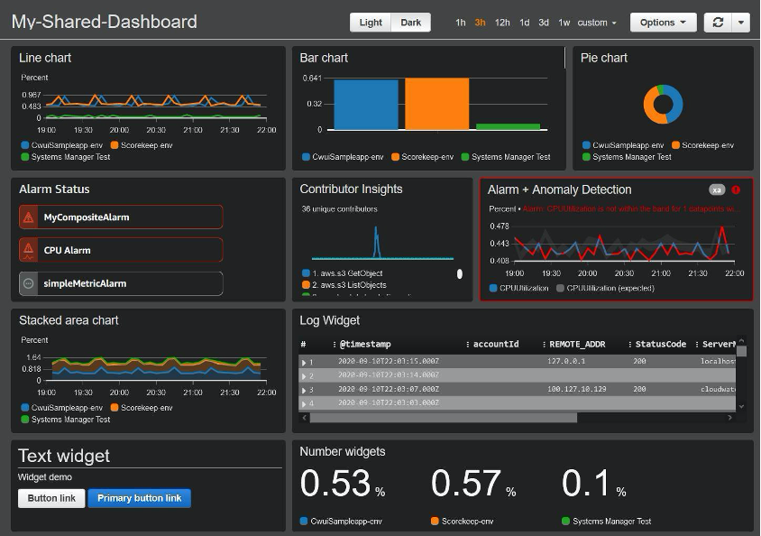
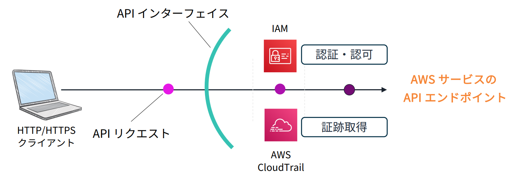
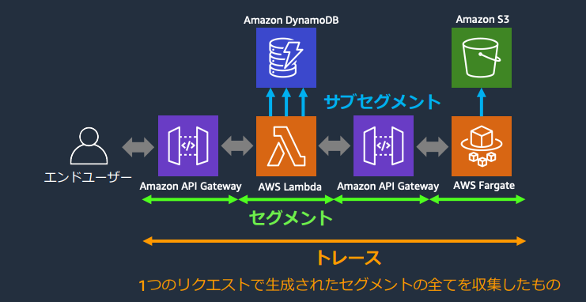
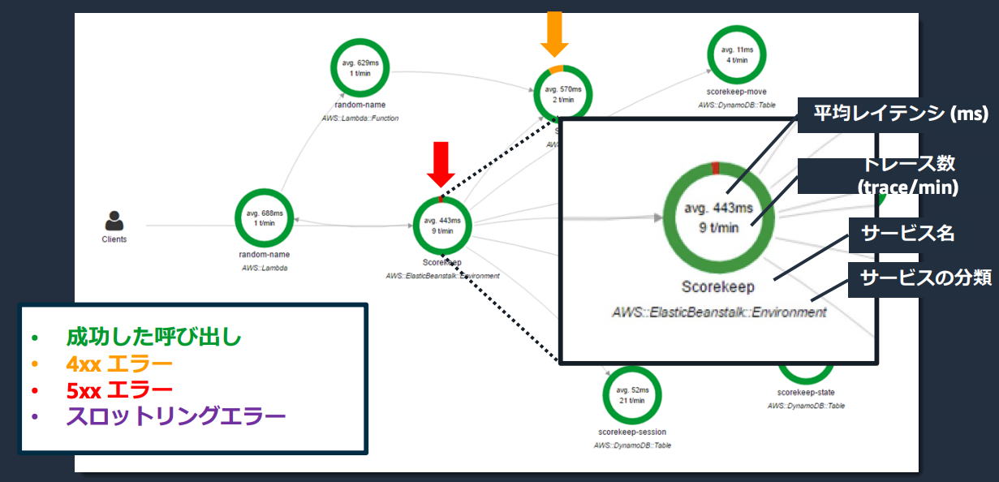

# 監視系

## Cloud Watch
AWSのリソースやAppの監視を行うサービス

各種メトリクス（パフォーマンスの時系列データ）の監視機能だけでなく、ログを収集機能やそれらの情報を分析集約する機能を持つ。

以下の代表的な機能についてまとめる。
- CloudWatch Metrics：メトリクスの集計、可視化
- CloudWatch Alarms：メトリクスに基づいたアラームの発行
- CloudWatch Logs：ログの監視、保存
- CloudWatch Logs Insights：収集したログの検索分析
- CloudWatch Dashboards：各機能で収集した情報を集約
- CloudWatch Events：イベントや時間を契機に処理を実施

### CloudWatch Metrics
監視対象のリソースのメトリクスを収集するサービス

統合CloudWatchエージェントというツールを利用することでAWSのサービスに限らず、オンプレミスのメトリクスを収集することが可能。

#### Cloud Watchの登場人物
- メトリクス  
`メトリクス`とは、システムのパフォーマンスを示す時系列データポイントのセットのことを指す。
取得期間は各サービスで設定可能だが、基本は１分程度

- 名前空間  
収集したメトリクスを格納する入れ物で、異なるサービスのメトリクスは異なる名前空間に格納される。  
AWSのサービスはAWS/"service"という名前空間になる。

- ディメンジョン  
メトリクスを一意に識別する名前と値で、インスタンス名やインスタンスI D

#### メトリクス
■Metrics Math  
既存のメトリクスと数式を利用して、新しいメトリクスを作成することができる。

■標準メトリクスとカスタムメトリクス  
EC2のCPU使用率など、事前にAWSで準備されているメトリクスを標準メトリクスと呼ぶ。
標準メトリクスに準備されていないメトリクスはカスタムメトリクスとして、独自に定義する必要がある。
カスタムメトリクスはAWS CLIやPutMEtricData APIを利用して定義する。

#### 異常検出
統計および機械学習を利用してメトリクスの異常を検出することができる。
メトリクスの新規作成時に以下の画面で設定可能

時間/日/週単位のパターンを組み合わせて機械学習モデルを構築し、想定値をバンドのように示してくれる。

### CloudWatch Alarms
CloudWatch Metricsで収集したメトリクスを監視対象として、以下を設定できる
- アラームの発行
- アラーム後に実行するアクション(Eメールを送信など)

アラームの状態は以下の３つに分類することができる
1. OK：閾値以下で正常
2. ALARM：閾値以上で以上
3. INSUFFICIENT_DATA：データが不足していて、状態の判断が不可能

アラームを発行する際に、1回の閾値超えでアラームとせずにM回中N回閾値を超えるとアラームとするといった設定が可能。

欠落データの扱い方の種類についてと合わせて、アラーム状態を理解しておくと良い
1. missing：アラーム評価範囲全てのデータポイントがない場合で、INSUFFICIENT_DATAのアラームが発行される
2. breaching：不良として扱う
3. notBreachin：良好として扱われる
4. ignore：現在のアラーム状態を維持する

### CloudWatch Logs
AWSサービスやアプリケーションのログファイルの監視、保存、アクセスができるサービス

ログは階層構造となっている
- ロググループ：ログストリームを集約したもので、保持監視アクセス制御について同じ設定を共有するものをグループ化可能
- ログストリーム：タイムスタンプごとに集約したログイベント
- ログイベント：実際の挙動が記録されたログ

ロググループレベルやログストリームレベルでのフィルタリングが可能なことを踏まえてログ設計をするべき。
ログの種類ごとにロググループを作成し、ログを出力するアプリケーションのインスタンごとにストリームを作成するとわかりやすい。

#### 保存期間とS3連携
ロググループは保管期間を設定できるが、ログの保管料金が割高のため、S3にエクスポートすることがおすすめ。
手動によるS3エクスポートか一度Kinesis Data Firehoseを経由してS3にエクスポートできる。

#### メトリクスフィルタ
定義したファイルパターンにて起動するログイベントを数えて、メトリクスにすることが可能。
「ERROR」を定義しておくことで、アラームを発行することが可能。

### CloudWatch Logs Insights
専用のクエリ言語使って、CloudWatch Logs内のログの検索と可視化をする機能

### CloudWatch Dashboards
 Cloud Watchのコンソール画面においてダッシュボードを作成、カスタマイズすることで各機能での監視情報を集約することができる。

マルチアカウントやマルチリージョンの監視情報を集約することが可能で、ダッシュボードでシステム全体の稼働状況を確認することも可能。

### CloudWatch Events
システム側のイベントやスケジュールを契機にして、後続処理を実行させることができる。
皇族のサービスとして`Event Bridge`が提供されている

#### イベント契機
システムソース（イベントの発生元）の変更と事前に定義したルールを照らし合わせて、一致した場合に、後続の処理を実行する

#### スケジュール契機
スケジュールでは、特定の時間や時間間隔を定義して処理を実行する。

特定時間の定義にはCron式を利用する
> cron(分 時 日 月 曜日 年)

時間感覚にはRate式を利用する
> rate(value unit)

- value：正の数値
- unit：minite,minites,hour,hours,day,days

## Cloud Trail
AWSで実行されるAPIの実行履歴を記録することが可能なサービス

AWSアカウント内のユーザー、ロール、サービスがコンソール・CLI・SDKから実行したAPIアクションをイベントとして記録する。
CloudTrailを有効化することで15分後とに出力され、90日間の記録を残すことが可能。S3やCloudWatchに連携することも可能。

CloudTrailの有効化はリージョンごとの設定だが、一括で有効化することが推奨されている

### 記録対象のイベント
全部で３種類のイベントがあり、記録対象を選択することができる。

- 管理イベント  
AWSアカウントのリソースで実行される管理オペレーションが対象  
IAMポリシーのアタッチやネットワークの構成変更などが対象となる

- データイベント
AWSサービスで取り扱われるリソースやデータを対象にした操作オペレーションが対象  
S3のオブジェクトやLambda関数の実行が対象となる。

- インサイトイベント
管理イベントの異常な挙動やエラーを示した場合が対象  
S3バケットが大量に作成されたり、API呼び出し頻度が跳ね上がったりしていると、異常を検知する。

### イベント履歴の調査
- CloudTrail コンソール画面  
複雑な検索はできないが、フィルタリングなどを手動で実施できる。

- S3 Athena  
S3内の構造データを対象にSQLで分析可能

- Elasticsearch Service  
オープンソースのElasticSearchとkibanaを組み合わせたサービス

- CloudWatch Insight  
データロードが不要で高速かつある程度複雑な検索が可能

## X-Ray
分散アーキテクチャでの処理状況をトレーシングし、呼び出し関係、実効成否、レスポンス時間を可視化することができる。
マイクロサービスなどの複数のサービスが連携し合うアーキテクチャに適したサービス

アプリケーション全体としての処理の流れを整理して、ボトルネックなどを洗い出すことができる。

可視化ツールなので
[Black Belt](https://pages.awscloud.com/rs/112-TZM-766/images/20200526_BlackBelt_X-Ray.pdf)
はわかりやすい。

### X-Rayの概念
- セグメント  
    リソース名・リクエスト詳細などの動作に関するデータ
- サブセグメント  
    AWSのサービス・外部HTTP APIなど呼び出しに関する追加の詳細情報
- トレース  
    1つのリクエストで生成されたセグメントすべてを収集したもの

### X-Rayの仕組み
トレースに含まれるセグメントを管理するために、リクエストごとに一意な`トレースID`を発行する。

セグメントのつながりや順序を管理するために、トレース内のセグメントに対して一意な`セグメントID`を発行する。
親セグメントIDによって、順序を決めることができる。

トレースIDとセグメントIDを使って、どのトレースに含まれるどの順番で実行されたセグメントかを整理することができる。

### X-Rayの機能
- サービスマップ  
サービス単位やAWSサービス間の呼び出し成否や処理にかかった時間を`可視化`する

- トレース  
Appへの呼び出しの内訳を時間軸で並べて、リスト化するなど、`詳細化`する
ボトルネックやエラー箇所を特定できる。

- アナリティクス  
各トレースの統計情報など`分析`する

### 利用できる言語
メトリクス収集のSDKライブラリが提供されており、以下の言語で利用可能
- Java
- Node.js
- python
- C#
- Ruby
- Go

### X-rayの利用
アプリケーションの中でX-rayのSDKライブラリを経由して、APIを呼び出す。

呼び出し方としてはAppから直接呼び出すのではなく、X-rayのデーモンを利用することが多い。
EC2ではデーモンをインストールするが、ECSでは別コンテナでデーモンコンテナを立ち上げる。
その際デーモンコンテナではX-rayのAPIを呼び出す権限をIAMで付与しておくことを忘れないようにする。

