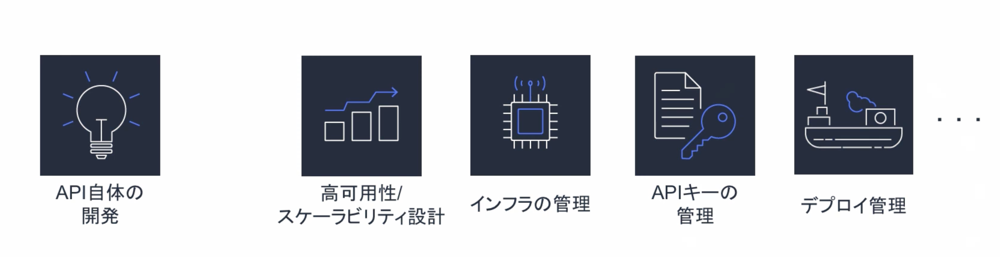
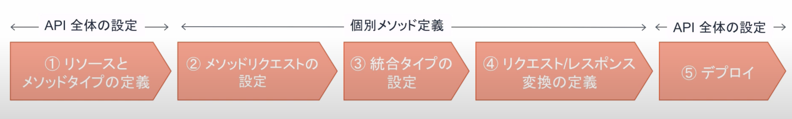
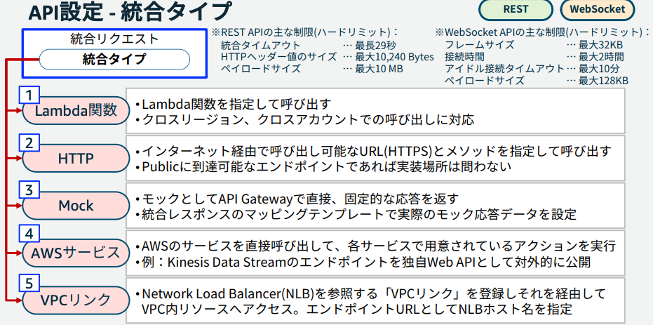
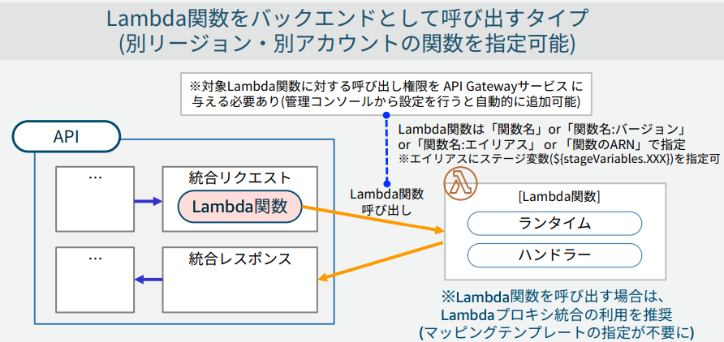
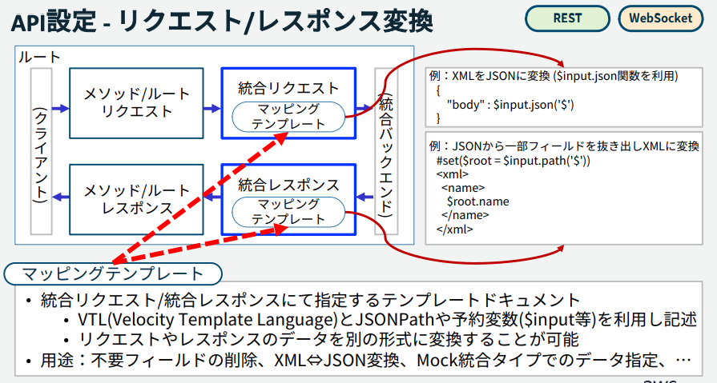
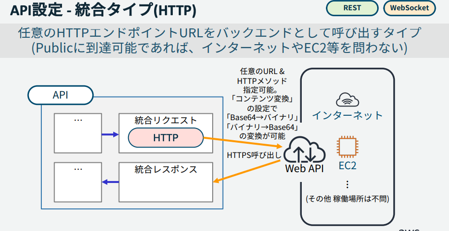
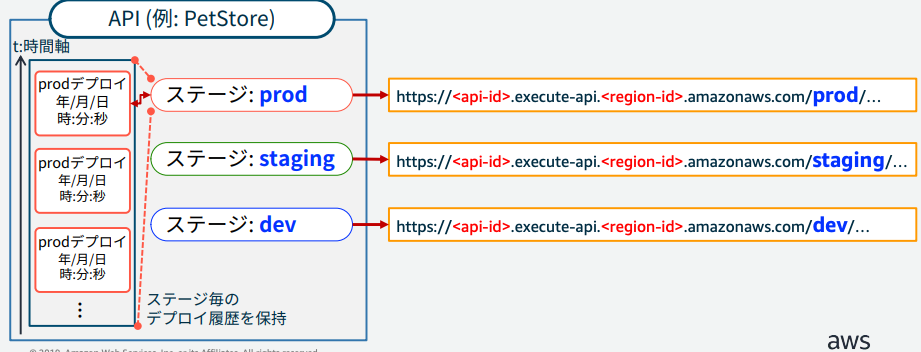
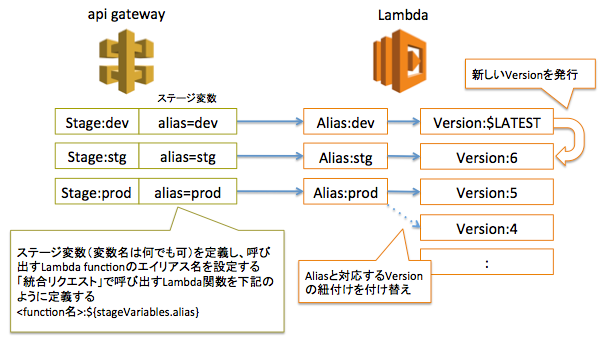
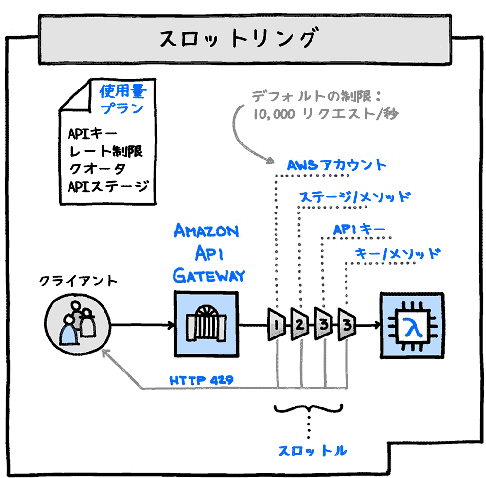
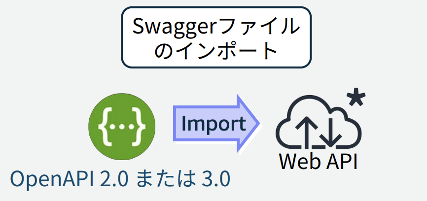

# API GateWay
[BlackBelt](https://pages.awscloud.com/rs/112-TZM-766/images/20190514_AWS-Blackbelt_APIGateway_rev.pdf)
はこちら

## APIとは
Application Programming Interface：プログラム同士がやりとりするための取り決め・仕様

Web APIを開発するためにはAPIの開発の他にも考えることが多い




## API Gatewayとは
「Web API」の作成や公開、管理を行うためのフルマネージドサービス。  
サーバーレスのため、APIの実行基盤のサーバー構築や維持管理はAWSが責任を負う。

API Gatewayを利用することでRESTなWebAPIを作成、公開、管理することができる。

料金体系は、リクエストベース
```
実行回数＋キャッシュメモリ量＋データ転送料金
```


## API GatewayのAPIの種類
APIは3種類存在し、バックエンドのサービス、エンドポイントのタイプやCloudFrontが利用できるかなどの差がある   
注意点として、APIのエンドポイント自体は`HTTPS`のみ

APIの種類は３種類
- REST API
- HTTP API
- WebSocket API

バックエンドのサービスは5つ
- Lambda
- HTTPエンドポイント
- Mock
- AWS　サービス
- VPCリンク

エンドポイントのタイプは３種
- エッジ最適化APIエンドポイント（Cloud Front)
- プライベートAPIエンドポイント
- リージョンAPIエンドポイント

### APIで利用できる機能の差分について
RESTは古くからあって、HTTP APIはOIDCやOAuth対応など、最近の技術に対応している側面がある。

■認証認可  
OAuthやOIDCの認証認可はHTTPでしか利用できないが、Cognitoオーソライザは、WebSocketやRESTで利用できる。

■エッジ最適化  
エッジ最適化エンドポイントはRESTのみがサポートしている。


## API Gatewayの設定項目
大きく5つの設定を行なっていく。  
最初にリソースとメソッドを設定したら、各`リソース×メソッド`ごとにAPIのフローを定義する。

- リソースとメッソドタイプ
- メソッドリクエスト
- 統合タイプ
- リクエスト/レスポンス変換
- デプロイ



### リソースとメッソドタイプ
最初にリソースを作成する。リソースとは、APIとして公開されるエンドポイントのURLの一部に当たり、階層的に定義することも可能である。

次に、各リソースに対するメソッドタイプを指定する。
リソースに対して、以下のメソッドのうち、何を許可するかを制御することができる。

- GET：リソースの取得
- POST：リソースの作成
- PUT：リソースの更新
- DELETE：リソースの削除


### メソッドリクエスト
リクエストを受信した時に実施する処理を定義する


具体的には、以下のような設定ができる
- 認証の設定
- 受け付けるクエリパラメータ
- 必須となるHTTPヘッダの設定


### 統合タイプ
統合バックエンドを渡す前後に処理を定義する


統合リクエストでは、処理を受け付けるバックエンドの種別を選択する
- Lambda関数
- HTTP
- Mock
- AWSサービス
- VPCリンク

バックエンドに向けてのリクエストとバックエンドからのレスポンスについて、形式を変換することが可能

プロキシ統合を利用する場合、APIGWとLambdaで事前に決められた形式のデータにしておく必要がある点に注意
- [API Gateway で統合レスポンスを設定する](https://docs.aws.amazon.com/ja_jp/apigateway/latest/developerguide/api-gateway-integration-settings-integration-response.html)


### リクエスト/レスポンス変換
レスポンスを送信する時に実行する処理を定義する


最終的なAPI GWとしてのレスポンスに関する設定
- ステータスコード
- HTTPレスポンスヘッダなど


## API GWの統合タイプ
全部で４つの統合タイプが準備されている。
実装時に、統合タイプとして、統合リソースのtypeを選択する
- Lambda関数：プロキシ統合であればtypeはAWS_PROXYX
- HTTP：HTTP_PROXYおよびHTTP
- Mock：MOCK
- AWSサービス：AWS
- VPCリンク：



### Lambda関数との統合
プロキシ統合と非プロキシ統合がある。
- プロキシ統合：Lambdaからの返り値のフォーマットが固定
- 非プロキシ統合：フォーマットが決まっていないので、マッピングテンプレートを利用して、APIからの返り値を変更可能

指定するtypeについても、プロキシの場合はAWSではなくAWS_PROXYとなる点に注意




#### マッピングテンプレート
統合リクエストや統合レスポンスで指定するテンプレートドキュメントで、データの形式を変換する



### HTTPとの統合
HTTPプロキシ統合またはHTTPカスタム統合を使用して、APIメソッドをHTTPエンドポイントに統合することが可能。
カスタム統合では、受信リクエストデータを統合リクエストにどのようにマッピングするかなどの設定が必要となる。




## API GWのデプロイとステージ
APIは`ステージ`という論理的な環境にデプロイされる。APIがデプロイされると以下の形式のエンドポイントURLが払い出される
> https://{api-id}.execute-api.{region}.amazonaws.com/{stageName}/...

`{stageName}`は好きに設定することができ、prd,stg,devのように定義する



### ステージ変数
ステージごとに変数を定義することができ、呼び出すLambda関数のバージョンと関連づけることで、API GWのステージとリリースされるLambdaを関連づけることができる。



[ハンズオン](https://blog.serverworks.co.jp/tech/2017/02/01/apigateway-lambda-cloudwatchlogs/)

### Canaryリリース
API GWでは既存ステージ上で、カナリアリリースを利用することができる。
新しいバージョンがCanaryリリースとして、デプロイされ、一部のユーザーが新しいバージョンを利用する。


## API GWのキャッシュ
API GWはステージごとにキャッシュを定義することができる。
キャッシュを更新した場合は、TTLを一時的に0にしたり、キャッシュをフラッシュすることで一時的にキャッシュを無効化する。

個別のリクエストがわでキャッシュを無効化したい場合は、Cache-Control:max-age=0を設定してリクエストする。


## API GWのAPIキーと使用量プラン
`APIキー`を発行することで、APIキーを持つユーザーのみがアクセス可能なAPIを作成することができる。

`使用量プラン`を作成することでAPIキーに対して、アクセス可能回数やアクセス頻度を設定することができる。

### 実装の流れ
[API GatewayのAPIキーと使用量プランについて](https://dev.classmethod.jp/articles/try-api-gateway-usage-plan/)
が参考になる。

実装の流れとしては以下のステップを踏む
1. APIGWでAPIの作成（APIキーを有効化）
2. APIキーの作成
3. 使用量プランの作成
4. 使用量プラン、APIのステージ、APIキーを関連づける


### スロットリング
API GWでは、流量制御の仕組みが実装されている。
流動制御により、過多なりクエストからAPIを守ったり、クライアントの使用量プランを作成できる。  

流動制御はスロットリングと呼ばれるトークンバケットアルゴリズムであり、1リクエストを処理するたびにバケットないのTokenが消費される。
サーバー側で設定する上限によりバックエンドを守ることができるとともに、クライアント側に設定することで使用量の制限をAPIキーとして設定することができる。




## API GWと認証認可
API GWにより、認証認可の仕組みを適用する場合い、いくつかの実現方法がある
1. IAMアクセス権限  
クライアントは、IAMユーザーのアクセスキーをハッシュ化した`AWS署名ver4`をリクエストヘッダーに付与する。
API GWで署名を検証して問題なければAPIを呼び出す。

2. Lambda オーソライザ  
クライアントがリクエストに認証情報を付与して、Lambdaで認証して、IAMポリシーを返却する。
API GWでポリシー評価をして問題なければAPIを呼び出す。
以下２つの機能がある
    - トークンベース  
    OAuthやSAMLを利用した認証を実装する場合やリクエストパラメータを使用するカスタム認証スキーム
    - リクエストベース  
    ヘッダーやクエリ文字列パラメータを組み合わせてはっっ新車IDを受け取る、（WebSocketはこっち）

3. Cognito オーソライザ  
クライアントはCognitoで認証してJWTを発行してもらってJWTリクエストのヘッダーに付与する。
これは古くからあるRESTでも利用できる。

4. JWT オーソライザ(OAuth/OIDC)  
クライアントはOIDCやOAuth2のプロバイダーでで認証してJWTを発行してもらってJWTリクエストのヘッダーに付与する。
これは最近できたHTTPのみでサポートされている。


## APIGWの監視
CloudWatchでAPIGWを監視した際に取得できるメトリクスは以下
- 4XXError：指定された期間に取得されたクライアント側エラーの数。
- 5XXError：指定された期間に取得されたサーバー側エラーの数。
- Cache`Hit`Count：指定された期間内に `API キャッシュ`から配信されたリクエストの数。(Cacheにヒットした数)
- Cache`Miss`Coun：API キャッシュが有効になっている特定の期間における、`バックエンド`から提供されたリクエストの数。(CacheからMissしてバックエンドへ問い合わせた数)
- Count：指定された期間内の API リクエストの合計数。
- IntegrationLatency：API Gateway がバックエンドにリクエストを中継してから、レスポンスを受け取るまでの時間。
- Latency：API Gateway がクライアントからリクエストを受け取ってから、クライアントにレスポンスを返すまでの時間。

## 新規APIの作成
API GWでAPIのインポート機能があり、外部定義ファイルからREST APIをインストールすることができる



対象としては、SwaggerとOpenAPIの定義ファイルがサポートされている。

## APIGWのエラーメッセージ
### 502BAD Gateway
プロキシ統合では、フォーマットが決まっているが、この形式に従わない場合プロキシ統合で形式違のエラーが発生する。

### INTEGRATION_FAILURE
統合が失敗した場合のGWレスポンスで、レスポンスタイプが未指定の場合。

### INTEGRATAION_TIMEOUT
API GWでタイムアウト値をカスタマイズすることができ、50msec-29secの間で設定可能
Lambda、Lambdaプロキシ、HTTP、HTTPプロキシ、AWS統合全てにおいて、最大29secになっている。