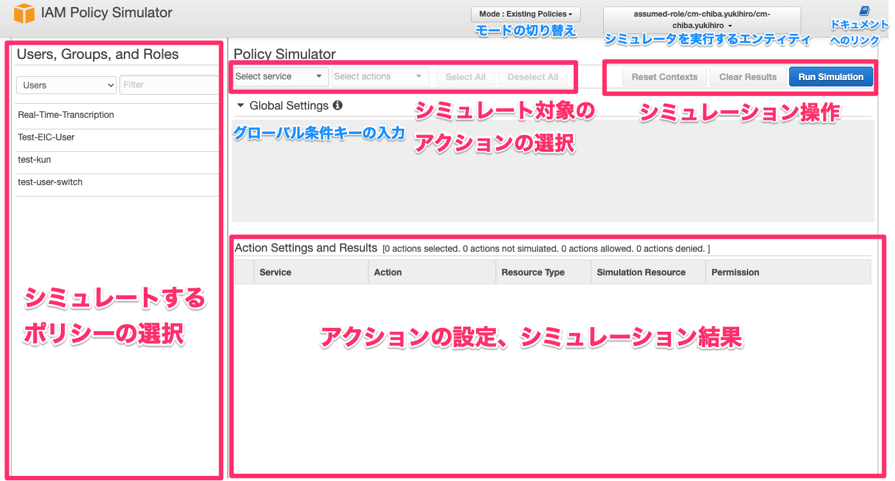
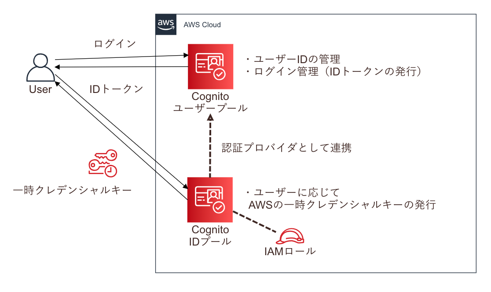
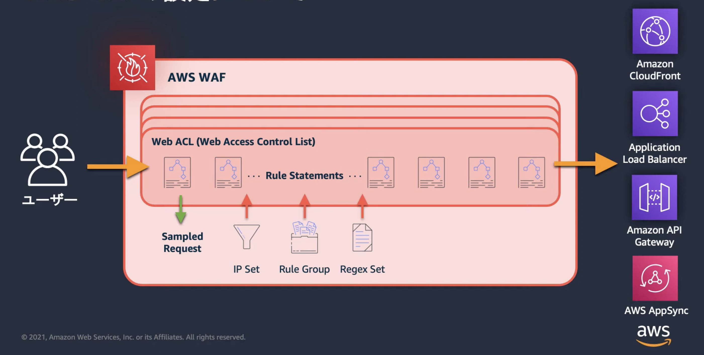
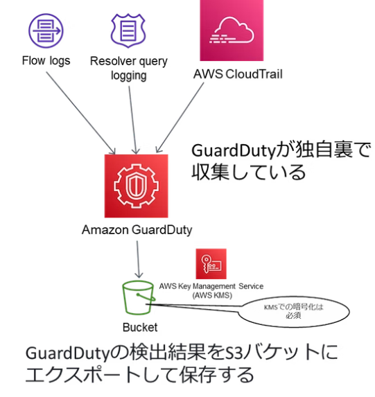
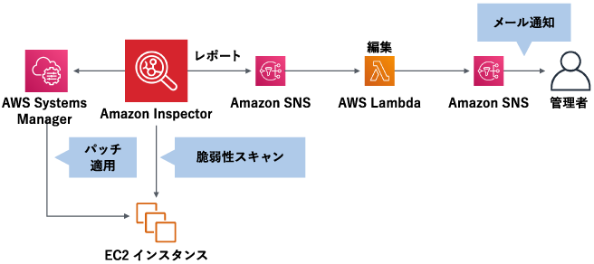

# セキュリティ
## IAM
AWSサービスの認証認可についてはほぼIAMが管理している

### 基本的な用語

- ルートユーザー  
アカウント作成時に作られるすべての権限を持つユーザーで基本的には利用しない
- IAMユーザー  
IAMで作成するユーザーで個人や役割に応じた権限を付与したユーザーを作成する
- ロール   
特定の個人ではなく役割に相当する概念で、役割を持つ人にまとめて付与できる
- プリンシパル  
AWSリソースに対して、アクションをリクエストする人
- ポリシー  
アクセス許可の具体的な定義

### IAMポリシー
ポリシーにはユーザーやグループに付与する`アイデンティティベース`とAWSのサービス側に付与する`リソースベース`が存在する。
アクセス可否は２つのポリシーの組み合わせで決まり、どちらかに明示的な拒否があると実行できない。

#### IAMポリシーで変数を利用
ポリシーの中で`${aws:username}`のように動的変数を利用することができる。
IAMグループを作成して動的変数を利用したポリシーを付与することで、所属するユーザーごとのルールを付与することができる。
※同じようなポリシーを何個も作らなくて済む。

例えば、接続先リソースに動的変数を組み込めば、各ユーザーだけがアクセスすることができるS3ディレクトリが設定できたりする。

- [IAMポリシーで変数を利用してみる](https://qiita.com/mechamogera/items/c31009d481961eea0f56)


### アクセスキー
AWS環境外で実行されるAppがAWSリソースにアクセスする場合、アクセスキーが必要になる。
アクセスキーはIAMで発行し、AWS CLIやリクエストに署名を行う。
AWS SDKを利用する場合は、いかにファイルを作成てアクセス設定を保存する
- Linux: `~/.aws/credentials`
- Windows: `C:/Users/USER_NAME/.aws/credentials`


### IAM RoleとAssumeRole
[IAM ロールの PassRole と AssumeRole をもう二度と忘れない](https://dev.classmethod.jp/articles/iam-role-passrole-assumerole/)がお面を使ってわかりやすく説明している。[AssumeRoleの解説](https://dev.classmethod.jp/articles/iam-role-and-assumerole/)こちらもわかりやすい。


IAM Roleは「API権限を委譲する」機能である。

これを実現する機能としてstsを利用したAssumeRole がある。
AssumeRoleとは、stsに信頼できるリクエスト元を定義しておいて、信頼できることを確認できれば、一時的にRoleを与えるというイメージ。

IAMポリシーを作成する際には、信頼できるプリンシパルを定義する`信頼ポリシー`とどのサービスにアクセスできるかの`アクセスポリシー`を定義する。
信頼ポリシーで設定されているプリンシパルがAssumeRoleAPIを実行することで一時的に認証情報が作成され、アクセスポリシーに定義されたサービスを利用できるようになる。

- 信頼ポリシーは誰を信頼するか(認証相手を定義)
- アクセスポリシーは何をさせるか（認可)


#### リクエスト元を信頼する（アクセスポリシー）
アクセスポリシーで以下のような定義を記述しておく  
以下を定義して、AssumeRoleしても良い、`アカウント(principal)を明確化`
- principalで信頼するリクエスト元
- Actionはsts:AssumeRole
```
{
  "Version": "2012-10-17",
  "Statement": [
    {
      "Sid": "",
      "Effect": "Allow",
      "Principal": {
        "AWS": [ "123456789012" ] // ← AWSアカウントを信頼
        "Service": [ "ec2.amazonaws.com" ] // ← EC2サービスを信頼
      },
      "Action": "sts:AssumeRole"
    }
  ]
}
```
#### リソースに対してアクションを許可する(リソースポリシー)
リソースポリシーでは以下のような定義を記述しておく
以下を定義して、`AssumeRoleされたアカウントに対してのリソースアクセスを制限`する
- Resource: アクセスを許可するリソース
- Action: 実施して良い内容
```
{
  "Version": "2008-10-17",
  "Id": "__default_policy_ID",
  "Statement": [
    {
      "Sid": "__owner_statement",
      "Effect":"Allow",// ← 許可か拒否か
      "Action":"SQS:*",// ← アクションの内容
      "Resource": "arn:aws:sqs:ap-northeast-1:123456789012:MyQueue"// ← アクションを実行できるリソース
    }
  ]
}
```
※`arn:aws:iam::123456789012:root`はルートユーザーではなくて、全ユーザーを対象とすることを意味する。


#### クロスアカウント
AssumeRoleを利用することで異なるアカウントのリソースにアクセスする、クロスアカウント設定ができる。

例えばユーザーAがユーザーBのアカウントのS3にアクセスしたい場合は以下の手順を踏む

1. ユーザーBでロールBを作成
2. ロールBのアクセスポリシーでユーザーAのアカウントをPrincipalとして設定
3. ロールBでS3のアクセス許可を設定
4. ユーザーAでロールAを作成
5. ロールAでロールBへのAssumeRoleを設定


#### IAM Policy Simulator 
設計したIAMポリシーについて、想定しているアクションが実行できるか簡単に調べることができる。


[IAM Policy Simulator でお手軽に確認しちゃおう](https://dev.classmethod.jp/articles/iam-policy-simulator-howto/)


## STS
一時的な認証許可をすることができる。
### STSによる一時的な認証許可
AppからS3にアクセスするという挙動が一般的な作りだが、Appに返すのが性能要件になる場合は、S3に直接アクセスさせることを考える。

その場合、クライアントに一時的にS3へ直接アクセスすることができる署名付きのURLを発行する。
デフォルトは15分程度の期限がある。

### AssumeRoleのAPI
AssumeRole APIを利用することで、適切なIAMのARNを返却し、この情報を利用して、一時的にリソースにアクセスする。


## KMS(Key-Management-Service)
データを暗号化するための鍵を管理するサービス

管理する鍵を利用した暗号化やエンベロープ暗号化のための鍵のやりとりをするエンドポイントを持っている。

### 鍵の種類：CMKとCDK
KMSでは、`CDK(Customer Data Key)`と`CMS(Customer Master Key)`という２つの鍵が登場する
CDKはデータを暗号化するための鍵であり、CMKはCDKを暗号化するための鍵である。  


KMSを利用する場合は最初にCMKを作成し、CMKに紐付ける形でCDKを生成する。
CMKとCDKを利用することで[エンベロープ暗号化](#エンベロープ暗号化)を行い、安全にデータの暗号化が可能となる。

以下のサイトがわかりやすい
- [10分でわかる！Key Management Service](https://dev.classmethod.jp/articles/10minutes-kms/#toc-10)
- [AWS Key Management Service (AWS KMS) を使ってみる](https://qiita.com/mksamba/items/a7e902c6d5a12f2a36dc)


#### KMSのキーの種類詳細
CMK
- カスタマー管理CMK  
  カスタマーがAWSで作成or外部からインポートしたキーでCCSで利用する、AWSが管理するキー
- AWS管理CMK  
  KMSが作成する、AWSサービスを暗号化するSSEで利用するためのキー
- AWS所有CMK  
  AWSが所有する、ユーザーは意識しないキー
CDK
- 対象キー  
  テキストの暗号化を行う鍵A
- 非対称キー  
  プレーンキーの暗号化と復号化を行う鍵B

### 処理方式の種類
KMSでは、`SSE(Server Side Encryption)`と`CSE(Client Side Encrryption)`の2種類の方式がある。  
SSEでは、KMSと統合されたAWSサービスのEBSやS3、RDSで利用され、AWSが自動で暗号化と復号化をサービス内でやってくれるので、ユーザーは暗号化をあまり意識しない。  
CSEでは、アプリケーション側で暗号化を明示的に行う。


### KMSのエンドポイント
- Encrypt/Decrypt: 暗号化と複合化を行うエンドポイントでサイズ制限あり
- GenerateDataKey: プレーンデータキーと暗号化されたデータキーを返す（エンベロープ暗号化で利用）


### エンベロープ暗号化(ハイブリット暗号化)
KMSのAPI公開されている直接の暗号化はサイズ制限などがあるので、エンベロープ暗号化を利用する。
通信に流れるのは暗号化されたテキストと暗号化された鍵
暗号化された鍵はKMSにアクセスできないと複合化できないので、そこで安全性を担保しているっぽい。（両方盗まれても鍵を複合化できない）

1. エンドポイントにGenerateDataKey（CMK）を指定
2. プレーンデータキー（鍵A）と暗号化データキー（鍵Bで錠をかけた鍵A）が返却される
3. プレーンデータキー（鍵A）でテキストを暗号化。プレーンデータキー（鍵Aは捨てる
4. 暗号化データキー（鍵Bで錠をかけた鍵A）と暗号化テキストを送付
5. 受信者は暗号化データキー（鍵Bで錠をかけた鍵A）をエンドポイントに送付するとプレーンデータキー（鍵A）が返却される
6. 暗号化テキストをプレーンデータキー（鍵A）で復号化する


### 主なユースケース
- SSE(Server Side Encryption)
  - SSE-S3  
    S3で管理する鍵で暗号化する（かなりシンプルで監査ログなどは対応していない
  - SSE-KMS  
   KMSで管理する鍵で暗号化する。`監査ログなどを吐く`ことができる
  - SSE-C
   S3へのファイルアップロードで、クライアントで準備した鍵で暗号化する
- CSE(Client Side Encryption)
  - CSE-KMS  
  KMSで管理しているキーを利用して、クライアントサイドで暗号化を実施する
  - CSE-C  
  ユーザー側で用意したキーを利用して、クライアントサイドで暗号化を実施する

### KMSによる暗号化リクエストヘッダー
バッチジョブなどでS3にファイルアップロードする際にはヘッダーに以下を追加する
- x-amz-server-side-encryption  
  KMSのサーバーサイドキーで暗号化する
- x-amz-server-side-encryption-custoemr-algorithm  
  アルゴリズムを指定する
- x-amz-server-side-encryption-customer-key  
  鍵を指定する


### 大量の問い合わせ
大量に暗号化や複合化の問い合わせをするとスロット処理がエラーを発生させる可能性がある。

対応としては、AWSサポートに依頼して、AWS KMSレート制限を引き上げを依頼することや、時間を置いて問い合わせをする（エクスポーネンシャルバックオフ）といった対応が必要。


## Cognito
Web-AppやMobile-Appに対してAPIベースで認証機能を提供するサービス
### ユーザープール
ユーザーDBに相当するが、AWSがマネージドで管理してくれる。

#### ユースケース
ざっくり分けると３つのユースケースに分類可能。Appへの認証、IDプールと連携してAWSサービスへのアクセス、CognitoからLambdaのキック。
- EC2やECS常に配置したWeb-AppやMobile-Appの認証：アプリケーションへの認証をする
- API GWやALBからのオーソライザ：Tokenの認証をしてIDプールと連携して他のサービスと連携する
- Lambdaを使ったオーソライザ：CognitoがLambdaを使って、サインインのワークフロをカスタマイズする

#### 具体的な利用方法
まず、ユーザーディレクトリを定義して、サインアップ方法やパスワードポリシーを設定する。  
アプリクライアント側（認証を求めてくるクライアント）によって、推奨される認証フローが異なる点に注意

#### ユーザープールとアプリケーションの統合
Cognitoでは、OIDCの標準に準拠したエンドポイントが提供されている。
そのため、アプリへのリクエストに対して、Cognitoのエンドポイントにリダイレクトすることで認証・認可をCognitoに任せることができる。
Cognitoで認証してクライアント側にTokenを付与することで、Cognitoと連携するアプリへの一元的なアクセスができるようになる（シングルサインオン）

Cognitoへの認証を外部フェデレーテッドIDプロバイダと連携して任せることができる。
具体的なIDプロバイダとしてはGoogle ,Amazon ,Facebook ,Apple ,SAML, OpenIDConnectプロバイダが挙げられる。

#### アプリケーションの設定
Cognitoに問い合わせが来るクライアントを事前に定義しておく。
結果として、クライアントIDが払い出される。


#### ユーザプールの定義
認証フローを定義する必要があるが、モバイルで実行されるアプリケーションかサーバーサイドのWebアプリケーション化で設定内容が異なる。
- ALLOW_ADMIN_USER_PASSWORD_AUTH  
  CLIやSDKを使って管理やユーザーとして認証処理する場合のオプション。
  リクエストにパスワードパラメータが含まれるため、安全なサーバーサイドのWebアプリケーションで利用する。
- ALLOW_CUSTOM_AUTH  
  Lambdaでカスタム認証を行う場合に利用する
- ALLOW_USER_PASSWORD_AUTH  
  CLIやSDKで認証を行うオプション。
  リクエストにパラメータ情報をもつので、モバイルアプリで利用する場合は、SRPを利用する
- ALLOW_USER_SRP_AUTH  
  Secret Saltなどでパスワード交換性の安全性を高める
- ALLOW_REFRESH_TOKEN_AUTH  
  リフレッシュトークンを使って認証を行う場合のオプション

- クライアントシークレットの生成  
  アプリクライアントの正当性を検証する認証情報で、不特定多数に参照される可能性があるモバイルアプリケーションでは利用しない


### IDプール
ユーザープールや外部フェデレーションで認証したユーザーに対してAWSサービスを`認可`する機能を提供

cognitoでは認証をユーザープールが、認可をIDプールが行う。
したがって、両者が協力している。

流れとしては以下
1. ユーザープールで認証される
2. JWTがクライアントに提供される
3. クライアントがIDプールにTokenを渡す
4. IDプールがTokenの検証をする
5. Tokenが正しければ、STSに認証情報をもらう
6. クライアントが所望のサービスにアクセスする




#### 認証されていないゲストユーザー
付与する認可情報はユーザーに応じたルール設定などが可能であり、認証されていないユーザーに対しても権限付与のルール設定ができるので、ゲストユーザーに対する権限付与を行うことも可能  

認証に関わるところなのでユーザープールで設定すると勘違いしやすいが、
ゲストユーザー（未認証）と認証して、IDプール側で認可情報を与えたあげる処理をする

[AWS CLIで動かして学ぶCognito IDプールを利用したAWSの一時クレデンシャルキー発行](https://dev.classmethod.jp/articles/get-aws-temporary-security-credentials-with-cognito-id-pool-by-aws-cli/)
この記事は実際に画面からIDプールの設定をしていてわかりやすい。


### JWT
`署名付きの認証情報を含むToken`

署名がJWTの発行元の秘密鍵で暗号化されているため、公開鍵で復号化するだけで署名を検証することができる点が有用

ただし、期限付きの合鍵となるので奪取されることは避けなくてはいけないので取り扱いに注意が必要。


### Cognito Sync
現在は、AppSyncを利用することが推奨されている点に注意

Cognitoのユーザープールで特定された個人に対して固有のデータストレージを提供する。
クラウドで情報を同期しているので、デバイスが変わってもユーザーが同じなら情報は共有される。


## AWS SSO
複数のAWSアカウントの管理やビジネスアプリケーションへのログインを一元管理できるSSOサービス、

[AWS SSOを図解してみた](https://dev.classmethod.jp/articles/aws-sso-wakewakame/)を後で整理したい。


## ACM(AWS Certificate Manager)
ACMはSSL/TLSサーバー証明書を管理するサービス

前提として、SSLを有効化するためには、通信を行うサーバーに対してSSL/TLSサーバー証明書を発行準備する必要がある。
SSLが有効化されていることでHTTPSの通信が可能となる。

ACMを利用することで、証明書の更新やデプロイを自動化することができる。

### 対象サービス
配置となるAWSのサービスは以下
- ELB
- CloudFront
- API Gateway

### 証明書の発行元
公的機関が発行するパブリック証明書と、自前の認証局で発行するプライベート証明書がある。

パブリック証明書は、接続の安全性を保証するために利用され、不特定多数の人がアクセスするWebサイトなどで利用する。

### ACMの役割
- 証明書の発行：パブリック・プライベートの証明書を発行
- 証明書のインポート：既存の証明書をインポートする
- 証明書のデプロイ：AWSサービスに証明書を配備する

### ACMが利用できないリージョン
ACMが利用できないリージョンで、証明書をインポートしたい場合には、ACMの代わりにIAMを利用する。


## WAF
WAFはWebアプリケーションファイアウォール（Web Application Firewall)機能である。

AWSのサービスに通信が届く前にAWS WAFがルールに従ってフィルタリングをする。



CloufFrontやALB、APIGWに対してルールを設定して、特定のIPからのアクセスを拒否したりすることができる。


### WAFのルール設定
WAFで定義するルールはACL（Access Control List）として設定を行う

- Rule  
通信内容を確認して、不正なアクセスを防ぐためのルールセット  
以下のようにカスタムすることも、AWSが準備しているマネージドのものもある
  - statement: 検査対象とルール複数を and or で組み合わせが可能
  - Action: statementの条件に対する許可と拒否を設定可能

-  Web ACL  
1個以上のRuleの集合体で、このWeb ACLの単位で保護するAWS リソースに紐付けを行う。
複数のルールがある場合は優先順位が適用され、どれにも当てはまらない場合は、デフォルトのルールが適用される。


## Shield
ShieldはL3,L4,L7レイヤーへのDDoS攻撃からシステムを保護する。
StandardとAdvancedが存在
- Standard  
  L3-L4へのDDoSを保護することができ、デフォルト有効で無料
- Advanced  
  WASFと連携することでL7への攻撃への対応
  攻撃の通知やレポーティング機能を提供。  

ただし、Advancedは年間3000ドル＋通信量で費用が多くなるので注意


## Guard Duty
Guard Dutyは見張り役という意味を持つ。

ユーザーの動作や通信をモニタリング・分析し、脅威を識別する脅威検出サービス。

以下のログを収集して、機械学習モデルなどを利用しながら、脅威を検出する。
- VPCフローログ
- CloudTrail
- Rout53
- DNS




## Amazon Macie
S3バケットを対象として、オブジェクト内部の脅威の検出やクレジットカードが暗号化されていないなどを検知することができる。

検知には機械学習が利用されている。


## Detective
各種AWSサービスから収集できるデータを分析・可視化することで、インシデンtおの原因を特定（犯人探しを）する。


## Inspector
EC2のソフトウェアの脆弱性についてサポートするサービス。

サーバー内部から脆弱性を診断するホスト型診断と外部ネットワークから脆弱性を確認する外部ネットワーク型診断がある。




## Secrets Manager
データベースのパスワードやAPIキーなどデータ流出の危険性がある認証情報を集約して管理するサービス。
KMSで暗号化して保存できるので、セキュアに管理することができる。

Secrets Managerにシークレットを管理し、Secrets Managerにアクセスすることで、シークレットを取得する。


Systems Managerのパラメータストアでも、認証情報を一元管理することができるが、***シークレットの自動ローテション機能***が存在する。
シークレットの更新期間を設定すると、パスワードを自動更新して、RDSなどのデータベース側のパスワードも変更することができる。