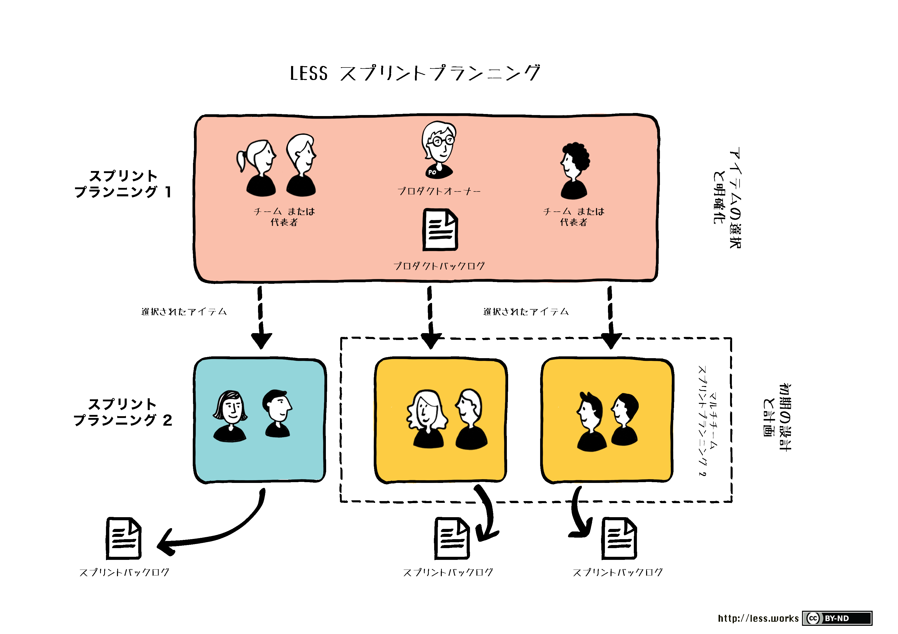
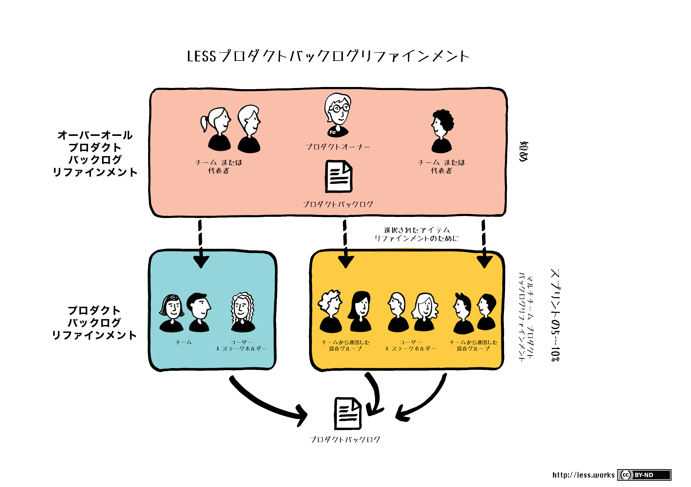
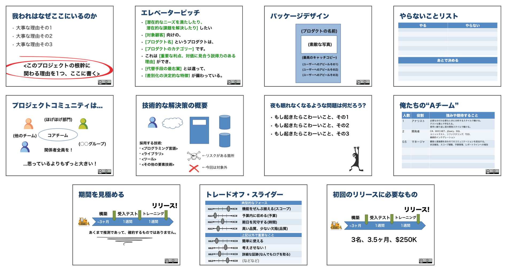
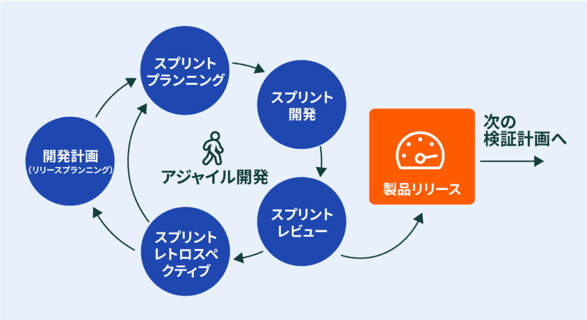
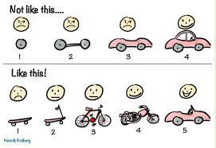

# Agileの基本
## why Agile
ソフトウェア開発で最も重要なことは何か。  
それは、ソフトウェアが顧客にとって重要な課題を解決し続けることである。すなわち価値のあるソフトウェアであり続けることである。

この目的を達成するために、リリース後も開発を継続し、サービス向上していくことが求められている。 

> Agileの目的とは、  
> 開発行為を少しづつ反復しながら進めていくことで、  
> 経験に基づき、チームとプロダクトをkaizenしていき、  
> 変化に強い価値のあるプロダクトを世に送り出し続けることである。  

ここまでは理想論からのなぜAgileを説明した。

次に、現実論からのなぜAgile化を語る。
Agileを始める前に3つの真実を受け入れる
1. プロジェクト開始時に全ての要求を集めることはできない
2. 集めたところで要求はどれも必ずと言っていいほどかわる
3. やるべきことはいつだって与えられた時間と資金よりも多い

この真実を受け入れると、事前に全ての要望を洗い出し計画通りに開発を進めることがいかに難しいかがわかるはずである。  
そのため、Agileでは以下のように開発を進めて3つの真実に対応する

> Agileではこの真実に対応するために  
> 顧客と共に開発を進め、  
> 取捨選択することでやるべきことを限定して、やれる範囲での開発を行うという  
> 現実に適用する計画を立てる

## what Agile
アジャイルでは、短い期間でリリースし、フィードバックを受け、改善するというサイクルを基本としている。

"Agile"は機敏さ俊敏さを表しているが、このスピードはゴールに辿り着くまでの速さではない。  
俊敏さは以下の事柄に対する素早い対応と意思決定を意味する。
- 市場の変化に対する対応の速さ
- リリースによって生まれたユーザーからのフィードバックの速さ
- 開発者自身の気づきに対する開発サイクルの改善の速さ

ウォーターフォールと比較すると、不確実性に対して向き合い、不確実性を味方としてビジネスチャンスを掴む開発手法になる。  
ウォーターフォールの上位互換ではない。必要機能や作るべきものが決まっているのであればウォーターフォールを採用する。

## what Scrum
スクラムはアジャイル開発手法の１つ。

スクラムでは以下の特徴がある。本記事では、AgileとScrumを併せて説明していく。
- タイムボックス  
    固定の短い時間に区切って、開発を行う
- 透明性  
    現在の状況や問題点を常に可視化する
- 検査  
    定期的に進捗状況やプロダクトの期待値と現状を比較し、確認を行う
- 適応  
    透明性と検査の結果明らかになった課題に対してkaizenを目指して新しい取り組みを取り入れる

まとめると、ScrumではAgileの原理原則を満たすために、以下のように開発を進める
> タイムボックスという短い時間に区切ることで、少しづつ、繰り返しながら開発を進める  
> 透明化により、開発を進めていく上での現状や問題をいつだれでも分かる状態とする  
> 検査により、プロダクトと現状のギャップを明らかにする  
> 適応により、透明化と検査で判明した課題に対して、タイムボックスを繰り返す中で試行錯誤的に解決を目指していく  
> 上記を経て、変化に強いチームとなり、価値のあるプロダクトを作り続ける  

## アジャイルソフトウェア開発宣言
アジャイルソフトウェア開発宣言は、以下の文書である。それぞれについてポイントを整理する。
また、重要なことは左のことがらに価値があることを認めている点。左側が不要とは言っていない。

> 私たちは、ソフトウェア開発の実践あるいは実践の手助けをする活動を通じて、より良い開発方法を見つけ出そうとしている。この活動を通じて、私たちは以下の価値に至った  
> ・プロセスやツールよりも個人との対話を、  
> ・包括的なドキュメントよりも動くソフトウェアを、  
> ・契約交渉よりも顧客との協調を、  
> ・計画に従うことよりも変化への対応を、  
> 価値とする。すなわち、左記のことがらに価値があることを認めながらも、私たちは右記のことがらに価値をおく。

### 個人との対話(自己組織化/心理的安全性)
対話とは、相手の価値観を尊重し、共に考えていく取り組みのこと。心理的安全性のあるチームであること。  
Agileのチームでは前提として、自分達がなぜここにいるのかを理解し、お互いの強みがわかっているために最適なフォーメーションを組んで、ビジョンに向けて自走できる自己組織化された組織であるべき。

プロダクトを自分ごととして捉え、お互いを理解し尊重し合いながら行う対話が行われることで、情報共有が活発に行われ、複数視点からkaizenや懸念点の洗い出しが行われる。

### 動くソフトウェア(MVP)
ソフトウェアは何かしらの課題を解決するためのものであり、プロダクト開発は「この方法は課題を解決する」という仮説の検証である。
ただし、仮説は仮説のため、本来必要なものとのギャップが存在する。

「動くソフトウェア」とは仮説の正しさをいち早く検証し、仮説と欲しいもののギャップを洗い出すための取り組みである。
Agileにおいては、仮説の価値を提供できる実用的で最小限の範囲のプロダクトであるMVPを作成し、仮説検証をいち早く行う。

### 顧客との協調（提供する価値）
顧客は、共に価値を創り出す大切なパートナーである。
顧客からのフィードバックはプロダクトをより良くするための宝です。ただし、顧客の言いなりになってモノづくりをするということではない。

顧客の抱える課題を分析し、その課題に対して効果のあるプロダクトを生み出すことで価値を高める。

### 変化への対応（変化はチャンス）
顧客のニーズや市場環境の変化は大きな成功を掴むためのチャンスである。
Agileの成果物はプロダクトとチーム。変化に強いチームを生み出すことで、変化し続ける市場において優位性を保って戦い続けることができる。

## アジャイル宣言の背後にある原則
アジャイルソフトウェア開発宣言のマインドセットを実現するための行動指針として、「アジャイル宣言の背後にある原則」がある。

> ・顧客満足を最優先し、価値のあるソフトウェアを継続的に提供します  
> ・要求の変更はたとえ開発後期であっても歓迎します  
> ・変化を味方につけることによって、お客様の競争力を引き上げます  
> ・動くソフトウェアを2-3週間から2-3ヶ月という出来るだけ短い間隔でリリースします  
> ・ビジネス側の人と開発者はプロジェクトを通じて日々一緒に働かなければなりません  
> ・意欲に満ちた人々を集めてプロジェクトを構成します  
> ・環境と支援を与え仕事が無事終わるまで彼らを信頼します  
> ・情報を伝える最も効率的で効果的な方法はface2faceで話をすることです  
> ・動くソフトウェアこそ最も重要な尺度です  
> ・アジャイル・プロセスは持続可能な開発を促進します。一定のペースを継続的に維持できるようにしなければなりません  
> ・技術的卓越性と優れ設計に対する普段の注意が機敏さを高めます  
> ・シンプルさ（無駄なく作れる量を最大化すること)が本質です  
> ・最良のアーキテクチャ・要求・設計は自己組織的なチームから生み出されます  
> ・チームがもっと効率を高めることができるかを定期的に振り返り、それに基づいて自分達のやり方を最適に調整します

## Role
以下３つのRoleがある。
- Product Owner  
    プロダクトの価値を最大化する
- Scrum Master  
    Scrumの仕組みを正常に回す
- Dev Team  
    チームとして最大効率でプロダクトを開発する

### Product Owner
プロダクトの責任者であり、プロダクトの価値を高めるための情熱を持った人。   
POは真実の源であり、積極的にプロダクトに興味を持ってくれることが成功に直結するため、たとえお客さまであっても積極的にチームに巻きこむ。

■what's is  
- プロダクトの価値最大化に責任を持つ
- 必要機能（PBL）を明確にし、優先順位を定める
- 1人の人間であり、複数人を構成しない

■目的  
開発チームを活用して、そのプロダクトが生み出す価値を最大化する責任がある。

■実施内容  
- プロダクトのビジョンを明らかにする
- リリース計画および予算を管理する
- PBLの内容を詳細化する
- PBLが完了しているかを確認する

### Scrum Master
一番Agile開発やスクラム開発に対して知見を有しており、正常にAgile開発ができるようにチームに影響を与えられる人。

■what's is  
- スクラムの促進と支援に責任を持つ
- スクラムのルールや進め方をPOとDEVに理解させ、実践を促す
- チームが機能するための障害を取り除く

■目的  
スクラム外部からスクラムを守り、スクラム内ではスクラムをスムーズに行われるように促す

■実施内容  
- POやDevチームにAgileやScrumについて説明する
- プランニングやレトロスペクティブの会議を進行する
- POとDevの会話を促す
- スクラムの生産性が上がるように足りていない部分のフォローをする

### Dev
具体的な開発を行うチームであり、個人ではなく全体として成果を出すチーム

■what's is  
- プロダクトを作るために必要な専門家
- 自分達自身を管理する体制と権限がある
- 開発メンバの責任はチームで担う

■実施内容  
機能横断的なチームであることが望ましい。  
すなわち、特定のことしか行わない専門のサブチームで構成されるのではなく、作業を進めていく過程でなるべく個人が複数のことをできるようなっているべき。

また、自己組織化されていることが望ましい。  
すなわち、自分達がなぜここにいるのかを理解し、お互いの強みがわかっているために最適なフォーメーションを組んで、ビジョンに向けて自走できる組織であるべき。
各個人は、チームの一員として成果のために最善を尽くすことが望まれる。Devチームだけでなくスクラム全体が最善を尽くしていることがもちろん前提。

## イベント
以下５つのイベントがある
- スプリントプランニング  
    スプリントで何をどうやって作るのかを検討する
- スプリントRV  
    スプリントで作成した成果物を確認し、フィードバックを得る
- デイリー  
    開発チームが毎日行い、課題を明らかにする
- レトロスペクティブ  
    チームとして振り返りを行い、kaizenを目指す
- バックロググルーミング/リファインメント  
    PBLについて詳細化、具体化を行い、プランニングの準備を行う

### スプリントプランニング
スプリントの中で何を作るのか、どうやって作るのかを対話する。(1ヶ月のスプリントで8時間の時間を割く)

■what's is  
区切られたタイムボックスの中で、何を成果物として生み出すのかの計画を立てる取り組みがスプリントプランニングである。  
POが主体となって開催する、何を作るのかを説明するスプリントプランニング一部とDevが主体となって開催する、どのように作るのかを対話するスプリント計画二部がある。

■目的  
名前がスプリント`プランニング`であることから分かる通り、重要視されているのは計画（スケジュール表）ではなく、`計画作り`  
計画づくりの中で対話をすることで、POとDev間で期待値の擦り合わせやDev内部での実装の観点を擦り合わせていく。

そのため、不一致こそタスクの理解度を揃えるきっかけとなる。
計画が早く終わることが期待されているのではなく、計画を立てる際の意見の不一致や対話のプロセスが重視される。

そもそもAgileでは精密な計画は価値が少ないとしている。
なぜなら、精密な計画を準備したところで、スプリントを経て得られたフィードバックによって変更される可能性が高いためである。
そのため、長期の計画は相対見積もりを利用したざっくりとした見積もりを行う。
一方で、短期の計画は確実性を高めることが求められ、スプリントプランニングにおいて立てた計画に対してはDevチームはコミットすることが求められる。

### スプリントプランニング(前半)
■what's is  
POがスプリントで何を作成するのかということを説明する。  
基本的にはPBLの上位にあるものから開発をしていくため、上位から説明することになる。

■実施内容  
スプリントプランニング自体は最終確認の場として、この時点では、既にPOとDevで対象となるPBLについては合意できている状態が望ましい。

スプリントプランニングの前から、事前準備としてバックロググルーミング/リファインメントを通じて、
PBL上位の項目について、詳細化しておくことが必須である。

### スプリントプランニング(後半)
■what's is  
Devチームが、前半で説明されたPBLに対して、具体的な作業を洗い出すことで作業計画を立てる。  

■実施内容  
PBLを作業レベルに分割し、それぞれの作業に対して時間単位での見積りを行う。個々の作業は1日で終わる範囲に分割することが望ましい。
これは、１日以上だと作業ステータスの変化が捉えにくくなるため、透明性を阻害するためのである。

スプリント計画を経て、得られるプロダクトバックログ項目と作業の一覧を合わせてスプリントバックログと呼ぶ。

なお、開発チームはスプリントプランニングでコミットした内容は、完成させるために最善を尽くす必要があるが、完成することを約束しているわけではない点に注意。
すなわち、完成させることにフォーカスしてしまうと、テストが適当になったり長時間残業して対応したりすることになり、開発チームのコンスタントな能力が不透明になってしまうという問題がある。

### スプリントRV
■what's is  
プロダクトオーナー主催でスプリントの成果をレビューするイベント

Devチームの成果物を関係者にデモを行う。

■目的  
プロダクトに対するフィードバックを得ること

■実施内容  
- プロダクトのデモ
- フィードバックの獲得
- PBLの見直しおよび全体の進捗確認
- 今後の予定や見通しの共有

### デイリー
■what's is  
開発チームのための会議であり、開発チームの透明化を行うための取り組み。

■目的  
スプリングバックログの残作業を確認し、このまま進めることでスプリントのゴールが達成できるのかを確認する。

■実施内容  
毎日、同じ時間、同じ場所にメンバーが集まって「昨日やったこと・今日やること・困っていること」を共有する。

絶対に15分というタイムボックスで終わらせることがルールであり、具体的な議論は２次会で行う。

### レトロスペクティブ（振り返り）
■what's is  
タイムボックスの中で行動した結果を振り返り、Teamが成長するためのネクストアクションを模索する適応のプロセス。  

■目的  
アジャイルの成果物は、プロダクトとチームである。チームが育つために、定期的に振り返りを行う。
すなわち、Agileではプロダクトを開発するプロセスの中にチームや個人の成長戦略を織り込んでいる。

■実施内容  
振り返りの中でKPT分析などを行う

Keepに関しては、チームで実施されている良い取り組みに対して感謝をして、継続する理由付けを行う。
せっかく、チームのために作業を拾ったり支援してくれた人がいるのに、フィードバックがないと継続されなくなってしまう。
やる価値があるのかというのが分かりにくいが、keepとしてあげたり、感謝を伝えることで、チームのブラッシュアップに繋がる

スプリントの中で発見したチームの課題(Ploblem)に対しての解決策(Try)については必ず次のスプリントで実践する
対策については、PBLに取り入れる

### バックロググルーミング/リファインメント
POとDEVで未来のスプリントに向けて、PBLを着手可能な状態にするための取り組み(全体の5-10%の時間を割く)

■what's is  
アジャイル開発にでは、対話をしながら一緒に考える時間を重視しているため、POは開発チームを巻き込んでプロダクトバックログをメンテナンスをする。
このメンテナンスする活動を「プロダクトバックログリファインメント」と呼ぶ

■目的  
POとDevが共に議論を交わすことで、技術的な視点や全体を俯瞰したシステム構築により抜け漏れや曖昧性を減らすことができる。
手戻りが少なく、必要な機能を必要なだけ作ることで、要望とのすり合わせや作業の不安を軽減して停滞感を打破することができる。

■実施内容  
大きなバックログの内容を把握するために受入条件を明確化したり、PBLの分割を行うことで以下の項目が準備できていることを確認する
- 実施する価値が明確
    - 最終顧客に価値があるという根拠や仮説がある
- 着手可能な状態である
    - 具体的な情報が準備されている
    - チームにとって開発可能な大きなサイズに分解されている
    - テスト可能な受け入れ条件がある
    - 開発チームの能力で開発可能な基準である
- タイミングが明確
    - 優先順位で並び替えられている
    - 見積もりが完了している

## 成果物
以下4つの成果物がある
- Product  
    顧客の課題を解決し、価値を提供するProduct
- Team  
    変化に強く、最大効率でPruductの開発を行うTeam
- PBL  
    Productを開発する項目一覧と優先順位
- SBL  
    スプリントの中で開発する項目の具体的な作業

### Product
スプリント単位でプロダクトに対してリリースが行われ、評価可能なインクリメントを作成することが求められる。
動作されるソフトウェアとして提供され、スプリント終了時点で正常に動作する必要がある。

### チーム
スプリント単位でレトロスペクティブなどを通じてチームとしてのkaizenを繰り返していく。
このチームはDevチームではなくスクラム全員のことを意味している。

最終的に、以下の要素を踏まえたチームとなることを目指している
- 心理的安全性がある
- 機能横断的である
- 自己組織化されている

そしてこのような要素を踏まえたチームというのは、変化に強く、価値のあるプロダクトを提供し続けることができる。

### Pruduct BackLog
■what's is  
機能や要求、要望、修正などプロダクトに必要なものの一覧をプロダクトバックログと呼ばれるリストで管理する。  
必ず、プロダクトにつき１つであり、順番が明確に決められている必要がある。

POの最大の役割はこのPBLを管理すること。

■目的  
開発全体はこのプロダクトバックログを軸に進んでいく。

上の方から順番に開発が行われるため、上位にあるものほど詳細化され見積もられている必要がある。

### Spring BackLog
■what's is  
スプリント計画を経て、得られるプロダクトバックログ項目と作業の一覧を合わせてスプリントバックログと呼ぶ。

■目的  
スプリントで行われる具体的な開発プロセスはこのSBLに従って行われる。

個々の作業は1日で終わる範囲に分割することが望ましい。
これは、１日以上だと作業ステータスの変化が捉えにくくなるため、透明性を阻害するためのである。

# Agileの活動
## Agileで意識する7つのP
1. Product  
    Productは、Agileの成果物の一つ。顧客にとって解決する価値のある課題を解決するプロダクトを生み出す。

2. People(Team)  
    People(Team)はAgileの生活部の一つ。自己組織化された心理的安全性のあるチームとして、変化に対応して成長し続ける、Teamを目指す。

3. Project  
    成果物であるProductとTeamを生み出すために、開発期間やコストなどProjectとして着地点を検討し続ける。

4. Process  
    Projectを推進する中で、Processを少しづつ繰り返し回し続ける。

5. Practice  
    Processを推進する中で溜まったノウハウや習慣など、Teamのパフォーマンスを高めて、Projectを成功に導く方法論

6. Pattern  
    Practiceをパターン化して組織間で情報共有、展開できるようにする。

7. Performance  
    相互作用する上記6つのPのPerfomanceを最大化する

## Product
Productは、Agileの成果物の一つ。顧客にとって解決する価値のある課題を解決するプロダクトを生み出す。
 
`Productの価値は顧客の課題に届いているか` リリースの回数にとらわれるビルドトラップにかからずに、顧客の課題を解決する価値あるプロダクトにする必要がある。

### 顧客インサイト
どのように顧客にとって解決する価値のある課題を抽出するのか。
もちろん顧客の声は重要であるが、ユーザー自身が気づいていない課題や動機も存在する。
> マクドナルド顧客の「健康的なメニューが欲しい」という声を聞いて「サラダマック」を発売したが、売り上げは芳しくなかった。
> 一方で、ビックマックよりもパティを増やした「クオーターパウンダー」は大ヒットした。

ヘルシーなものが食べたいと言っているのに、実際は真逆の行動をとるのは顧客の声は嘘ではなく、本当に欲しいものがわかっていない。
ユーザー自身が気づいていない本音や動機をProducetに結びつけるために`顧客インサイト`は重要

### 完成したソフトウェアの使用率とMVP
スタンディッシュグループの調査によると、完成したソフトウェアのうち60%は利用されない。
利用者が表明している「欲しいもの」を開発者が理解し、プロダクトを開発して、初めて「欲しいもの」と「本当に必要なもの」のギャップに気づく。
だからこそAgileではMVPを作成して、実際に動かしてもらう中でユーザーの「本当に必要なもの」を探り、作り上げていく。

### 贅肉を落としたProduct
プロダクトの根幹をなす部分が`背骨`だとして、利用者の課題を解決する機能は`筋肉`、使われない機能は`贅肉`にあたる。
贅肉が増えることは開発と保守運用のコストを要するためにプロダクトの競争力を落とす。
一度始めたことを止めるのは大きな労力を要する、何をリリースするのか、何を贅肉として機能から落とすのか覚悟と勇気を持って取り組む。

> 実際に必要となるまでは追加しない  
> シンプルな設計が成功への鍵

### Productの価値を測る
Productへの不満の声が上がったり、不満がなくても使われていなかったりするのは開発したものが顧客の課題に届いていないことを意味する。
期待した効果が得られているのか、利用されているのかという定量的なデータを取得する機構を構築して、価値を測る取り組みを継続する。

## People(Team)
People(Team)はAgileの生活部の一つ。自己組織化された心理的安全性のあるチームとして、変化に対応して成長し続ける、Teamを目指す。

Team自体も少しづつ、繰り返してkaizenが行われることで、最終的に自己組織化されており、心理的安全性が確保されたチームとなる。  
このようなチームは、変化に強く、価値の高いProductを生み出し続けることができるようなる。

### 自己組織化
自分達がなぜここにいるのかを理解し、お互いの強みがわかっているために最適なフォーメーションを組んで、ビジョンに向けて自走できる組織

### 心理的安全性
チームのメンバーがこのチームに所属していいということを認識しており、全員が意見を言い合えるような環境のこと。

### 共通理解を育む
以下の3つの観点でチーム内で共通認識を持つことはチームビルディングの上で重要
- プロジェクト/プロダクトレベル：インセプションデッキでPJやチームの目的や目標、制約を理解する
- チームメンバーレベル：メンバーの考え方や得意技を理解する
- チーム活動レベル：協働のためのルールや約束事を理解する

### インセプションデッキ
10個の問いに対して、チームで対話をしていくことで関係者全体で理解を揃えていくプロセスを踏む。
重要なのは作成されるドキュメントではなく、メンバーの理解が一致していること。

10個の問いでwhyとhowについて対話を重ねる。
- 我々はなぜここにいるのか
- エレベータピッチ
- パッケージデザイン
- ご近所さんを探せ
- やらないことリスト
- 夜も眠れない音大
- トレードオフスライダー
- 技術的な解決策
- 期間を見極める
- 何がどれだけ必要か

## Project
成果物であるProductとTeamを生み出すために、開発期間やコストなどProjectとして着地点を検討し続ける。

アジャイルでは、不確実性と向き合う開発手法であるため、長期間の計画は価値を保ち続けることができない。
そのため、アジャイルでは次のようにして計画を立てていく。
1. スプリントプランニングの中で、スプリントの中で確実性の高い計画を立てる。Devはこの計画にコミットする
2. デイリーの中で、当日の計画を立て遅れなどを素早く検知する
3. リリース計画を行い、消化したいPBLのストーリポイント、スプリントで消化できるポイントから必要なスプリント数を割り出す

### ストーリーポイント
アジャイルでは、ストーリーポイントというものを利用して、PBLの見積りを行う。

ストーリーポイントの見積りでは、チーム内で合意した、すでに見積されているタスクと比較して相対的に大きいか、小さいかを見積もっていく`相対見積り`を行う。

その際にフィボナッチ数列を利用したポーカーで見積りを行うことが多い。
なぜ、フィボナッチ数列を利用した相対見積りを行うかというと、`精緻な見積ではなくざっくりとした規模感をチーム内で合意するというのが目的`であるから。  

アジャイルでは、精緻な見積りを作るということを極力避けるため、対象タスクが大体どのくらいの規模感なのかを算出して、そのポイントを利用して長期間のざっくりした計画を立てていく。

### スプリントレベルでの計画
スプリントの最初に行うスプリントプランニング。PBLを入力として、SBLを出力する。
スプリントという比較的短いタイムボックスであれば確実性が高いことを担保でき、チームで消化できる分のストーリーポイントが消化できるはず。

スプリントで開発する対象機能(PBL)を決め、PBLをタスクレベルに分割しながら時間単位での見積り(SBL)を行う。  
このスプリントプランニングで開発すると決めたタスクに関してはDevチームはPOに対してコミットメントをして完了するように最大限の努力をする。

### 毎日の計画
毎日行われるデイリーであり、昨日やったこと、今日やること、困っていることをDevチームで共有する。  
チーム内で課題や状況を共有しあうことで、日単位で計画や修正を行い、スプリントでコミットした内容を達成することを目指す。

### 長期間の計画（リリースプランニング）
アジャイルでは、長期間の計画は精緻に立てることはできないし、どれだけやっても確実にはならない。という考えがある。  
しかし、もちろん長期的なスパンでの計画は必要となる。
そのためにストーリーポイントやベロシティから必要なスプリント数を算出するというリリースプランニングをスプリント終了時や、月に一度といったスパンで行う。

具体的な手順
1. 必要となるPBLをリストアップし、そのPBLのストーリーポイントを合計する
2. いくつかのスプリントを経てわかったDevチームがスプリントで消化することができるストーリーポイント（ベロシティ）を算出する
3. １番の数字を２番の数字で割ることで必要なスプリント数を算出する

1番のストーリーポイントを合計するために、Devチームに見積りをしてもらう必要があるが、この見積もりには時間をかけない。
Agileにおいて、未来の不確実な事柄に対して時間をかけることは避け、確実なものについて時間を使う。

## Process
Projectを推進する中で、Processを少しづつ繰り返し回し続ける。

### 少しづつ作る（インクリメンタル）
MVPから初めて、フィードバックの獲得、Productの調整、修正していくことでProductの価値を高め続ける。  
快適な移動手段をProductとして提供する場合、スケボーから始めて改善を繰り返していくことで必要な機能や顧客の要望がすり合わせられる。  
もしかしたら、顧客は自転車で満足するのかもしれないし、欲しいのはバイクだっったのかもしれない。  
ウォーターフォールでは、車が欲しいというのが絶対にわかっている状態でスタートする。（本当に車が欲しいのならOK）

インクリメンタルな開発をする上で意識する点は２つ
- 品質の維持  
    各機能が独立して存在できる設計であり、デプロイやテストに関しては自動化する。  
    マイクロサービス的なアーキテクチャを採用し、CICDの環境を構築することが重要。
- プロダクト全体への理解  
    各機能が独立している場合に、全体の構成がわかりつらくなり、何を作っているのかが曖昧になってしまう。  
    プロダクト全体をシステム目線ではなく、ユーザー視点で捉えるユーザーストーリーマッピングをDevチームでも意識する

### 反復的に作る（イテレーティブ）
少しづつ作る（インクリメンタル）ためのチームの基本動作が`反復的に作る(イテレーティブ)`  
イテレーティブに作るとは、
> チームとプロダクトの間のコミュニケーションあり方

と言える

反復的に作ることで、行動からわかった、「プロダクトについて」そして「チームについて」の事柄を学びとして次の開発期間に適応することができる。

### イテレーション・スプリント
反復的に作るために、一定期間で時間を区切る考え方を「タイムボックス」と呼ぶ。

スクラムでは「スプリント」、スクラム以外では「イテレーション」と呼ぶ。

## Practice
Processを推進する中で溜まったノウハウや習慣など、Teamのパフォーマンスを高めて、Projectを成功に導く方法論

Agileを進める中で、様々な課題を表面化させて、対策に取り組んでいく。
そのためのツールやプラクティスを導入していく。プラクティスはすでに考案されたものでも良いし、チームで生み出しても良い。
チームごとに表面化する課題は異なるため、同じプロダクトを開発しているチームがあったとしてもそれぞれのチームで採用されるプラクティスは異なる。
自分達のチームで作成したプラクティスには是非愛称をつけて親しみを持つのもオススメ。
PBLにするほどではないが、改善したいことをメモする「もやもやボード」など。

### 見える化する
 Project全体として実施するべき項目の一覧であるPBL、スプリントの中で実施するべき項目の一覧であるSBL、毎日の作業の進捗情報であるタスクボードや朝会などを利用してチーム全体として状況が容易に把握できる環境にする。

 また、タスクだけでなく気づいたこともどんどん見える化することでTeamの成長のチャンスを拾う。

### ペア/モブプラグラミング
■what's is  
複数人（Devメンバーに限らず、POやデザインチームも含む）で画面を見ながら開発を行う方法

■目的  
一人でもできることを複数人で行うことは、効率を落とすように感じられるが「隙間時間があって時間を無駄にするのではないかということを懸念するよりも、価値が速く顧客の手に届く流れの効率を重視している」
一緒に仕事をすることで得られる、共通理解の構築や育成時間の短縮、後から発生する可能性のある手戻りの無駄を削減できる効果が得られる。

## Pattern
Practiceをパターン化して組織間で情報共有、展開できるようにする。

自組織に留まらず、組織を跨いで情報交換をしあうことが大事。
そのために自組織での取り組みは整理しパターン化しておく。

## 参考サイト
- [Less](https://less.works/jp/less/framework/product)

