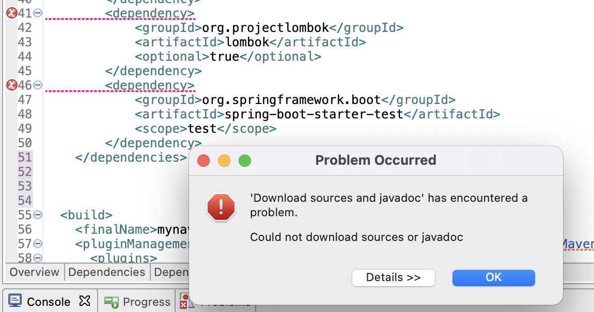
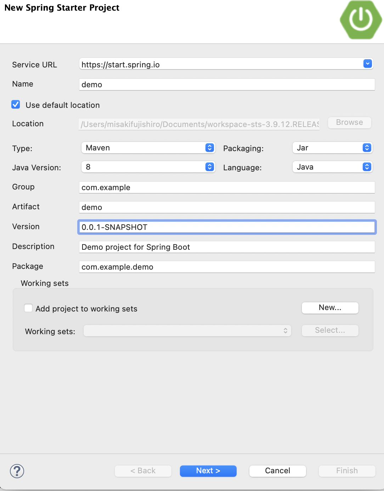
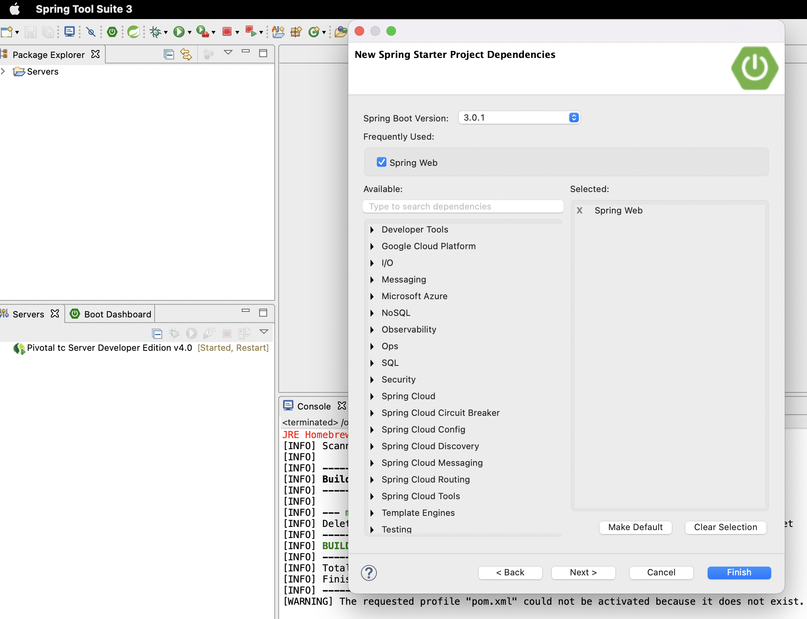
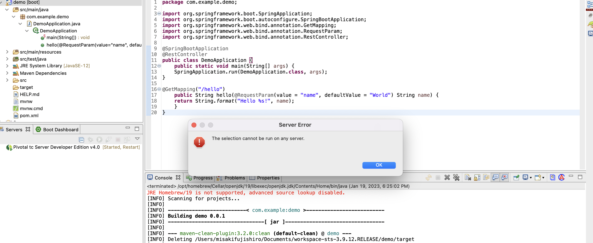
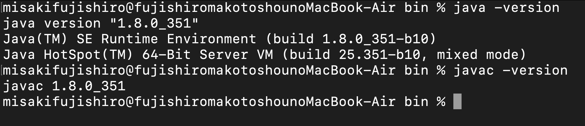
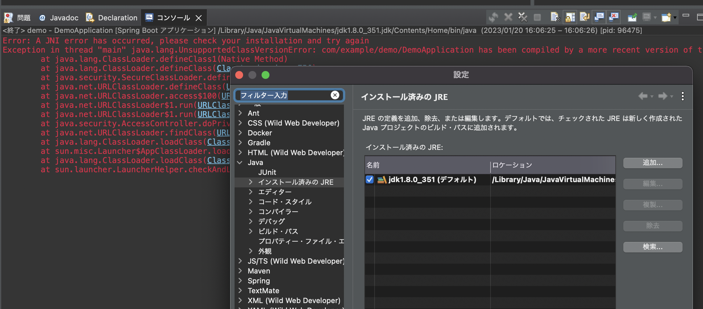

# API GWとLambdaを利用したサーバーレスSpringアプリケーション
アプリケーション開発では、リクエストを受け付けるAppやサーバーが必要になるが、
それらを意識することなく、最小限どのプログラムでAppの実行環境を構築するサーバーレス開発を
API GWとLambdaを利用して実装する。

塾長の記事[AWSで作るクラウドネイティブアプリケーションの基本](https://news.mynavi.jp/techplus/series/AWS/?page=2)を実する。
- [第1回 Spring の開発](https://news.mynavi.jp/techplus/article/techp4316/)
- [第2回 Lambdaの設定](https://news.mynavi.jp/techplus/article/techp4318/)
- [第3回 API GWの設定](https://news.mynavi.jp/techplus/article/techp4321/)

ソースコードは[github](https://github.com/debugroom/mynavi-sample-aws-lambda)のものを参考にする


## PJ構築
## App実装（Spring Cloud Function）
### Spring Cloud Functionとは
Lambdaが呼ばれると、Java側では`com.amazonaws.services.lambda.runtime.RequestHandler`が呼び出されるという仕様になっている

Spring Cloud FunctionはDIコンテナの注入とかしている？？

a

## Lambdaの設定
## API GWの設定


## トラブルシューティング


### PJの始め方がわからない。。。
[TerasolunaのTutorial](https://debugroom.github.io/technical-academy/kickoff/202210/slides/index.html#/7-1)
では、mvn archeytpe:generate コマンドでPJを作成していたので今回もそれを踏襲して、pomを更新することにしたが、方針として正しいのか。
```
 % mvn archetype:generate -B\
 -DarchetypeGroupId=org.terasoluna.gfw.blank\
 -DarchetypeArtifactId=terasoluna-gfw-web-blank-archetype\
 -DarchetypeVersion=5.7.0.RELEASE\
 -DgroupId=org.debugroom\
 -DartifactId=mynavi-sample-aws-lambda\
 -Dversion=0.0.1-SNAPSHOT
```
STSにて、以下の手順でarchetypeで作成したプロジェクトを選択する。
> [File] -> [Import] -> [Maven] -> [Existing Maven Projects] -> [Next]


pom.xmlの以下の部分をgithubからコピーするとエラーが発生

変更前
```
  <properties>
    <project.build.sourceEncoding>UTF-8</project.build.sourceEncoding>
    <maven.compiler.source>1.7</maven.compiler.source>
    <maven.compiler.target>1.7</maven.compiler.target>
  </properties>

  <dependencies>
    <dependency>
      <groupId>junit</groupId>
      <artifactId>junit</artifactId>
      <version>4.11</version>
      <scope>test</scope>
    </dependency>
  </dependencies>
```
変更後

```
   <properties>
        <java.version>1.8</java.version>
        <spring-cloud.version>Greenwich.RC2</spring-cloud.version>
    </properties>

    <dependencies>
        <dependency>
            <groupId>org.springframework.cloud</groupId>
            <artifactId>spring-cloud-function-web</artifactId>
        </dependency>
        <dependency>
            <groupId>org.springframework.cloud</groupId>
            <artifactId>spring-cloud-function-adapter-aws</artifactId>
        </dependency>
        <dependency>
            <groupId>com.amazonaws</groupId>
            <artifactId>aws-lambda-java-events</artifactId>
            <version>2.0.2</version>
        </dependency>
        <dependency>
            <groupId>com.amazonaws</groupId>
            <artifactId>aws-lambda-java-core</artifactId>
            <version>1.1.0</version>
        </dependency>
        <dependency>
            <groupId>org.projectlombok</groupId>
            <artifactId>lombok</artifactId>
            <optional>true</optional>
        </dependency>
        <dependency>
            <groupId>org.springframework.boot</groupId>
            <artifactId>spring-boot-starter-test</artifactId>
            <scope>test</scope>
        </dependency>
    </dependencies>
```
エラー



少し調べたが、javaのパスに関する記事ができてた。
バージョンは Java1.8でmvnも同じはず

javaのバージョン
```
% java -version
openjdk version "1.8.0_292"
OpenJDK Runtime Environment (AdoptOpenJDK)(build 1.8.0_292-b10)
OpenJDK 64-Bit Server VM (AdoptOpenJDK)(build 25.292-b10, mixed mode)

```
mvnのバージョン
```
% mvn -v
Apache Maven 3.8.6 (84538c9988a25aec085021c365c560670ad80f63)
Maven home: /opt/homebrew/Cellar/maven/3.8.6/libexec
Java version: 1.8.0_292, vendor: AdoptOpenJDK, runtime: /Library/Java/JavaVirtualMachines/adoptopenjdk-8.jdk/Contents/Home/jre
Default locale: ja_JP, platform encoding: UTF-8
OS name: "mac os x", version: "10.16", arch: "x86_64", family: "mac"
```

### Run on Serverができない。
Spring Initializerでプロジェクトを作成したが、Run on Serverでエラーが発生。

Spring InitializerからPJを作成して、[チュートリアル](https://spring.pleiades.io/quickstart)通り設定



STSのバージョンが３なので、Spring Boot　Versionは3.0.１を設定。




run on serverするとエラーが発生



[stackoverflow](https://stackoverflow.com/questions/32731672/the-selection-cannot-be-run-on-any-server)で同じエラーを見つけたが、
PropertiesからProject FacetsにDynamic Web ModuleとJava1.8を追加したが同じエラーが出る。。。


### jdkとjreの設定したけど。。。




