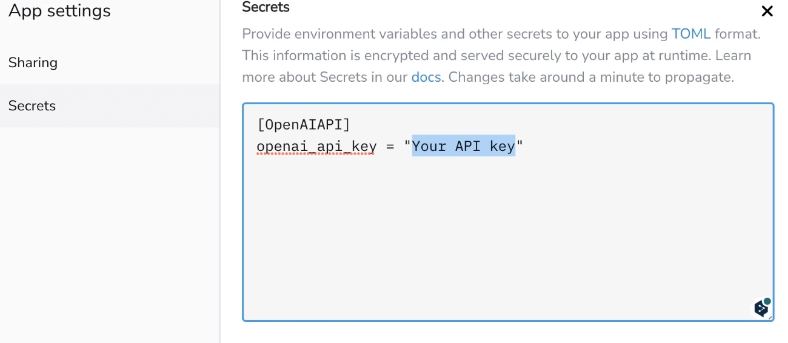

# ChatGPTとstleamlitでwebappの作成
[udemy](https://github.com/yukinaga/chatgpt_api)を利用してchatgptAPIとstrealitでwebappを作成する

## OpenAIでAPIを取得
[openAI](https://platform.openai.com/)のAPIのページから払い出し、API keyを取得

## PythonでAPIへ問い合わせ
openaiのライブラリをインストール
```
!pip install openai
```

openaiライブラリを利用して、keyを設定したら、設定の記述と質問の記述を設定
- model
    - gpt-3.5-turbo
    - gpt-4
- 設定の記述：ChatGPTにどのような設定で回答させるか
- 質問の記述：ChatGPTへの質問
```
import openai

openai.api_key = "Your API key"

response = openai.ChatCompletion.create(
    model="gpt-3.5-turbo",
    messages=[
        {"role": "system", "content": "---設定の記述---"},
        {"role": "user", "content":"---質問の記述---"}
        ]
)

# レスポンスの表示
print(response['choices'][0]['message']['content'])
```


## webappの作成
今回のHandsonでは、GoogleColab上でstreamlitを利用して、webappを作成して実行。
ngrokを利用して、このアプリを外部公開している。


### ngrok 
ngrok(エングロック)・・・ローカルサーバーを外部公開するツール

### Streamlit
Webアプリのフレームワークで、pythonのみで簡単にアプリ構築ができる

[ギャラリー](https://streamlit.io/gallery)に公開されているようなwebappを簡単に作成できる。


## OpenAIのAPIとやり取りするコード
以下のコードをapp.pyとして設定。ポイントは以下
- messagesにユーザーメッセージと返り値を全て保存する
    - openaiのapiはリスト形式でメッセージを送れる
    - リストの中身はroleとcontentの辞書型にしておく
- このmessagesを毎回openaiに送っている
    - systemのRoleは初期で設定している
    - 全部送信しているので、文章が長くなりすぎるとエラーになるor前半切り捨て
    - web版は多分このapiを利用していて、やり取りの最新部分を送っているだけだと思う。

ちなみに、openai.createの返り値は
```
   {
     'message': {
        'role': 'assistant',
        'content': 'これがモデルの応答です。'
      },
```
のような形式になっているので、messagesはこの形式を踏襲している


messagesの設定でsystemを追加。今後このmessagesにやり取りが追加される
```
# st.session_stateを使いメッセージのやりとりを保存
if "messages" not in st.session_state:
    st.session_state["messages"] = [
        {"role": "system", "content": "あなたは優秀なアシスタントAIです。"}
        ]
```


ユーザーからのインプットをmessagesに追加
```
# チャットボットとやりとりする関数
def communicate():
    messages = st.session_state["messages"]

    user_message = {"role": "user", "content": st.session_state["user_input"]}
    messages.append(user_message)

```

openaiの返り値をmessagesに追加  
```
    response = openai.ChatCompletion.create(
        model="gpt-3.5-turbo",
        messages=messages,
        temperature=1.0
    )  
    bot_message = response["choices"][0]["message"]

    st.session_state["user_input"] = ""  # 入力欄を消去
```


以下はsteamlitを利用して、画面を作成
```

# ユーザーインターフェイスの構築
st.title("My AI Assistant")
st.write("ChatGPT APIを使ったチャットボットです。")

user_input = st.text_input("メッセージを入力してください。", key="user_input", on_change=communicate)

if st.session_state["messages"]:
    messages = st.session_state["messages"]

    for message in reversed(messages[1:]):  # 直近のメッセージを上に
        speaker = "🙂"
        if message["role"]=="assistant":
            speaker="🤖"

        st.write(speaker + ": " + message["content"])
```


## webappの公開
### Streamlit community cloud登録
[streamlit](https://streamlit.io/)にアクセスしてサインアップ。
githubアカウントで登録する。

### チャットボットコードコード
api keyなどはStreamlitのSecretsKeyを利用して参照するので、githubを利用する際も安心
```
openai.api_key = st.secrets.OpenAIAPI.openai_api_key
```

[リポジトリ](https://github.com/MisakiFujishiro/openai_chatbot)を作成して、webappのソースコードとrequirementを設定する

### streamlitの設定
New app > appのデプロイ > repository、branch、app の設定を行う

Deployが失敗したら、apikeyなどのSecretsの設定を行う。
設定から、Secretsを開いて、API_keyの情報を書く



[作成されたwebappはこちら](https://openaichatbot-5hfs1ifdsqk.streamlit.app/)