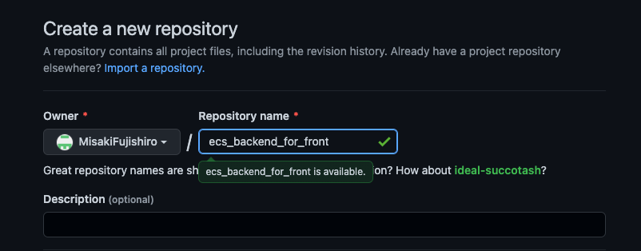
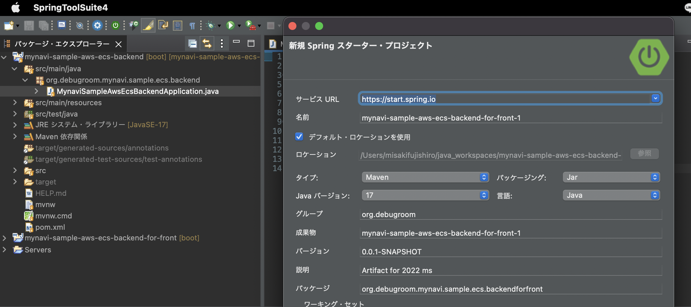
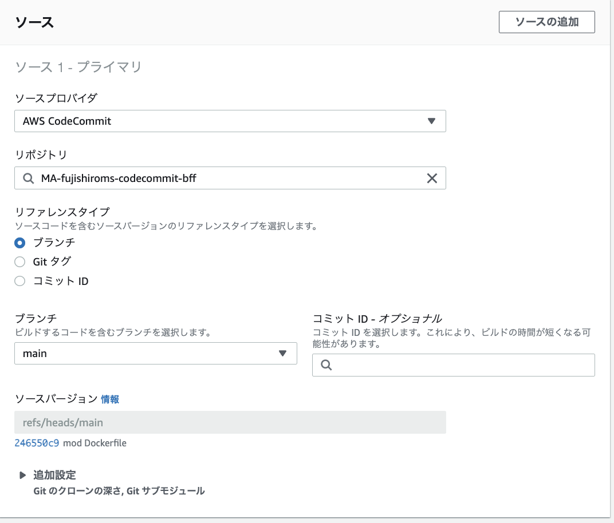
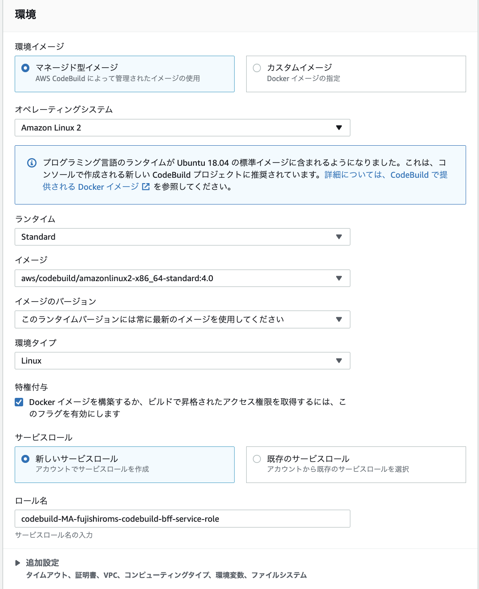
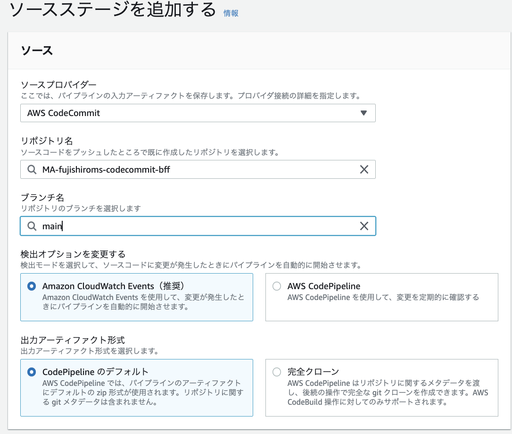
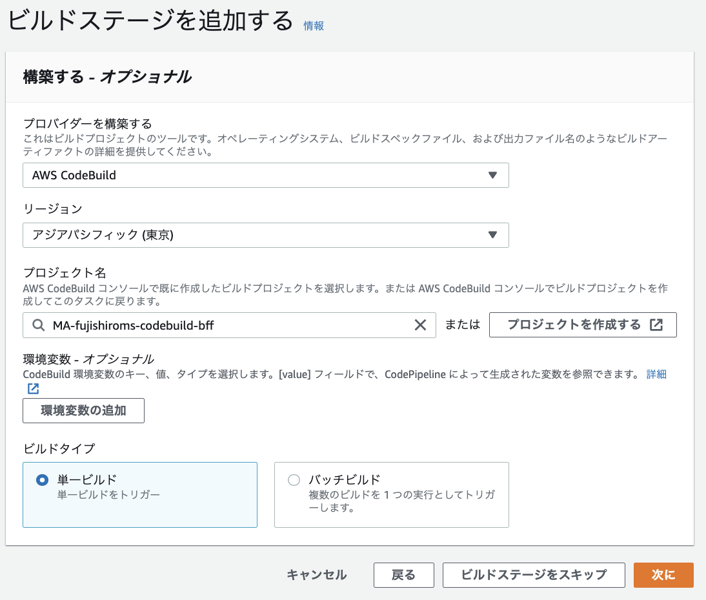
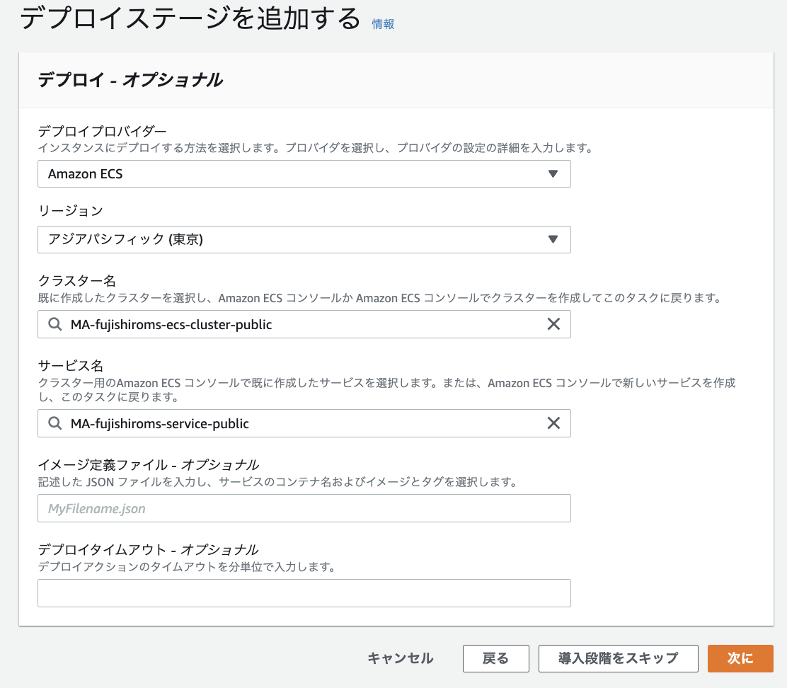

# AWS Code Seriesを利用したCICD環境

## GitHubとSpringPJの連携
### Git hubでrepository作成
git hubでリポジトリを新規作成する
> MisakiFujishiro/ecs_backend_for_front



### Java PJ作成
STSでSpring Starter Projectを作成



### terminalでGitHubへpush
ターミナルを開いて、作成したプロジェクトのディレクトリに移動
> cd [YOUR_STS_PJ]

実行したディレクトリ以下のファイルがgitで管理される
> git init

STSで作成された各種ファイルをaddとcommit
> git add .
> git commit -m "first commit"

メインブランチ作成
> git branch -M main

現在のローカルリポジトリをリモートリポジトリに追加
> git remote add origin https://github.com/[YOUR_REMOTE_REPO].git

リモートリポジトリにpush
> git push -u origin main


## codeCommitとGitHubのミラーリング
### CodeCommitの作成
CodeCommmitのページから、レポジトリを作成する。
設定項目は、リポジトリ名のみ。

### githubのミラーリング
githubの変更を検知して、CodeCommitに反映されていることを確認する。

実施項目は以下
1. SSHキーをローカルPCで作成
1. IAMユーザーに公開鍵を登録
1. githubに秘密鍵を登録
1. githubにミラーリングの設定

詳細は、別ページ


## CodeBuildによるBuild設定
### CodeBuildのプロジェクト作成
- CodeBuildのプロジェクト名
- ソース
    - CodeCommitとの紐付け
    - 対象のブランチ指定


- CodeBuildの環境設定
    - Dockerを利用する場合特権付与を忘れない


### IAMポリシーの変更
新規で作成されたサービスロールにECRへアクセスするためのポリシー`AmazonEC2ContainerRegistryPowerUser`を付与する。


### buildspec.yml作成
```
version: 0.2
phases:
  pre_build:
    commands:
      - echo Logging in to Amazon ECR...
      - $(aws ecr get-login --no-include-email --region ap-northeast-1)
      - AWS_ACCOUNT_ID=$(echo ${CODEBUILD_BUILD_ARN} | cut -f 5 -d :)
      - REPOSITORY_URL=${AWS_ACCOUNT_ID}.dkr.ecr.ap-northeast-1.amazonaws.com/ma-fujishiroms-ecr-bff
      - IMAGE_TAG=$(echo ${CODEBUILD_RESOLVED_SOURCE_VERSION} | cut -c 1-7)

  build:
    commands:      
      - echo Building the Docker image on `date`
      - docker build --no-cache -t ma-fujishiroms-ecr-bff:${IMAGE_TAG} .
      - docker tag ma-fujishiroms-ecr-bff:${IMAGE_TAG} ${REPOSITORY_URL}:${IMAGE_TAG}
  post_build:
    commands:
      - echo Pushing the Docker image on `date`
      - docker push ${REPOSITORY_URL}:${IMAGE_TAG}
```


## CodePipelineによるデプロイ自動化
codeCommitの変更を契機して、ECSへのリリースまでの一連の流れを作成。

### buildspec.ymlの変更
`imagedefinitions.json`を出力するためにbuildspec.ymlに以下の文言を追加

コンテナ名とECRのURIをimagedefinition.jsonに書き込む
```
  post_build:
    commands:
      - printf '[{"name":"MA-fujishiroms-container-private","imageUri":"%s"}]' $REPOSITORY_URL:$IMAGE_TAG > imagedefinitions.json
artifacts:
    files: imagedefinitions.json
```

### codepipelineの作成
- sourceステージの作成


- buildステージの作成


- deployステージの作成


### 動作確認
githubのmainブランチにpushすると以下のようにCodepipelineが実行されて、ECSに新しいタスクがリリースされる


