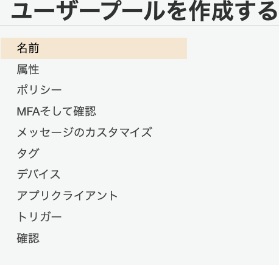

# Amazon CognitoとSpring Securityを利用したOAuth2ログイン
塾長の記事[AWSで作るマイクロサービス](https://news.mynavi.jp/techplus/series/aws_2/)を参考に認証認可の仕組みを実装する。
図は[ドラフト版](https://debugroom.github.io/mynavi-doc-draft/microservice/microservice_cognito-oauth2-login-2.html)の方が見やすい
- [Cognitoの設定①](https://news.mynavi.jp/techplus/article/techp5319/)
- [Cognitoの設定②](https://news.mynavi.jp/techplus/article/techp5368/)
- [Lambda関数の設定①](https://news.mynavi.jp/techplus/article/techp5466/)
- [Lambda関数の設定②](https://news.mynavi.jp/techplus/article/techp5496/)
- [Spring Securityの設定①](https://news.mynavi.jp/techplus/article/aws_2-19/)
- [Spring Securityの設定②](https://news.mynavi.jp/techplus/article/aws_2-20/)
- [Spring Securityの設定③](https://news.mynavi.jp/techplus/article/aws_2-21/)

## Cognitoの設定
CognitoはAWSの認証/認可のサービス

ユーザープールとIDプールという２つの大きな機能を提供する
- ユーザープール（ユーザー情報データベース）  
    - ユーザー情報やユーザー属性を定義可能
    - ユーザーの作成やサインイン管理    
    - サードパーティとの連携
    - MFAの設定が可能   
- IDプール（認可情報機能を提供する）  
    認証されたユーザーに対して、Tokenを検証して、一時的な認可情報を付与する

### Cognitoのユーザープールの作成
以下の項目を設定していく
- 名前  
    userpoolの名前
- 属性  
    ログインIDなど、ログインユーザーの情報に関しての設定
- ポリシー  
    パスワードに関するポリシーを設定
- MFAとアカウント回復  
    MFAの設定やアカウントの回復方法の設定
- メッセージのカスタマイズ  
    ユーザーに発出するメールに関する設定
- タグ  
    Cognitoに関するタグの設定
- デバイス  
    一度ログイン完了したブラウザ情報を通じてログインを継続する機能
- アプリクライアント  
    アプリクライアントの設定を行い、クライアント名ややりとりするトークンの設定、クライアントシークレットに関する設定を行う。
- トリガー  
    ユーザープールにおけるイベントを契機として実行するLambdaの設定を行う

#### 名前の設定
userpoolの名前を設定する

#### 属性
ログインユーザーのIDや基本設定を定義する

- ユーザー名  
    サインイン時の識別子IDについて設定  
    今回は検証した（ユーザーからの応答があった）Eメールを設定
- Eメール・電話番号  
    Eメールや電話番号自体をユーザーIDにする場合に設定するオプション
- 大文字小文字の区別  
    大文字小文字の区別設定で、区別を推奨している
- 標準属性  
    標準で準備されている、ユーザープールで保持する属性情報（今回は氏名と名前）
- カスタム属性  
    開発者がカスタムで設定できる、ユーザープールで保持する属性情報（今回はログインIDと管理者フラグ）

#### ポリシー
パスワードに関するポリシーを設定
- パスワード強度  
    文字数などを設定
- 自己サインアップ  
    管理者だけが、ユーザー登録できるか、一般ユーザーが自分でできるか
- 有効期限  
    ユーザー作成時の一時パスワードについての有効期限で、これを過ぎるとユーザーの作り直しとなる。

#### MFAとアカウント回復
MFAの設定とパスワードを忘れたときなどのアカウントの回復方法を定義する

- MFAの有効  
    Cognitoを利用したサインアップ・サインインについてMFAを利用するかの設定（今回は不要）
- 回復方法  
    パスワードを忘れたときのリセット方法としてEメールや電話が利用できる
- 確認する属性  
    サインアップやリセット時に確認する属性情報を設定
- SMSのロール  
    MFAや回復にはSMSを利用するので、そのためのロールを作成する（デフォルトでOK）

#### メッセージのカスタマイズ
Cognitoから発出するメールの設定を行う

- Eメールアドレスのカスタマイズ  
    発信リージョンは限られているが、利用しているリージョンと異なっていても特に問題はない  
    発信元のメール設定やリプライ先について設定可能
- SESによるメール発信設定  
    大規模なユーザーに向けて、サービスを提供する場合はEメール対応のための設定（今回は不要）
- Eメール検証メッセージ設定  
    検証メールのカスタマイズ
- ユーザー招待メッセージ設定  
    初回ログイン時の招待メールのメッセージをカスタマイズ

#### タグ
Cognitoリソースに対するタグ設定を必要に応じて実施

#### デバイス
ブラウザやデバイス情報を記憶して、ログインを保持する、Remembermeサービス設定を必要に応じて設定

#### アプリクライアント
ユーザープールを利用するアプリクライアントの設定や、やりとりするトークンやクライアントシークレットの設定を行う。
- アプリクライアント名  
    Cognitoへアクセスするアプリケーションクライアントの設定（適当なものを設定）
- トークンの有効期限  
    リフレッシュトークンの有効期限で、30days
- アクセストークンの有効期限  
    アクセストークン（認可情報）の有効期限で、60minがデフォルト
- IDトークンの有効期限  
    IDトークン（認証情報）の有効期限で、60minがデフォルト
- クライアントシークレットの生成  
    アプリクライアントの正当性を確認するパスワードのようなもので、サーバーサイド側でやりとりするべき情報  
    JSやモバイルアプリケーションは脆弱性に直結するので利用しない点に注意
- 認証フローの設定  
    OAuth2の認証フローではなくて、ユーザーサインアップ時のユーザー認証フローを指しており、以下の5つから設定する
    - ALLOW_ADMIN_USER_PASSWORD_AUTH  
        CLIやSDKを利用して、管理者ユーザーとして認証を処理する
    - ALLOW_CUSTOM_AUTH  
        Lambdaでカスタム認証を行う
    - ALLOW_USER_PASSWORD_AUTH  
        CLIやSDKを利用して、一般ユーザーとして処理を行うオプション
    - ALLOW_USER_SRP_AUTH  
        Saltやチャレンジレスポンスなど、パスワード交換の安全性を高めた方法
    - ALLOW_REFRESH_TOKEN_AUTH(必須)  
        リフレッシュトークンを利用した、認証
- セキュリティ設定  
    ユーザーが存在しない時のエラーに対応（デフォルトでOK
- 高度なトークン設定  
    個別にリフレッシュトークンを無効化することが可能になるらしい

#### トリガー
ユーザープールにおけるイベントを契機として実行するLambdaの設定を行う(今回はデフォルト)

### CognitoのIDプールの作成
OAuth2Loginに向けて、アプリクライアントの設定とユーザープールで発行したトークンを検証するIDプールを作成する。

#### アプリクライアントの設定
Cognitoのユーザープールの画面のナビゲーションペインから`アプリクライアントの設定`を選択

以下の項目を選択していく
- 有効なIDプロバイダ  
    プロバイダとして利用するユーザーディレクトリ
- サインインとサインアウトのURL  
    - コールバックURL  
        アプリクライアントからリダイレクトされたCognitoで認証が完了した後、アプリクライアントへ再度リダイレクトするURL  
        Spring Securityでリダイレクトを受け入れるURLは`https://domain_name/context_path/login/oauth2/code/provice_name`  
        今回はローカルで実行されるアプリケーション向けに`http://localhost:8080/frontend/login/oauth2/code/cognito`とする。  
        この設定が、正しく一致しないと動作しないので注意
    - サインアウトURL   
        サインアウト後にリダイレクトするアプリケーションのクライアントURL  
        今回は`http://localhost:8080/frontend`
- OAuth2.0のフローとスコープ  
    - OAuthの認可フロー  
        セキュリティ的な安全性が担保されている`Authorization code grant`が推奨
    - スコープ  
        OAuth2.0では、保護されたリソースに対するアクセス制御する方法としてスコープという概念を使用している。  
        Cognitoが保護されたリソースへのアクセス権を指定する。（認可の指定)    
        今回は以下を許可する
        - openid: IDトークン
        - aws.cognito.signin.user.admin: ユーザープールのAPIオペレーション
        - profile: ユーザー情報へのプロファイルアクセス

#### ドメインの設定
Cognitoのユーザープールの画面のナビゲーションペインから`ドメイン名`を選択して、ドメイン名を設定

#### IDプールの設定
Cognitoのコンソール画面から、IDプールの管理>IDプールを作成を選択

- IDプール名  
    MA-fujishiroms-idpool
- ユーザープールID  
    ユーザープールの全般設定にある
- アプリクライアントID  
    ユーザープールのアプリクライアントの設定の一番上にある

## Springの設定
あんまり難しく考えないで、SpringSecurityを利用して、ログイン画面を作成する

### ユーザープールを利用した認証

### アクセストークンを利用した認可の設定

## Auth0との連携をする