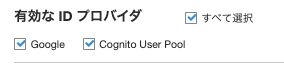

# Amazon CognitoとSpring Securityを利用したOAuth2ログイン
塾長の記事[AWSで作るマイクロサービス](https://news.mynavi.jp/techplus/series/aws_2/)を参考に認証認可の仕組みを実装する。
図は[ドラフト版](https://debugroom.github.io/mynavi-doc-draft/index.html)の方が見やすい

Lambdaで自動化している部分は、効率重視で手動で設定することにする。

- [Cognitoの設定①](https://news.mynavi.jp/techplus/article/techp5319/)
- [Cognitoの設定②](https://news.mynavi.jp/techplus/article/techp5368/)
- [Spring Securityの設定①](https://news.mynavi.jp/techplus/article/aws_2-19/)
- [Spring Securityの設定②](https://news.mynavi.jp/techplus/article/aws_2-20/)
- [Spring Securityの設定③](https://news.mynavi.jp/techplus/article/aws_2-21/)


## Cognitoの設定
CognitoはAWSの認証/認可のサービス

ユーザープールとIDプールという２つの大きな機能を提供する
- ユーザープール（ユーザー情報データベース）  
    - ユーザー情報やユーザー属性を定義可能
    - ユーザーの作成やサインイン管理    
    - サードパーティとの連携
    - MFAの設定が可能   
- IDプール（認可情報機能を提供する）  
    認証されたユーザーに対して、Tokenを検証して、一時的な認可情報を付与する

### Cognitoのユーザープールの作成
以下の項目を設定していく
- 名前  
    userpoolの名前
- 属性  
    ログインIDなど、ログインユーザーの情報に関しての設定
- ポリシー  
    パスワードに関するポリシーを設定
- MFAとアカウント回復  
    MFAの設定やアカウントの回復方法の設定
- メッセージのカスタマイズ  
    ユーザーに発出するメールに関する設定
- タグ  
    Cognitoに関するタグの設定
- デバイス  
    一度ログイン完了したブラウザ情報を通じてログインを継続する機能
- アプリクライアント  
    アプリクライアントの設定を行い、クライアント名ややりとりするトークンの設定、クライアントシークレットに関する設定を行う。
- トリガー  
    ユーザープールにおけるイベントを契機として実行するLambdaの設定を行う

#### 名前の設定
userpoolの名前を設定する


#### 属性
ログインユーザーのIDや基本設定を定義する

- ユーザー名  
    サインイン時の識別子IDについて設定  
    今回は検証した（ユーザーからの応答があった）Eメールを設定
- Eメール・電話番号  
    Eメールや電話番号自体をユーザーIDにする場合に設定するオプション
- 大文字小文字の区別  
    大文字小文字の区別設定で、区別を推奨している
- 標準属性  
    標準で準備されている、ユーザープールで保持する属性情報（今回は氏名と名前）
- カスタム属性  
    開発者がカスタムで設定できる、ユーザープールで保持する属性情報（今回はログインIDと管理者フラグ）


#### ポリシー
パスワードに関するポリシーを設定
- パスワード強度  
    文字数などを設定
- 自己サインアップ  
    管理者だけが、ユーザー登録できるか、一般ユーザーが自分でできるか
- 有効期限  
    ユーザー作成時の一時パスワードについての有効期限で、これを過ぎるとユーザーの作り直しとなる。


#### MFAとアカウント回復
MFAの設定とパスワードを忘れたときなどのアカウントの回復方法を定義する

- MFAの有効  
    Cognitoを利用したサインアップ・サインインについてMFAを利用するかの設定（今回は不要）
- 回復方法  
    パスワードを忘れたときのリセット方法としてEメールや電話が利用できる
- 確認する属性  
    サインアップやリセット時に確認する属性情報を設定
- SMSのロール  
    MFAや回復にはSMSを利用するので、そのためのロールを作成する（デフォルトでOK）


#### メッセージのカスタマイズ
Cognitoから発出するメールの設定を行う

- Eメールアドレスのカスタマイズ  
    発信リージョンは限られているが、利用しているリージョンと異なっていても特に問題はない  
    発信元のメール設定やリプライ先について設定可能
- SESによるメール発信設定  
    大規模なユーザーに向けて、サービスを提供する場合はEメール対応のための設定（今回は不要）
- Eメール検証メッセージ設定  
    検証メールのカスタマイズ
- ユーザー招待メッセージ設定  
    初回ログイン時の招待メールのメッセージをカスタマイズ


#### タグ
Cognitoリソースに対するタグ設定を必要に応じて実施

#### デバイス
ブラウザやデバイス情報を記憶して、ログインを保持する、Remembermeサービス設定を必要に応じて設定


#### アプリクライアント
ユーザープールを利用するアプリクライアントの設定や、やりとりするトークンやクライアントシークレットの設定を行う。
- アプリクライアント名  
    Cognitoへアクセスするアプリケーションクライアントの設定（適当なものを設定）
- トークンの有効期限  
    リフレッシュトークンの有効期限で、30days
- アクセストークンの有効期限  
    アクセストークン（認可情報）の有効期限で、60minがデフォルト
- IDトークンの有効期限  
    IDトークン（認証情報）の有効期限で、60minがデフォルト
- クライアントシークレットの生成  
    アプリクライアントの正当性を確認するパスワードのようなもので、サーバーサイド側でやりとりするべき情報  
    JSやモバイルアプリケーションは脆弱性に直結するので利用しない点に注意
- 認証フローの設定  
    OAuth2の認証フローではなくて、ユーザーサインアップ時のユーザー認証フローを指しており、以下の5つから設定する
    - ALLOW_ADMIN_USER_PASSWORD_AUTH  
        CLIやSDKを利用して、管理者ユーザーとして認証を処理する
    - ALLOW_CUSTOM_AUTH  
        Lambdaでカスタム認証を行う
    - ALLOW_USER_PASSWORD_AUTH  
        CLIやSDKを利用して、一般ユーザーとして処理を行うオプション
    - ALLOW_USER_SRP_AUTH  
        Saltやチャレンジレスポンスなど、パスワード交換の安全性を高めた方法
    - ALLOW_REFRESH_TOKEN_AUTH(必須)  
        リフレッシュトークンを利用した、認証
- セキュリティ設定  
    ユーザーが存在しない時のエラーに対応（デフォルトでOK
- 高度なトークン設定  
    個別にリフレッシュトークンを無効化することが可能になるらしい


#### トリガー
ユーザープールにおけるイベントを契機として実行するLambdaの設定を行う(今回はデフォルト)


### アプリクライアントとドメインの設定
OAuth2Loginに向けて、アプリクライアントの設定とドメインの設定を行う

#### アプリクライアントの設定
Cognitoのユーザープールの画面のナビゲーションペインから`アプリクライアントの設定`を選択


以下の項目を選択していく
- 有効なIDプロバイダ  
    プロバイダとして利用するユーザーディレクトリ
- サインインとサインアウトのURL  
    - コールバックURL  
        アプリクライアントからリダイレクトされたCognitoで認証が完了した後、アプリクライアントへ再度リダイレクトするURL  
        Spring Securityでリダイレクトを受け入れるURLは
        ```
        https://domain_name/context_path/login/oauth2/code/provice_name
        ```
        今回はローカルで実行されるアプリケーション向けに
        ```
        http://localhost:8081/backend-for-front/login/oauth2/code/cognito
        ```
        この設定が、正しく一致しないと動作しないので注意
    - サインアウトURL   
        サインアウト後にリダイレクトするアプリケーションのクライアントURL  
        今回は
        ```
        http://localhost:8080/frontend
        ```
- OAuth2.0のフローとスコープ  
    - OAuthの認可フロー  
        セキュリティ的な安全性が担保されている`Authorization code grant`が推奨
    - スコープ  
        OAuth2.0では、保護されたリソースに対するアクセス制御する方法としてスコープという概念を使用している。  
        Cognitoが保護されたリソースへのアクセス権を指定する。（認可の指定)    
        今回は以下を許可する
        - openid: IDトークン
        - aws.cognito.signin.user.admin: ユーザープールのAPIオペレーション
        - profile: ユーザー情報へのプロファイルアクセス


#### ドメインの設定
Cognitoのユーザープールの画面のナビゲーションペインから`ドメイン名`を選択して、ドメイン名を設定


### CognitoのIDプールの作成
ユーザープールで発行したトークンを検証するIDプールを作成する。

#### IDプールの設定
Cognitoのコンソール画面から、IDプールの管理>IDプールを作成を選択

- IDプール名  
    MA-fujishiroms-idpool
- ユーザープールID  
    ユーザープールの全般設定にある
- アプリクライアントID  
    ユーザープールのアプリクライアントの設定の一番上にある


## Cognitoの初期設定(ユーザー追加とSystem Managerへの登録)
Cognitoの初期化処理を自動化するLambda関数を構築するが、今回は手動で行うこととする。
- アプリクライアントのクライアントシークレットをSystems Managerに登録する
- CognitoのユーザープールにOAuth2Login用のユーザーを作成
- OAuth2 Loginユーザーのサインアップステータスを変更する

### アプリクライアントのクライアントシークレットをSystems Managerに登録する
Lambdaでは、以下の実装をしている
1. CFNで生成されたCognitoから、ユーザープールIDとアプリクライアントIDを取得する。
2. ユーザープールIDとアプリクライアントIDを利用して、Cognitoから、クライアントシークレットを取得する
3. 取得したクライアントシークレットをSystemManagerのパラメータストアに格納する。

今回は、手動でCognitoからクライアントシークレットを取得してパラメータストアに格納する。
#### Cognitoからクライアントシークレットを取得
Cognitoのナビゲーションペインの「全般設定」から、「アプリクライアント」を選択して、詳細を表示を押下すると確認可能
#### System Managerの設定
System Managerは複数のパラメータをまとめて登録はできない。（SecretsManagerのシークレットのような概念はない)するのではなくて、一つ一つのパラメータを登録するイメージ

System Managerの画面のナビゲーションペインから、`パラメータストア`を選択
パラメータの作成から、以下を設定
- 名前  
    パラメータストアの名前(パラメータの名前)
- 利用枠  
    標準
- タイプ  
    安全な文字列(SecretString)にして、デフォルトでOK
- 値  
    登録したい値


### CognitoのユーザープールにOAuth2Login用のユーザーを作成とサインアップステータスの更新
Cognitoにユーザーを追加する方法はいくつか存在する。
- Lambdaから追加コマンドを実行（JAVA SDK)
- AWS CLIを利用
- CognitoのGUIから作成


今回は、Cognitoにyamada.taroというユーザーを登録する。
- Username → cognito.user.yamada
- email → 自分の確認の取れるメール
- family_name → yamada
- given_name → tarou
- Password → Dummy456
- customer:isAdmin → 1
- customer:loginId → login.id.yamada


#### AWS CLIからの実行
今回のユーザーで利用する変数を設定
```
POOL_ID=YOUR_COGNITO_POOL_ID
USER_EMAIL="YOUR_MAIL_ADDRESS@gmail.com"
USER_NAME="cognito.user.yamada"
FAMILY_NAME="yamada"
GIVEN_NAME="taro"
PASSWORD="Dummy456"
LOGIN_ID="login.id.yamada"
isAdmin=1
```


まずは、ユーザーを作成
```
aws cognito-idp admin-create-user \
--user-pool-id ${POOL_ID} \
--username ${USER_NAME} \
--message-action SUPPRESS
```


アカウントのステータスをFORCE＿CHANGE＿PASSWORDは、パスワードが初期設定から変更がないため、利用できない状態

これをAWS CLIからCONFIRMEDへ変更する
```
aws cognito-idp admin-set-user-password \
--user-pool-id ${POOL_ID} \
--username ${USER_NAME} \
--password ${PASSWORD}  \
--permanent
```


検証状況の更新と属性情報の追加
custom属性については、Nameに`cusotm:`を追加して付与する

```
aws cognito-idp admin-update-user-attributes \
--user-pool-id ${POOL_ID}  \
--username ${USER_NAME} \
--user-attributes Name=email,Value=${USER_EMAIL} \
    Name=email_verified,Value=true \
    Name=given_name,Value=${GIVEN_NAME} \
    Name=family_name,Value=${FAMILY_NAME} \
    Name=custom:isAdmin,Value=${isAdmin} \
    Name=custom:loginId,Value=${LOGIN_ID} 
```


## 外部IDPの準備
CognitoのユーザープールはAuth0やGoogleなど、他のOIDCやSAML IdPのサードパーティフェデレーションを介して、サインインの設定が可能。


今回は、Auth0を利用してOIDCとSAMLとのユーザープールの連携を実装する。
また、Googleアカウントを利用した連携も行う。

Auth0およびGoogle Cloud Platform側の設定を行う。

### Auth0のセットアップ
#### Auth0にサインアップ
[Auth0](https://manage.auth0.com/dashboard/jp/mafujishiromsauth/)でアカウントを作成するか、ログインする。

#### テナントの作成
リージョンとテナント名を指定して、テナントを作成


#### アプリケーションの作成
作成したテナントからアプリケーションを選択して、アプリケーションの作成


アプリケーションの名前を設定して、`SIngle Page Web Application`を選択してCreate


作成した、アプリケーションのSettingから以下の情報を控えておく
- Name
- Domain
- Client ID
- Client Secret


#### Userの作成
ナビゲーションペインから、`User Management`を選択して`User`から、`Create User`を選択する。
Emailとパスワードを設定する。


### GCP のセットアップ
[Amazon CognitoユーザープールでGoogle認証を連携する](https://dev.classmethod.jp/articles/amazon-cognito-google-social-signin/)を参考にセットアップする。

#### Google Platformにログイン
Googleの開発者アカウントを作成の上、[Google Cloud Platform](https://console.cloud.google.com/home/dashboard?project=bamboo-media-378904)のコンソールにサインイン


#### OAuth同意タブ設定
GCPのナビゲーションペインから`APIとサービス`を選択する。
新たに現れたナビゲーションペインから、OAuth同意画面を選択してExternalでCreateする。


アプリ名とサポートメールアドレスを追加


画面下のAuthorized domainsには、`amazoncognito.com`を入力し、Developer contact informationは任意のメールアドレスを追加


他はデフォルト値で保存

#### Credentialsタブ設定
左のタブから、Credentialsを選択して、OAuth ClientIDを選択。
次画面で、Web applicationを選択すると、各種設定項目が表示される。
Authorized JavaScript originsでCognitoユーザープールのドメインを追加。
```
https://ma-fujishiroms-domain.auth.ap-northeast-1.amazoncognito.com
```
承認済みのリダイレクトURIも以下を追加
```
https://ma-fujishiroms-domain.auth.ap-northeast-1.amazoncognito.com/oauth2/idpresponse
```

クライアントのID及びシークレット情報をJSONとして保存しておく


## Auth0とCognitoの連携（SAML)
Auth0とCognitoを連携させる場合、OIDCのIdPとして連携するかSAMLのIdPとして連携させるか選択することができる。今回は[Amazon Cognito ユーザープールを使用して、SAML ID プロバイダーとして Auth0 を設定するにはどうすればよいですか?](https://aws.amazon.com/jp/premiumsupport/knowledge-center/auth0-saml-cognito-user-pool/)を参考にして、SAMLのIdPとして連携させる。


### Auth0でアプリケーションのSAML設定を行う
ナビゲーションペインから`Application`を選択して、作成したアプリケーションを選択する。
Addonのタブから、SAML2 WEB APPをオンにして、Settingを行う

Application Callback URLには、
```
https://yourDomainPrefix.auth.region.amazoncognito.com/saml2/idpresponse
```
を設定する。`yourDomainPrefix`にはcognitoで設定したdomainを、`region`にはAWSのリージョンを選択する。
```
https://ma-fujishiroms-domain.auth.ap-northeast-1.amazoncognito.com/saml2/idpresponse
```

Settingsには、以下を設定
```
{
  "audience": "urn:amazon:cognito:sp:ap-northeast-1_lojw6klNd",
  "user_id": "http://schemas.xmlsoap.org/ws/2005/05/identity/claims/nameidentifier",
  "email": "http://schemas.xmlsoap.org/ws/2005/05/identity/claims/emailaddress",
  "given_name": "http://schemas.xmlsoap.org/ws/2005/05/identity/claims/givenname",
  "family_name": "http://schemas.xmlsoap.org/ws/2005/05/identity/claims/surname",
  "nameIdentifierFormat": "urn:oasis:names:tc:SAML:2.0:nameid-format:persistent"
}
```
`audience`には、CognitoのユーザープールIDを設定し、nameIdentifierFormatは上記に書き換える。
加えて、Cognitoに渡す属性情報のコメントアウトを削除しておく。

上記を設定してDebugを押下して、作成したユーザーとしてログインすると、SAMLで得られるResponseを確認できる。
Saveを押下して設定完了。


### CognitoとSAMLの連携
Auth0のAddonのタブから、SAML2 WEB APPのUsageから`Identity Provider Metadata`をDLする。

Cognito側で、ユーザープール>IDプロバイダーから、SAMLを選択して、先ほどのXMLを選択。
プロバイダ名は記号を用いるとエラーが発生するので注意して登録


### クライアントアプリの設定
ユーザープール>クライアントアプリの設定から、SAMLが選択可能となっている。


auth0を選択せずに、`ホストされたUI`を押下すると、Cognitoによる認証のみが表示される。


しかし、auth0を選択して`ホストされたUI`を押下すると、Auth0での認証も可能となっている。


ボタンを押下するとAuth0の画面に遷移する。


### 属性情報のマッピング
cognitoのナビゲーションペインからフェデレーションの属性マッピングを選択

Authユーザーの属性とCognitoのユーザープールでどのような照らし合わせをするかを決定
この際、SAML属性には、Auth0のSettingsでmappingで設定したものを選ぶ


#### トラブルシューティング
given_nameとfamily_nameはユーザーで設定できていないので渡せてない。
必須属性が正しく渡せていない場合、Cognito側でユーザーが追加されない。

取り急ぎは全てをEmailにすることで対応しているが対応が必要


## GoogleとCognitoの連携
[Amazon CognitoユーザープールでGoogle認証を連携する](https://dev.classmethod.jp/articles/amazon-cognito-google-social-signin/)を参考にセットアップする。

### Cognitoで外部プロバイダを設定
ユーザープールのナビゲーションペインから`IDプロバイダー`を選択して、Googleを選択。

 GCPの設定でDLしたJSONファイルからclient_idやclient_secretをコピペして設定


### 属性のマッピングを行う
ユーザープールのナビゲーションペインから`属性マッピング`を選択して、Googleを選択。

Google側の属性と、Cognitoのユーザープール側の属性を紐づける
`sub`はGoogle側のUsernameで強制的に、ユーザプールのUsernameと紐づけられる


### アプリクライアントでGoogleを有効化
ユーザープールのナビゲーションペインから`アプリクライアントの設定`を選択して、有効なIDプロバイダとして、追加されているGoogleを選択。



ホストされたUIを起動すると、Googleの認証が追加されてい流。


ログインすると、Cognitoのユーザープールにユーザーが追加されている。


## Springの設定
あんまり難しく考えないで、SpringSecurityを利用して、ログイン画面を作成する


### Spring Securityの実装（フロントエンド）
#### Spring Securityとは？
Spring Frameworkを用いいてWebAppを作成する場合に認証にか処理を簡単に実装できるフレームワーク

セキュリティ対策は難解であるものの、SpringSecurityを利用することで少量のコーディングで多様なセキュリティ対策処理を実装可能
- サーブレットフィルタリングによる、リクエスト処理の正当性チェック
- 不正リクエストのブロック
- パスワードのハッシュ化、暗号化
- OAuth2を使ったトークン検証など

#### 作成するアプリケーション
- WebApp  
    SpringBootAppを実行する起動クラス   
- MvcConfig  
    SpringMVCの設定クラス    
- SecurityConfig     
    SpringSecurityの設定クラス   
- SampleController     
    ログイン画面やログイン後にポータル画面に遷移するよう定義するクラス   
- CustomUserDetails     
    SpringSecurityでユーザー情報を表すモデルオブジェクトを継承したカスタムクラス   
- CustomeUserDetailServiece     
    CustomUserDetailsを取得するためのカスタムクラス   
- LoginSuccessHandler     
    ログインが成功したのちに実行されるハンドラクラス   
- SessionExpiredDetectingLoginUrlAuthenticationEntryPoint     
    セッションが無効になったことを検出してログイン画面へ遷移するためのハンドラクラス   

```
src/main/java/***/frontend
|
|-- app/web
|   |
|   |-- SampleController
|   |
|   |-- security
|        |
|        |-- CustomUserDetails
|        |
|        |-- CustomUserDetailsService
|        |
|        |-- LoginSuccessHandler
|        |
|        |-- SessionExpiredDetectingLoginUrlAuthenticationEntryPoint
|
|
|-- congig
     |
     |-- MvcConfig
     |
     |-- SecurityConfig
     |
     |-- WebApp

```
#### 静的ファイルのコピー
staticやresources配下のhtmlファイルなどはgithubからコピーしておく

#### SecurityConfig
以下の内容など、Secruty関連の内容を指定していく
- SpringSecurityの対象外のパス
- ログインログアウト処理を行うURIのパス

#### CustomUserDetails
送信されたID/Passwordを検証するロジック

SpringSecurityによる、ログイン処理では、リクエストパラメータとして送信されたIDとパスワードを検証するロジックが必要。

このロジックは既に実装されており、org.springframework.security.core.userdetails.UserDetailsを使って実装する。


#### CustomUserDetailsService
CustomUserDetailsを実装するためには、org.springframework.security.core.userdetails.UserDetailsServiceのインターフェースを実装しておく必要があるので、実装する。

UserDetailsServiceでは、loadUserByUserNameメソッドを実装し、 UserDetailsインターフェースが実装したクラスを返却する。
このオブジェクトを利用して、SpringSecurtyが検証を行う。


#### トラブルシュート①: SpringSecurityのモジュールインポートエラー
pomでSpringbootを指定したところ、以下のモジュールが見つからないエラーが発生した
> import org.springframework.security.config.annotation.web.configuration.WebSecurityConfigurerAdapter;

SpringSecurtityでは、[5.4〜6.0でセキュリティ設定の書き方が大幅に変わる](https://qiita.com/suke_masa/items/908805dd45df08ba28d8)
いので、pomで明示的にバージョンを5.4になるように指定
```
	<properties>
		<spring-security.version>5.3.4.RELEASE</spring-security.version>
	</properties>

```

#### トラブルシュート②：　javaxのimportエラー
SampleControllerでjavaxのimportがエラー
> import javax.servlet.http.HttpSession;


pomで依存関係を追加してあげることで解決
```
		<dependency>
			<groupId>javax.servlet</groupId>
			<artifactId>javax.servlet-api</artifactId>
			<version>4.0.0</version>
			<scope>provided</scope>
		</dependency>
```

#### トラブルシュート③：循環？
```

***************************
APPLICATION FAILED TO START
***************************

Description:

The dependencies of some of the beans in the application context form a cycle:

┌──->──┐
|  securityConfig (field org.springframework.security.crypto.password.PasswordEncoder org.debugroom.mynavi.sample.ecs.backendforfront.config.SecurityConfig.passwordEncoder)
└──<-──┘


Action:

Relying upon circular references is discouraged and they are prohibited by default. Update your application to remove the dependency cycle between beans. As a last resort, it may be possible to break the cycle automatically by setting spring.main.allow-circular-references to true.


```

PasswordEncoderフィールドに対して、@Autowiredと@Beanの定義をしているせいで循環してしまっているっぽい。

SecurityConfigの@AutoWired部分を削除して、Beanを直接指定するように変更

削除
```
@Autowired
    PasswordEncoder passwordEncoder;
```

修正
```
    @Override
    protected void configure(AuthenticationManagerBuilder auth) throws Exception {
        auth
                .userDetailsService(userDetailsService())
                .passwordEncoder(passwordEncoder());
    }


```

※application.ymlで、重複を許可してしまうやり方もある
```
  spring:
    main:
      allow-circular-references: true
```


#### トラブルシュート④：javax.servlet.Filterをcastできない
実行すると以下のエラーが発生。

SpringSecurityのフィルターチェーンの構成が正しくできていない原因っぽい。
WebSecurityConfigurationがjavax.servlet.Filterインターフェースをcastできていないっぽい

```
org.springframework.beans.factory.BeanCreationException: Error creating bean with name 'springSecurityFilterChain' defined in class path resource [org/springframework/security/config/annotation/web/configuration/WebSecurityConfiguration.class]: Failed to instantiate [javax.servlet.Filter]: Factory method 'springSecurityFilterChain' threw exception with message: class org.springframework.security.web.access.ExceptionTranslationFilter cannot be cast to class javax.servlet.Filter (org.springframework.security.web.access.ExceptionTranslationFilter and javax.servlet.Filter are in unnamed module of loader 'app')

//omit

Caused by: org.springframework.beans.BeanInstantiationException: Failed to instantiate [javax.servlet.Filter]: Factory method 'springSecurityFilterChain' threw exception with message: class org.springframework.security.web.access.ExceptionTranslationFilter cannot be cast to class javax.servlet.Filter (org.springframework.security.web.access.ExceptionTranslationFilter and javax.servlet.Filter are in unnamed module of loader 'app')
	at org.springframework.beans.factory.support.SimpleInstantiationStrategy.instantiate(SimpleInstantiationStrategy.java:171) ~[spring-beans-6.0.4.jar:6.0.4]
	at org.springframework.beans.factory.support.ConstructorResolver.instantiate(ConstructorResolver.java:653) ~[spring-beans-6.0.4.jar:6.0.4]
	... 21 common frames omitted
Caused by: java.lang.ClassCastException: class org.springframework.security.web.access.ExceptionTranslationFilter cannot be cast to class javax.servlet.Filter (org.springframework.security.web.access.ExceptionTranslationFilter and javax.servlet.Filter are in unnamed module of loader 'app')
	at org.springframework.security.config.annotation.web.builders.FilterComparator.compare(FilterComparator.java:57) ~[spring-security-config-5.3.4.RELEASE.jar:5.3.4.RELEASE]
	at java.base/java.util.TimSort.countRunAndMakeAscending(TimSort.java:355) ~[na:na]
```

[参考サイト](https://stackoverflow.com/questions/39849534/maven-cannot-be-cast-to-javax-servlet-filter)のpom.xmlでprovideを追加するという対策をしてみたが、変化なし。。。    
```
<dependency>
    <groupId>javax.servlet</groupId>
    <artifactId>javax.servlet-api</artifactId>
    <version>4.0.0-b01</version>
    <scope>provided</scope>
</dependency>
```

[参考サイト](https://qiita.com/ponsuke0531/items/608d074b7e106c7fd1a0)では、微妙に違うエラーだが、tomcatのバージョンが10だからとあった。
今回利用しているのもtomcat10だった。
```
[Apache Tomcat/10.1.5]
```

tomcatのバージョンを変えてみた。pomでインストール済みのtomcat9を指定
```
<properties>
    <java.version>17</java.version>
    <spring-security.version>5.3.4.RELEASE</spring-security.version>
        <tomcat.version>9.0.71</tomcat.version>
</properties>
```

結果、違うエラーが発生した。
トラブルシュート⑤⑥を試しても結局改善せず、、、

[stack overflow](https://stackoverflow.com/questions/74769168/org-springframework-beans-beaninstantiationexception-failed-to-instantiate-jav)
に同じエラーの質問があり、spring Boot3はspring security6とjakartaを使えとのこと・・・


#### トラブルシュート⑤：jakartaがない
`jakarta/servlet/ServletException`とあるので、jakakrtaが利用できていない？
```
org.springframework.beans.factory.BeanCreationException: Error creating bean with name 'securityConfig' defined in file [/Users/misakifujishiro/java_workspaces/mynavi-sample-aws-ecs-backend-for-front/target/classes/org/debugroom/mynavi/sample/ecs/backendforfront/config/SecurityConfig.class]: Failed to instantiate [org.debugroom.mynavi.sample.ecs.backendforfront.config.SecurityConfig$$SpringCGLIB$$0]: Constructor threw exception

Caused by: org.springframework.beans.BeanInstantiationException: Failed to instantiate [org.debugroom.mynavi.sample.ecs.backendforfront.config.SecurityConfig$$SpringCGLIB$$0]: Constructor threw exception
	at org.springframework.beans.BeanUtils.instantiateClass(BeanUtils.java:223) ~[spring-beans-6.0.4.jar:6.0.4]
	at org.springframework.beans.factory.support.SimpleInstantiationStrategy.instantiate(SimpleInstantiationStrategy.java:87) ~[spring-beans-6.0.4.jar:6.0.4]
	at org.springframework.beans.factory.support.AbstractAutowireCapableBeanFactory.instantiateBean(AbstractAutowireCapableBeanFactory.java:1300) ~[spring-beans-6.0.4.jar:6.0.4]
	... 16 common frames omitted


Caused by: java.lang.NoClassDefFoundError: jakarta/servlet/ServletException
```

pomでjakartaを追加
```
<dependency>
    <groupId>jakarta.servlet</groupId>
    <artifactId>jakarta.servlet-api</artifactId>
    <version>5.0.0</version>
    <scope>provided</scope>
</dependency>			
```

SampleControllerでjakartaをimportする形に変更
```
import jakarta.servlet.http.HttpSession;
```

次なるエラーが発生

#### トラブルシュート⑥：クラスが存在しない？


```
***************************
APPLICATION FAILED TO START
***************************

Description:

An attempt was made to call a method that does not exist. The attempt was made from the following location:

    org.springframework.boot.web.embedded.tomcat.TomcatServletWebServerFactory.configureContext(TomcatServletWebServerFactory.java:378)

The following method did not exist:

    'void org.apache.catalina.Context.addServletContainerInitializer(jakarta.servlet.ServletContainerInitializer, java.util.Set)'

The calling method's class, org.springframework.boot.web.embedded.tomcat.TomcatServletWebServerFactory, was loaded from the following location:

    jar:file:/Users/misakifujishiro/.m2/repository/org/springframework/boot/spring-boot/3.0.2/spring-boot-3.0.2.jar!/org/springframework/boot/web/embedded/tomcat/TomcatServletWebServerFactory.class

The called method's class, org.apache.catalina.Context, is available from the following locations:

    jar:file:/Users/misakifujishiro/.m2/repository/org/apache/tomcat/embed/tomcat-embed-core/9.0.71/tomcat-embed-core-9.0.71.jar!/org/apache/catalina/Context.class

The called method's class hierarchy was loaded from the following locations:

    org.apache.catalina.Context: file:/Users/misakifujishiro/.m2/repository/org/apache/tomcat/embed/tomcat-embed-core/9.0.71/tomcat-embed-core-9.0.71.jar


Action:

Correct the classpath of your application so that it contains compatible versions of the classes org.springframework.boot.web.embedded.tomcat.TomcatServletWebServerFactory and org.apache.catalina.Context


```

[このサイト](https://stackoverflow.com/questions/66336509/im-having-a-problem-of-dependency-with-springboot-web-embed-tomcat-it-gives-me-t)的には、tomcat9を利用しているのが原因？？
だが、tomcat10に戻すとjavax.servlet.Filterをcastできないエラーに逆戻り・・・


## SpringSecurityとCognitoの連携
### ユーザープールを利用した認証


### アクセストークンを利用した認可の設定


