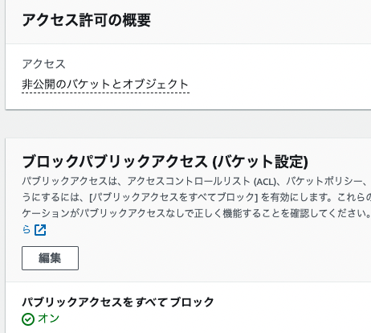
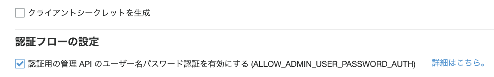
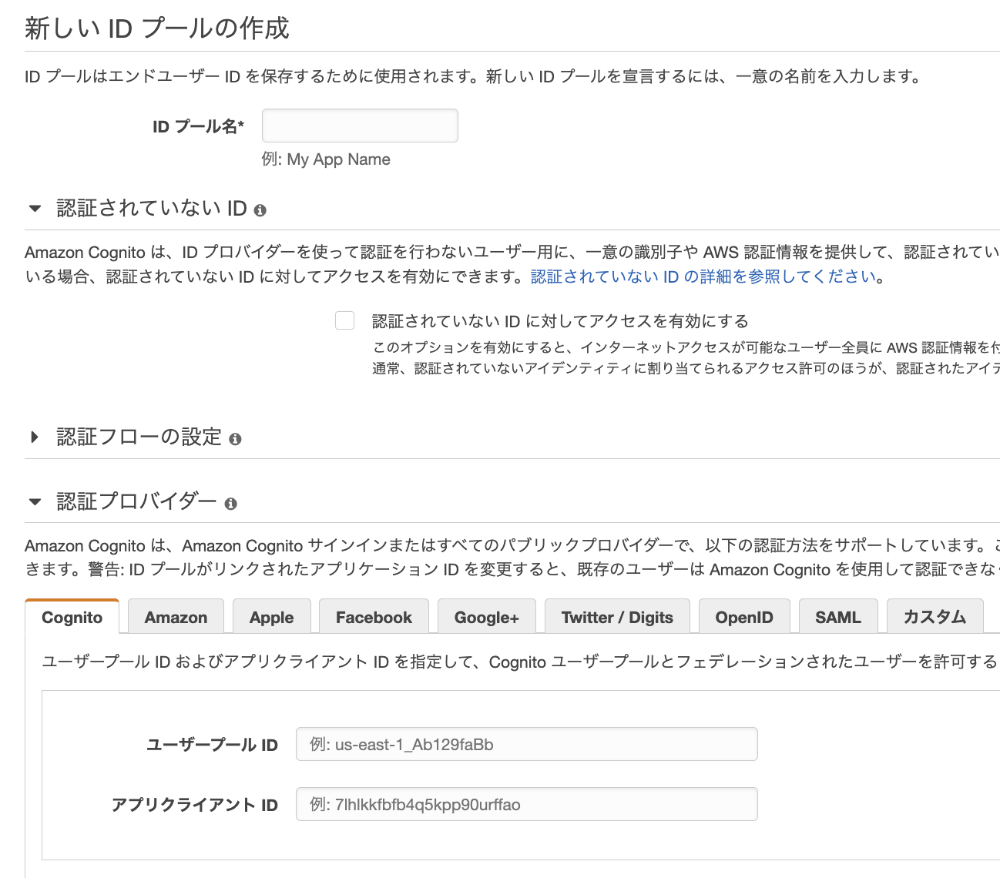
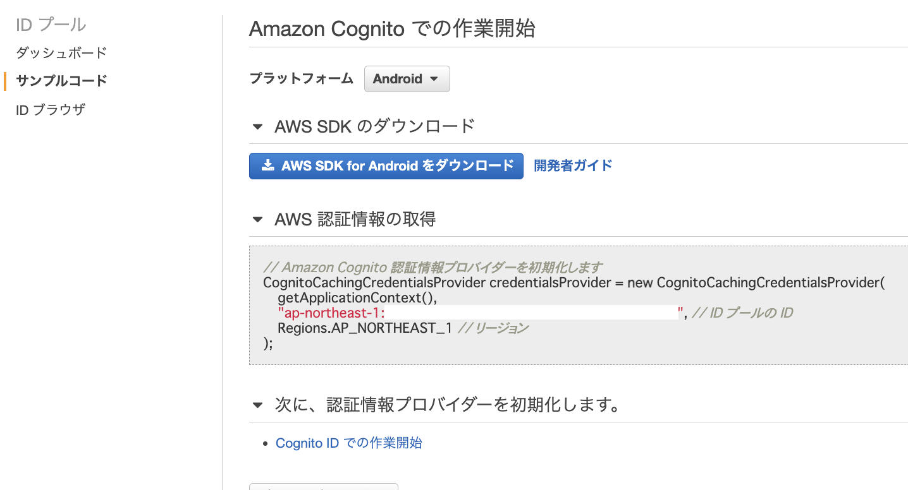
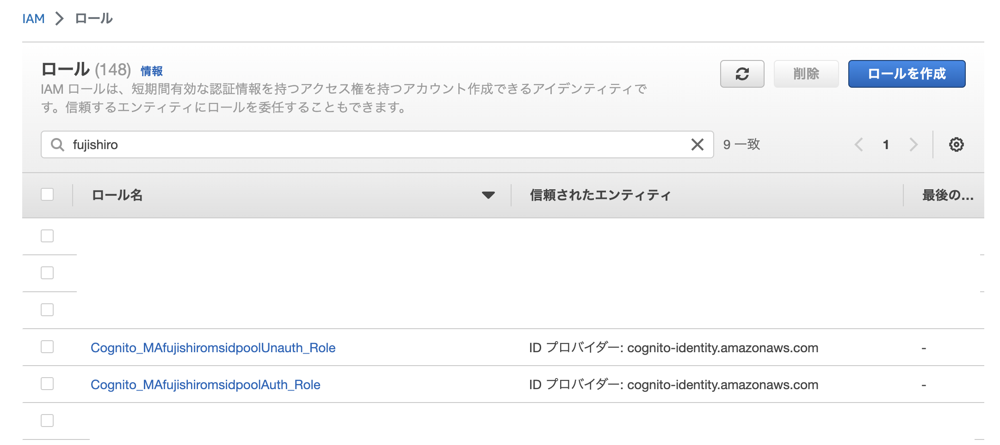
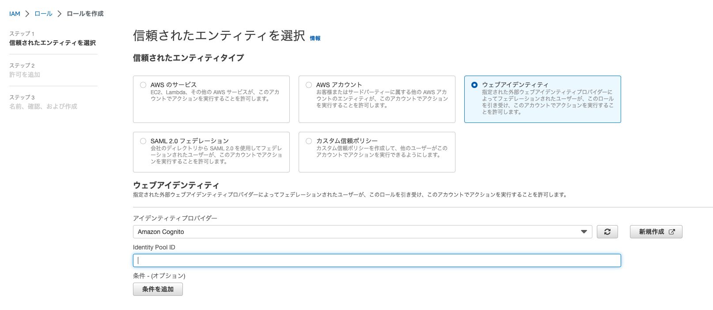
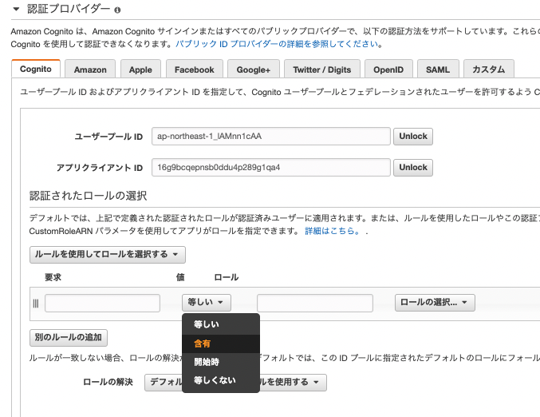
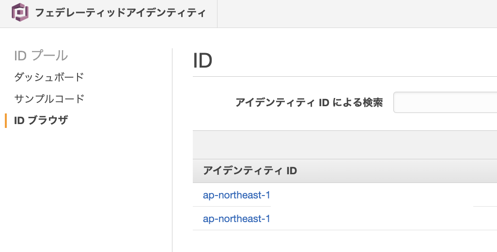

## Cognitoで認証をして、AWSのリソースにアクセスする
実施手順とポイント
1. S3バケット作成
1. ConitoでUser Poolとユーザーを作成する
1. CognitoでIDPoolを作成する 
1. Cognitoの認証されたユーザーに対するIAM権限を設定する。
1. Cognitoへ問い合わせしてクレデンシャルを取得する
1. クレデンシャルを利用して、AWS CLIからS3にアクセス
1. 【＋α】ルールベースでIAMロールを割り当てる


### 参考文献
- [クレデンシャルの取得方法](https://dev.classmethod.jp/articles/get-aws-temporary-security-credentials-with-cognito-id-pool-by-aws-cli/)  
：一番参考になるAWS CLIでCognitoのクレデンシャルを取得する方法から、ルールベースで付与するIAMを変更する手順が整理されている
- [Cognito を使ったユーザ認証で S3 にアクセスしてみる](https://www.aws-room.com/entry/cognito-s3)  
：pythonを利用して、cognitoから認証情報を受けてS3へのアクセス制御を検証している
- [PythonからCognitoのUSER_PASSWORD_AUTHとUSER_SRP_AUTHでのトークン取得](https://yomon.hatenablog.com/entry/2022/8/cognito_python)  
：pythonを利用してクレデンシャルを取得するところまで、クライアントシークレットを有効化している時に対応しているところまで整理してくれている
- [S3 の読み書きを Cognito で認証する方法](https://dev.classmethod.jp/articles/cognito-trigger-allow-access-per-identity-id/)  
：ディレクトリにユーザーIDを付与することで、認証したユーザーのIDを冠したディレクトリしかアクセスすることができなくなる。
- [外部ユーザが安全かつ直接的に Amazon S3 へファイルをアップロードできるようにする方法](https://aws.amazon.com/jp/blogs/news/allowing-external-users-to-securely-and-directly-upload-files-to-amazon-s3/)  
：amplifyを利用して、アップロードページをアップロードする方法
- [Cognito を使ったユーザ認証で S3 にアクセスしてみる](https://www.aws-room.com/entry/cognito-s3)


### S3バケット作成
S3バケットを作成する。アクセス制御はブロックしておく



### Cognitoでユーザープールを作成
詳細は[別ページ](https://misakifujishiro.github.io/mylogs/Artifact/cognito.html#cognito)参照

この時に、アプリクライアントの設定で、`クライアントシークレットの作成`については無効化しておき、`ALLOW_ADMIN_USER_PASSWORD_AUTH`を有効化する  
また、test userも作成しておく（有効化してもなんとかなるけど、Cognitoへのログイン設定が面倒）




### CognitoでIDプールを作成
- idPool名  
    同じユーザー内で一意にする    
- 認証していないID  
    有効化すると、認証していないユーザーへの権限が設定可能
- 認証プロバイダ  
    前節で作成したCognitoのユーザープールの情報を設定



作成したIDプールのナビゲーションペインのサンプルコードからIDプールのIDを確認できる。
後から利用するので記録しておく。




### 紐づくIAMの作成
作成したIDpool名を冠したIAMロールが存在するはずなので、そのロールのポリシーを編集していく。



今回は、以下の権限を付与する
- 認証ユーザー:S3バケット内のオブジェクト一覧表示とput/get
- 非認証ユーザー:S3バケット内のオブジェクト一覧表示

認証ユーザー(Auth_Role)に付与するIAMポリシーは以下
```
{
    "Version": "2012-10-17",
    "Statement": [
        {
            "Effect": "Allow",
            "Action": [
                "cognito-sync:*",
                "cognito-identity:*",
                "s3:ListBucket",
                "s3:GetObject",
                "s3:PutObject"
            ],
            "Resource": [
                "arn:aws:s3:::[YOUR_BUCKET_NAME]",
                "arn:aws:s3:::[YOUR_BUCKET_NAME]/*"
            ]
        }
    ]
}
```

非認証ユーザー(UnAuth_Role)に付与するIAMポリシーは以下
```
{
    "Version": "2012-10-17",
    "Statement": [
        {
            "Effect": "Allow",
            "Action": [
                "mobileanalytics:PutEvents",
                "cognito-sync:*",
                "s3:ListBucket"
            ],
            "Resource": [
                "arn:aws:s3:::[YOUR_BUCKET_NAME]",
                "arn:aws:s3:::[YOUR_BUCKET_NAME]/*"
            ]
        }
    ]
}
```

### Python SDKからのアクセス
認証ユーザーとして処理を実行する場合は以下のコマンドを実行

対象bucketのオブジェクト一覧表示、ダウンロード、アップロードが成功する。

```
import boto3

###
# 設定情報
###
account_id = 'YOUR_AWS_ID'
user_pool_id = 'COGNITO_USER_POOL_ID'
client_id = 'COGNITO_APP_CLIENT_ID'
identity_pool_id = 'ap-northeast-1:COGNITO_ID_POOL_ID'
user_name = 'COGNITO_USER_NAME'
email = 'COGNITO_USER_EMAIL'
password = 'COGNITO_USER_PASSWORD'
bucket_name = 'YOUR_S3_BUCKET_NAME'

region = 'ap-northeast-1'
logins_key = f"cognito-idp.{region}.amazonaws.com/{user_pool_id}"
auth_flow = "USER_PASSWORD_AUTH"


###
# CognitoIdentityProviderクライアントを初期化
###
idp_client = boto3.client('cognito-idp')

# ログインしてセッションを開始
response = idp_client.initiate_auth(
    ClientId=client_id,
    AuthFlow=auth_flow,
    AuthParameters={
        'USERNAME': user_name,
        'PASSWORD': password
    }
)

# IDトークン、アクセストークン、リフレッシュトークンを取得
id_token = response['AuthenticationResult']['IdToken']
access_token = response['AuthenticationResult']['AccessToken']
refresh_token = response['AuthenticationResult']['RefreshToken']


###
# CognitoIdentityクライアントを初期化
###
identity_client = boto3.client('cognito-identity')

# アイデンティティIDを取得
identity_id = identity_client.get_id(
    AccountId=account_id,
    IdentityPoolId=identity_pool_id,
    Logins={
        logins_key: id_token
    }
)['IdentityId']

credentials_response = identity_client.get_credentials_for_identity(
    IdentityId=identity_id,
    Logins={
        logins_key: id_token
    }
)


###
# S3にアクセスするクレデンシャルを取得
###
Credentials = credentials_response['Credentials']
access_key_id = Credentials['AccessKeyId']
secret_access_key = Credentials['SecretKey']
session_token = Credentials['SessionToken']


###
# S3にアクセス
###
s3_client = boto3.client('s3',
            region_name="ap-northeast-1",
            aws_access_key_id=access_key_id,
            aws_secret_access_key=secret_access_key,
            aws_session_token=session_token
        )


###
# オブジェクト一覧表示
###
object_list = s3_client.list_objects_v2(Bucket=bucket_name)
for obj in object_list['Contents']:
    print(obj['Key'])

###
# ファイルアップロード
###
Filename = 'PATH_TO_UPLOAD_FILE_AT_LOCAL'
UL_Key = 'PATH_TO_S3_FILE'

s3_client.upload_file(bucket_name, Filename, UL_Key)

###
# ファイルダウンロード
###
Filename = 'DL_FILE_NAME'
DL_Key = "PATH_TO_DOWNLOAD_FILE_AT_S3"


s3_client.download_file(bucket_name,DL_KEY, Filename)
```


非認証ユーザーとして処理を実行する場合は以下のコマンドで実行

対象バケットの一覧表示のみが成功し、アップロードやダウンロードは権限的に失敗する。
```
import boto3
from botocore.exceptions import NoCredentialsError

session = boto3.Session()
cognito_identity_pool_id = 'ap-northeast-1:1f392b6a-751d-4760-8849-5924149f8e67'

# 一時的な認証情報を取得するためにCognito Identityを使用する
client = session.client('cognito-identity')
response = client.get_id(IdentityPoolId=cognito_identity_pool_id)
identity_id = response['IdentityId']
credentials = client.get_credentials_for_identity(IdentityId=identity_id)

# 一時的な認証情報を使用して、AWSサービスに接続する
s3_client = session.client('s3',
    aws_access_key_id=credentials['Credentials']['AccessKeyId'],
    aws_secret_access_key=credentials['Credentials']['SecretKey'],
    aws_session_token=credentials['Credentials']['SessionToken']
)

bucket_name = 'ma-fujishiroms-bucket'

# バケットにあるアイテムを検索
object_list = s3_client.list_objects_v2(Bucket=bucket_name)
for obj in object_list['Contents']:
    print(obj['Key'])


```


### 【参考】AWS CLIからのアクセス
#### ログイン
AWS CLIの場合は以下のコマンドでログインする  
Cognitoのユーザープールで動作確認用に2つのアカウントを作成しておく

初期設定
- USER_POOL_IDはCognitoのユーザープールの全般設定から取得
- CLIENT_IDはCognitoのユーザープールのアプリクライアントから取得
- IDENTITY_POOL_IDはCognitoのIDプールのサンプルコードから取得（前節でメモした）
```
USER_POOL_ID=ap-northeast-1_xxxxxxx
CLIENT_ID=xxxxxxxxxxxx
IDENTITY_POOL_ID=ap-northeast-1:xxxxxxxxxx
USER_NAME=YOUR_USER_NAME
USER_EMAIL=YOUR_MAIL_ADDRESS@gmail.com
REGION=ap-northeast-1
PASSWORD="Dummy456"
COGNITO_USER_POOL=cognito-idp.${REGION}.amazonaws.com/${USER_POOL_ID}
```

ログインして、ID Tokenの取得
(`USERNAME`はUSER＿NAMEでもUSER_EMAILでも認証が通った)
```
ID_TOKEN=$(aws cognito-idp admin-initiate-auth \
  --user-pool-id ${USER_POOL_ID} \
  --client-id ${CLIENT_ID} \
  --auth-flow ADMIN_NO_SRP_AUTH \
  --auth-parameters "USERNAME=${USER_NAME},PASSWORD=${PASSWORD}" \
  --query "AuthenticationResult.IdToken" \
  --output text) && echo ${ID_TOKEN}
```


#### クレデンシャルの取得
IDENTITY_IDを取得
```
IDENTITY_ID=$(aws cognito-identity get-id \
  --identity-pool-id ${IDENTITY_POOL_ID} \
  --logins "${COGNITO_USER_POOL}=${ID_TOKEN}" \
  --query "IdentityId" \
  --output text) && echo ${IDENTITY_ID}
```
Identify IDを利用して、`クレデンシャル`を取得
```
OUTPUT=$(aws cognito-identity get-credentials-for-identity \
  --identity-id ${IDENTITY_ID} \
  --logins "${COGNITO_USER_POOL}=${ID_TOKEN}") && echo ${OUTPUT}
```

返却されたクレデンシャルの`AccessKeyID`、`SecretKey`、`SessionToken`を環境変数に設定
```
AWS_ACCESS_KEY_ID=`echo $OUTPUT | jq -r '.Credentials.AccessKeyId'`
export AWS_ACCESS_KEY_ID
AWS_SECRET_ACCESS_KEY=`echo $OUTPUT | jq -r '.Credentials.SecretKey'`
export AWS_SECRET_ACCESS_KEY
AWS_SECURITY_TOKEN=`echo $OUTPUT | jq -r '.Credentials.SessionToken'`
export AWS_SECURITY_TOKEN
```


### 【参考】ユーザーごとに紐づけるロールを変更する場合
#### IAMロールの作成
IAMのコンソール画面から、新しいロールを作成し、エンティティタイプをウェブアイデンティティにする。
プロバイダーとしてCognitoを選択して、IDプールのIDを書き込み、ポリシーを付与してロールを作成する



#### IDプールでルールを設定
`IDプールの編集`から、認証プロバイダを選択して、`ルールを使用してロールを選択`するから、ルール設定
例えば、「emailにxxxxを含む」などの条件で付与するIAMを変更できる




### 【参考】ユーザー毎にアクセスするオブジェクト（フォルダ）を制限する場合のIAM
ポリシーには、Cognitoで認証したユーザーごとのバケットの中でも`フェデレーティッドユーザーの ID${cognito-identity.:sub}`のディレクトリに紐づいたオブジェクトにのみアクセスできるポリシーを付与。
```
{
  "Version": "2012-10-17",
  "Statement": [
    {
      "Effect": "Allow",
      "Action": ["s3:ListBucket"],
      "Resource": ["arn:aws:s3:::ma-fujishiroms-bucke"],
      "Condition": {"StringLike": {"s3:prefix": ["cognito/"]}}
    },
    {
      "Effect": "Allow",
      "Action": [
        "s3:GetObject",
        "s3:PutObject",
        "s3:DeleteObject"
      ],
      "Resource": [
        "arn:aws:s3:::ma-fujishiroms-bucket/cognito/${cognito-identity.amazonaws.com:sub}",
        "arn:aws:s3:::ma-fujishiroms-bucket/cognito/${cognito-identity.amazonaws.com:sub}/*"
      ]
    }
  ]
}
```

UnAuthユーザーには情報を付与しない。

#### S3バケットの作成
作成したIAMの権限に合わせて、S3バケットを作成する。
バケット内に作成するフォルダについても、`cognito/CognitoUserID`とする。
UserIDは先ほどの手順でログインすることでCognitoのID poolに追加されている値を利用する



以下のようなディレクトリ構成となる
```
bucket
|
|--cognito
    |
    |--ap-northeast-1:xxxxxxxxx
    |
    |--ap-northeast-1:yyyyyyyyy
```

#### 動作確認
xxxxxxxのクレデンシャルを環境変数に設定しているときとyyyyyyyyyのクレデンシャルを環境ヘンスに設定している時で、アクセスできるS3が異なることを確認する
```
aws s3 cp --region ap-northeast-1 s3://ma-fujishiroms-bucket/cognito/ap-northeast-1:xxxxxxxxx/alb_setting_basic.png ./


aws s3 cp --region ap-northeast-1 s3://ma-fujishiroms-bucket/cognito/ap-northeast-1:yyyyyyyyy/auth0_tenant.png ./
```


