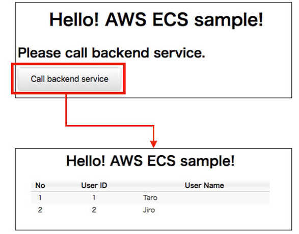
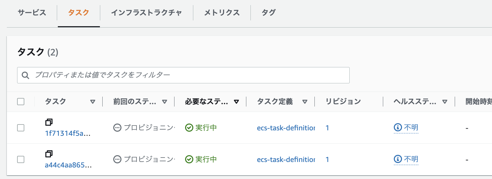

# AWS ECS上に構築するSpringアプリケーション
ECSは、クラスタ単位でDockerコンテナを実行・停止・管理することができるコンテナ管理サービス  
複数のAZを跨いで、コンテナ実行できるため、可用性が高い。


塾長の記事[AWSで作るクラウドネイティブアプリケーションの基本](https://news.mynavi.jp/techplus/series/AWS/?page=2)を実装していく。
- [第1回 VPC環境構築](https://news.mynavi.jp/techplus/article/techp4354/)
- [第2回 ALBの作成](https://news.mynavi.jp/techplus/article/techp4359/)
- [第3回 Springを使用したコンテナアプリ実装](https://news.mynavi.jp/techplus/article/techp4363/)
- [第4回 Dockerコンテナの作成](https://news.mynavi.jp/techplus/article/techp4390/)
- [第5回 ECSクラスターの作成](https://news.mynavi.jp/techplus/article/techp4405/)
- [第6回 ECSタスクの定義](https://news.mynavi.jp/techplus/article/techp4408/)
- [第7回 ECSサービスの実行](https://news.mynavi.jp/techplus/article/techp4416/)

ソースコードは[github](https://github.com/debugroom/mynavi-sample-aws-ecs)のものを参考にする


## VPC環境構築
### 基本方針
複数AZに跨って、Private-SubnetとPublic-Subnetを作成する。

private-subnetには、NAT GWにルーティングされたルートテーブルを付与する。  
public-subnetには、Internet GWにルーティングされたルートテーブルを付与する


### VPC作成後の成果物
成果物
- VPC
- subnet: private/publicそれぞれ２つ
- Internet GW
- NAT GW
- Elastic-IP: NATGWに割り当たる
- ルートテーブル

#### VPC作成
ウィザードからVPCなどを選択して設定すると各種自動で作成される

- 名前タグ  
    自動設定をONにして、入力しておくと自動作成されるリソースにPrefixを付与してくれる


- サブネット  
    サブネットないのAZの数やPublicとPrivateそれぞれのSubnet数を選択するだけで、自動作成される      
    CIDRに関しても自動で、割り振りをしてくれる  


- Internet GW    
    自動で作成し、VPCに自動でアタッチしてくれる

- NAT GW    
    自動で作成し、ElasticIPの取得とアタッチをしてくれる


- ルートテーブル  
    Public-SubnetにはInternet GWへのルーティングを設定したルートテーブルがアタッチされる  
    Private-SubnetにはNAT GWへのルーティングを設定したルートテーブルがアタッチされる


## ALBの作成
### 基本方針
Public-Subnetに構築されるBFFは外部向けロードバランサー経由でHTTPリクエストを受け取る  
Private-Subnetに構築されるバックエンドアプリは内部向けロードバランサー経由でリクエストを受け取る。

パスルーティングを行うため、ALBおよびターゲットグループ、それぞれのセキュリティグループを作成する。


### ALB作成後の成果物 
- Public向けALB
    Public-Subnetに配置するECS用のインターネットからの接続可能なALB
- Private向けALB  
    Private-Subnetに配置するECS用のVPC内部からしか接続できないALB
- Public/PrivateのTargetGrout（ヘルスチェックやターゲットは未設定）
- Public/PrivateのALB用のセキュリティグループ


### ALBの作成
- EC2のナビゲーションペインからロードバランサーを選択
- Create Load BalancerからALBを選択
- 名前を設定
- スキーム：public：Internet、Private：Internalを選択
- アドレスタイプ：Ipv4
- VPCとSubnet：作成済のSubnetを選択


- セキュリティグループの作成  
    今後、ECSのセキュリティグループで、接続元を制限する際に本セキュリティグループと紐づけるので新規でSGを作成  
    VPCの設定変更や Nameタグの付与を忘れない  
    Publicの場合は、0.0.0.0/0をインバウンドに設定、Privateの場合はVPC内部だけをインバウンドに設定


- ターゲットグループの作成  
    ターゲットの種類には、ECSのクラスターのインスタンスが対象となるのでインスタンスを指定を指定する。  
    ヘルスチェック先やターゲットの登録を行う。
    Protocol Portは80でOK

    ターゲットは、動的マッピングの場合、ECSでサービス作成時にTGを紐付けると自動で設定されるので、設定しなくて良い。
    
    

- リスナーの設定（ロードバランサのプロトコル・ポート）  
    HTTPの80を指定して、作成したTGを設定。  
    ポート設定などは、アプリ側や動的マッピングのことは考えなくてOK。
    基本的に外部からは80や443で受け付けて、パスルーティングでTGに流して、動的マッピングしていくイメージ。


- ルールの設定  
    ALBのListenersからRulesを選択して、パスルーティングの設定をする。
    パスを指定するときは、アプリケーションが利用するパスがxxxであれば、`/xxx/*`という形で設定する。


## Springを使用したコンテナアプリ実装
### 基本方針
backendとbackend-for-frontのPJを作成する。

backend-for-frontは、HTML画面を表示、ボタンを押下するとbackendのサービスを呼び出して、user情報を受け取り、画面に表示する。

backendでは、`backend/api/vi/users`の受け口を作成して、事前定義したuser情報を返却するコードを実装する。




### 成果物
- bffのSpring PJ
- backendのSpring PJ

### backend
User情報をmodelに格納して、Controllerでパスの設定や処理を記述する。

各種ファイルの役割
- backend/app/model/User.java  
        User情報を定義しておく(DBの代わり)
- backend/app/web/BackendRestController.java   
        パスの設定とUser情報の作成、返り値の定義  
        "/api/v1/users"にアクセスがくると、User情報を返す
- backend/config/App.java  
    BackendアプリのSpringBoot起動クラス
- backend/config/MvcConfig.java  
    Controllerを読み取って、RESTAPIとして動作させるため、ComponentScanの対象を指定
- resources/application.yml  
    サーバー上のWebアプリケションを識別するパスであるコンテキストパスを設定  
    これによって、URLが`http://localhost:8080/backend/api/v1/users`となる。


#### [トラブルシュート]User.javaのLombokで躓いた話
■背景  
Lombokとは、getterやsetter、builderなどを自動生成してくれるライブラリである。  
こちらのサイトがわかりやすい[LombokのBuilderパターン解説](https://qiita.com/uhooi/items/bb817e7ca7dc128bf475)

■問題  
User.javaでlombokを使って@builderしているのに、BackendRestController.java側で認識してくれない。

■解決策  
STSではlombokは適用されていないので、STSでLombokを有効にするために、lombok.jarをDLして、STSのiniファイルを対象にする。

[stsでlombokを利用する](https://snona.hatenablog.com/entry/2016/02/18/024239)の手順に従えばOK

#### [実装上の工夫]application.ymlを環境を切り替える
構築環境に応じて、エンドポイントなどを切り替える際に、複数のapplication.ymlを準備して、利用対象を切り替える。  
[Spring Bootでのプロファイルを使った環境切り分け](https://scior.hatenablog.com/entry/2019/03/20/003058)

■application-dev.ymlの設定
基本はapplication.ymlが利用されるがapplication-xxx.ymlを作成すると、xxxとして、application.ymlは認識してくれる。


■application.ymlの設定  
以下を設定すると、application-dev.ymlがデフォルトで読み込まれるようになる。
```
spring:
  profiles:
    active: dev
```

■利用profileの設定  
jarファイルの実行時に指定してあげる。以下だとdevが利用される
> java -jar spring-boot-application-properties-sample-1.0.0.jar --spring.profiles.active=dev


### bff
各種ファイルの役割
- backendforfrontend/app/model/User.java  
    User情報を定義しておく(DBの代わり)
- backendforfrontend/app/web/BackendForFrontendController.java  
    index.htmlからのリクエストを受け取って、backendのAPIへ問い合わせる
- backendforfrontend/app/web/ServiceProperties.java  
    ConfigurationPropertiesを利用してapplication.ymlのdns名を取得
- backendforfrontend/config/MvcConfig.java  
    RestOpearationsの生成時にdns名を指定してREST呼び出し先を指定
- backendforfrontend/config/WebApp.java  
    Backend -for-frontアプリのSpring起動クラス
- resources/static/index.html  
    最初の画面
- resources/template/users.html  
    userを取得した後の画面
- resources/application.yml  
    applicationのコンテキストパスを`/backendforfront`に設定  
    DNSの宛先を指定。これをServicePropertiesやMvcConfigから読み取っている。


### chap3の疑問点
#### application.ymlの指定
- [第4回 Dockerコンテナの作成](https://news.mynavi.jp/techplus/article/techp4390/)の設定ファイルの指定について

> CMD java -jar -Dspring.profiles.active=production /usr/local/mynavi-sample-aws-ecs/backend-for-frontend/target/mynavi-sample-aws-ecs-backend-for-frontend-0.0.1-SNAPSHOT.jar

ここで、productionを指定しているが、applicaiton-production.ymlは存在しない。  
productionを指定すると、application.ymlが指定されるかと思ったが、実際動かなかった。


#### backendのdns指定
backend側は、albを指定する必要がないが、application.ymlでserviceとして、albを指定している。これは利用されていない？
マイナビの説明でも触れていないが、gitには記述されている。
> service:  
>   dns: https://sample-ecs-alb-1379155413.ap-northeast-1.elb.amazonaws.com/


## Dockerコンテナの作成
### 基本方針
DockerFileから、DockerImageを作成し、DockerImageからdockerコンテナを起動することで動作確認する。

最後に作成したdocker ImageをECRにpushする。

### 成果物
- Docker File  bffとbackend
- Docker Image bffとbackend
- ECRのレジストリ bffとbackend


### ECR作成
最初に、docker ImageをpushするためのレジストリをAWS上に作成しておく。

ECRから、新規作成で、bffとbackendのレジストリを作成


### DockerFileの説明
BFF側のdockerFile

今回はjavaのver17で開発したので、色々変更しながら動かしている。
```
# Docker Imageとしてcentos7
FROM centos:centos7

# git などのインストール
RUN yum install -y \
       wget tar iproute git

# java17のインストール
RUN yum install -y https://cdn.azul.com/zulu/bin/zulu-repo-1.0.0-1.noarch.rpm
RUN yum install -y zulu17-jdk

# mavenのインストール
RUN yum install -y ca-certificates
RUN wget http://repos.fedorapeople.org/repos/dchen/apache-maven/epel-apache-maven.repo -O /etc/yum.repos.d/epel-apache-maven.repo
RUN sed -i s/\$releasever/6/g /etc/yum.repos.d/epel-apache-maven.repo
RUN curl -OL https://archive.apache.org/dist/maven/maven-3/3.5.2/binaries/apache-maven-3.5.2-bin.tar.gz
RUN tar -xzvf apache-maven-3.5.2-bin.tar.gz
RUN mv apache-maven-3.5.2 /opt/

# PATHの追加
ENV JAVA_HOME /usr/lib/jvm/zulu17
ENV PATH $PATH:/opt/apache-maven-3.5.2/bin
ENV PATH $JAVA_HOME/bin:$PATH

# PJのコピー
RUN git clone https://github.com/MisakiFujishiro/ecs_backend
RUN mvn install -DskipTests=true -f /ecs_backend/pom.xml

# タイムゾーンの変更
RUN cp /etc/localtime /etc/localtime.org
RUN ln -sf  /usr/share/zoneinfo/Asia/Tokyo /etc/localtime

# コンテナのポート解放
EXPOSE 8080

# Javaの実行
CMD java -jar -Dspring.profiles.active=production ecs_backend/target/mynavi-sample-aws-ecs-backend-0.0.1-SNAPSHOT.jar

```

### Docker Imageの作成
docker buildコマンドで、DockerFileからイメージを作成する。最後の`.`はカレントディレクトリにあるDockerfileを指定している。
> docker build -t [IMAGE_TAG]:[IMAGE_VER] .

> docker build -t bff:v1 .  

今回自分のPC（MacのM1チップを利用していたため、以下のコマンドを含めて実行しないとECSでうまく動かなかった

> docker build --platform linux/amd64 -t bff:v1 . 


### Docker Containerの作成
docker runコマンドでイメージからコンテナを起動する
> docker run --name [YOUR_CONTAINER_NAME] -it [IMAGE_TAG]:[IMAGE_VER]


#### コンテナ内からlocalhostへ接続
Dockerコンテナ同士で通信して動作確認するために、`--add-host=host.docker.internal:host-gateway`これを追加してコンテナを立ち上げる。
これを設定すると、dockerコンテナ内から、host.docker.internalを指定するとホスト側にアクセスしてくれる。

> docker run -p 18081:8081 --name bff -it --add-host=host.docker.internal:host-gateway bff:v1

#### application.ymlの設定
事前にapplication-dev.ymlやapplication-production.ymlなどを作成しておき、それぞれ接続先を変更しておく。

docker runする際に、`-Dspring.profiles.active`によって、指定するapplicaiton.ymlの接頭辞を指定する。


> java -jar -Dspring.profiles.active=production ecs_backend_for_front/target/mynavi-sample-aws-ecs-backend-for-front-0.0.1-SNAPSHOT.jar

### DockerをECRにpush
認証トークンを取得して、レジストリに対して、dockerクライアントを認証
> aws ecr get-login-password --region ap-northeast-1 --profile my_profile　| docker login --username AWS --password-stdin 626394096352.dkr.ecr.ap-northeast-1.amazonaws.com


Docker Fileからイメージを作成。(backendの場合)
> docker build -t ma-fujishiroms-ecr-backend .

タグをECRと一致させる(backendの場合)
> docker tag ma-fujishiroms-ecr-backend:latest 626394096352.dkr.ecr.ap-northeast-1.amazonaws.com/ma-fujishiroms-ecr-backend:latest

 ECRにpush(backendの場合)
 > docker push 626394096352.dkr.ecr.ap-northeast-1.amazonaws.com/ma-fujishiroms-ecr-backend:latest


#### [トラブルシュート]wgetでエラーが発生
■課題  
Apache Mavenのインストールに必要な資材をwgetコマンドで取得に失敗
```
#6 2.044 ERROR: cannot verify repos.fedorapeople.org's certificate, issued by '/C=US/O=Let\'s Encrypt/CN=R3':
```

■解決策  
以下を追加して解消
```
RUN yum install -y ca-certificates
```


#### [トラブルシュート]apache-mavenがインストールできない
■課題  
apache-mavenがインストールできない
```
 => ERROR [6/6] RUN yum install -y apache-maven                                           7.5s 
------                                                                                         
 > [6/6] RUN yum install -y apache-maven:                                                      
#9 0.263 Loaded plugins: fastestmirror, ovl                                                    
#9 0.340 Loading mirror speeds from cached hostfile                                            
#9 0.341  * base: ftp.yz.yamagata-u.ac.jp                                                      
#9 0.341  * extras: ftp.yz.yamagata-u.ac.jp                                                    
#9 0.341  * updates: ftp.yz.yamagata-u.ac.jp
#9 7.105 http://repos.fedorapeople.org/repos/dchen/apache-maven/epel-6/aarch64/repodata/repomd.xml: [Errno 14] HTTPS Error 404 - Not Found
#9 7.105 Trying other mirror.
#9 7.105 To address this issue please refer to the below wiki article 
#9 7.105 
#9 7.105 https://wiki.centos.org/yum-errors
#9 7.105 
#9 7.105 If above article doesn't help to resolve this issue please use https://bugs.centos.org/.
#9 7.105 
#9 7.351 No package apache-maven available.
#9 7.395 Error: Nothing to do
```

■解決策  
apache-maven-3.5.2をcurlでDLして、パスを通した

- [Apache Maven 3.5 を CentOS 7 にインストールする手順](https://weblabo.oscasierra.net/install-maven-35-centos7/)
- [ JAVA_HOME environment variable is not defined correctly](https://tabeta-log.blogspot.com/2022/02/the-javahome-environment-variable-is.html?)


#### [トラブルシュート]mvn buildで、テストが実行されてエラー
■課題  
mvn installでテストエラー

■解決策  
一旦は、testをスキップする形で対処
> mnv install -DskipTests=true -f pom.xml


#### [トラブルシュート]ECRにpushできない。
■課題  
ECRにpushできない。EOFとなってタイムアウトしてしまう

■解決策  
docker pushを実行してる環境のアクセスキーを設定していないのが原因？？
[サイト](https://qiita.com/NaokiIshimura/items/1886dbd04631c3f7d0e1)を参考に、IAMでアクセスキーを作成して、ローカルPCに登録したらうまくできた。
この運用は正しい？アクセスキーの情報はコンソール上で入力した以外は利用していない。


## ECSクラスターの作成
### 基本方針
クラスターの設定を行う。PublicとPrivateそれぞれでクラスターを作成する。

セキュリティグループの設定として、それぞれのクラスターは、ALBからのリクエストを許可する。
具体的には、ALBが属するセキュリティグループを対象として、ポートが動的マッピングされることを考慮して32768-61000のポートを許可する

ECSでは以下の３種類のIAMロールの設定が必要であり、混乱するので、事前に
[参考サイト](https://qiita.com/tmiki/items/25473b8975f8a1095c0a)
などで確認しておくこと

### 成果物
- ECSクラスター　publicとprivate
- ECSクラスター用のIAM 
- セキュリテイグループ：ALBのSGからのアクセスを許可する。

### ECSクラスター作成
EC2+ネットワーキングから各種設定を行う。

EC2はECSに付随して自動で作成される。インスタンスタイプは少し大きめでOK。今回はt2.mediumにした。（作り直しが面倒なので）


## ECSタスクの定義
### 基本方針と成果物
ECS上に起動するコンテナの各種設定を行う
- タスク実行ロール：ECRとの接続やCloudWatchへのログを送るための実行ロール
- タスクロール: 各タスクが行う処理内容に応じたロール
- port：コンテナとECSホストのポートマッピングの設定をする

### IAMの作成
IAMからRoleを作成して、ECS Taskを選択して、AmazonECSTaskExecutionRolePolicyを付与



### ポートの設定
ポートフォワーディングの設定が必要。
- コンテナポート：アプリと一致させる
- ホストポート：動的フォワーディングをするので0

### メモリの設定
ハードメモリ：コンテナに予約するメモリ
ソフトメモリ：メモリ使用量の最大値で超えるとコンテナが落ちる

今回は両方1024にした。


## ECSサービスの実行
### 基本方針


### 成果物
- ECSのサービスとタスク。
- 実際に動く画面

### サービスの作成
サービスを作成していく中で、ALBやTGを設定する。

これは初回しか設定できないので、設定するときにALBとTGの設定を再確認しておく。


#### [トラブルシュート]タスクが起動しない：exec format error
CloudWatchを確認すると以下のエラー
```
exec /bin/sh: exec format error
```

調べてみると、M1チップを利用して、作成したdocker imageは動かないらしい！？
[ECS + Fargate で exec format error](https://nomad.office-aship.info/ecs-format-error/)

docker buildで以下のオプションを指定してみたらうまくいった。
> docker build --platform linux/amd64 -t ma-fujishiroms-ecr-bff:v2 .


[稼働プラットフォームを指定](https://qiita.com/OmeletteCurry19/items/fd057a7448aa3072fd1e)