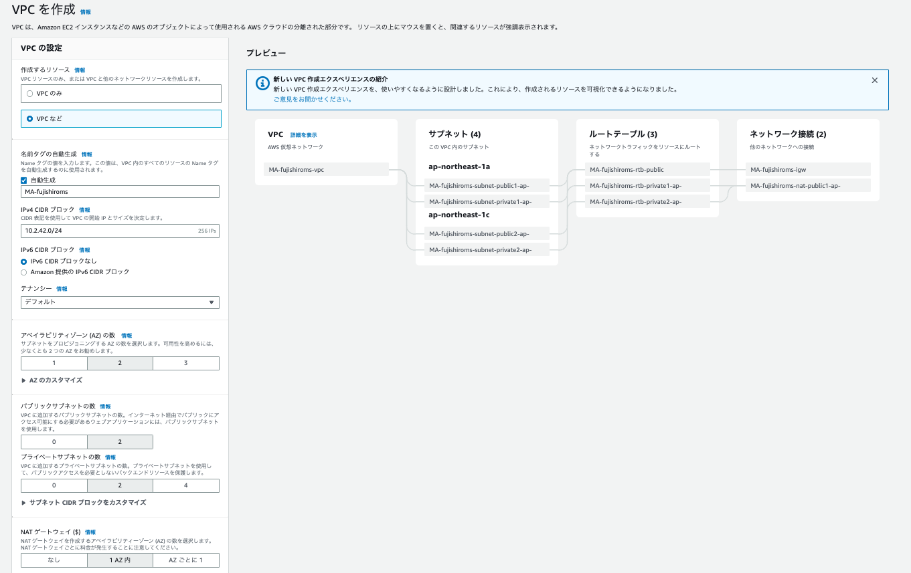

# AWS ECS上に構築するSpringアプリケーション
ECSは、クラスタ単位でDockerコンテナを実行・停止・管理することができるコンテナ管理サービス
複数のAZを跨いで、コンテナ実行できるため、可用性が高い。

塾長の記事[AWSで作るクラウドネイティブアプリケーションの基本](https://news.mynavi.jp/techplus/series/AWS/?page=2)を実する。
- [第1回　VPC環境構築](https://news.mynavi.jp/techplus/article/techp4354/)
- [第2回 ALBの作成](https://news.mynavi.jp/techplus/article/techp4359/)
- [第3回 Springを使用したコンテナアプリ実装](https://news.mynavi.jp/techplus/article/techp4363/)
- [第4回 Dockerコンテナの作成](https://news.mynavi.jp/techplus/article/techp4390/)
- [第5回 ECSクラスターの作成](https://news.mynavi.jp/techplus/article/techp4405/)
- [第6回 ECSタスクの定義](https://news.mynavi.jp/techplus/article/techp4408/)
- [第7回 ECSサービスの実行](https://news.mynavi.jp/techplus/article/techp4416/)

ソースコードは[github](https://github.com/debugroom/mynavi-sample-aws-ecs)のものを参考にする

作成する環境のイメージ

## VPC環境構築
### 基本方針
複数AZに跨って、Private-SubnetとPublic-Subnetを作成し、それぞれにECSコンテナを配置する。

パブリックサブネットにBFFとして、WebApp向けのHTMLを作成するサーバーを配置
プライベートサブネットのECSコンテナにAPIサーバーを配置

### VPCを作成する
成果物
- Elastic-IP: MA-fujishiroms-eip
- VPC: MA-fujishiroms-vpc
- subnet: private/publicを2つづつ
- Internet GW
- NAT GW
- ルートテーブル

#### NATGW用のElasticIPの取得
VPCのナビゲーションペインから`Elastic IP`を選択し、`Elastic IPアドレスを割り当てる`から取得

タグで、Nameタグを付与しておくこと。
今回は`MA-fujishiroms-eip`で取得

#### VPC作成
- VPC名：MA-fujishiroms-vpc
- IPv4 CIDRブロック：10.2.42.0/24

#### サブネット作成
AZとして、ap-northeast-1aとap-northeast-1cを利用し、それぞれにpublicとprivateのサブネットを作成。
- public-subnet-az-1a:10.2.42.0/28
- public-subnet-az-1c:10.2.42.16/28
- private-subnet-az-1a:10.2.42.128/28
- private-subnet-az-1c:10.2.42.144/28

#### NAT GWの設定

#### ルートテーブルの設定

## ALBの作成

## Springを使用したコンテナアプリ実装
## Dockerコンテナの作成
## ECSクラスターの作成
## ECSタスクの定義
## ECSサービスの実行

## トラブルシューティング