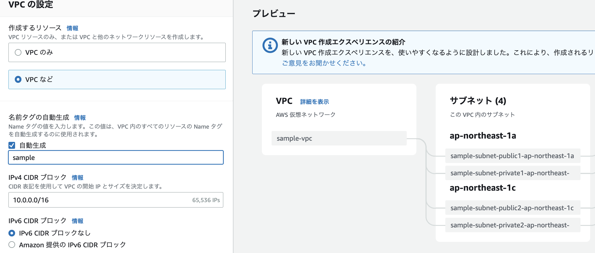

# AWS ECS上に構築するSpringアプリケーション
ECSは、クラスタ単位でDockerコンテナを実行・停止・管理することができるコンテナ管理サービス
複数のAZを跨いで、コンテナ実行できるため、可用性が高い。

塾長の記事[AWSで作るクラウドネイティブアプリケーションの基本](https://news.mynavi.jp/techplus/series/AWS/?page=2)を実する。
- [第1回　VPC環境構築](https://news.mynavi.jp/techplus/article/techp4354/)
- [第2回 ALBの作成](https://news.mynavi.jp/techplus/article/techp4359/)
- [第3回 Springを使用したコンテナアプリ実装](https://news.mynavi.jp/techplus/article/techp4363/)
- [第4回 Dockerコンテナの作成](https://news.mynavi.jp/techplus/article/techp4390/)
- [第5回 ECSクラスターの作成](https://news.mynavi.jp/techplus/article/techp4405/)
- [第6回 ECSタスクの定義](https://news.mynavi.jp/techplus/article/techp4408/)
- [第7回 ECSサービスの実行](https://news.mynavi.jp/techplus/article/techp4416/)

ソースコードは[github](https://github.com/debugroom/mynavi-sample-aws-ecs)のものを参考にする

作成する環境のイメージ

## VPC環境構築
### 基本方針
複数AZに跨って、Private-SubnetとPublic-Subnetを作成する。

private-subnetには、NAT GWにルーティングされたルートテーブルを付与する。
NAT GWには、Elastic IPを付与する。

public-subnetには、Internet GWにルーティングされたルートテーブルを付与する

### VPC作成後の成果物
成果物
- VPC
- subnet: private/publicを2つづつ
- Internet GW
- NAT GW
- Elastic-IP: NATGWに割り当たる
- ルートテーブル

#### VPC作成
ウィザードからVPCなどを選択して設定すると各種自動で作成される

- 名前タグ  
    自動設定をONにして、入力しておくと自動作成されるリソースにPrefixを付与してくれる

- サブネット
    サブネットないのAZの数やPublicとPrivateそれぞれのSubnet数を選択するだけで、自動作成される      
    CIDRに関しても自動で、割り振りをしてくれる  

- Internet GW  
    自動で作成し、VPCに自動でアタッチしてくれる

- NAT GW  
    自動で作成し、ElasticIPの取得とアタッチをしてくれる

- ルートテーブル
    Public-SubnetにはInternet GWへのルーティングを設定したルートテーブルがアタッチされる  
    Private-SubnetにはNAT GWへのルーティングを設定したルートテーブルがアタッチされる

## ALBの作成
### 基本方針
Public -Subnetに公開されるBFFアプリケーションはロードバランサー経由でHTTPリクエストを送信する。  
ロードバランサー側で、パスルーティングを行うため、ALBを構築する。

### ALB作成後の成果物 
- Public向けALB
    Public-Subnetに配置するECS用のインターネットからの接続可能なALB
- Private向けALB  
    Private-Subnetに配置するECS用のVPC内部からしか接続できないALB

### ALBの作成
1. EC2のナビゲーションペインからロードバランサーを選択
2. Create Load BalancerからALBを選択
3. 名前を設定
4. スキーム：publicなのでInternet向けを選択
5. アドレスタイプ：Ipv4
6. VPCとSubnet：作成済のPublicを選択

7. セキュリティグループの作成  
    今後、ECSのセキュリティグループで、接続元を制限する際に本セキュリティグループと紐づけるので新規でSGを作成  
    VPCの設定変更や Nameタグの付与を忘れない
    Publicの場合は、0.0.0.0/0をインバウンドに設定、Privateの場合はVPC内部だけをインバウンドに設定

8. ターゲットグループの作成  
    ターゲットの種類には、ECSのクラスターのインスタンスが対象となるのでインスタンスを指定を指定する。  
    ヘルスチェック先やターゲットの登録はECSサービスを作成してから再設定するので、デフォルトのままで設定完了
    
    

10. リスナーの設定（ロードバランサのプロトコル・ポート）  
     HTTPの80を指定して、作成したTGを設定

## Springを使用したコンテナアプリ実装
### 基本方針

## Dockerコンテナの作成
### 基本方針

## ECSクラスターの作成
### 基本方針

## ECSタスクの定義
### 基本方針

## ECSサービスの実行
### 基本方針

## トラブルシューティング