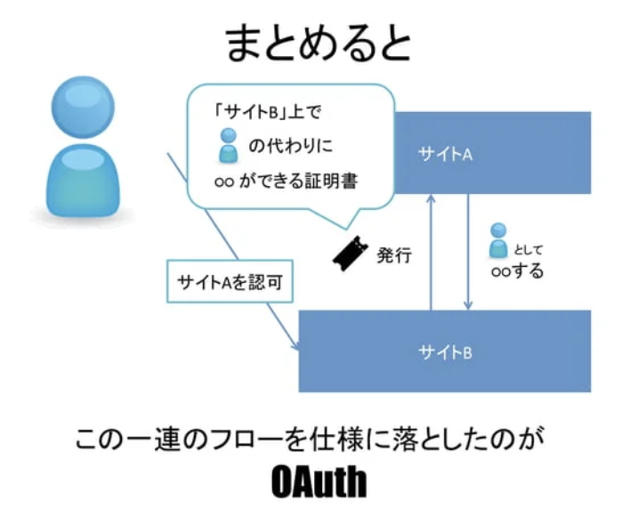
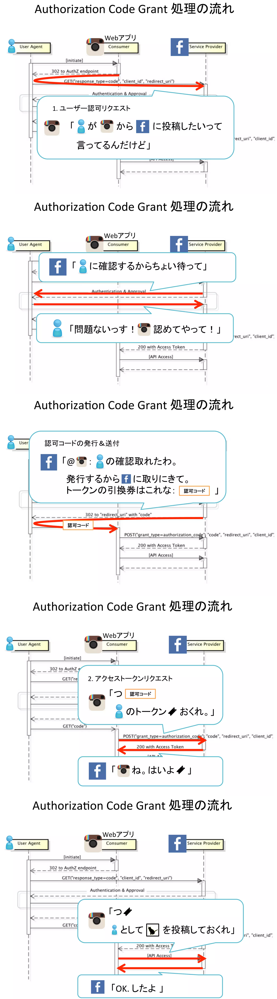
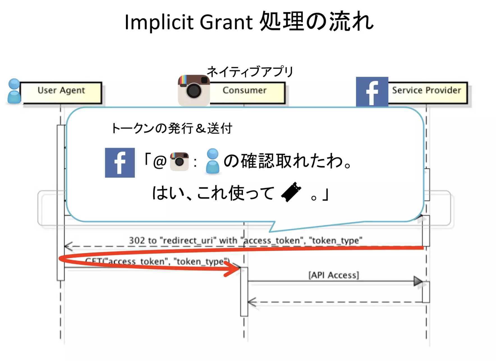
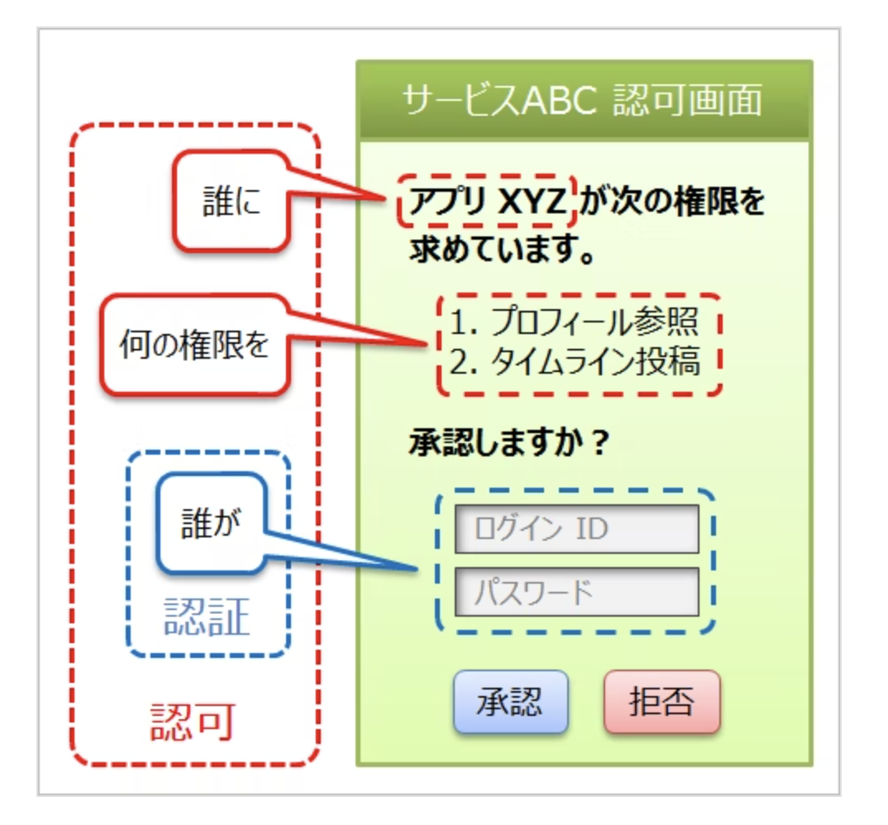
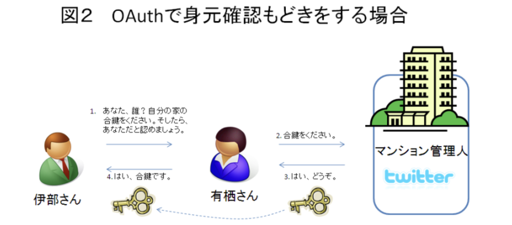
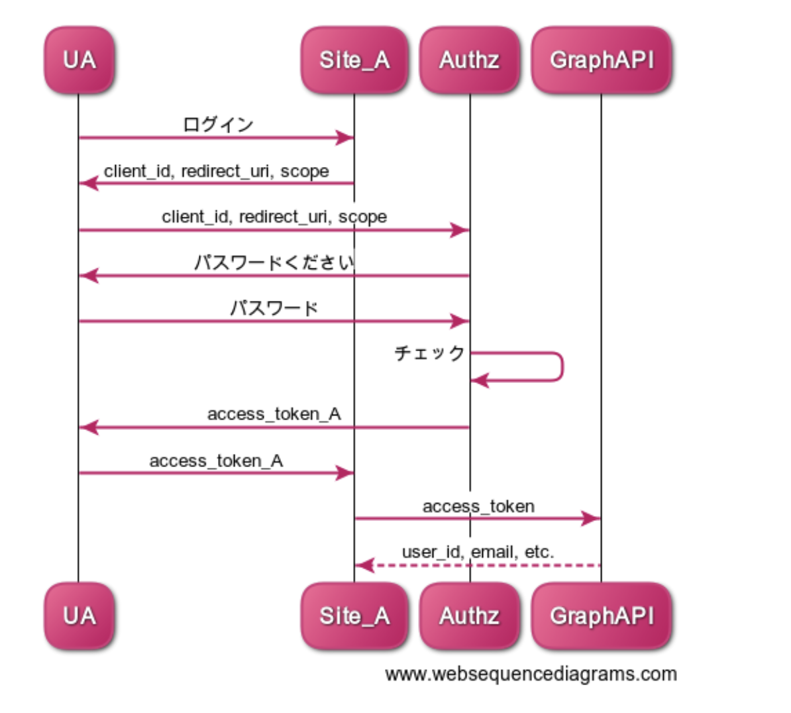
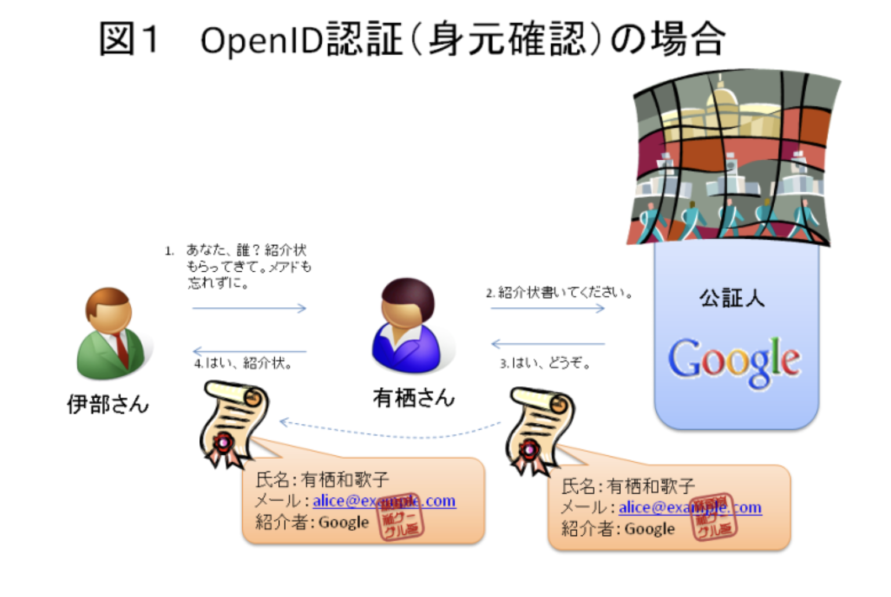
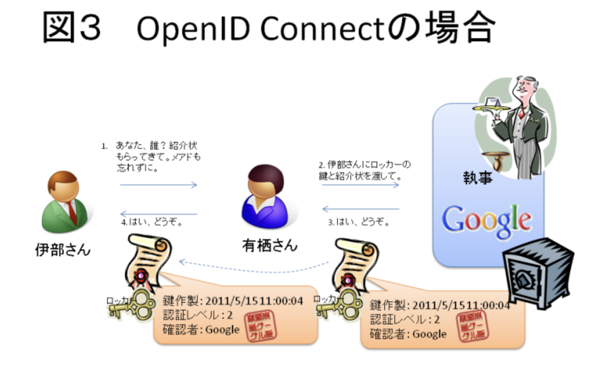

# テーマの整理

## マイクロサービアーキテクチャとは
マイクロサービスの概念は10年前の2014年くらいから提唱されている

## マイクロサービスアーキテクチャのメリット
マイクロサービス一番の目的はサービス間の独立性

疎結合となることで、機能間のソフトウェア的な組織的な独立性を高めて、開発速度向上を高める。
「開発速度を高めることができる」を深掘りするとコンテナサービスやCICDの文脈が語れると思う。

## 基本的な動き
認証認可のサーバーからTOKENを受け取って、 バックエンド機能に問い合わせをしていくのが基本の動き。
認可の情報に従って、提供するサービスを制御してバックエンドは処理を返していく

## Oath2.0やOpenIDConnect勉強
### Oath2.0
HTTP上で、認可を行うための仕様

正確にに書くと
> OAuth 2.0 とは、サービスのユーザーが、サービス上にホストされている自分のデータへのアクセスを、自分のクレデンシャルズ (ID & パスワード) を渡すことなく、第三者のアプリケーションに許可するためのフレームワークである。

具体例で書くと
> あるサイトAの機能（FaceBookの写真投稿）を、サイトB（Instagram）から実行するために、
ユーザーがサイトBに許可を与えて、サイトAにアクセスすることを認めること。

ユーザーがサイトBでサイトAについて認可すると、サイトBの認可チケットをサイトAへわたす。
そうすると、サイトAにサイトBの認証情報をおかないで、サイトAへ認可することができる。

Oathが流行っている理由
1. パスワードをサードパーティのアプリに渡すことなくAPIを利用できる
2. どのリソースにアクセス可能かを細かくユーザーに認可させることができる

#### トークンの発行フロー
Authorization Code GrantとImplicit Grantの２つがある。

##### Authorization Code Grant
Authrozation CodeはサイトAのTokenをユーザーには渡さない
代わりに、認可コードをWebアプリケーションに渡す。

##### Implicit Grant
一番の違いはImplicit GrandはサイトAのTokenを一度ユーザーに渡す点

### Oath認証
Oathを使って、認証までしてしまおうという流れ。
本来Oathは認証ではなくて認可の使用なので、間違って使うと脆弱性が生まれる。

認可は「誰が、誰に、何を」提供するかを定義するものであり、 その中の「誰が」は認証をしているものなので、話がややこしい。
このOathの認可の中で認証をしているので、これを認証として扱ってしまおうというのが「Oath認証」

本来認証ではない行為を使って認証をしている。マンションの合鍵を持ってきて、本人確認をする。
OAuth Server（Twitter）とかで悪さすることができるので、合鍵をばら撒くのは好ましくない・・・

セキュリティ的なレベルの低さはあったが、手軽さのおかげで普及した

#### セキュリティホール
セキュリティホールは、 access_tokenをUserAgentに渡すということは、UAはaccess_tokenを使いまわせる点にある。
サイトAが悪役で、渡したTokenが盗まれたとすると、そのTokenを使うことで、認証せずに、サイトBがAのふりをできる。

### OpenID
異なるWebサービス間でユーザーの認証情報を受け渡す方法

認証：紹介状を使って本人確認をしているイメージ
紹介状はIdentity Provider（Googleとか）に書いてもらう

登場人物は３人
- EndUser
- OpenID Provider(ユーザー認証を行う)
- Relying Party（ユーザーの許可のもと、OPから認証情報をもらう）

### OpenID Connect
認証の仕様

上記のOathの課題観を解決するためにOpenID Connctを開発。 OathとOpenIDを組み合わせて、認証を提供する
基本アイデアはOathで渡す鍵を紹介状が入っているロッカーの鍵にすること
このロッカーを「UserInfo （ユーザ情報）Endpoint」と呼ぶ
紹介状の中には、どのような認証をしたのかというメタ情報もある。この紹介状のことを、OpenIDトークンと呼ぶ

## Cognito

## ESC/EKS

## CodeSeries

## X-ray

## 参考
- [塾長のマイクロサービス概要資料](https://debugroom.github.io/technical-academy/forum/202104/cloudnative_app.html)
- [OathとOpenIDの違い](https://www.sakimura.org/2011/05/1087/)
- [Oathによる認可の流れ](https://www.slideshare.net/ph1ph2sa25/oauth20-46144252)
- [OpenIDConnct誕生までの流れ](https://qiita.com/TakahikoKawasaki/items/f2a0d25a4f05790b3baa)

