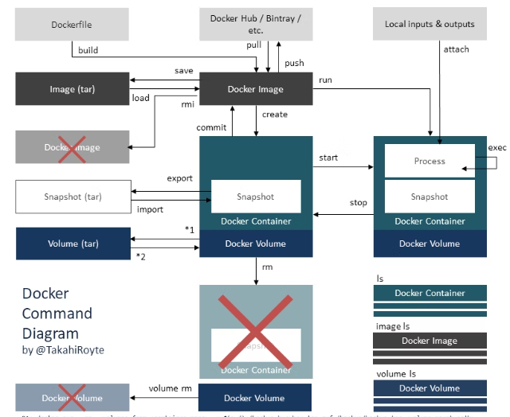

# 環境構築（MacOS）
## Dockerとは
コンテナ型アプリケーション実行環境。  
DockerではIaC(ミドルウェアのインストールや各種環境設定をコード化して管理すること)が可能。  
別環境でも容易に立ち上げることが可能なので、スクラップ・ビルドが容易で開発速度を高めることができる。

## インストール
[Dockerのインストール](https://style.potepan.com/articles/34060.html#Docker_Visual_Studio_Code)こちらを参考にした

[Docker公式サイト](https://docs.docker.com/desktop/install/mac-install/)からダウンロードする。  
MACOSの場合、CPUがIntelチップかM1チップで選択が異なる。  
PCの🍎マークから「このマックについて」を選択。プロセッサに「Intel」や「M1」の記載から判断する。自分のPCはM1なのでM1をDL
パスワードなどを入力して、上部にDockerのアイコンが表示されたら成功


## Dockerのライフサイクル



## コマンド
### DockerFileからDockerImageを作成
> docker build -t [IMAGE_NAME]:[IMAGE_VER] .

- .はDockerFileの位置を示しており、カレントディレクトリにあるDockerが対象になる


### DockerImageからコンテナ起動
> docker run --name [CONTAINER_NAME] -it [IMAGE_TAG]:[IMAGE_VER]

- `-it`はコンテナ起動後にコンテナに入るためのコマンド
- `--name`でコンテナの名称を決める

#### コンテナとホストのポートマッピング
> docker run --name [CONTAINER_NAME] -it [IMAGE_TAG]:[IMAGE_VER] -p [HOST_PORT]:[CONTAINER_PORT]

- `-p`でポートのマッピング設定が可能

HOST_PORTにホストで受け付けるポート番号を設定し、CONTAINER＿PORTにはアプリケーションで設定したポート番号を設定する。ss

#### コンテナからホストマシンにアクセスする
[Docker コンテナ内からホストのポートにアクセスする方法](https://gotohayato.com/content/561/)を参考にした。

> docker run --name [CONTAINER_NAME] -it [IMAGE_TAG]:[IMAGE_VER] --add-host=host.docker.internal:host-gateway

- `:host-gateway`は変更不可だが、`host.docker.internal`の部分は、変更可能

コンテナ内部から`http://host.docker.internalを指定することで、localhostを指し示すのと同じになる。


### 状況確認
Docker Imageの確認
> docker images

Docker Containerの確認
> docker ps -a

Docker Cacheの確認
> docker system df  

### 資材削除
Docker Imageの削除
> docker rmi [ImageID]

Docker Containerの削除
> docker rm [ContainerID]

Docker Cacheの削除
> docker builder prune 

## DockerFIle
Docker Imageを作成するためのコマンドで、ベースイメージを決めて、そのイメージをBuildして実行するコマンドを設定する。

簡単なDocker Fileの例

```
FROM maven:3.6.3-jdk-11 AS builder
WORKDIR /tmp
COPY ./src ./src
COPY ./pom.xml .
RUN mvn package
FROM adoptopenjdk/openjdk11:debianslim-jre
COPY --from=builder /tmp/target/app.jar /app/app.jar
EXPOSE 8080
ENTRYPOINT ["java", "-jar", "/app/app.jar"]
```
Dockerfileで利用できる各種コマンドとその説明

| コマンド       | 内容                    |
|------------|-----------------------|
| FROM       | コンテナのベースイメージ          |
| WORKDIR    | 作業を行うディレクトリ           |
| COPY       | ホストからコンテナへのファイルコピー    |
| EXPOSE     | コンテナがListenするポート      |
| RUN        | docker buildに実行するコマンド |
| ENTRYPOINT | docker runに実行するコマンド   |

以下のサイトを参考にJava SpringのHello Worldをdockerコンテナに固めるとイメージが湧く
- [SpringでHelloWorld](https://searchman.info/java_eclipse/1130.html)
- [SpringをDockerImageに固める](https://qiita.com/saitoshi/items/a931399e81e63e8e4f1e)
