# MSKのチュートリアル実装(CLI編)
MSKを利用したメッセージの送受信を行うために、MSKのクラスターを作成する。
その後、クラスターに対してキュートなるトピックを作成する。
最後に、EC2上からCLIを利用して、メッセージの送受信を行う。

- [クラスターの作り方](https://docs.aws.amazon.com/ja_jp/msk/latest/developerguide/getting-started.html)

## クラスターの作り方
基本的にMSKはマネージドなkafkaのクラスターを提供するサービスである。
そのため、kafkaのトピック作成やメッセージの送受信、メッセージの中身の確認といった部分のサポートは提供されていない。

MSKのコンソールからクラスターを作成を選択。カスタムを選択する

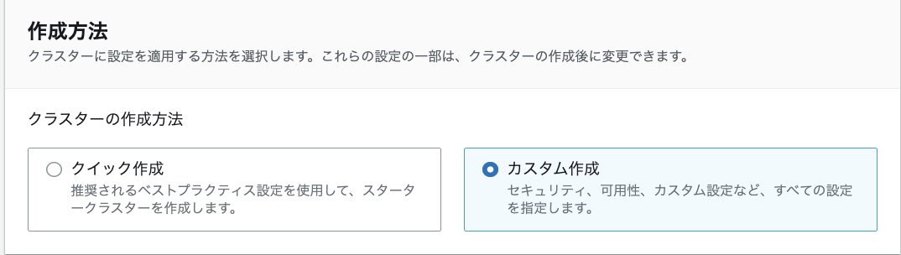

クラスター名を設定する。

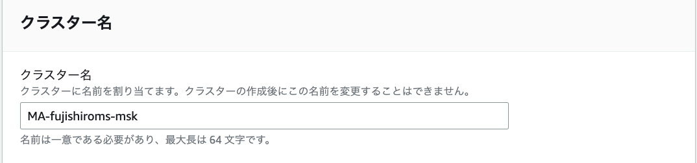

クラスターのタイプはプロビジョンドを利用

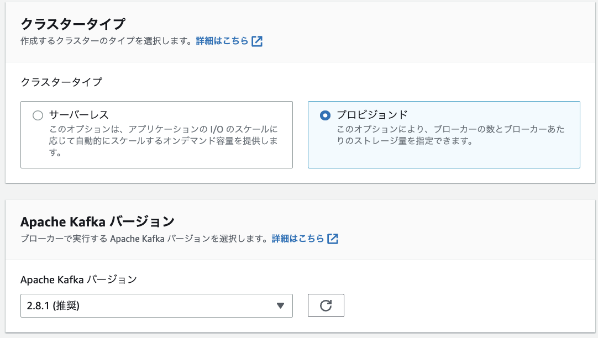


ブローカーのインスタンスのファミリーのタイプを選択を行う。  
ブローカーがどの程度分散されるかなどを設定できるか、AZに分散をするので、この後に設定するネットワークの設定と関連する。

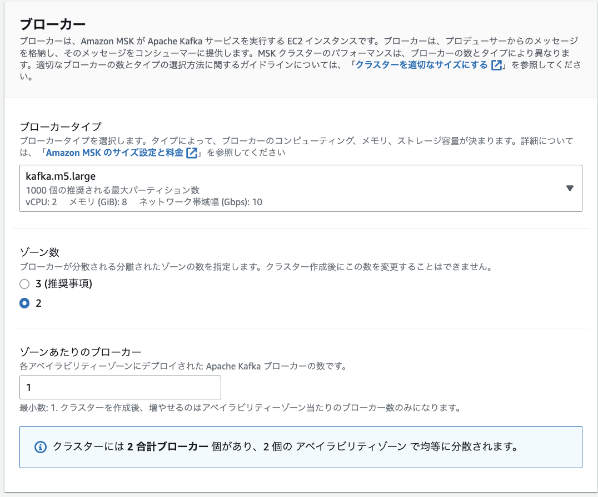

ネットワークの設定を行う。  
事前に設定するVPC、AZ、セキュリティグループを作成しておく。
後ほど、EC2のクライアントと接続できるようにセキュリティグループの設定を行う。

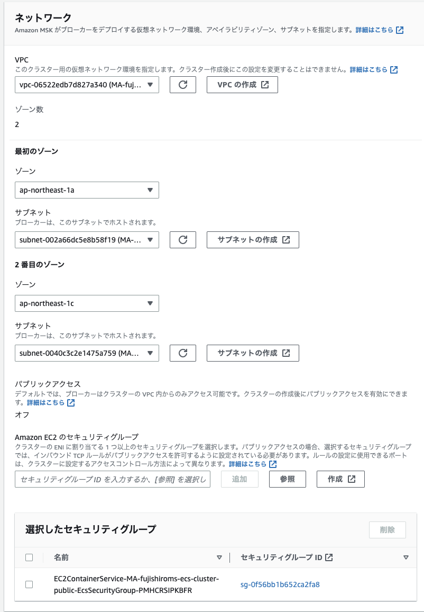

セキュリティの設定を行う。一旦はIAMベースでのセキュリティやメッセージの暗号化について設定しておく

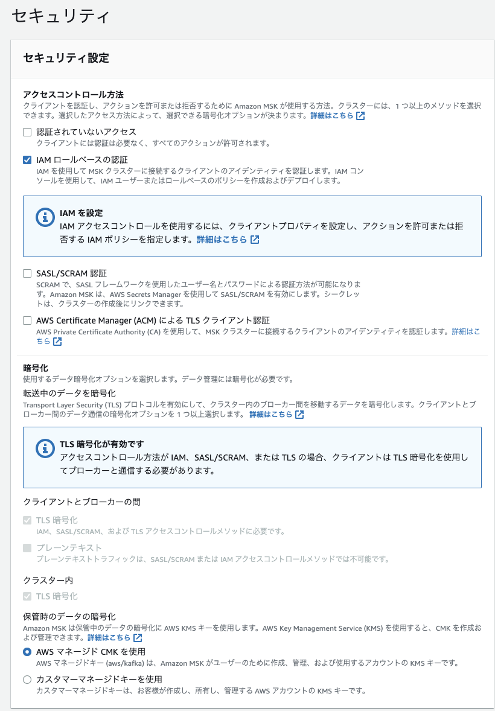

モニタリングの設定をする前にロググループを設定しておく
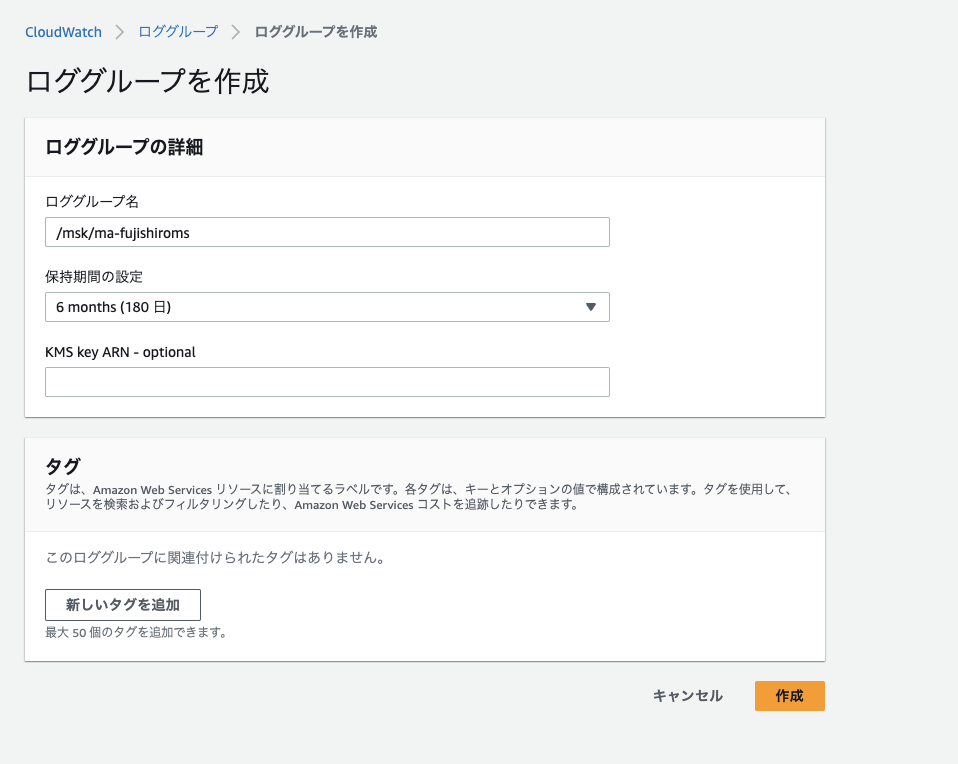

作成したロググループを使って、ログの出力を行う。ログのレベルはDEFAULTでOK

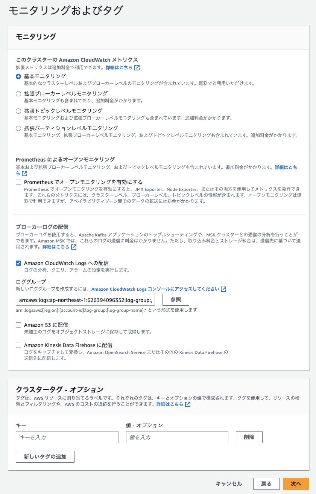

作成後に変更できる項目などの一覧は以下
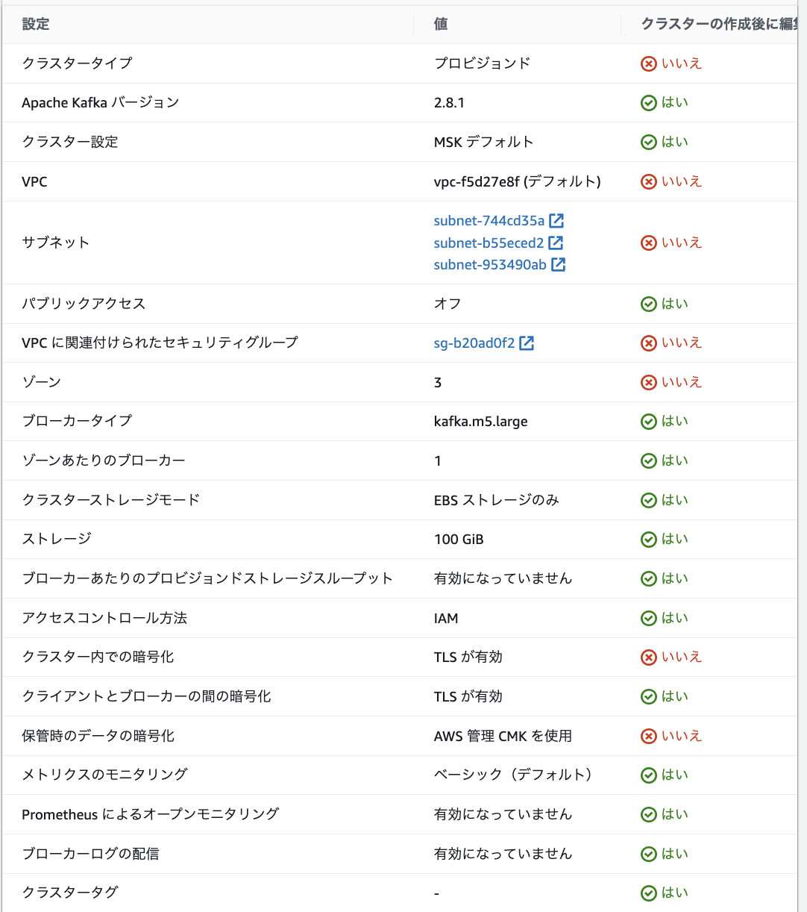

## EC2の作成
### IAM Roleの作成
EC2に付与するMSKにアクセスすることができるポリシー及びロールを作成する

ポリシーを作成して、以下のポリシーに対して3点変更する
- Account-ID
- MSKTutorialCluster
- region
```
{
    "Version": "2012-10-17",
    "Statement": [
        {
            "Effect": "Allow",
            "Action": [
                "kafka-cluster:Connect",
                "kafka-cluster:AlterCluster",
                "kafka-cluster:DescribeCluster"
            ],
            "Resource": [
                "arn:aws:kafka:region:Account-ID:cluster/MSKTutorialCluster/*"
            ]
        },
        {
            "Effect": "Allow",
            "Action": [
                "kafka-cluster:*Topic*",
                "kafka-cluster:WriteData",
                "kafka-cluster:ReadData"
            ],
            "Resource": [
                "arn:aws:kafka:region:Account-ID:topic/MSKTutorialCluster/*"
            ]
        },
        {
            "Effect": "Allow",
            "Action": [
                "kafka-cluster:AlterGroup",
                "kafka-cluster:DescribeGroup"
            ],
            "Resource": [
                "arn:aws:kafka:region:Account-ID:group/MSKTutorialCluster/*"
            ]
        }
    ]
}
```

ロールを作成して、一般的なユースケースで EC2を選択した上で、先ほどのロールに対しても追加する。


### EC2インスタンスの作成
MSKのクライアントをEC2で作成する。
簡単のためにMSKと同じVPC上にEC2を作成する。

名前とインスタンスの設定はデフォルト

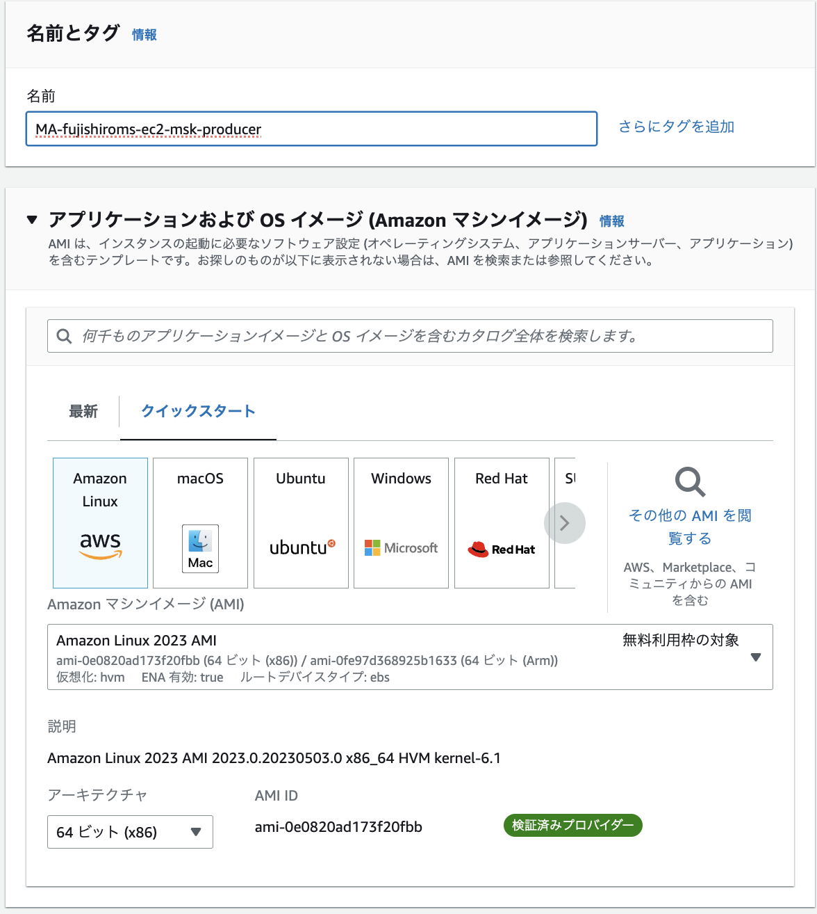

ネットワークの設定はMSKと同じVPC内にEC2を作成する

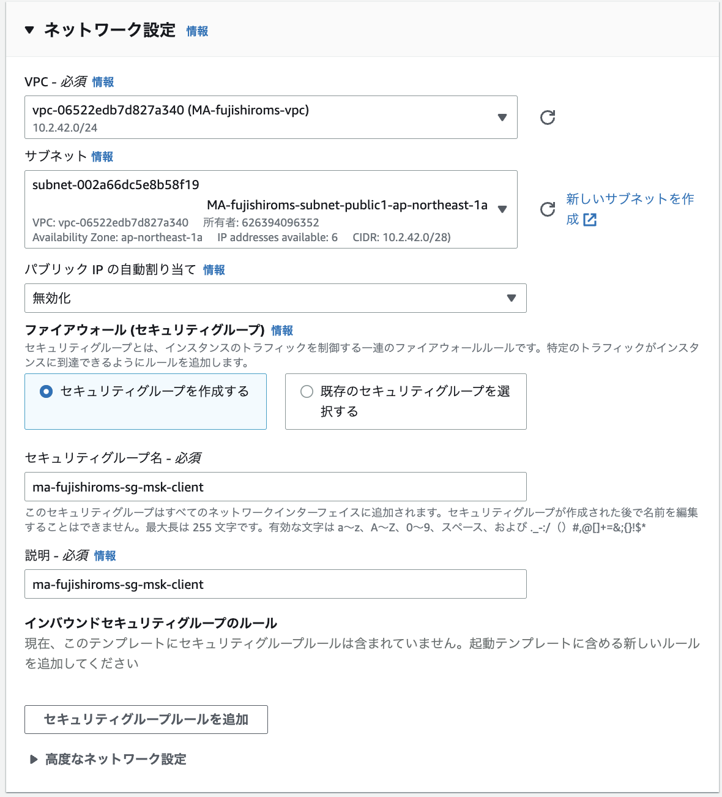

作成が完了したら、セキュリティグループのルールの変更とIAMロールの付与を行う。

まず、セキュリティグループを修正するためVPCのコンソール画面からセキュリティグループの画面に移動する。  
- MSK側のSG  
インバウンドルールを編集して`EC2のSG`からのすべてのトラフィックについて許可する。
- EC2側のSG  
SSHの許可をする。ポート22に対して0.0.0.0/0で許可する。

次に、IAMロールを付与するためにEC2のコンソールからIAM Roleの付与を思う。


## トピックの作り方
EC2からインスタンスを選択して、接続する。

javaのインストール
> sudo yum -y install java-11

kafkaのダウンロードと解凍
> wget https://archive.apache.org/dist/kafka/2.8.1/kafka_2.12-2.8.1.tgz  
> tar -xzf kafka_2.12-2.8.1.tgz

kafka_2.12-2.8.1/libsディレクトリに移動し、次のコマンドを実行して Amazon MSK IAM JAR ファイルをダウンロードします。Amazon MSK IAM JAR により、クライアントマシンはクラスターにアクセスできます。
> wget https://github.com/aws/aws-msk-iam-auth/releases/download/v1.1.1/aws-msk-iam-auth-1.1.1-all.jar

kafka_2.12-2.8.1/bin ディレクトリに移動します。次のプロパティ設定をコピーして、新しいファイルに貼り付けます。ファイルに client.properties という名前を付け、保存します。
```
security.protocol=SASL_SSL
sasl.mechanism=AWS_MSK_IAM
sasl.jaas.config=software.amazon.msk.auth.iam.IAMLoginModule required;
sasl.client.callback.handler.class=software.amazon.msk.auth.iam.IAMClientCallbackHandler
```

以下を実行するとTopicが作成される
```
bin/kafka-topics.sh --create --bootstrap-server BootstrapServerString --command-config bin/client.properties --replication-factor 2 --partitions 1 --topic MSKTutorialTopic
```


## メッセージの送信
```
<path-to-your-kafka-installation>/bin/kafka-console-producer.sh --broker-list BootstrapServerString --producer.config bin/client.properties --topic MSKTutorialTopic
```
コンソールが出力されるのでメッセージを記入
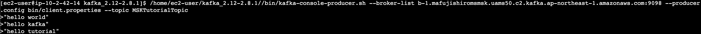

## メッセージの受信
別のEC2を起動し、javaやkafkaのインストールをする。

以下のコマンドを実行すると、producerで送信されたメッセージが受信できる。
```
<path-to-your-kafka-installation>/bin/kafka-console-consumer.sh --bootstrap-server BootstrapServerString --consumer.config bin/client.properties --topic MSKTutorialTopic --from-beginning
```

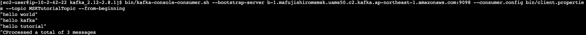


## DLTの設定


# MSKのチュートリアル実装(Lambda編)
# MSKのチュートリアル実装(Java編)