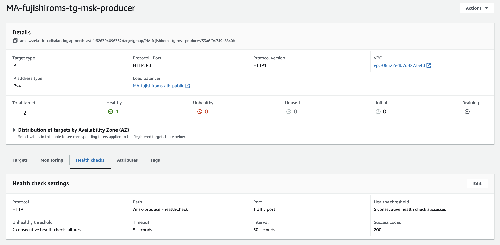

# MSKのチュートリアル実装(CLI編)
MSKを利用したメッセージの送受信を行うために、MSKのクラスターを作成する。
その後、クラスターに対してキュートなるトピックを作成する。
最後に、EC2上からCLIを利用して、メッセージの送受信を行う。

- [クラスターの作り方](https://docs.aws.amazon.com/ja_jp/msk/latest/developerguide/getting-started.html)

## クラスターの作り方
基本的にMSKはマネージドなkafkaのクラスターを提供するサービスである。
そのため、kafkaのトピック作成やメッセージの送受信、メッセージの中身の確認といった部分のサポートは提供されていない。

MSKのコンソールからクラスターを作成を選択。カスタムを選択する


クラスター名を設定する。


クラスターのタイプはプロビジョンドを利用


ブローカーのインスタンスのファミリーのタイプを選択を行う。 (図では大きいファミリーだが小さいのでOK) 
ブローカーがどの程度分散されるかなどを設定できるか、AZに分散をするので、この後に設定するネットワークの設定と関連する。


ネットワークの設定を行う。  
事前に設定するVPC、AZ、セキュリティグループを作成しておく。
後ほど、EC2のクライアントと接続できるようにセキュリティグループの設定を行う。


セキュリティの設定を行う。一旦はIAMベースでのセキュリティやメッセージの暗号化について設定しておく


モニタリングの設定をする前にロググループを設定しておく


作成したロググループを使って、ログの出力を行う。ログのレベルはDEFAULTでOK


作成後に変更できる項目などの一覧は以下


## EC2の作成
### IAM Roleの作成
EC2に付与するMSKにアクセスすることができるポリシー及びロールを作成する

ポリシーを作成して、以下のポリシーに対して3点変更する
- Account-ID
- MSKTutorialCluster
- region
```
{
    "Version": "2012-10-17",
    "Statement": [
        {
            "Effect": "Allow",
            "Action": [
                "kafka-cluster:Connect",
                "kafka-cluster:AlterCluster",
                "kafka-cluster:DescribeCluster"
            ],
            "Resource": [
                "arn:aws:kafka:region:Account-ID:cluster/MSKTutorialCluster/*"
            ]
        },
        {
            "Effect": "Allow",
            "Action": [
                "kafka-cluster:*Topic*",
                "kafka-cluster:WriteData",
                "kafka-cluster:ReadData"
            ],
            "Resource": [
                "arn:aws:kafka:region:Account-ID:topic/MSKTutorialCluster/*"
            ]
        },
        {
            "Effect": "Allow",
            "Action": [
                "kafka-cluster:AlterGroup",
                "kafka-cluster:DescribeGroup"
            ],
            "Resource": [
                "arn:aws:kafka:region:Account-ID:group/MSKTutorialCluster/*"
            ]
        }
    ]
}
```

### EC2インスタンスの作成
MSKのクライアントをEC2で作成する。
簡単のためにMSKと同じVPC上にEC2を作成する。

名前とインスタンスの設定はデフォルト


ネットワークの設定はMSKと同じVPC内にEC2を作成する


作成が完了したら、セキュリティグループのルールの変更とIAMロールの付与を行う。

まず、セキュリティグループを修正するためVPCのコンソール画面からセキュリティグループの画面に移動する。  
- MSK側のSG  
    インバウンドルールを編集して`EC2のSG`からのすべてのトラフィックについて許可する。
- EC2側のSG  
    SSHの許可をする。ポート22に対してMyIPか3.112.23.0/29(AWSコンソールからの接続用)で許可する。

次に、EC2のコンソールから先ほど作成したIAM Roleの付与をする。


## トピックの作り方
EC2からインスタンスを選択して、接続する。

javaのインストール
> sudo yum -y install java-11

kafkaのダウンロードと解凍
> wget https://archive.apache.org/dist/kafka/2.8.1/kafka_2.12-2.8.1.tgz  
> tar -xzf kafka_2.12-2.8.1.tgz

kafka_2.12-2.8.1/libsディレクトリに移動し、次のコマンドを実行して Amazon MSK IAM JAR ファイルをダウンロードします。Amazon MSK IAM JAR により、クライアントマシンはクラスターにアクセスできます。
> wget https://github.com/aws/aws-msk-iam-auth/releases/download/v1.1.1/aws-msk-iam-auth-1.1.1-all.jar

kafka_2.12-2.8.1/bin ディレクトリに移動します。次のプロパティ設定をコピーして、新しいファイルに貼り付けます。ファイルに client.properties という名前を付け、保存します。
```
security.protocol=SASL_SSL
sasl.mechanism=AWS_MSK_IAM
sasl.jaas.config=software.amazon.msk.auth.iam.IAMLoginModule required;
sasl.client.callback.handler.class=software.amazon.msk.auth.iam.IAMClientCallbackHandler
```

これらの設定の詳細を解説しておくと
- security.protocol=SASL_SSL  
    クライアントとKafkaサーバー間の通信プロトコルを設定している（SASLを使用したSSLを指定）
- sasl.mechanism=AWS_MSK_IAM  
    SASL認証をどの方法を利用するかで、MSKのIAM認証を利用
- sasl.jaas.config=software.amazon.msk.auth.iam.IAMLoginModule required;  
    JAAS(Java Authentication and Authorization Service)の設定で、IAMを利用することを指定
- sasl.client.callback.handler.class=software.amazon.msk.auth.iam.IAMClientCallbackHandler  
    Callbackに関する設定


以下を実行するとTopicが作成される
```
bin/kafka-topics.sh --create --bootstrap-server BootstrapServerString --command-config bin/client.properties --replication-factor 2 --partitions 1 --topic MSKTutorialTopic
```


## メッセージの送信
```
<path-to-your-kafka-installation>/bin/kafka-console-producer.sh --broker-list BootstrapServerString --producer.config bin/client.properties --topic MSKTutorialTopic
```
コンソールが出力されるのでメッセージを記入


## メッセージの受信
別のEC2を起動し、javaやkafkaのインストールをする。

以下のコマンドを実行すると、producerで送信されたメッセージが受信できる。
```
<path-to-your-kafka-installation>/bin/kafka-console-consumer.sh --bootstrap-server BootstrapServerString --consumer.config bin/client.properties --topic MSKTutorialTopic --from-beginning
```


## その他操作
Topic一覧表示
```
bin/kafka-topics.sh --list --zookeeper [ZookeeperServerString]
```

Topicの削除
```
bin/kafka-topics.sh --delete --zookeeper [ZookeeperServerString] --topic [TopicName]
```


# MSKの開発環境の構築
## ProducerのCICD
MSKは依存関係などが重くなることが見込まれるので、ECS上に構築することにする。
[SQSのConsumer](https://misakifujishiro.github.io/mylogs/HandsOn/SQS.html#id12)と同様の手順で構築する

## ConsumerのCICD
基本的には[SQSのConsumer](https://misakifujishiro.github.io/mylogs/HandsOn/SQS.html#id12)と同様

- Spring側でapplication.ymlを作成してportを8081に変更する
- DockerFileをmskに変えて、Portも8081とする


# MSKのチュートリアル実装(Java編)
## Producerの設定
### pomの設定

以下の依存関係を追加する
- kafka:kafka-clients  
    Apache KafkaのJavaクライアントライブラリで、ProducerとConsumerを設定するためには必要
- kafka:spring-kafka  
    SpringBootフレームワークが提供するkafkaとの統合をサポートするライブラリで、送受信を行う
- awssdk:kafka  
    AWS SDK for javaの一部で、MSKのクラスタに対するAPIリクエストを行うために利用される
- msk:aws-msk-iam-auth  
    AWS MSK IAM Java Authenticationというライブラリで、MSKへのIAM認証を実施してくれる
- aws-sdk-java  
    springプロジェクトがAWS JAVA SDKを利用してAWSのサービスにアクセスするための依存関係の設定


```
<dependency>
    <groupId>software.amazon.msk</groupId>
    <artifactId>aws-msk-iam-auth</artifactId>
    <version>1.1.0</version>
</dependency>

<dependency>
    <groupId>software.amazon.awssdk</groupId>
    <artifactId>kafka</artifactId>
    <version>2.20.98</version>
</dependency>

<dependency>
    <groupId>org.apache.kafka</groupId>
    <artifactId>kafka-clients</artifactId>
</dependency>

<dependency>
    <groupId>org.springframework.kafka</groupId>
    <artifactId>spring-kafka</artifactId>
</dependency>

<!-- https://mvnrepository.com/artifact/software.amazon.awssdk/aws-sdk-java -->
<dependency>
    <groupId>software.amazon.awssdk</groupId>
    <artifactId>aws-sdk-java</artifactId>
    <version>2.20.98</version>
    <scope>provided</scope>
</dependency>
```

### application.yml
msk-producerは8082のポートを利用するため、application.yamlで以下を設定する
```
server:
  port: 8082
```


kafkaを利用するための設定を行う。これはcliから実行した時はclient.propertiesに設定してたもの
- producer
    - bootstarap-servers: ブートストラップのエンドポイントを指定する（MSKクラスタより取得）
    - key-serializer: producerがキーを送信する際にバイトに変換するための設定
    - value-serializer: producerが値を送信する際にバイトに変換するための設定
- properties
    - security.protocol: kafkaへの接続に使用するセキュリティプロトコルの設定
    - sasl.mechanism: saslのメカニズム設定で、今回はIAMを利用するための設定が行われている
    - sasl.jaas.config: JAASの設定で、MSKのIAMログインモジュールを利用
    - sasl.client.callback.handler.class: SASLのコールバックを指定する
```
spring:
  kafka:
    producer:
      bootstrap-servers: <YOUR_BOOTSTRAP>
      key-serializer: org.apache.kafka.common.serialization.StringSerializer
      value-serializer: org.apache.kafka.common.serialization.StringSerializer
    properties:
      security.protocol: SASL_SSL
      sasl.mechanism: AWS_MSK_IAM
      sasl.jaas.config: software.amazon.msk.auth.iam.IAMLoginModule required;
      sasl.client.callback.handler.class: software.amazon.msk.auth.iam.IAMClientCallbackHandler
```


### フロントエンドの作成
前提としてalbのパスルーティングを行う際に、`msk-producer*`というパスをルーティングするので、全てのパスはmsk-producerから始まるようにする。
msk-producerにアクセスすると、index.htmlにリダイレクトしてindex.htmlからmessageをmskにpostするという全体像。


以下2つのフロントエンドの実装を行う。  
- ヘルスチェック用のフロント
- 画面を表示して、メッセージをMSKに送信するフロント


■ヘルスチェック用  
TGで設定するALBからのヘルスチェックのエンドポイントとして利用する。
```
@RestController
public class HealthCheckController {
    @GetMapping("/msk-producer-healthCheck")
        public ResponseEntity<String> healthCheck() {
            return ResponseEntity.ok("Healthy");
    }
}
```




■表示する画面のhtml  
src/main/java/resourcesの配下にmsk-producer-index.htmlを作成する
```
<!DOCTYPE html>

<html lang="ja">
<head>
    <title>Send Message</title>
</head>
<body>
<form action="/msk-producer-send" method="post">
    <label for="message">Message:</label><br>
    <input type="text" id="message" name="message"><br>
    <input type="submit" value="Submit">
</form>
</body>
</html>
```

msk-producerへのアクセスをindex.htmlにリダイレクトするためにWebConfig.javaを実装する
```
@Configuration
public class WebConfig implements WebMvcConfigurer {

    @Override
    public void addViewControllers(ViewControllerRegistry registry) {
        registry.addRedirectViewController("/msk-producer", "/msk-producer-index.html");
    }
}
```

### Controller
フロントエンドで受け取ったメッセージをmsk-producer-sendにpostするためのControllerクラスを作成する。

```
@RestController
public class FrontendController {
    private final MessageSender messageSender;

    @Autowired
    public FrontendController(MessageSender messageSender) {
        this.messageSender = messageSender;
    }

    @PostMapping("/msk-producer-send")
    public ResponseEntity<String> sendMessage(@RequestParam("message") String message) {
        messageSender.sendMessage(message);
        return ResponseEntity.ok("Message sent: " + message);
    }
}

```


### MessageSender
メッセージを送るMessageSenderを作成する

spring-kafkaで提供されているKafkaTemplateを利用して、kafkaへの送信をおこなっている
```
@Component
public class MessageSender {
    private final KafkaTemplate<String, String> kafkaTemplate;
    private final String topic;

    @Autowired
    public MessageSender(KafkaTemplate<String, String> kafkaTemplate) {
        this.kafkaTemplate = kafkaTemplate;
        this.topic = "Topic_from_java"; // 送信先のトピック名
    }

    public void sendMessage(String message) {
        kafkaTemplate.send(topic, message);
    }
}
```


## Consumerの設定