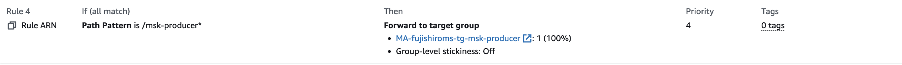
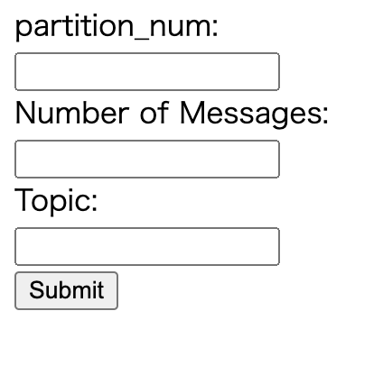
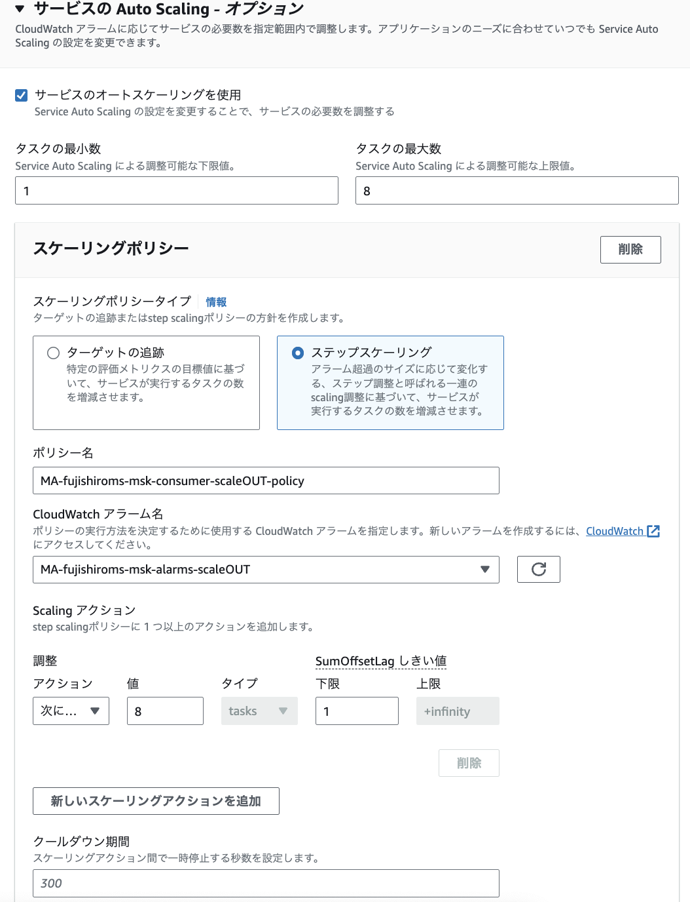

# MSKのチュートリアル実装(CLI編)
MSKを利用したメッセージの送受信を行うために、MSKのクラスターを作成する。
その後、クラスターに対してキュートなるトピックを作成する。
最後に、EC2上からCLIを利用して、メッセージの送受信を行う。

- [クラスターの作り方](https://docs.aws.amazon.com/ja_jp/msk/latest/developerguide/getting-started.html)

## クラスターの作り方
基本的にMSKはマネージドなkafkaのクラスターを提供するサービスである。
そのため、kafkaのトピック作成やメッセージの送受信、メッセージの中身の確認といった部分のサポートは提供されていない。

MSKのコンソールからクラスターを作成を選択。カスタムを選択する


クラスター名を設定する。


クラスターのタイプはプロビジョンドを利用


ブローカーのインスタンスのファミリーのタイプを選択を行う。 (図では大きいファミリーだが小さいのでOK) 
ブローカーがどの程度分散されるかなどを設定できるか、AZに分散をするので、この後に設定するネットワークの設定と関連する。


ネットワークの設定を行う。  
事前に設定するVPC、AZ、セキュリティグループを作成しておく。
後ほど、EC2のクライアントと接続できるようにセキュリティグループの設定を行う。


セキュリティの設定を行う。一旦はIAMベースでのセキュリティやメッセージの暗号化について設定しておく


モニタリングの設定をする前にロググループを設定しておく


作成したロググループを使って、ログの出力を行う。ログのレベルはDEFAULTでOK


作成後に変更できる項目などの一覧は以下


## EC2の作成
### IAM Roleの作成
EC2に付与するMSKにアクセスすることができるポリシー及びロールを作成する

ポリシーを作成して、以下のポリシーに対して3点変更する
- Account-ID
- MSKTutorialCluster
- region
```
{
    "Version": "2012-10-17",
    "Statement": [
        {
            "Effect": "Allow",
            "Action": [
                "kafka-cluster:Connect",
                "kafka-cluster:AlterCluster",
                "kafka-cluster:DescribeCluster"
            ],
            "Resource": [
                "arn:aws:kafka:region:Account-ID:cluster/MSKTutorialCluster/*"
            ]
        },
        {
            "Effect": "Allow",
            "Action": [
                "kafka-cluster:*Topic*",
                "kafka-cluster:WriteData",
                "kafka-cluster:ReadData"
            ],
            "Resource": [
                "arn:aws:kafka:region:Account-ID:topic/MSKTutorialCluster/*"
            ]
        },
        {
            "Effect": "Allow",
            "Action": [
                "kafka-cluster:AlterGroup",
                "kafka-cluster:DescribeGroup"
            ],
            "Resource": [
                "arn:aws:kafka:region:Account-ID:group/MSKTutorialCluster/*"
            ]
        }
    ]
}
```

### EC2インスタンスの作成
MSKのクライアントをEC2で作成する。
簡単のためにMSKと同じVPC上にEC2を作成する。

名前とインスタンスの設定はデフォルト


ネットワークの設定はMSKと同じVPC内にEC2を作成する


作成が完了したら、セキュリティグループのルールの変更とIAMロールの付与を行う。

まず、セキュリティグループを修正するためVPCのコンソール画面からセキュリティグループの画面に移動する。  
- MSK側のSG  
    インバウンドルールを編集して`EC2のSG`からのすべてのトラフィックについて許可する。
- EC2側のSG  
    SSHの許可をする。ポート22に対してMyIPか3.112.23.0/29(AWSコンソールからの接続用)で許可する。

次に、EC2のコンソールから先ほど作成したIAM Roleの付与をする。


## トピックの作り方
EC2からインスタンスを選択して、接続する。

javaのインストール
> sudo yum -y install java-11

kafkaのダウンロードと解凍
> wget https://archive.apache.org/dist/kafka/2.8.1/kafka_2.12-2.8.1.tgz  
> tar -xzf kafka_2.12-2.8.1.tgz

kafka_2.12-2.8.1/libsディレクトリに移動し、次のコマンドを実行して Amazon MSK IAM JAR ファイルをダウンロードします。Amazon MSK IAM JAR により、クライアントマシンはクラスターにアクセスできます。
> wget https://github.com/aws/aws-msk-iam-auth/releases/download/v1.1.1/aws-msk-iam-auth-1.1.1-all.jar

kafka_2.12-2.8.1/bin ディレクトリに移動します。次のプロパティ設定をコピーして、新しいファイルに貼り付けます。ファイルに client.properties という名前を付け、保存します。
```
security.protocol=SASL_SSL
sasl.mechanism=AWS_MSK_IAM
sasl.jaas.config=software.amazon.msk.auth.iam.IAMLoginModule required;
sasl.client.callback.handler.class=software.amazon.msk.auth.iam.IAMClientCallbackHandler
```

これらの設定の詳細を解説しておくと
- security.protocol=SASL_SSL  
    クライアントとKafkaサーバー間の通信プロトコルを設定している（SASLを使用したSSLを指定）
- sasl.mechanism=AWS_MSK_IAM  
    SASL認証をどの方法を利用するかで、MSKのIAM認証を利用
- sasl.jaas.config=software.amazon.msk.auth.iam.IAMLoginModule required;  
    JAAS(Java Authentication and Authorization Service)の設定で、IAMを利用することを指定
- sasl.client.callback.handler.class=software.amazon.msk.auth.iam.IAMClientCallbackHandler  
    Callbackに関する設定


以下を実行するとTopicが作成される
```
bin/kafka-topics.sh --create --bootstrap-server BootstrapServerString --command-config bin/client.properties --replication-factor 2 --partitions 1 --topic MSKTutorialTopic
```


## メッセージの送信
```
<path-to-your-kafka-installation>/bin/kafka-console-producer.sh --broker-list BootstrapServerString --producer.config bin/client.properties --topic MSKTutorialTopic
```
コンソールが出力されるのでメッセージを記入


## メッセージの受信
別のEC2を起動し、javaやkafkaのインストールをする。

以下のコマンドを実行すると、producerで送信されたメッセージが受信できる。
```
<path-to-your-kafka-installation>/bin/kafka-console-consumer.sh --bootstrap-server BootstrapServerString --consumer.config bin/client.properties --topic MSKTutorialTopic --from-beginning
```


## その他操作
Topic一覧表示
```
bin/kafka-topics.sh --list --zookeeper [ZookeeperServerString]
```

Topicの削除
```
bin/kafka-topics.sh --delete --zookeeper [ZookeeperServerString] --topic [TopicName]
```


# MSKの開発環境の構築
## ProducerのCICD
MSKは依存関係などが重くなることが見込まれるので、ECS上に構築することにする。
[SQSのConsumer](https://misakifujishiro.github.io/mylogs/HandsOn/SQS.html#id12)と同様の手順で構築する

## ConsumerのCICD
基本的には[SQSのConsumer](https://misakifujishiro.github.io/mylogs/HandsOn/SQS.html#id12)と同様

- Spring側でapplication.ymlを作成してportを8081に変更する
- DockerFileをmskに変えて、Portも8081とする


# MSKのチュートリアル実装(Java編)
## Producerの設定
### pomの設定

以下の依存関係を追加する
- kafka:kafka-clients  
    Apache KafkaのJavaクライアントライブラリで、ProducerとConsumerを設定するためには必要
- kafka:spring-kafka  
    SpringBootフレームワークが提供するkafkaとの統合をサポートするライブラリで、送受信を行う
- awssdk:kafka  
    AWS SDK for javaの一部で、MSKのクラスタに対するAPIリクエストを行うために利用される
- msk:aws-msk-iam-auth  
    AWS MSK IAM Java Authenticationというライブラリで、MSKへのIAM認証を実施してくれる
- aws-sdk-java  
    springプロジェクトがAWS JAVA SDKを利用してAWSのサービスにアクセスするための依存関係の設定


```
<dependency>
    <groupId>software.amazon.msk</groupId>
    <artifactId>aws-msk-iam-auth</artifactId>
    <version>1.1.0</version>
</dependency>

<dependency>
    <groupId>software.amazon.awssdk</groupId>
    <artifactId>kafka</artifactId>
    <version>2.20.98</version>
</dependency>

<dependency>
    <groupId>org.apache.kafka</groupId>
    <artifactId>kafka-clients</artifactId>
</dependency>

<dependency>
    <groupId>org.springframework.kafka</groupId>
    <artifactId>spring-kafka</artifactId>
</dependency>

<!-- https://mvnrepository.com/artifact/software.amazon.awssdk/aws-sdk-java -->
<dependency>
    <groupId>software.amazon.awssdk</groupId>
    <artifactId>aws-sdk-java</artifactId>
    <version>2.20.98</version>
    <scope>provided</scope>
</dependency>
```

### application.yml
msk-producerは8082のポートを利用するため、application.yamlで以下を設定する
```
server:
  port: 8082
```


kafkaを利用するためにapplication.yamlで以下の設定を行う。これはcliから実行した時はclient.propertiesに設定してたもの
- producer
    - bootstarap-servers: ブートストラップのエンドポイントを指定する（MSKクラスタより取得）
    - key-serializer: producerがキーを送信する際にバイトに変換するための設定
    - value-serializer: producerが値を送信する際にバイトに変換するための設定
- properties
    - security.protocol: kafkaへの接続に使用するセキュリティプロトコルの設定
    - sasl.mechanism: saslのメカニズム設定で、今回はIAMを利用するための設定が行われている
    - sasl.jaas.config: JAASの設定で、MSKのIAMログインモジュールを利用
    - sasl.client.callback.handler.class: SASLのコールバックを指定する
```
spring:
  kafka:
    producer:
      bootstrap-servers: <YOUR_BOOTSTRAP>
      key-serializer: org.apache.kafka.common.serialization.StringSerializer
      value-serializer: org.apache.kafka.common.serialization.StringSerializer
    properties:
      security.protocol: SASL_SSL
      sasl.mechanism: AWS_MSK_IAM
      sasl.jaas.config: software.amazon.msk.auth.iam.IAMLoginModule required;
      sasl.client.callback.handler.class: software.amazon.msk.auth.iam.IAMClientCallbackHandler
```


### フロントエンドの作成
前提としてalbのパスルーティングを行う際に、`msk-producer*`というパスをルーティングするので、全てのパスはmsk-producerから始まるようにする。
msk-producerにアクセスすると、index.htmlにリダイレクトしてindex.htmlからmessageをmskにpostするという全体像。




以下2つのフロントエンドの実装を行う。  
- ヘルスチェック用のフロント
- 画面を表示して、メッセージをMSKに送信するフロント


■ヘルスチェック用  
TGで設定するALBからのヘルスチェックのエンドポイントとして利用する。
```
@RestController
public class HealthCheckController {
    @GetMapping("/msk-producer-healthCheck")
        public ResponseEntity<String> healthCheck() {
            return ResponseEntity.ok("Healthy");
    }
}
```


■表示する画面のhtml  
src/main/java/resourcesの配下にmsk-producer-index.htmlを作成する
```
<!DOCTYPE html>

<html lang="ja">
<head>
    <title>Send Message</title>
</head>
<body>
<form action="/msk-producer-send" method="post">
    <label for="message">Message:</label><br>
    <input type="text" id="message" name="message"><br>
    <input type="submit" value="Submit">
</form>
</body>
</html>
```

msk-producerへのアクセスをindex.htmlにリダイレクトするためにWebConfig.javaを実装する
```
@Configuration
public class WebConfig implements WebMvcConfigurer {

    @Override
    public void addViewControllers(ViewControllerRegistry registry) {
        registry.addRedirectViewController("/msk-producer", "/msk-producer-index.html");
    }
}
```

### Controller
フロントエンドで受け取ったメッセージをmsk-producer-sendにpostするためのControllerクラスを作成する。

```

@RestController
public class FrontendController {
    private final MessageSender messageSender;

    @Autowired
    public FrontendController(MessageSender messageSender) {
        this.messageSender = messageSender;
    }

    @PostMapping("/msk-producer-send")
    public ResponseEntity<String> sendMessage(@RequestParam("message") int message) {
        if (message <= 0) {
            return ResponseEntity.badRequest().body("Invalid message value. Only positive integers are allowed.");
        }

        messageSender.sendRandomMessages(message);
        return ResponseEntity.ok("Messages sent: " + message);
    }
}

```


### MessageSender
メッセージを送るMessageSenderを作成する

spring-kafkaで提供されているKafkaTemplateを利用して、kafkaへの送信をおこなっている

なぜか、デフォルトで送信すると、一つのpartitionに集中して、メッセージを送ってしまう形になっていたので、明示的にkeyを生成して、送信時に利用している。
```

@Component
public class MessageSender {
    private final KafkaTemplate<String, String> kafkaTemplate;
    private final String topic;

    @Autowired
    public MessageSender(KafkaTemplate<String, String> kafkaTemplate) {
        this.kafkaTemplate = kafkaTemplate;
        this.topic = "Topic_P5"; // 送信先のトピック名
    }

    public void sendMessage(String message) {
        String randomKey = UUID.randomUUID().toString();
        kafkaTemplate.send(topic, randomKey, message);
    }

    public void sendRandomMessages(int num) {
        Random rand = new Random();
        System.out.print(num);
        for (int i = 0; i < num; i++) {
            int randomNum = rand.nextInt(11);
            System.out.print(randomNum);
            String randomKey = UUID.randomUUID().toString();
            kafkaTemplate.send(topic, randomKey, String.valueOf(randomNum));
        }
    }
}
```


## Consumerの設定
### application.yaml
msk-consumerは8081のポートを利用するため、application.yamlで以下を設定する
```
server:
  port: 8081
```

kafkaを利用するためにapplication.yamlで以下の設定を行う。これはcliから実行した時はclient.propertiesに設定してたもの
- producer
    - group-id  
        これはConsumer側で自身が所属するグループを指定するための値。  
        この値を利用することで、Pub-Subモデルのメッセージキューにすることができる。
        - 異なるグループのConsumerはそれぞれ独立して、メッセージをConsumeする。
        - 同じグループのConsumerは、お互いにoffset情報をやり取りして、メッセージが適切に分配されることを保証する
    - auto-offset-reset  
        Consumerが消費者が読み込むべき最初のオフセットをどのように決定するかを指定する。
        - earliest: 最も古いオフセットから読み込むので、全メッセージを消費することになる
        - latest: 最新のオフセットから読み込む、Consumerが起動した時点からTopicに追加されたメッセージを消費する
        - none: Consumerが前回消費した最後のオフセットの次から読み込むが、そのオフセットが存在しない場合、例外がスローされる

- propertiesはProducerと同様

```
spring:
  kafka:
    consumer:
      bootstrap-servers: YOUR_BOOTSTRAP_SERVER
      key-deserializer: org.apache.kafka.common.serialization.StringDeserializer
      value-deserializer: org.apache.kafka.common.serialization.StringDeserializer
      group-id: group_id
      auto-offset-reset: earliest
    properties:
      security.protocol: SASL_SSL
      sasl.mechanism: AWS_MSK_IAM
      sasl.jaas.config: software.amazon.msk.auth.iam.IAMLoginModule required;
      sasl.client.callback.handler.class: software.amazon.msk.auth.iam.IAMClientCallbackHandler
```

### MessageReceiver
以下のMessageReciverクラスを作成する
- @Component  
    Springのコンポーネントスキャンにより、自動的にコンポーネントとして検出され、springによりインスタンスが生成される
- @KafkaLister  
    このメソッドはTopicからのメッセージ受信するためのリスナーメソッドになる
- ConsumerRecord  
    kafkaから受信したメッセージ
```

@Component
public class MessageReceiver {

    @KafkaListener(topics="Topic_from_java")
    public void receiveMessage(ConsumerRecord<String, String> record){
        DateTimeFormatter formatter = DateTimeFormatter.ofPattern("yyyy-MM-dd HH:mm:ss");

        System.out.println("PROCESSING START =======================================================" );

        //処理開始時間の表示
        LocalDateTime now_bf = LocalDateTime.now();
        System.out.println("START TIME：" + formatter.format(now_bf)+" & MESSAGE key： "+record.key());
        System.out.println("START TIME：" + formatter.format(now_bf)+" & MESSAGE Value： "+record.value());
        System.out.println("START TIME：" + formatter.format(now_bf)+" & MESSAGE partition： "+record.partition());
        System.out.println("START TIME：" + formatter.format(now_bf)+" & MESSAGE Offset： "+record.offset());

        int waitTime = Integer.parseInt(record.value()) * 1000;
        System.out.println("wait time: " + waitTime);
        waitInMilliseconds(waitTime);

        //処理完了時間の表示
        LocalDateTime now_af = LocalDateTime.now();
        System.out.println("END TIME： " + formatter.format(now_af) +" & MESSAGE ID： "+record.key());
        System.out.println("PROCESSING END =======================================================" );

    }
    //数字を受け取って、その時間待機するためのメソッド
    private void waitInMilliseconds(int milliseconds) {
        try {
            Thread.sleep(milliseconds);
        } catch (InterruptedException e) {
            Thread.currentThread().interrupt();
            e.printStackTrace();
        }
    }

}

```

これだけで、メッセージを送信すると、Consumerで受信することができる。


### 結果
ALB_URL/msk-producerにアクセスすると以下画面が表示される。



画面から数字を入力すると、Consumer側でその数だけメッセージを受け取ってシリアルに待機することを確認


# MSKのオートスケーリング設定
## 基本方針
- 監視
    CloudWatchで`SumoffsetLag`を監視する。
    (処理済みと未処理のoffsetの差分)
- オートスケール
    - キューが溜まったら、スケールアウトして8台になる
    - 5分間連続でメッセージ数が0になったらスケールインする
- 確認事項
    - 件数と処理数が多い場合に、働かないConsumerが発生して、減り方が漸減する
    - 最初はpartitionに偏りがない
    - 後半にpartitionに偏りが発生する
    - partition数を増やすことで、偏りが減るかを確認する

## 監視設定
メトリクスの各種設定はSQSと同様


スケールアウトの設定


スケールインの設定


## オートスケール設定
基本的にはSQSの設定と同様にする。

スケールアウトの設定



スケールインの設定


## 検証計画
いくつかの観点で検証を行う
### latest
- partitionの数が異なる場合の挙動4パターンに1000件投入
    - partition1
    - partition5
    - partition10
    - partition100
- partitionの数が異なる場合のものをconsumer0台で2週間放置したものに1000件投入
    - partition1
    - partition5
    - partition10
    - partition100
- Partitionの数が5に対して、処理させずに2週間放置して100件入れる  
    全てのPartitionに対して、うまく処理できないのではないかという期待がある。
- Partitionの数が5に対して、1件だけ処理させてから2週間放置して100件入れる  
    処理したpartitionだけが、うまく処理して、他のParitionは処理しなくなるのではないかという期待がある。
- partition5に対して、0件処理で、1日に一度consumerを起動したもの
        Partition数5に対して、処理させずに、2週間放置するが、1日一度起動するので、2週間後も正しく処理できるのではないかという期待がある。

### eariest
- partitionの数が異なる場合の挙動4パターンに1000件投入
    - partition1
    - partition5
    - partition10
    - partition100
- partitionの数が異なる場合のものをconsumer0台で2週間放置したものに1000件投入
    - partition1
    - partition5
    - partition10
    - partition100
- Partitionの数が5に対して、処理させずに2週間放置して100件入れる  
    全てのPartitionに対して、うまく処理できないのではないかという期待がある。
- Partitionの数が5に対して、1件だけ処理させてから2週間放置して100件入れる  
    処理したpartitionだけが、うまく処理して、他のParitionは処理しなくなるのではないかという期待がある。
- partition5に対して、0件処理で、1日に一度consumerを起動したもの
        Partition数5に対して、処理させずに、2週間放置するが、1日一度起動するので、2週間後も正しく処理できるのではないかという期待がある。


## コマンド準備
EC2上から実効するコマンドは以下

```
Topicの一覧表示
kafka_2.12-2.8.1/bin/kafka-topics.sh --list --zookeeper YOUR_ZOOKEEPER_SERVER

Topicの作成
kafka_2.12-2.8.1/bin/kafka-topics.sh --create --bootstrap-server YOUR_BOOTSTRAP_SERVER --command-config kafka_2.12-2.8.1/bin/client.properties --replication-factor 2 --partitions 1 --topic Topic_from_java

Topicの削除
kafka_2.12-2.8.1/bin/kafka-topics.sh --delete --zookeeper YOUR_ZOOKEEPER_SERVER --topic Topic_from_java

TopicのPartition数など確認
kafka_2.12-2.8.1/bin/kafka-topics.sh --describe --zookeeper YOUR_ZOOKEEPER_SERVER --topic Topic_from_java

kafka_2.12-2.8.1/bin/kafka-topics.sh --describe --bootstrap-server YOUR_BOOTSTRAP_SERVER --command-config kafka_2.12-2.8.1/bin/client.properties --topic Topic_from_java


TopicのLagなど確認
kafka_2.12-2.8.1/bin/kafka-consumer-groups.sh --bootstrap-server YOUR_BOOTSTRAP_SERVER --command-config kafka_2.12-2.8.1/bin/client.properties  --group group_id --describe
```

### TopicのLagについて
TopicのLagは時系列で取得できないので、自分で以下のshellを作成して、実行させる

monitor_consumer_group.sh
```

#!/bin/bash

# Check if no arguments were passed
if [ $# -lt 1 ]; then
  echo "Insufficient arguments supplied. Please pass a consumer group id and output file name as arguments."
  exit 1
fi

# Kafkaの接続情報を設定します
BOOTSTRAP_SERVER="b-2.mafujishiromsmsk.2mkkld.c2.kafka.ap-northeast-1.amazonaws.com:9098"
GROUP_ID=$1 # 受け取った引数（コンシューマーグループID）を使用
COMMAND_CONFIG_PATH="kafka_2.12-2.8.1/bin/client.properties"

# 出力するログファイルを設定します
OUTPUT_FILE="$1_consumer_group_offset.log" # 受け取った引数（ファイル名）を使用
while true
do
  # タイムスタンプを取得します
  TIMESTAMP=$(date +"%Y-%m-%d %T")

  # コマンドを実行し、出力を取得します
  OUTPUT=$(kafka_2.12-2.8.1/bin/kafka-consumer-groups.sh --bootstrap-server $BOOTSTRAP_SERVER --command-config $COMMAND_CONFIG_PATH --group $GROUP_ID --describe)

  # タイムスタンプとコマンドの出力をログファイルに書き込みます
  echo -e "$TIMESTAMP\n$OUTPUT\n" >> $OUTPUT_FILE

  # 10秒待機します
  sleep 10
done
```

実行権限付与
```
chmod +x monitor_consumer_group.sh
```

以下を実行
```
./monitor_consumer_group.sh
```

内容は以下を確認
```
less consumer_group_offset.log
```


### EC2には以下のIAMRoleを付与した
コマンドを実行するためには、EC2に適切な権限を付与する必要がある。

MSKに対する基本的な操作の権限
```
{
    "Version": "2012-10-17",
    "Statement": [
        {
            "Effect": "Allow",
            "Action": "kafka-cluster:*",
            "Resource": [
                "arn:aws:kafka:ap-northeast-1:123456789012:cluster/YOUR_MSK_SERVER/*",
                "arn:aws:kafka:ap-northeast-1:123456789012:topic/YOUR_MSK_SERVER/*"
            ]
        }
    ]
}
```

ConsumerGroup対する権限
```
{
    "Version": "2012-10-17",
    "Statement": [
        {
            "Effect": "Allow",
            "Action": [
                "kafka-cluster:*"
            ],
            "Resource": [
                "arn:aws:kafka:ap-northeast-1:123456789012:cluster/YOUR_MSK_SERVER/*"
            ]
        },
        {
            "Effect": "Allow",
            "Action": [
                "kafka-cluster:*Group*"
            ],
            "Resource": [
                "arn:aws:kafka:ap-northeast-1:123456789012:group/YOUR_MSK_SERVER/*"
            ]
        }
    ]
}
```


### トピック作成
Topicは以下の6つを作成
- Topic_from_java  
    Partitionの数が1つ
- Topic_P5  
    Partitionの数が5でConsumerの数と同じ
- Topic_P10  
    Partitionの数が10でConsumerの数より多い
- Topic_P100  
    Partitionの数が100でConsumerの数より大分多い
- Topic_P5_zero  
    Partitionの数が5に対して、処理させずに2週間放置して100件入れる  
- Topic_P5_one
    Partitionの数が5に対して、1件だけ処理させてから2週間放置して100件入れる  
- Topic_P5_up  
    Partitionの数が5に対して、1日一度Consumerが起動する


## partitionの数が異なる場合の挙動4パターンに1000件投入
### partitionが1でscaleoutする場合
この場合は、処理が適切に行われなかった。そのため、一旦検証対象から除く。

問題概要  
```
consumer-Aはメッセージをまとめて全部受け取り、処理をしている。
しかし、MSK側へのコミットへの返却はある程度まとめて行っている。
結果として１３件目まではコミットできている。
ただし、14件目移行をconsumer-Aが処理している間に、consumer-Bも14件目以降を取得してしまい、どちらも正しくMSKにコミットすることができていないか。
```
- consumer-Aは常時起動のconsumer
- producerから100件のメッセージを送信
- consumer-Aのログを見ていると、順調に処理
- consumer-Aは100件全ての処理を完了したログが出る


- consumer-Aが13件目を処理したあたりで、ECSがオートスケールを開始

- 13件目以降もconsume-Aはcommit successのログを出力し、100件しょり


- しかし、13件目以降はmsk側でコミットを受け取れていないらしく、sumoffsetlagは87のまま


- またオートスケーリングで起動したconsumer-Bが14件目からのメッセージを処理するようになっている


- 結果として、ログにはconsumer-Aとconsumer-B両方のcommit successのログが出るが、MSK側では認識されない


### partitionが5でscaleout台数と同じ場合


### partitionが10でscaleout台数より多い場合


### partitionが100でscaleout台数よりとても多い場合


## partitionの数が異なる場合のものをconsumer0台で2週間放置したものに1000件投入

### partitionが5でscaleout台数と同じ場合

### partitionが10でscaleout台数より多い場合

### partitionが100でscaleout台数よりとても多い場合


## 1000件投入したpartition5に対して1日に一度consumerを起動し、10分後に停止したもの

## partition100に対して、10件投入したものに2週間後に1000を投入


## トラブルシューティング
### オートスケールすると、処理がループする
コミットがされないので、処理がループしてしまっている。
同じ処理が終わったのに、別のConsumerでまた処理されている。

以下のように、partition一つに対して二つのconsumerが紐づいていたりする。


関連性があるかはわかないが、Consumerが追加されたタイミングでリバランス（partitionとconsumerの割り振り）している間にcommitをしようとしてエラーになっている。
これの影響で、offsetがおかしくなっているのでは？

```
2023-07-22 09:52:30.444,Caused by: org.apache.kafka.clients.consumer.CommitFailedException: Offset commit cannot be completed since the consumer is not part of an active group for auto partition assignment; it is likely that the consumer was kicked out of the group.,ecs/MA-fujishiroms-container-msk-consumer/7ea6c17e42934381bd5c59d52e0fc2e2
```