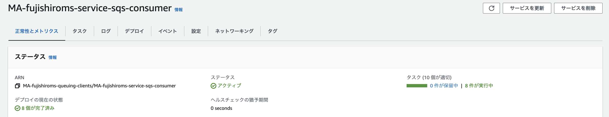

# SQSのチュートリアル実装(CLI編)
以下の内容に関して理解するためにチュートリアルを行う
- キューの作り方
- DLTの設定方法
- メッセージの送受信方法

参考にしたサイト
- [CLIで作成・送受信](https://weblabo.oscasierra.net/aws-sqs-tutorial/)


## キューの作り方
SQSのキューの作成方法について整理する
### CLIで作成する場合
まずは、キューが存在するかの確認。以下コマンドで、現在のキューを確認できる。何もない場合は返値なし
```
$ aws sqs list-queues
```

キューの作成はcreate-queueコマンド（以下は標準キューを作成する場合）
```
$ aws sqs create-queue --queue-name [YOUR_QUEUE_NAME]
{
    "QueueUrl": "https://sqs.ap-northeast-1.amazonaws.com/[AWS_ACCOUNT_ID]/[YOUR_QUEUE_NAME]"
}
```
FIFOキューを作成する場合は、キュー名の最後に`.fifo`を追加して、FifoQueue=Trueのオプションを追加する
```
$ aws sqs create-queue --queue-name [YOUR_QUEUE_NAME].fifo --attributes FifoQueue=true
```

改めて、キューの確認を行うと作成したキューが確認できる
```
$ aws sqs list-queues
{
    "QueueUrls": [
        "https://sqs.ap-northeast-1.amazonaws.com/[AWS_ACCOUNT_ID]/[YOUR_QUEUE_NAME]"
    ]
}
```

また、作成したキューについての詳細を`get-queue-attributes`で表示させることができる
```
$ aws sqs get-queue-attributes --attribute-names All --queue-url https://sqs.ap-northeast-1.amazonaws.com/[AWS_ACCOUNT_ID]/[YOUR_QUEUE_NAME] 

{
    "Attributes": {
        "QueueArn": "arn:aws:sqs:ap-northeast-1:[AWS_ACCOUNT_ID]:[YOUR_QUEUE_NAME]",
        "ApproximateNumberOfMessages": "0",
        "ApproximateNumberOfMessagesNotVisible": "0",
        "ApproximateNumberOfMessagesDelayed": "0",
        "CreatedTimestamp": "1683331260",
        "LastModifiedTimestamp": "1683331260",
        "VisibilityTimeout": "30",
        "MaximumMessageSize": "262144",
        "MessageRetentionPeriod": "345600",
        "DelaySeconds": "0",
        "ReceiveMessageWaitTimeSeconds": "0",
        "SqsManagedSseEnabled": "true"
    }
}
```
得られる属性値のうち、キューの状態を表すものは以下
- ApproximateNumberOfMessages  
    未処理のメッセージの数
- ApproximateNumberOfMessagesNotVisible  
    Consumerが取得したが、処理完了していないメッセージ数（処理中のメッセージ数）
- ApproximateNumberOfMessagesDelayed  
    遅延時間が設定されているメッセージ数（Consumer処理可能になるまで待機しているメッセージ数）

得られる属性値のうち、キューの設定値を表すものは以下
- VisibilityTimeout  
    可視性タイムアウト（他のConsumerにメッセージが見えるようになるまでの時間）
- DelaySeconds  
    遅延時間（受信してから、Consumerがメッセージが見えるようになるまでの時間）  
    この遅延時間はキュー全体に対して適用される。
- ReceiveMessageWaitTimeSeconds     
    メッセージがポーリングされる際の最大待機時間
- MessageRetentionPeriod  
    メッセージが保管される期間

コンソールから確認すると以下


### GUIで作成する場合
キュータイプと名前を指定する


キューに対する遅延時間や可視性タイムアウトを設定する


暗号化とアクセスポリシーを設定する


## DLTの設定方法
CLIから作成する場合は、`RedrivePolicy`をオプションとして指定することで作成することができるが、詳細は[公式ドキュメント](https://docs.aws.amazon.com/cli/latest/reference/sqs/create-queue.html)を参照されたい。

コンソール画面からは、キューを作成や更新する際に指定することができる。注意点として、DLQは送信元のキューと同じキュータイプ（標準・FIFO）を設定する必要がある。


最大受信数に設定した回数、、キューが失敗した場合にDLQに送信される。


## メッセージの送受信方法
### CLIで送信
`send-message`を利用してメッセージを送信するとメッセージIDとメッセージのハッシュが返却される
```
aws sqs send-message --queue-url "https://sqs.ap-northeast-1.amazonaws.com/[AWS_ACCOUNT_ID]/[YOUR_QUEUE_NAME]" --message-body "hello world"
{
    "MD5OfMessageBody": "5eb63bbbe01eeed093cb22bb8f5acdc3",
    "MessageId": "1db7869e-5ca0-4e97-810c-bb7b7b7522bc"
}
```


### コンソールから送信
SQSのコンソールから、キューを選択しメッセージを送受信を選択


メッセージを送信タブから、メッセージ本文を記載して送信する


### 送信の確認
CLIから`ApproximateNumberOfMessages`を確認する
```
$ aws sqs get-queue-attributes --attribute-names ApproximateNumberOfMessages  --queue-url "https://sqs.ap-northeast-1.amazonaws.com/[AWS_ACCOUNT_ID]/[YOUR_QUEUE_NAME]" 
{
    "Attributes": {
        "ApproximateNumberOfMessages": "2"
    }
}
```

もしくは、コンソールから`利用可能なメッセージ`を確認する


### コンソールで受信確認
まず、コンソールからキュー内のメッセージを受信することができる。
注意点は、SQSはメッセージを受信しただけではなく、削除までする必要があるので、このオペレーションを繰り返すと、受信回数が増えてDLQに移動してしまうこと。

SQSのコンソールから、キューを選択しメッセージを送受信を選択


メッセージを受信タブから、メッセージをポーリングする


ポーリングの結果得られたメッセージを押下すると、本文などが確認できる。


ポーリングをDLQで設定した回数分行うとDLQに移動する


### CLIでメッセージ受信と削除
次に、メッセージをコンソールから受信し、その上で削除を行う。

メッセージの受信は`receive-message`を利用する。メッセージは複数格納されていても、1つのメッセージだけが受信される
```
$ aws sqs receive-message --queue-url "https://sqs.ap-northeast-1.amazonaws.com/[AWS_ACCOUNT_ID]/[YOUR_QUEUE_NAME]" 
{
    "Messages": [
        {
            "MessageId": "698a7959-7d80-4125-9ccf-2a1a52334606",
            "ReceiptHandle": "AQEBQfRoUCKb74uFFlmZT~~~~",
            "MD5OfBody": "11b1d675d840f10f85fed95d4af7264a",
            "Body": "message_from_console1"
        }
    ]
}
```

SQSではメッセージの処理が完了したら、明示的にメッセージの削除を行う必要がある。
メッセージの削除は`delete-message`を利用する。また、メッセージを指定するために受信した際に受け取った`ReceiptHandle"を指定して削除するメッセージを決める
```
$ aws sqs delete-message --queue-url "https://sqs.ap-northeast-1.amazonaws.com/[AWS_ACCOUNT_ID]/[YOUR_QUEUE_NAME]" --receipt-handle "AQEBQfRoUCKb74uFFlmZT~~~~"
```

削除されたことで、メッセージキューにも、DLQにもメッセージが存在しないことが確認できる。


# SQSの開発環境構築

## ProducerのEC2の作成
基本的にはデフォルトでEC2を作成。

IAMについては以下のポリシーを持つIAMポリシーを作成しておき付与する
```
{
    "Version": "2012-10-17",
    "Statement": [
        {
            "Sid": "VisualEditor0",
            "Effect": "Allow",
            "Action": [
                "sqs:DeleteMessage",
                "sqs:ReceiveMessage",
                "sqs:SendMessage"
            ],
            "Resource": "arn:aws:sqs:ap-northeast-1:[アカウントID]:[SQS_NAME]"
        }
    ]
}

```

## ProducerのCICD
Producer側はバッチで処理を流すので、CodeDeployでEC2上にjarファイルをデプロイする
1. [IntelliJとGithubを連携](https://misakifujishiro.github.io/mylogs/Java/intelliJ.html#intellijgithub)
2. [GithubとCodeCommitのミラーリング](https://misakifujishiro.github.io/mylogs/AWS/CodeSeries.html#code-commit)
3. CodeDeoloyの準備
3. CodeDeployの設定
4. CodePipelineの作成


### CodeDeployの準備
- appspec.ymlをJava PJのルートディレクトリに配置する

```
version: 0.0
os: linux
files:
  - source: target/sqs_producer-0.0.1-SNAPSHOT.jar
    destination: /home/ec2-user/
permissions:
  - object: /home/ec2-user/sqs_producer-0.0.1-SNAPSHOT.jar
    mode: 755
```

- EC2にcodedeployエージェントをインストール
```
sudo yum -y update
sudo yum install -y ruby
sudo yum install -y aws-cli
wget https://aws-codedeploy-ap-northeast-1.s3.ap-northeast-1.amazonaws.com/latest/install
chmod +x ./install
sudo ./install auto
```

- EC2に必要なポリシーを追加  
`AmazonEC2RoleforAWSCodeDeploy`のポリシーをEC2に付与したRoleに追加


- CodeDeployのIAM Roleの作成  
Roleを作成する際にCodeDeployを選択する


### CodeDeployの設定
- Code Deployのコンソール画面>アプリケーション>アプリケーションの作成
    - アプリケーション名を入力
    - コンピューティングプラットフォームに'EC2'を選択


- アプリケーションが作成できたら、そのままデプロイグループを作成する
    - デプロイグループの名前を入力
    - サービスロールは事前に作成したもの
    

    - デプロイのグループはキーを利用するのでデプロイ先のEC2のタグを指定する
    

    - DodeDeployエージェントのインストールは完了しているので、対応なし
    


### CodePipelineの作成
- Pipelineの作成
    - パイプライン名を入力
    - サービスロールは新規で作成する
    
- ソースプロバイダーは事前作成したCodeCommit
- ビルドステージはスキップ
- デプロイステージは事前に作成したCodeDeploy


## ConsumerのECSデプロイとCICD
Consumerは最終的にオートスケーリングを行うことを考えて、ECSでのデプロイを目指す。
1. [IntelliJとGithubを連携](https://misakifujishiro.github.io/mylogs/Java/intelliJ.html#intellijgithub)
2. [GithubとCodeCommitのミラーリング](https://misakifujishiro.github.io/mylogs/AWS/CodeSeries.html#code-commit)
3. DockerFileの作成
4. ECRの設定
5. buildspec.ymlの作成
6. CodeBuildの設定
7. ECSの設定
8. Pipelineの作成(Deployまで)


### Dockerfileの作成
javaの環境構築済みのコンテナを起動し、githubからspringプロジェクトをcloneして、コンテナを起動する。
```
# Docker Imageとしてadoptopenjdk11を使用
FROM adoptopenjdk:11-jdk-hotspot

# git などのインストール
RUN apt-get update && apt-get install -y \
       wget tar iproute2 git

# mavenのインストール
RUN apt-get install -y maven

# PJのコピー
RUN git clone https://github.com/[YOUR_GITHUB_URL]

# プロジェクトのビルド
RUN mvn install -DskipTests=true -f /sqs_consumer/pom.xml

# タイムゾーンの変更
RUN ln -sf  /usr/share/zoneinfo/Asia/Tokyo /etc/localtime

# コンテナのポート解放
EXPOSE 8080

# Javaの実行
CMD java -jar sqs_consumer/target/sqs_consumer-0.0.1-SNAPSHOT.jar

```

試しに以下のコマンドでカレントディレクトリのDockerfileを利用したdocker imageが作成されるか確認する
```
sudo docker built -t [YOUR_IMAGE_TAG] .
```

### ECRの設定
パブリックで、ECRを作成しておく。


### Buildspec.ymlの作成
codeBuildで作成したDockerFileを利用してDockerImageを作成し、そのDocker ImageをECRへpushするように設定する

```
version: 0.2

phases:
  pre_build:
    commands:
      - echo Logging in to Amazon ECR...
      - $(aws ecr get-login --no-include-email --region ap-northeast-1)
      - echo ${DOCKER_USER}
      - echo ${DOCKER_PASS} | docker login -u ${DOCKER_USER} --password-stdin
      - AWS_ACCOUNT_ID=$(echo ${CODEBUILD_BUILD_ARN} | cut -f 5 -d :)
      - REPOSITORY_URL=${AWS_ACCOUNT_ID}.dkr.ecr.ap-northeast-1.amazonaws.com/ma-fujishiroms-sqs-consumer
      - IMAGE_TAG=$(echo ${CODEBUILD_RESOLVED_SOURCE_VERSION} | cut -c 1-7)

  build:
    commands:
      - echo Building the Docker image on `date`
      - docker build --no-cache -t ma-fujishiroms-sqs-consumer:${IMAGE_TAG} .
      - docker tag ma-fujishiroms-sqs-consumer:${IMAGE_TAG} ${REPOSITORY_URL}:${IMAGE_TAG}
  post_build:
    commands:
      - echo Pushing the Docker image on `date`
      - docker push ${REPOSITORY_URL}:${IMAGE_TAG}
      - printf '[{"name":"MA-fujishiroms-container-sqs-consumer","imageUri":"%s"}]' $REPOSITORY_URL:$IMAGE_TAG > imagedefinitions.json
artifacts:
  files: imagedefinitions.json
```

Dockerを利用する際に、AWSで共通のアカウントを利用している関係で、[ログイン回数の制限](https://dev.classmethod.jp/articles/codebuild-has-to-use-dockerhub-login-to-avoid-ip-gacha/)が発生してエラーが発生する可能性がある。

そのために、pre buildでdockerへのログインを行う。  
以下のCodeBuildを作成する際にbuildステージで環境変数にDOCKER_USERとDOCKER_PASSを登録しておく。


### CodeBuildの設定
CodeBuildを設定することで、buildspec.ymlが実行され、gitlabにコミットすると、Docker ImageがECRにPushされるようになる。

CodeBuildのコンソールからビルドプロジェクトを作成開始
- PJ名の入力


- ソースはCodeCommitのmainブランチ（ここのルートのbuildspecを見る）


- 環境を設定する
- dockerを利用する場合は特権付与にチェックを入れる
- サービスロールは新規で作成するが、後ほどECRへの権限を付与する


- buidspec.ymlがルートディレクトリにある場合はデフォルトでOK


- IAM Roleは新規作成した後に`AmazonEC2ContainerRegistryPowerUser`を付与する


この時点でCodeBuildまでのCodePipelineを作成すると、ECRへのpushが行われる


buildspecで設定した通り、イメージタグにIDが振られている(Latestにならない)


### ECSの設定
#### タスクのIAM準備
事前に付与するIAM Roleを作成しておく。以下を付与する
- AmazonECSTaskExecutionRolePolicy
- タスクがアクセスするリソースへの許可  
    sqsやmskにアクセスするので、それに必要なポリシーを付与する（EC2で作成したpolicyと同じもので良い
```
{
    "Version": "2012-10-17",
    "Statement": [
        {
            "Sid": "VisualEditor0",
            "Effect": "Allow",
            "Action": [
                "sqs:DeleteMessage",
                "sqs:ReceiveMessage",
                "sqs:SendMessage"
            ],
            "Resource": "arn:aws:sqs:ap-northeast-1:[アカウントID]:[SQS_NAME]"
        }
    ]
}

```

#### タスク定義の設定
今回はFargateで設定するため、ネットワークモードがawsvpcになっており、ホストポートを設定しない。


#### サービスの設定
今回はFargateで作成するので起動タイプをFargateとする。
作成したタスク定義を指定することで、起動時のコンテナの設定を行う。


ネットワークモードとして、VPCやサブネットを選択する。
設定するセキュリティグループの注意点として、コンテナポートに接続できるように設定を行う。（今回は8080にアクセスできるようにインバウンドルールを修正しておく）


ロードバランサーの設定はサービスを作成する際にしか設定できない点に注意。

今回は動作確認用に事前に作成したALBを指定する。
ロードバランス用のコンテナとして、TGの作成などをこの場で設定することができる。
こちらで設定すれば、TGの作成およびTGとALBの紐付けを行うことができる。


### CodeDeployの設定
CodePipelineを修正し、Deployステージを設定する。

まず、Code Buildのステージで出力アーティファクトを追加する。


次に、Deployステージを追加し、入力アーティファクトにBuildの出力ステージを追加し、対象となるクラスターやサービス名を指定する。

この設定を行うことで、gitlabの修正から、ECRへのpush、ECSのデプロイを自動化することができる。


無事ECSが起動できたら、ALBのDNSの後ろに`/sqs-consumer`でアクセスして文字列が表示されるか確認する。


# SQSのチュートリアル実装(Java編)
参考サイト
- [JavaからAmazon SQSのメッセージ送受信を行う](https://www.stsd.co.jp/dev-blog/send_and_receive_amazon_sqs_messages_from_java.html)
- [JavaでAmazon SQSのメッセージを送受信するチュートリアル](https://weblabo.oscasierra.net/aws-sqs-tutorial-java-1/)


## SQSの作成
SQSは前資料で作成した標準キューを再利用する


## Javaのプログラム作成（Producer
JavaからSQSへのアクセスには、AWS公式のライブラリ`aws-java-sdk-sqs`を利用することとする。pomに以下を追加する。

pom.xml
```
<dependency>
  <groupId>com.amazonaws</groupId>
  <artifactId>aws-java-sdk-sqs</artifactId>
  <version>1.12.116</version>
</dependency>
```

### config
src/main/javaにconfigのディレクトリを作成して、`sqsConfig`を作成する

- @configurationクラスの宣言  
設定クラスであることを宣言し、SpringにConfigクラスと認識させる。このクラスの配下では@Beanを付与することで対象クラスの返り値のオブジェクトをSpringの管理下に置かれ、他のクラスからはAmazonSQSクライアントを新規作成するのではなく、このAmazonSQSを呼び出すことで利用することができる。  
今回はSQSクライアントというサードパーティのメソッドで作成されるオブジェクトを管理したいので設定クラスで定義する。

- AmaozonSQSClientBuilder  
SQSのデフォルトのクライアントインスタンスを作成している。  
一旦デフォルト値を使用して、SQSのクライアントに対して、認証情報やリージョンの情報を渡している。メッセージに関する詳細なやりとりに関しては別で実装する。
```
package com.msa.aws.sqs.sqs_producer.config;

import com.amazonaws.services.sqs.AmazonSQS;
import com.amazonaws.services.sqs.AmazonSQSClientBuilder;
import org.springframework.context.annotation.Bean;
import org.springframework.context.annotation.Configuration;

@Configuration
public class sqsConfig {
    @Bean
    public AmazonSQS amazonSQSClient(){
        return AmazonSQSClientBuilder.defaultClient();
    }
}
```


### MessageSender
src/main/javaにMessageSenderクラスを作成する  
このクラスでは、SQSへメッセージを送信するメソッドを定義する。

- @Componentクラスの宣言  
今回は、自分で作成するクラスを他のクラスでも呼び出し、依存性の注入を行いたいので@componentで宣言する。

- @Autowiredによる依存性注入  
@Autowiredを利用して、設定クラスで宣言したSQSClientを呼び出している。

- メッセージ送信メソッド  
    - メッセージ詳細  
    ランダムに数字を生成して、文字列に変換している
    - SQSのメッセージ送信リクエストを作成
        - withDelaySecondsは、送信してからConsumerが見えるようになるまでの時間でメッセージごとに設定可能
    - SQSのコンソール画面から設定した、`DelaySeconds`はキュー全体に対する遅延時間。


```
package com.msa.aws.sqs.sqs_producer;

import com.amazonaws.services.sqs.AmazonSQS;
import com.amazonaws.services.sqs.model.SendMessageRequest;
import org.springframework.beans.factory.annotation.Autowired;
import org.springframework.stereotype.Component;

@Component
public class MessageSender {

    @Autowired
    private AmazonSQS amazonSQSClient;

    public void sendMessage(){
        String url = "https://sqs.ap-northeast-1.amazonaws.com/626394096352/MA-fujishiroms-sqs-standard";

        // 送信するデータの作成
        Random rand = new Random();
        int num = rand.nextInt(10) ;
        num = num+1;
        String message = String.valueOf(num);

        SendMessageRequest request = new SendMessageRequest()
                .withQueueUrl(url)
                .withMessageBody(message)
                .withDelaySeconds(5);
        amazonSQSClient.sendMessage(request);
    }
}

```


### main
src/main/javaにSqsProducerApplicationクラスを作成する  
このクラスは、Appのmainクラスであり、jarファイルを実行するとこのクラスのmainが実行される。

処理としては、数字を引数を受け取って、その数だけSQSにメッセージを送信する。引数がなければ10回メッセージを送信する。

- @SpringBootApplication  
    プロジェクト内のクラスを読み込んで、アプリケーションの設定やBeanの設定をする。これによりSpringはDIを行うことができ、各種設定済みのインスタンスを利用することができる
- ApplicationContext  
    Spring Applicationが実行され、contextの中にBeanなどで定義されたインスタンスが格納される。
- context.getBean(MessageSender.class)  
    contextの中にあるBeanをとりだす。MessageSenderは@Componentで定義されているのでcontext内にBeanガ注入されている。
```
package com.msa.aws.sqs.sqs_producer;

import org.springframework.boot.SpringApplication;
import org.springframework.boot.autoconfigure.SpringBootApplication;
import org.springframework.context.ApplicationContext;
//実行時に各種のアノテーションを読み込んで、DIする
@SpringBootApplication
public class SqsProducerApplication {
    //java実行時に最初に呼び出される
    public static void main(String[] args) {
        int executionCount = 10;

        if (args.length>0){
            executionCount = Integer.parseInt(args[0]);
        }
        // SQSProducerApplicationの呼び出されることで@SpringBootApplicationにより作成されたBeanなどがcontextに格納される
        ApplicationContext context = SpringApplication.run(SqsProducerApplication.class, args);
        for (int i = 0; i < executionCount; i++){
            //context内部に管理されているBeanをよびだしている
            MessageSender sender = context.getBean(MessageSender.class);
            sender.sendMessage();
        }
    }

}
```

## EC2からの実行
### jarファイルを移動させる
- キーペアのコピー
    - 作成した、キーペアをworkspacesにコピーしておく（ファイルのコピーはできないので、テキストベースでコピーする。

- 権限付与
```
chmod 600 XXXX.pem 
```

- ファイルコピーコマンド実行
```
scp -i 'EC2秘密鍵' 'ローカルの転送したいファイル' 'EC2ユーザー名@IPアドレス:ファイル配置先 

EX)scp -i .ssh/XXX.pem TEST.txt ec2-user@12.34.567.890:/home/
```


### javaのインストール
EC2にjavaをインストールして、jarファイルを実行する

javaのインストール
```
sudo yum install java-11-amazon-corretto
```

実行
```
java -jar XXX.jar
```

### 結果
Producer側のjarファイルを実行


Consumer側のjarファイルを実行すると、メッセージを取得することができる


CloudWatchでApproximateNumberOfMessagesVisibleを確認するとConsumer側ではメッセージを削除するので、Produceした分増えた後、Consumeした分減る


## Javaのプログラム作成（Consumer
### Config
Producerと同様の設定を行うが、今回は、非同期で、メッセージを処理するため、Asyncのクライアントを作成する  
- amazonSQSAsyncClient  
    非同期でsqsからのメッセージを受信して、処理するメソッド
```
@Configuration
public class sqsConfig {
    @Bean
    public AmazonSQSAsync amazonSQSAsyncClient(){
        return AmazonSQSAsyncClientBuilder.defaultClient();
    }
}
```

### frontend
ECSに載せるための動作確認用とhelthcheck用に文字列を返すページを準備したい。その為のControllerを作成しておく

- @RestController  
    クラスレベルで用いられる。対象クラスがRESTful Webサービスのコントローラーであることを示す。このクラスが付与されているとSpringによってBean管理されて、HTTPリクエストを処理する
- @RequestMapping  
    メソッドレベルで用いられる。指定したパスへのリクエストをfrontend()で処理する。
```
package com.msa.aws.sqs.sqs_consumer;

import org.springframework.web.bind.annotation.RequestMapping;
import org.springframework.web.bind.annotation.RestController;

@RestController
public class frontendController {

    @RequestMapping(value="/sqs-consumer", produces = "text/plain")
    public String frontend(){
        return "Hello sqs-consumer!";
    }
}
```


### MessageReceiver
SQSからメッセージを受信して、処理するクラス。
- MessageReceiver  
    Configクラスで設定したamazonSQSAsyncClientのインスタンスを取得
- ReceiveMessageRequest  
    リクエストの設定。受信数やロングポーリングの時間などを設定
- sqsAsyncClient.receiveMessage  
    非同期でメッセージを受信してメッセージをリストで返却


```
package com.msa.aws.sqs.sqs_consumer;

import com.amazonaws.services.sqs.AmazonSQSAsync;
import com.amazonaws.services.sqs.model.Message;
import com.amazonaws.services.sqs.model.ReceiveMessageRequest;
import org.springframework.beans.factory.annotation.Autowired;
import org.springframework.stereotype.Component;

import java.time.LocalDateTime;
import java.time.format.DateTimeFormatter;
import java.util.List;
@Component
public class MessageReceiver implements Runnable {

    private static final String QUEUE_URL = "https://sqs.ap-northeast-1.amazonaws.com/626394096352/MA-fujishiroms-sqs-standard";
    private static final int MAX_NUMBER_OF_MESSAGES = 10; // 一度に受信する最大メッセージ数
    private static final int WAIT_TIME_SECONDS = 20; // メッセージがない場合のロングポーリング待機時間
    private final AmazonSQSAsync sqsAsyncClient;

    @Autowired
    public MessageReceiver(AmazonSQSAsync sqsAsyncClient) {
        this.sqsAsyncClient = sqsAsyncClient;
    }

    @Override
    public void run() {
        while (true) {
            // 受信用のリクエスト作成
            final ReceiveMessageRequest receiveMessageRequest = new ReceiveMessageRequest(QUEUE_URL)
                    .withMaxNumberOfMessages(MAX_NUMBER_OF_MESSAGES)
                    .withWaitTimeSeconds(WAIT_TIME_SECONDS);

            // 受信リクエストの設定を入力としてSQSからメッセージを受信
            final List<Message> messages = sqsAsyncClient.receiveMessage(receiveMessageRequest).getMessages();


            DateTimeFormatter formatter = DateTimeFormatter.ofPattern("yyyy-MM-dd HH:mm:ss");
            for (final Message message : messages) {
                System.out.println("======================================================= start =======================================================" );

                //処理開始時間の表示
                LocalDateTime now_bf = LocalDateTime.now();
                System.out.println("Received Time: " + formatter.format(now_bf));

                //メッセージ内容の表示
                System.out.println("Message");
                System.out.println("Body:          " + message.getBody());
                //メッセージの処理（今回は待機するだけ）
                int waitTime = Integer.parseInt(message.getBody()) * 1000;
                System.out.println("wait time: " + waitTime);
                waitInMilliseconds(waitTime);
                //メッセージの削除
                sqsAsyncClient.deleteMessage(QUEUE_URL, message.getReceiptHandle());

                //処理完了時間の表示
                LocalDateTime now_af = LocalDateTime.now();
                System.out.println("Processed Time: " + formatter.format(now_af));
                System.out.println("======================================================= end =======================================================" );

            }
        }
    }


    //数字を受け取って、その時間待機するためのメソッド
    private void waitInMilliseconds(int milliseconds) {
        try {
            Thread.sleep(milliseconds);
        } catch (InterruptedException e) {
            Thread.currentThread().interrupt();
            e.printStackTrace();
        }
    }
}
```


### main
このクラスは、Appのmainクラスであり、jarファイルを実行するとこのクラスのmainが実行される。

- implements CommandLineRunner  
    このインターフェースを実装すると、Spring Bootアプリケーションが起動した直後にrunメソッドが呼び出されます。
- @Autowired  
    MessageReciverをDIしている
- Thread messageReceiverThread = new Thread(messageReceiver);  
    MessageReciverで定義されているrunが実行される

```
package com.msa.aws.sqs.sqs_consumer;

import org.springframework.beans.factory.annotation.Autowired;
import org.springframework.boot.CommandLineRunner;
import org.springframework.boot.SpringApplication;
import org.springframework.boot.autoconfigure.SpringBootApplication;

@SpringBootApplication
public class SqsConsumerApplication implements CommandLineRunner {

	private final MessageReceiver messageReceiver;

	@Autowired
	public SqsConsumerApplication(MessageReceiver messageReceiver) {
		this.messageReceiver = messageReceiver;
	}

	public static void main(String[] args) {
		SpringApplication.run(SqsConsumerApplication.class, args);
	}

	@Override
	public void run(String... args) {
		Thread messageReceiverThread = new Thread(messageReceiver);
		messageReceiverThread.start();
	}
}
```


# SQSのオートスケーリング設定
## 基本方針
- 監視
    - CloudWatchアラームを設定して、処理できるキューの数(ApproximateNumberOfMessagesVisible)を監視する。
    - スケールアウト用の監視とスケールイン用の監視を作成
- オートスケール
    - キューが少しでも溜まったら、台数を8件に変更する。
    - キューのメッセージ数が5分連続で0になったらスケールインする
- 確認項目
    - メトリクスのログを確認して、減り方が一定であることを確認（漸減しない）
    - 1000件全てが正しく処理されているか確認
    - オートスケールした各コンテナのログを確認して重複処理していないか確認
    - オートスケールした各コンテナのログを確認して最後の処理について処理タイミングが同じか確認


## 監視設定
以下の手順でスケールアウトとスケールインのメトリクスを作成
- CloudWatchAlarmsからアラームの作成
    - MA-fujishiroms-sqs-alarms-scaleOUT	
    - MA-fujishiroms-sqs-alarms-scaleIN	
- メトリクスとしてSQS>キューイングメトリクス>ApproximateNumberOfMessagesVisibleを選択
- 各種設定を行う
    - 統計：最大（メトリクスとして収集するデータをどの集計値にするか）
    - 期間：1分（詳細メトリクスの設定をしない場合は1分が最短）
    - 閾値の種類：静的（異常検出はMLによって異常値を検出する）
    - アラームを実行するポイント：メトリクスが何回閾値を超えたらアラームを出すか
        - スケールアウト：10以上となったデータが一回でもあればアラーム
        - スケールイン：0以下となったデータが5分連続したらアラーム
    - アクションの設定は一旦設定なしでOK


## オートスケール設定
ECSのサービスからオートスケーリングの設定を行う。サービスを選択し、更新
- スケールアウトとスケールインのポリシーを設定する
    - MA-fujishiroms-sqs-consumer-scaleOUT-policy
    - MA-fujishiroms-sqs-consumer-scaleIN-policy
- サービスのAuto Scalingから最小数と最大数を設定
    - 最大数：10
    - 最小数：1
- スケーリングポリシー
    - ポリシータイプ：ステップスケーリング
    - CloudWatchアラーム名：事前作成したもの
    - アクション:スケール*アウト*
        - アクション：add
        - 値：10
        - タイプ：タスク
        - 下限：10(どの値でスケールアウトさせるか)
- アクション:スケール*イン*
        - アクション：Remove
        - 値：10
        - タイプ：タスク
        - 上限：0(どの値でスケールインさせるか)


## 検証結果
### オートスケールの挙動
- producerで1000件のデータをSQSへ送信
- スケールアウトについては、アラートはうまく発出されて、スケールアウトも動作した。
（ただし、8台しか立ち上がらないので一旦最大数を8に変更）
- スケールインに関しても5分間連続で値が閾値を超えることでアラートが発出され、スケールインも実施された。


### ログの分析
- メトリクスのログを確認して、減り方が一定であることを確認（漸減しない）  
    - 上記のスケールアウトのメトリクスを見ても、処理の最後の方でも漸減していない。そのため、特定のコンテナだけが処理をして、他のコンテナがメッセージを受け取っていないようには見えない。

- 1000件全てが正しく処理されているか確認  
    - ログを確認して、処理終了のログを集計したところ1000件は全て処理されている。
- オートスケールした各コンテナのログを確認して重複処理していないか確認
    - 処理完了の件数を確認したところ1000件だったため、重複して処理しているものはない。
    - SQSの公式ドキュメントでは最低一回の補償なので、二回行われる可能性もある
- オートスケールした各コンテナのログを確認して最後の処理について処理タイミングが同じか確認
    - ログから書くコンテナの処理件数と最後の処理の終了時刻を取得
    - コンテナ５が件数多いものの、終了日時はずれていない。
    - コンテナ5に入った処理が軽かっただけと推察。この辺りは処理時間を長くして動作確認したい。
        - コンテナ１：118件処理・4:30:23
        - コンテナ２：110件処理・4:30:16
        - コンテナ３：120件処理・4:30:39
        - コンテナ４：122件処理・4:30:35
        - コンテナ５：167件処理・4:30:40
        - コンテナ６：120件処理・4:30:46
        - コンテナ７：113件処理・4:30:10
        - コンテナ８：130件処理・4:30:29


#### トラブルシューティング
- 1000件全てが正しく処理されているか確認【解決】
    - なぜか、ログが918件しかない
    - キューの中身もDLTの中身も確認したが、中身は残っていない
    - Consumer側を0件にしてみて、処理させてみる？1000件貯まるかのチェック
        - EC2のSQS Consumerが起動していた！！！！
- なぜかスケールインがうまく動作しない。【解決】
    - 0件以下でスケールイン0件以上でスケールアウトに変更して、スケールアウトとスケールインの間を無くしたら動いた（前はメトリクスが10以上ならスケールアウト、0以下ならスケールインみたいな設定にしていた）
- オートスケールした各コンテナのログを確認して重複処理していないか確認【解決】
    - 重複している処理があるものの、スケールイン中のコンテナが拾ってしまった様子。  
    - 削除しなければ可視性タイムアウトが終了して、他のコンテナが拾ってくれたことを確認できた。
- オートスケールした各コンテナのログを確認して最後の処理について処理タイミングが同じか確認【解決】
    - コンテナの数が8件ではなくて、15件あって、非常にわかり辛いので、スケールアウトのルールをN台にするという設定ではなくて、N大追加するというものに変更
    - この設定のおかげというよりは、なかなか立ち上がらないから２回スケールアウトの命令が実施された？
- 課題として、10台までスケールアウトして欲しいのに、8台までしか立ち上がらなかった。【未解決】



