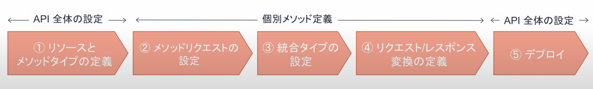

# API Gateway
## APIGW の設定項目
大きく5つの設定を行なっていく。  
最初にリソースとメソッドを設定したら、各`リソース×メソッド`ごとにAPIのフローを定義する。

- リソースとメッソドタイプ
- メソッドリクエスト
- 統合タイプ
- リクエスト/レスポンス変換
- デプロイ



### リソースとメッソドタイプ
最初にリソースを作成する。リソースとは、APIとして公開されるエンドポイントのURLの一部に当たり、階層的に定義することも可能である。

次に、各リソースに対するメソッドタイプを指定する。
リソースに対して、以下のメソッドのうち、何を許可するかを制御することができる。

- GET：リソースの取得
- POST：リソースの作成
- PUT：リソースの更新
- DELETE：リソースの削除


### メソッドリクエスト
リクエストを受信した時に実施する処理を定義する


具体的には、以下のような設定ができる
- 認証の設定
- 受け付けるクエリパラメータ
- 必須となるHTTPヘッダの設定


### 統合タイプ
統合バックエンドを渡す前後に処理を定義する


統合リクエストでは、処理を受け付けるバックエンドの種別を選択する
- Lambda関数
- HTTP
- Mock
- AWSサービス
- VPCリンク

バックエンドに向けてのリクエストとバックエンドからのレスポンスについて、形式を変換することが可能

プロキシ統合を利用するとAPIGWとLambdaで自動で、扱える形式に変換をしてくれる。

### リクエスト/レスポンス変換
レスポンスを送信する時に実行する処理を定義する


最終的なAPI GWとしてのレスポンスに関する設定
- ステータスコード
- HTTPレスポンスヘッダなど


### デプロイ
APIの単位にデプロイを行う。

ステージを作成して、そのステージごとにデプロイを行うことになる。


## APIGWの作成(Mockの利用)
GETすると、jsonを返す処理を作成する

### APIの作成
AWSのコンソールからAPI GWに遷移して、新しいAPIを作成する。
APIのタイプから`REST API`を作成する。


APIの名前を決定する。
エンドポイントタイプとしては、  呼び出される元によって指定
- リージョン：リージョンないで利用するならこちらでOK
- 最適化：全世界で利用するならこちら 
- プライベート：内部からのみ呼び出される場合


### リソースとHTTPメソッドの作成
作成されたAPIの画面から、リソースやメソッドを作成していく。  
今回はリソースとして`sample`メソッドとしてP`GET`を定義して、バックエンドにはMockを指定する。


### メソッドの定義
今回はMockから固定のjsonレスポンスを返却するので、作成したGETを押下して、統合レスポンス、マッピングテンプレートから返却するjsonを記述する。


```
{
    "statusCode": 200,
    "body": {
        {
            "report_id": 7,
            "report_title" : "Good morning!"
        }
    }
}
```

対象メソッドからTestを実行することができる


### デプロイ
アクションからAPIのデプロイを選択


デプロイする先のステージを選択（作成）する


### 動作確認
作成されたデプロイのステージから、作成されたURLを確認することができる。このURLにリソースを追加することによって、今回作成したMockの返却値を受け取ることができるかを確認できる。


## APIGWの作成（Lambdaとの連携）
GETでクエリパラメータを受信してLambdaに連携して処理を噛ませてレスポンスを返す処理を実装する。


### リソースとメソッドの作成
リソースを作成し、メソッドを定義するときにバックエンドに`Lambda Function`を指定し、Lambda プロキシ統合を仕様する。（パススルー場合）

どのLambdaと連携するかを指定するため、Lambdaは事前に作成しておく。


### リクエストの定義
メソッドリクエストから、`URLクエリ文字列パラメータ`を押下して、クエリパラメータの定義をする。

- クエリパラメータの文字列
- 必須設定


### Lambda側の設定
統合レスポンスの設定をしているので、Lambda側での返却の形を統合レスポンスに合わせておく必要がある。
- [API Gateway で統合レスポンスを設定する](https://docs.aws.amazon.com/ja_jp/apigateway/latest/developerguide/api-gateway-integration-settings-integration-response.html)

translateを利用して翻訳するときのpythonコードがこちら
```
import json
import boto3

translate = boto3.client(service_name='translate')

def lambda_handler(event, context):

    # ここで、API GWからデータを受信
    input_text = event['queryStringParameters']['input_text']

    response = translate.translate_text(
        Text=input_text,
        SourceLanguageCode="ja",
        TargetLanguageCode="en"
    )

    output_text = response.get('TranslatedText')


    # ここの形式は、統合レスポンスで指定された形式にする
    return {
        'statusCode': 200,
        'body': json.dumps({
            'output_text': output_text
        }),
        'isBase64Encoded': False,
        'headers': {}
    }
```


#### テストについて
Lambdaのテストする際には、新しいテストを作成して、テンプレートから、apigateway-aws-proxyを指定することによって、API GWからデータを受信した時のフォーマットを自動で作成してくれる。

### デプロイ
devステージにデプロイして、作成されたURLに対して、リソースとパラメータを指定してアクセスする。