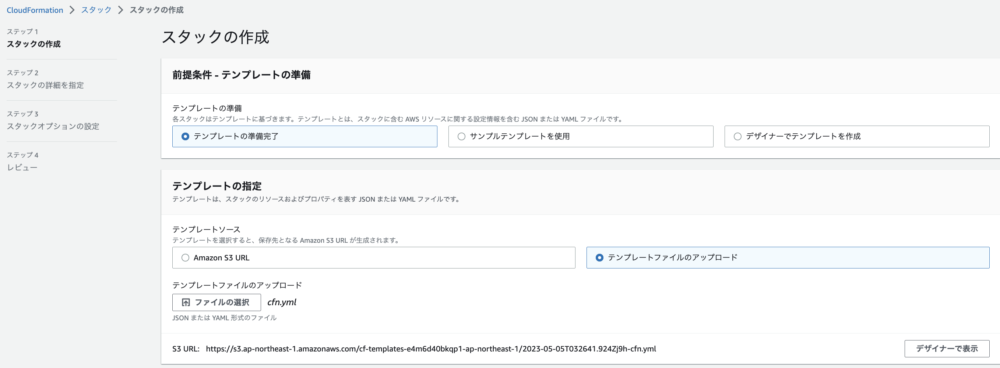
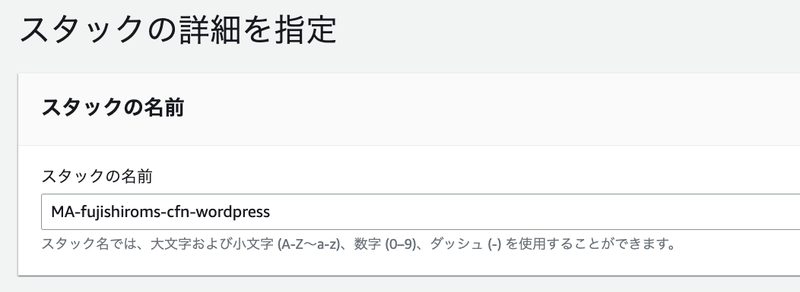
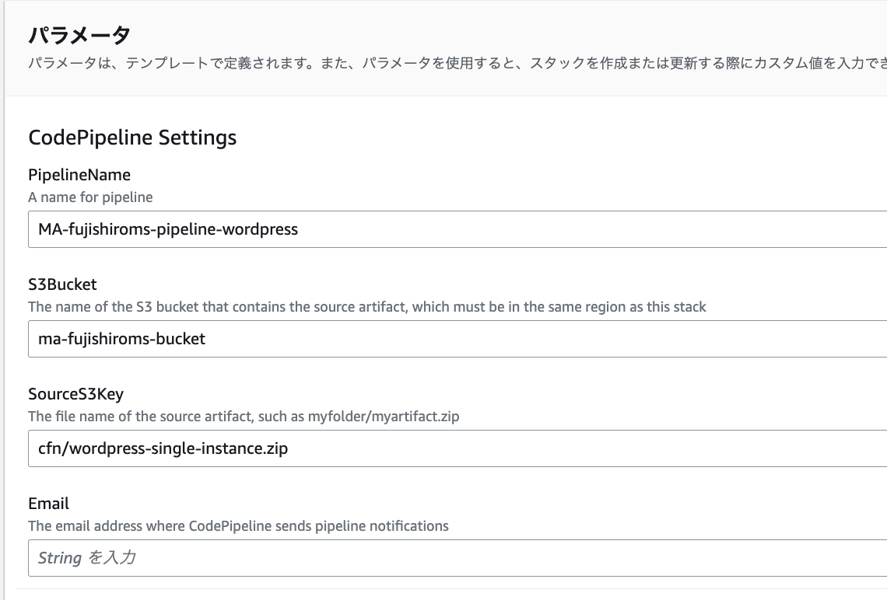
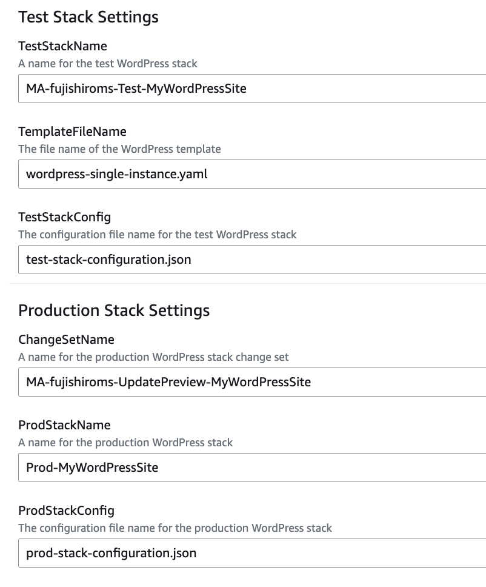
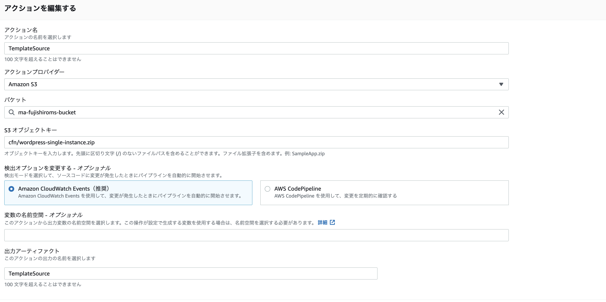
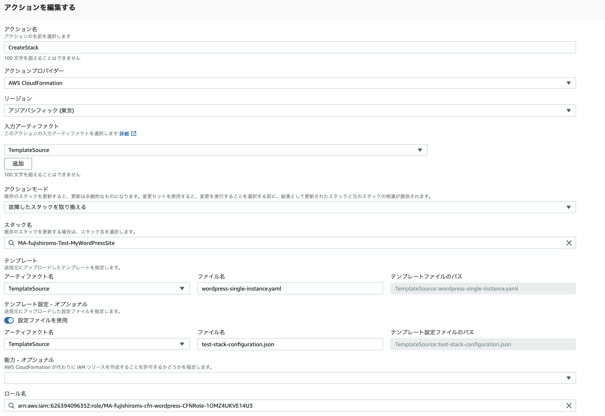
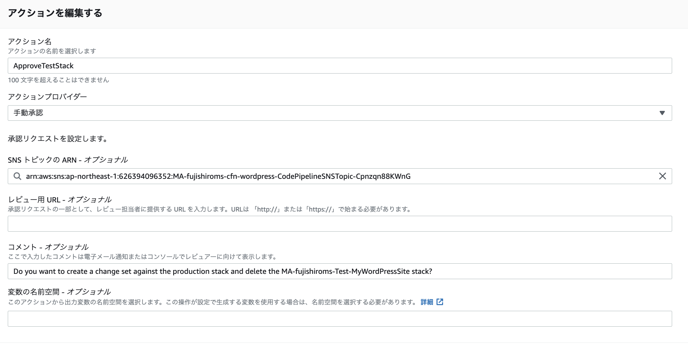
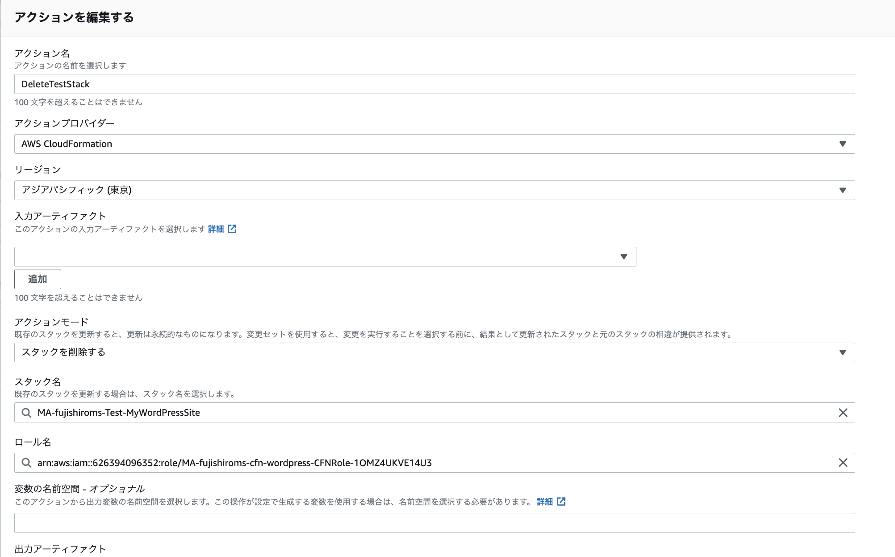
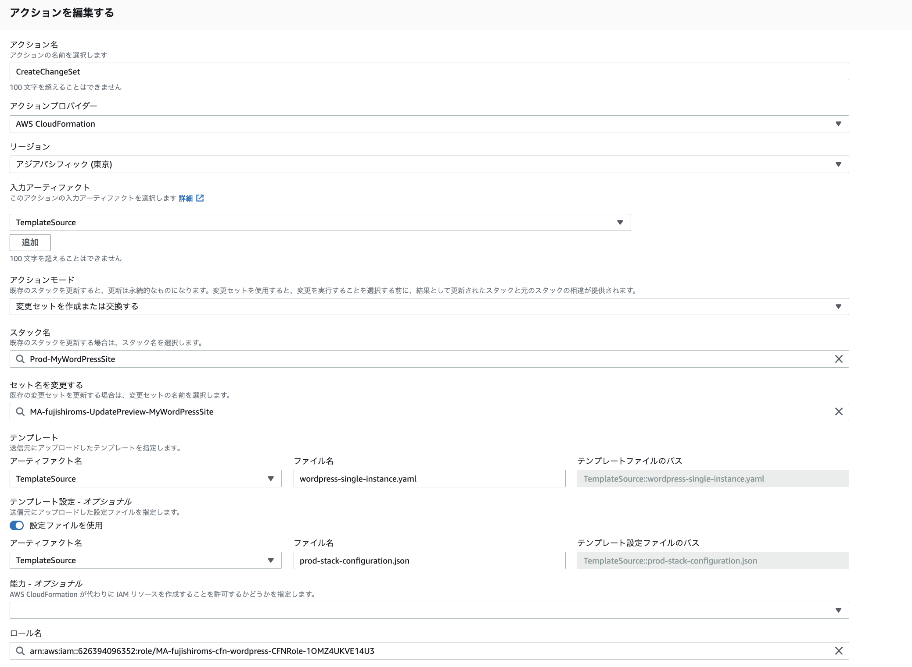
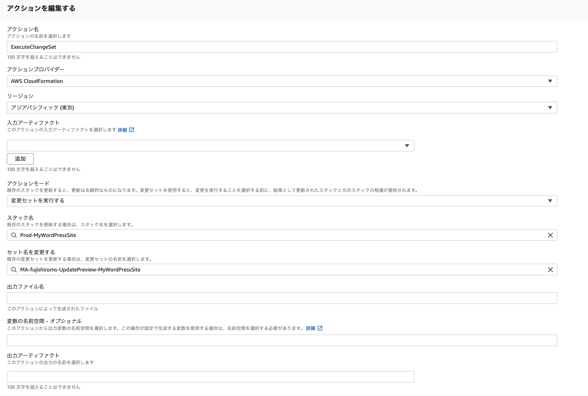

# CodePipelineを利用してCFNのCICD環境を作成する

## デプロイステージについて
デプロイステージとして以下2つの選択肢がある
- CloudFormation
- CloudFormation スタックセット

CloudFormationのスタックセットは、別リージョンや複数のAWSアカウントにデプロイする機能なので、今回はCloudFormationを利用することになるはず

### CloudFormationの設定項目：アクションモード
アクションモードとして以下が選択できる
- スタックを作成または更新する  
    新規のスタックを作成するか、すでにスタックがあれば、更新を行う。  
- スタックを削除する  
    指定されたCFNスタックを削除する  
- 故障したスタックを取り替える  
    指定されたCFNスタックが故障した場合、新しいスタックを作成して置き換える      
- 変更セットを作成または更新する  
    指定されたCFNスタックに対する変更セットを作成、更新する  
    このアクションにより、変更をスタックに反映する前に、変更の影響を予測し、評価するために使用される。
- 変更セットを実行する  
    指定されたCFNスタックに対する変更セットを実行する  
    変更を実際に反映するためのアクション

### CloudFormationの設定項目：スタック名
設定項目は以下
- スタック名  
    作成する場合は作成されるスタック名を意味する
    更新する場合は更新対象のスタックを意味する
- テンプレート


### CloudFormationの設定項目：権限
AWS CloudFormationがスタックを作成するために、スタックテンプレートに特定の機能が含まれていることを明示的に確認する必要があり、その設定を行う。
CloudFormationを使用するにはIAMユーザーやロールに必要な権限を付与する必要がある。
アクションに必要な権限は”能力(CAPABILITY)”というパラメータで付与する

設定項目は以下
- CAPABILITY_IAM  
    CFNがIAMリソースを作成・変更できるようにする
- CAPABILITY_NAMED_IAM  
    CFNが指定されたIAMリソースを作成または、変更できるようにする（作成するスタックの中にカスタム名のIAMリソースを含めることができる）
- CAPABILITY_AUTO_EXPAND   
    CFNがテンプレート内で、複数のネストされたAppが含まれる場合に指定するらしい


## チュートリアルをやってみる
[テストおよび本稼働スタック用のパイプラインを構築する](https://docs.aws.amazon.com/ja_jp/AWSCloudFormation/latest/UserGuide/continuous-delivery-codepipeline-basic-walkthrough.html)をやってみる


最終的に3つのステージが完成する
1. リポジトリからソースアーティファクトを取得して、S3バケットにアップロードする
2. テストスタックを作成して、実行か追加変更かを選べる。承認プロセスも含む
3. 本番スタックに対する変更セットを作成して、承認を待ち、承認後に変更が実行される

### IaCの基本
登場人物
- リポジトリ：gitなどコードを管理する場所
- IaCコード：実際のコード
- アーティファクトストア：IaCのコードなどを保管する


### 事前準備
- ネットワークに接続できるEC2を作成しておく（IGWが取り付けられたpublic subnetに所属しているEC2）。
- パブリックサブネットにEC2を作成してキーペアを保存しておく
- バージョニングが有効かされたS3を作成しておく


### ステップ１：コードを修正してS3にアップロードする
今回、アーティファクトストアにはS3を利用する。
S3を利用する場合、ソースファイルをzipファイルに変換してから、S3にコピーをする。

チュートリアルではワードプレスを作成するアーティファクトファイルが事前に準備されているので構成ファイル内のKeyNameをEC2で利用したキーペア名に変更しておく
- wordpress-single-instance.yaml:WordPress用のCFnコード
- test-stack-configuration.json:テスト用構成ファイル
- prod-stack-configuration.json:本番用構成ファイル

CFnのzipファイルをアップロードする


### ステップ2:パイプラインスタックを作成する
CFNの画面から、チュートリアルにある、CICDを構成するCFNコードをアップロードして、実行する。



CFNコードでは最初に設定するパラメータについて定義している。
パラメータセクションで定義された変数は、CFNを実行する最初にコンソールから入力を求められる。
```
Parameters:
  PipelineName:
    Description: A name for pipeline
    Type: String
  S3Bucket:
    Description: The name of the S3 bucket that contains the source artifact, which must be in the same region as this stack
    Type: String
  SourceS3Key:
    Default: wordpress-single-instance.zip
    Description: The file name of the source artifact, such as myfolder/myartifact.zip
    Type: String
  TemplateFileName:
    Default: wordpress-single-instance.yaml
    Description: The file name of the WordPress template
    Type: String
  TestStackName:
    Default: Test-MyWordPressSite
    Description: A name for the test WordPress stack
    Type: String
  TestStackConfig:
    Default: test-stack-configuration.json
    Description: The configuration file name for the test WordPress stack
    Type: String
  ProdStackName:
    Default: Prod-MyWordPressSite
    Description: A name for the production WordPress stack
    Type: String
  ProdStackConfig:
    Default: prod-stack-configuration.json
    Description: The configuration file name for the production WordPress stack
    Type: String
  ChangeSetName:
    Default: UpdatePreview-MyWordPressSite
    Description: A name for the production WordPress stack change set
    Type: String
  Email:
    Description: The email address where CodePipeline sends pipeline notifications
    Type: String
```

スタック名設定



パイプラインに関するパラメータ設定



設定ファイルに関するパラメータ設定



CFNコードでは、パラメータ入力画面の制御をMetadataセクションのInterfaceで行なっている
```
Metadata:
  AWS::CloudFormation::Interface:
    ParameterGroups:
      - Label:
          default: "CodePipeline Settings"
        Parameters:
          - PipelineName
          - S3Bucket
          - SourceS3Key
          - Email
      - Label:
          default: "Test Stack Settings"
        Parameters:
          - TestStackName
          - TemplateFileName
          - TestStackConfig
      - Label:
          default: "Production Stack Settings"
        Parameters:
          - ChangeSetName
          - ProdStackName
          - ProdStackConfig

```

また、Artifactを格納するS3バケット（ArtifactStore）とSNS Topic、IAM Roleを作成している
```
Resources:
  ArtifactStoreBucket:
    Type: AWS::S3::Bucket
    Properties:
      VersioningConfiguration:
        Status: Enabled

  CodePipelineSNSTopic:
    Type: AWS::SNS::Topic
    Properties:
      Subscription:
        - Endpoint: !Ref Email
          Protocol: email
```

CodePipelineに対して、必要なロールを付与している。
```
PipelineRole:
Type: AWS::IAM::Role
Properties:
    AssumeRolePolicyDocument:
    Statement:
    - Action: ['sts:AssumeRole']
        Effect: Allow
        Principal:
        Service: [codepipeline.amazonaws.com]
    Version: '2012-10-17'
    Path: /
    Policies:
    - PolicyName: CodePipelineAccess
        PolicyDocument:
        Version: '2012-10-17'
        Statement:
            - Action:
            - 's3:*'
            - 'cloudformation:CreateStack'
            - 'cloudformation:DescribeStacks'
            - 'cloudformation:DeleteStack'
            - 'cloudformation:UpdateStack'
            - 'cloudformation:CreateChangeSet'
            - 'cloudformation:ExecuteChangeSet'
            - 'cloudformation:DeleteChangeSet'
            - 'cloudformation:DescribeChangeSet'
            - 'cloudformation:SetStackPolicy'
            - 'iam:PassRole'
            - 'sns:Publish'
            Effect: Allow
            Resource: '*'
```

#### パイプラインの作成
CFNコードでCodePipelineを作成する。
まずは、CodePipelineで作成されるArtifactの格納場所であるArtifactStoreを定義する。S3を利用する宣言と、バケットを指定する。
バケットは事前に作成したArtifactStoreBuckerを利用する。

Roleに関してもCFNで定義しているものを利用する
```
  Pipeline:
    Type: AWS::CodePipeline::Pipeline
    Properties:
      ArtifactStore:
        Location: !Ref 'ArtifactStoreBucket'
        Type: S3
      DisableInboundStageTransitions: []
      Name: !Ref 'PipelineName'
      RoleArn: !GetAtt [PipelineRole, Arn]
```

#### ソースステージの作成
ソースステージでは、S3に置かれているCFNコードを参照できるようにする。

事前にCFN作成時にパラメタで指定したバケットとパスを使って、今回の対象となるCFNコードのzipがどこにあるかを把握する。

本ステージの出力として`TemplateSource`を指定しているので、別ステージでもこのソースコードを参照できるようになる。



このステージを作成するCFNコードは以下
```
- Name: S3Source
  Actions:
    - Name: TemplateSource
      ActionTypeId:
        Category: Source
        Owner: AWS
        Provider: S3
        Version: '1'
      Configuration:
        S3Bucket: !Ref 'S3Bucket'
        S3ObjectKey: !Ref 'SourceS3Key'
      OutputArtifacts:
        - Name: TemplateSource
```


#### テストステージの作成
テストステージは3つのステージに分割される
1. スタックを作成する
2. 承認する
3. スタックを削除する




```
- Name: TestStage
  Actions:
    - Name: CreateStack
      ActionTypeId:
        Category: Deploy
        Owner: AWS
        Provider: CloudFormation
        Version: '1'
      InputArtifacts:
        - Name: TemplateSource
      Configuration:
        ActionMode: REPLACE_ON_FAILURE
        RoleArn: !GetAtt [CFNRole, Arn]
        StackName: !Ref TestStackName
        TemplateConfiguration: !Sub "TemplateSource::${TestStackConfig}"
        TemplatePath: !Sub "TemplateSource::${TemplateFileName}"
      RunOrder: '1'
```



```
    - Name: ApproveTestStack
      ActionTypeId:
        Category: Approval
        Owner: AWS
        Provider: Manual
        Version: '1'
      Configuration:
        NotificationArn: !Ref CodePipelineSNSTopic
        CustomData: !Sub 'Do you want to create a change set against the production stack and delete the ${TestStackName} stack?'
      RunOrder: '2'
```



```
    - Name: DeleteTestStack
      ActionTypeId:
        Category: Deploy
        Owner: AWS
        Provider: CloudFormation
        Version: '1'
      Configuration:
        ActionMode: DELETE_ONLY
        RoleArn: !GetAtt [CFNRole, Arn]
        StackName: !Ref TestStackName
      RunOrder: '3'
```


#### 本番ステージの作成
本番ステージは以下は3つのステージに分割される
1. スタックを作成する
2. 承認する
3. スタックを適用する



```
- Name: ProdStage
    Actions:
    - Name: CreateChangeSet
        ActionTypeId:
        Category: Deploy
        Owner: AWS
        Provider: CloudFormation
        Version: '1'
        InputArtifacts:
        - Name: TemplateSource
        Configuration:
        ActionMode: CHANGE_SET_REPLACE
        RoleArn: !GetAtt [CFNRole, Arn]
        StackName: !Ref ProdStackName
        ChangeSetName: !Ref ChangeSetName
        TemplateConfiguration: !Sub "TemplateSource::${ProdStackConfig}"
        TemplatePath: !Sub "TemplateSource::${TemplateFileName}"
        RunOrder: '1'
```




```
    - Name: ExecuteChangeSet
        ActionTypeId:
        Category: Deploy
        Owner: AWS
        Provider: CloudFormation
        Version: '1'
        Configuration:
        ActionMode: CHANGE_SET_EXECUTE
        ChangeSetName: !Ref ChangeSetName
        RoleArn: !GetAtt [CFNRole, Arn]
        StackName: !Ref ProdStackName
        RunOrder: '3'
```