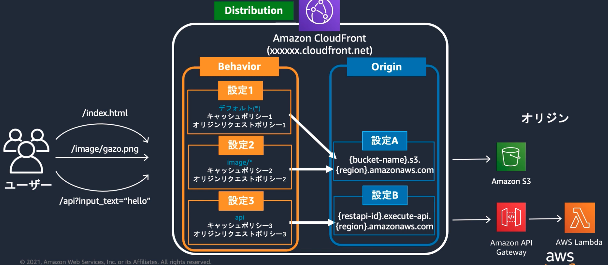
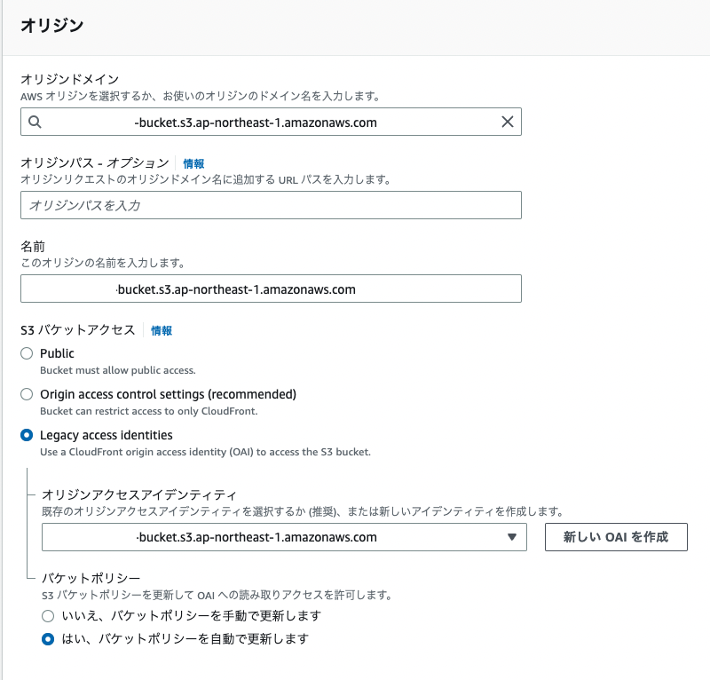
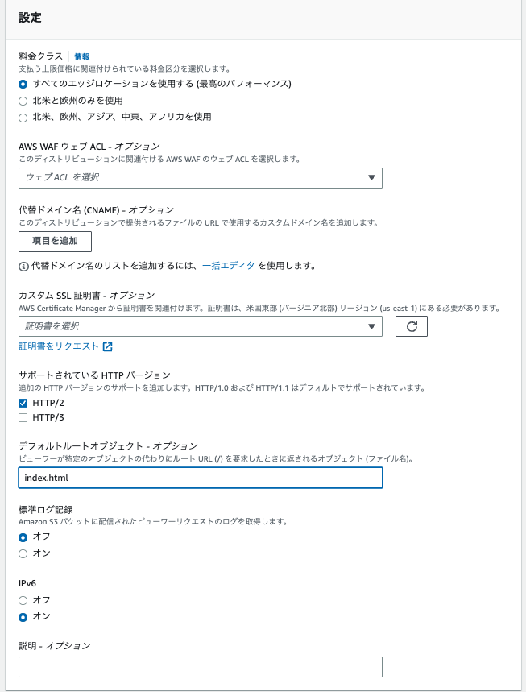
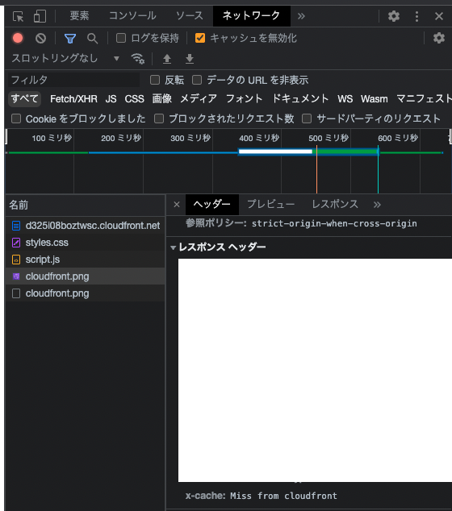
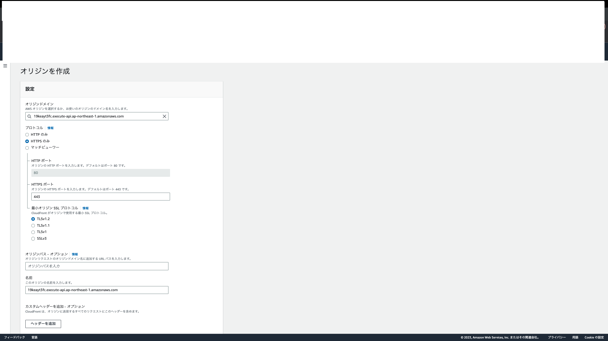
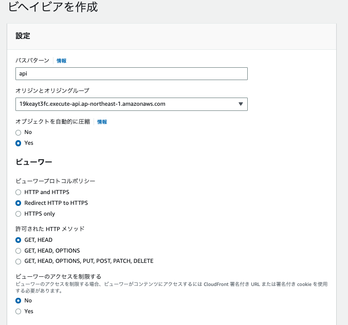

# CloudFront

## CloudFrontの設定項目
Cloud Frontにいては、設定項目が多い。大きくは以下の3箇所の設定が必要
- Distribution:Cloud Frontを指し示すもの
- Behavior:パスの設定
- Origin:バックエンドのオリジンを指定するもの




## 静的コンテンツのホスティングと配信
### S3の設定
1. バケットを作成する  
設定については、特に変更せず、デフォルトでOK

2. ファイルのアップロード  
事前に準備した静的コンテンツをS3にアップロードする


### Clouf Frontの設定
#### Distributionの作成  
Cloud Frontの画面からディストリビューションの作成を押下


#### Originの設定
- 先ほど作成したS3-Buckerをオリジンとして設定
- バケットへのアクセスはOAI(Origin Access Identity)を利用して新しいOAIを作成



#### Behaviorの設定(CachingDisabled)
- HTTPSのみを許可したいので`Redirect HTTP to HTTPS`を選択
- キャッシュポリシーに`CachingDisabled`を選択(キャッシュをしない設定)


#### Distributionの設定
- カスタムドメイン設定やカスタムSSL証明書の設定ができるが今回はしない
- デフォルトルートとして、S3のルートにあるindex.htmlを指定




#### 動作確認(キャッシュをしていない)
作成されたCloudFrontのディストリビューションドメイン名
```
https://xxxxxx.cloudfront.net
```
をブラウザで検索するとindex.htmlが表示される

ブラウザのディベロッパーツールのネットワークタブを確認して、キャッシュの無効化を押下してから再アクセスする。

レスポンスヘッダーの`x-cache`を確認するとCloudfrontのキャッシュを取得したかを確認できる




### Behaviorのポリシー設定(Cache)
CloudFrontのコンソール画面のナビゲーションペインから`ポリシー`を選択すると、AWSのマネージドポリシーが表示される。

先ほど選択した、CachingDisabledはTTLが全て0となっているのでCloudFrontでキャッシュをしない設定となっていた。


#### Cache Policyの作成
新たにカスタムポリシーを作成する。ポリシーの作成を押下して以下の項目を設定していく
- 名前
- TTL
- キャッシュキー


#### ビヘイビアで別のパスを作成
ディストリビューションを選択して、ビヘイビアのタブから新しいパスを作成するためにビヘイビアの作成を押下

前回同様にビヘイビアの設定をしていく
- パスパターン: `static/*'
- オリジン: s3のバケット
- HTTPSのみを許可したいので`Redirect HTTP to HTTPS`を選択
- キャッシュポリシーに先ほど作成したポリシーを選択

新しいビヘイビアが作成されるが、優先順位に従って、評価がされることになる


#### 動作確認（キャッシュをしている）

レスポンスヘッダーの`x-cache`を確認するとCloudfrontのキャッシュを取得したかを確認できる。

また処理時間に関しても、短くなっている


## 動的コンテンツのホスティングと配信
### 動的コンテンツの作成
LambdaとAPI GWを利用して、ユーザーが投げてきた文字列を英訳するAPIを作成
- リソースは`api`
- クエリパラメータは`input_text`


### Origin Request Policyの作成
動的コンテンツを扱う場合の注意点として、CloudFrontはリクエストからの情報をフィルタリングして、オリジンに情報を渡すため、明示的に渡すことを指定した情報しか渡さない。
なので、クエリパラメータについて明示的に渡す設定を追加する必要がある。

CloudFrontのポリシーから、Origin Request Policyを選択


クエリ文字列でホワイトリストとして`input_text'を追加する


### Cloud FrontとAPI GWの接続
Cloud Frontのディストリビューションで、オリジンを作成する  
オリジンドメインにAPI GWのURLを入力する



次に、ビヘイビアを作成する

パスパターンにはAPI GWのリソースである`api`として、オリジンは先ほど作成したAPI GWを指定する。




キャッシュポリシーに関しては、動的コンテンツのため`CachingDisabled`とする。
オリジンリクエストポリシーは先ほど作成した、クエリ文字列を渡すものを指定する。

