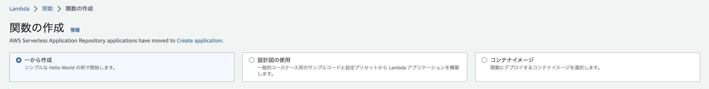
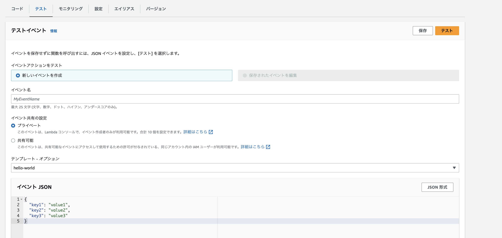

## Lambdaの利用方法
### Lambdaの作成
コンソールからLambdaを選択して、Lambdaの作成を選択。

`一から作成`と`設計図の利用`と`コンテナイメージ`が選択できる。

- 一から作成: ユーザーが全て設定をすることができる
- 設計図の利用: AWS側でよく利用するパターンのコードやIAMの設定をしておいてくれるテンプレート
- コンテナイメージ: ECRにPushしてあるDocker Imageを利用して、処理を行うことができる



### 各種設定の変更
Lambdaの設定タブの一般設定から、メモリやタイムアウト時間を変更することができる


### テスト実行について
Lambdaのテストタブから、テストを作成することができる。

テストではLambdaハンドラーに渡すeventの値を設定することができる。




Lambdaが呼び出された時に引き渡される`event`の中身を変えながら、テスト実行を行うことでLambdaが想定通りの動きをするかを確認することができる。
```
import json

def lambda_handler(event, context):
    # TODO implement
    return {
        'statusCode': 200,
        'body': json.dumps('Hello from Lambda!')
    }
```
