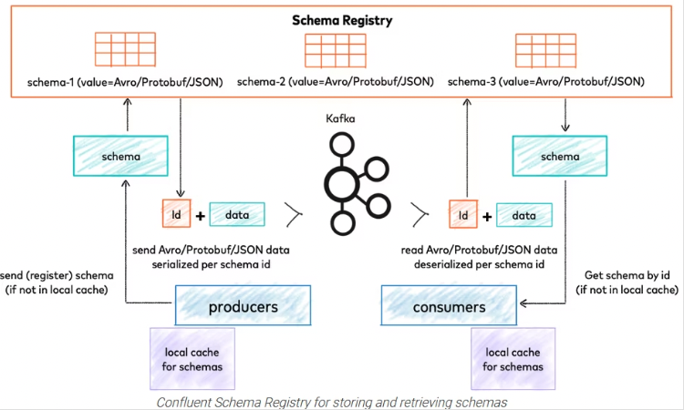

# MSKにおけるメッセージの優先順位について
kafkaに送信されたメッセージに対して、優先順位をつけて優先度の高いメッセージを優先して処理させたい。

Apache kafkaは公式にはそのような機能を提供していないので、いくつかの実装例を調査


## 優先度付きのトピックを作成
[Kafkaはトピックまたはメッセージの優先度をサポートしていますか？](https://www.web-dev-qa-db-ja.com/ja/apache-kafka/kafka%E3%81%AF%E3%83%88%E3%83%94%E3%83%83%E3%82%AF%E3%81%BE%E3%81%9F%E3%81%AF%E3%83%A1%E3%83%83%E3%82%BB%E3%83%BC%E3%82%B8%E3%81%AE%E5%84%AA%E5%85%88%E5%BA%A6%E3%82%92%E3%82%B5%E3%83%9D%E3%83%BC%E3%83%88%E3%81%97%E3%81%A6%E3%81%84%E3%81%BE%E3%81%99%E3%81%8B%EF%BC%9F/1053263533/)

■手順  
1. 優先度に応じたTopicを作成する。
2. Consumerでは、優先度に応じたトピック順にメッセージを確認する

■懸念点  
優先度が低いメッセージが大量に送信されているときに、優先度高いメッセージを優先してくれるか。

■確認事項
1. ConsumerのTopicを読み込むプロセスがどのタイミングになっているか確認する必要がある
2. Consumerが2つのTopicをよみこむプロセスを確認する必要がある


## パーティションキーの利用
Producer側でパーティションキーを設定し、特定のパーティションにメッセージを送付するように設定を行う。
Consumer側でもパーティションキーに従って、特定のパーティションにメッセージを読み込むように設定を行う。

- [Kafkaを利用した分散処理について](https://qiita.com/akiyoshi_tomita/items/bd46bb320cd7ea217b2f)

■手順  
1. Producer側で、メッセージに応じてPartitionキーを指定する。優先度の高いメッセージは特定のPartitionに紐付ける
2. Consumer側でも、特定のConsumerに対して、Partitionキーを指定するようにする。

■懸念点  
AutoScalingとどうやって整合性をとるか  
Topicは共通だが、Consumer側は優先度高い用と低いようを作成するように見える


## メッセージの中に優先度のキーを追加
Topicを共通として、Producer側でメッセージに対して優先度を付与する  
Producer側では、送信するメッセージの中にkey-valueとしてpriorityを一つ追加する
```
{
  "priority":"high",
  "customerCode":"xxx",
  "data":"hoge"
}
```

Consumer側で優先度を比較する実装を行う。


■懸念点  
チーム内にConsumer側の優先度に応じた、処理のソートまで実装できる能力があるか。  
現在は、1つ1つメッセージを拾っている実装だと理解しているがまとめてpartition内のデータを取得して、優先度順に並び替える必要がある  
（1つづつなのかまとめてやっているのかから調査）  
offsetについても順番が入れ替わるので、優先度が高いメッセージのoffsetよりも小さいoffsetのデータが正しく処理されるか確認する必要がある。


## kafkaストリームの利用
[Kafka Streams](https://kafka.apache.org/documentation/streams/)  
Kafka Streams はKafka内に格納されているデータの処理と解析のためのクライアントライブラリです。
とのことで、優先度についても使い込めばできるのかもしれないが、一旦は調査していない。


## schema Registryの利用
Schema Registry(スキーマ レジストリ)とは、メッセージングシステム「Apache Kafka」ベースのストリームデータ基盤「Confluent Platform」の1コンポーネントです。一元的なスキーマ管理機能を提供します。
スキーマ管理に対して一元管理されたシリアライズ機構を提供します。

とのことで、シリアライズ機構を提供してくれるそうなので、こちらも可能性がある。
詳しく調べられていないが、外部にスキーマを持たせて、メッセージを管理するようなイメージ？




■懸念点  
やっぱり学習コストがかかりそう。
また、単純に外部にスキーマを持たせて問い合わせという方式だと処理時間が追加でかかりそうな印象。  
結局Consumer側で優先順位順に処理するロジックがあれば、わざわざschema Resitryは不要では？

### 動作検証するなら
[Schema Registry簡易テスト](https://qiita.com/tomotagwork/items/5e456400197457cc4291)


## Decatonの利用 
Lineのライブラリっぽい。ドキュメント量も少なそうなので、一旦調査していない。

■懸念点  
