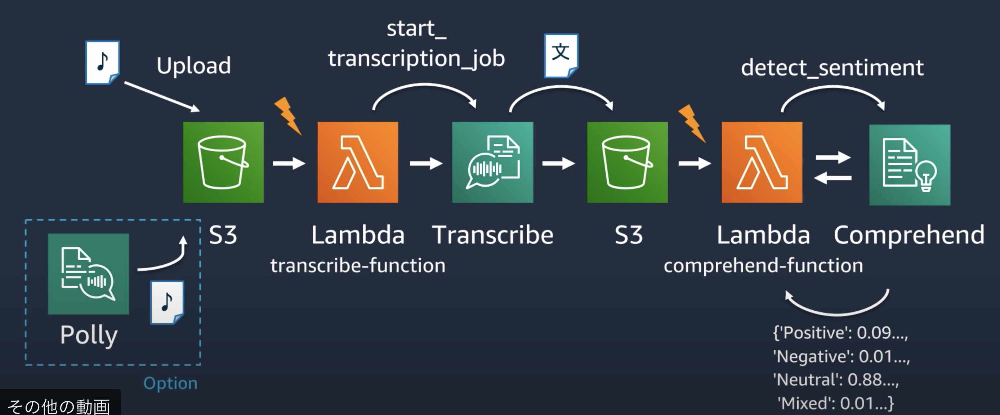
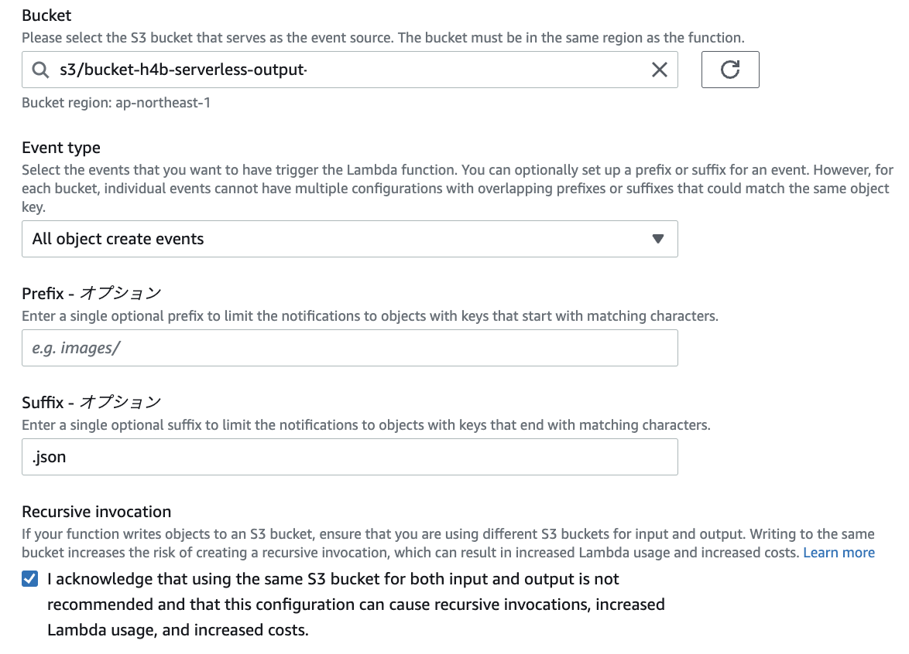

## LambdaとS3・AIなどのAWSサービスの連携
### H4b
[H4B：AWS LambdaとAWS AI Servicesを組み合わせて作る音声文字起こし&感情分析パイプライン](https://pages.awscloud.com/JAPAN-event-OE-Hands-on-for-Beginners-Serverless-3-2022-confirmation_772.html)
の内容を踏まえてLambadaの手順などを整理する。

#### 全体構成
S3に音声データをアップロードするとS3のイベントが発出され、Lambdaがそれを受け取る。  
LambdaがTranscribeを呼び出して、テキストデータに変換し、そのデータをS3にアップロードする。  
テキストのアップロードを契機として、再度Lambdaを呼び出して、ポジネガ判定を行う。

- Polly:テキストから音声を生成するAIサービス
- Transcribe:音声からテキストを生成するAIサービス
- comprehend:文章のポジネガ判定を行うAIサービス




#### S3とLambdaの連携
S3バケットの作成をして、Lambdaからpython-get-s3-objectからコードを作成する。


#### LambdaとTranscribeの連携
S3内部の音声データのObjectを指定すると、文字起こしをして指定したs3のディレクトリにjsonファイルを吐き出す。

LambdaのIAM Roleについて、TranscribeやS3への権限を付与する
- transcribeFullAccess
- S3FullAccess

Lambdaの関数の中身を変更する。LambdaからAWSを呼び出すときは[リファレンス](https://boto3.amazonaws.com/v1/documentation/api/latest/reference/services/transcribe.html)を参考にする  
処理の中身はs3からデータを受け取って、Transcribeに連携、Transcribeの保存先にS3を指定
```
import json
import urllib.parse
import boto3
import datetime # jobuをユニークにするため

# s3のclient作成
s3 = boto3.client('s3')
# transcribeのclient作成
transcribe = boto3.client('transcribe')


def lambda_handler(event, context):
    # bucket名取得
    bucket = event['Records'][0]['s3']['bucket']['name']
    # object名取得
    key = urllib.parse.unquote_plus(event['Records'][0]['s3']['object']['key'], encoding='utf-8')
    
    try:
         transcribe.start_transcription_job(
            # job名をユニークに設定
            TranscriptionJobName= datetime.datetime.now().strftime('%Y%m%d%H%M%S') + '_Transcription',
            # 日本語を対象に設定
            LanguageCode='ja-JP',
            Media={
                # 入力メディアのパス
                'MediaFileUri': 'https://s3.ap-northeast-1.amazon.com/' + bucket + '/' + key
             },
            # 出力するs3バケットの情報[s3::]は不要
            OutputBucketName='bucket-h4b-serverless-output',
            # 出力するs3バケット内のディレクトリ
            OutputKey = 'transcribe-output/'
        )    
    except Exception as e:
        print(e)
        print('Error getting object {} from bucket {}. Make sure they exist and your bucket is in the same region as this function.'.format(key, bucket))
        raise e

```
Lambdaファンクションを修正したら、Deployを忘れずに！


#### S3への連携
TranscribeがS3に格納したイベントを契機にして、Comprehendにデータを渡す。  


1. Lambdaの作成  
前回同様に、S3へのファイルアップロードを契機とする。  
アップロードされたjsonファイル飲みを対象とするので、Suffixで指定



2. IAMロールの修正
    - S3FullAccess
    - ComprehendFullAccess
   
3. Lambdaの修正  
今回は感情分析の`detect_sentiment`関数を利用する。
関数の設定方法は[リファレンス](https://boto3.amazonaws.com/v1/documentation/api/latest/reference/services/comprehend.html#Comprehend.Client.detect_sentiment)参照  


```
import json
import urllib.parse
import boto3

s3 = boto3.client('s3')
# comprehendのクライアントを設定
comprehend = boto3.client('comprehend')

def lambda_handler(event, context):
    # bucket名を取得
    bucket = event['Records'][0]['s3']['bucket']['name']
    # object名を取得
    key = urllib.parse.unquote_plus(event['Records'][0]['s3']['object']['key'], encoding='utf-8')
    try:
        # objectの中身を取得
        response = s3.get_object(Bucket=bucket, Key=key)
        
        # jsonに変換
        body = json.load(response['Body'])
        # 中身からテキストを抽出
        comprehend_text = body['results']['transcripts'][0]['transcript']
        
        # 感情分析のAPI呼び出し
        sentiment_response = comprehend.detect_sentiment(
            Text=comprehend_text,
            LanguageCode='ja'
        )
        
        # 感情分析の結果からスコアを取得
        sentiment_score = sentiment_response['SentimentScore']
        # CloudWatchで確認できるようにprint
        print(sentiment_score)
        
        
    except Exception as e:
        print(e)
        print('Error getting object {} from bucket {}. Make sure they exist and your bucket is in the same region as this function.'.format(key, bucket))
        raise e

```
