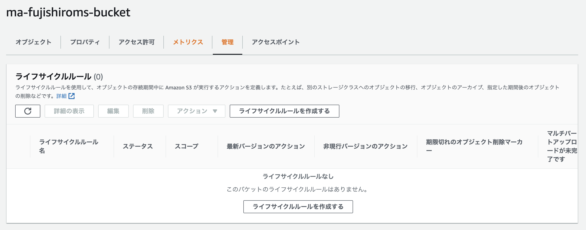
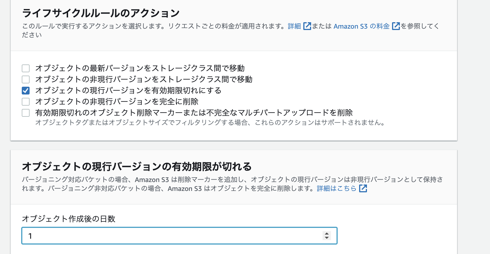

## S3の処理
### S3とローカルディレクトリを同期する
AWS CLIを利用して、ローカルのディレクトリとS3のディレクトリを同期する

コマンドとしては左側から右側へコピーをする
```
aws s3 sync [FROM_DIR] [TARGET_DIR] --exact-timestamps
```
- `--exact-timestamps`を付与すると、タイムスタンプを見て、同期を判断する（デフォルトはファイルサイズ）
- `--delete`を付与するとコピー元にないファイルを削除しようとする


#### S3にあるファイルをローカルに同期
```
aws s3 sync s3://[BUCKET_NAME] [LOCAL_DIR] --exact-timestamps
```


#### ローカルにあるファイルをS3に同期
```
aws s3 sync  [LOCAL_DIR] s3://[BUCKET_NAME]　--exact-timestamps　--delete
```


#### 参考文献
- [AWS CLIでS3操作(ls,mb,rb,cp,mv,rm,sync)](https://www.wakuwakubank.com/posts/642-aws-cli-s3/#index_id15)
- [syncのオプション](https://book.st-hakky.com/docs/aws-s3-sync/)


### ライフサイクルの設定
S3に格納されるオブジェクトに対して、ライフサイクルを設定することで、一定期間が経った段階でストレージクラスのレベルを変更したり、削除したりすることができる。


#### ルールのアクション
ライフサイクルで設定することができるルールについて整理する。


- オブジェクトの最新バージョンをストレージクラス間で移動  
    期限を迎えたオブジェクトをS3から別のストレージクラスに移動させる

- オブジェクトの非現行バージョンをストレージクラス間で移動  
    期限を迎えたオブジェクトの古いバージョンをS3から別のストレージクラスに移動させる（バージョニングが有効の場合のみ）

- オブジェクトの現行バージョンを有効期限切れにする  
    - バージョニングが有効：古いバージョンとなる
    - バージョニングが無効：削除される

- オブジェクトの非現行バージョンを完全に削除  
    期限を迎えたオブジェクトの古いバージョンを削除する


#### 設定方法
対象のバケットを選択して`管理`タブを開き`ライフサイクルルールを作成`を選択



ライフサイクルルール名を指定して、`プレフィックス`には、対象となるフォルダを記述する。  
※S3 バケットからのフルパスではなくて、対象のフォルダ名だけでOK


ライフサイクルのルールを設定して、ルールが適用される日数（作成されたからの日数）を指定する




#### 設定確認
今回作成されたルールが各オブジェクトに適用されているかのルールを確認する。

設定したprefix配下のオブジェクトを選択し、プロパティの中に`オブジェクト管理の概要`という項目があり`有効期限ルール`の箇所に削除日時が表示されている。


#### 削除タイミングについて
挙動としては、設定された日時を迎えたら9:00(JST)に非同期の削除バッチに追加されて、削除が開始される。
設定時に削除の期限を迎えていた場合は、次の9:00(JST)に削除バッチに追加される。

処理としては、非同期のバッチに入ってから削除されるので9:00に削除されるとは限らない。金額は設定時で換算される。


#### 注意事項
ライフサイクルによって、フォルダ配下のファイルが全て削除されると、フォルダ自体も削除されてしまう点に注意。

データをアップロードするときにもパスを指定するとフォルダごと作成してくれるので、影響はないはず。


#### 参考文献
- [S3のライフサイクルルールのアクションを理解する](https://www.capybara-engineer.com/entry/2021/09/16/151849)  
    設定できるルールのアクションについて解説している。

- [S3ライフサイクルルールで古いオブジェクトを自動削除する](https://nakada-r.com/2021/01/s3-lifecycle/)  
    一番丁寧に設定順序を整理してくれている

- [削除ルールを作成した時点ですでに期限が切れているオブジェクトを、ライフサイクルルールで削除するときの削除タイミングを教えてください](https://dev.classmethod.jp/articles/tsnote-tsexpiredobject-delete-timing/)  
    削除のタイミングについて解説している
