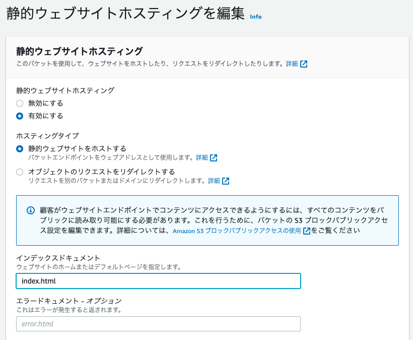

## 静的コンテンツの公開 S3/CloudFront/ACM/Route53

今回のHandsOnを通じて作成する全体像は以下

S3の静的ウェブサイトホスティングを利用してウェブサイトを公開し、CloudFrontを設定する。
加えて、Route53とACMを利用して独自ドメインを取得する（お金がかかる）


### 実案件における手順
```
1. S3バケットを利用して静的ウェブサイトホスティングを行う
2. Cloud Frontを利用してS3へのアクセスを設定(S3を直接指定)
---S3へのネットワーク開通（CloudFront→S3)---
3. Route53を利用してドメインを取得する
4. 取得ドメインに対してレコード設定を行う(レコードの指定でS3を直接指定)
---S3へのネットワーク開通（Route53ドメイン→S3）---
5. ACMを利用して証明書を取得(Route53で検証)
6. ACMとCloudFrontを紐付け
7. CloudFrontとRoute53を紐付け
---HTTPS接続の開通（Route53→CloudFront→HTTPS→S3)---


```


### 静的ウェブサイトホスティング
S3にWebサーバーの役割を付与することで、アップロードしたHTMLサイトなどの静的なウェブサイトを一般公開する

バケットの設定でこの機能を設定すると、以下の形式でWebサイト用のURLが発行される
```
http://<bucket-name>.s3-website-<region>.amazon.com
```

#### Webドメインとの連携に向けて
Route53を利用してWebドメインをS3の静的ウェブサイトホスティングと連携する場合、ドメインネームとバケット名が一致している必要性があることに注意


#### 手順
1. バケットのブロックパブリックアクセス設定で、ブロックをオフにする


2. 静的ウェブサイトホスティングを許可する  
バケット>プロパティ>静的ウェブサイトホスティング  
「有効にする」を選択くして、最初に表示するindex.htmlなどを設定



デフォルトで表示するファイルを指定して、S3にアップロードしておく。
設定が完了すると、静的ウェブサイトホスティングのURLが生成される。

3. アクセスポリシー  
バケット作成時にパブリックアクセス設定を許可したからといってパブリックになる訳ではなく、バケットポリシーにもパブリックな設定を入れる必要がある。

バケット>アクセス許可>バケットポリシーの設定
```
{
  "Version": "2012-10-17",
  "Statement": [
      {
          "Sid": "PublicReadGetObject",
          "Effect": "Allow",
          "Principal": "*",
          "Action": [
              "s3:GetObject"
          ],
          "Resource": [
              "arn:aws:s3:::[YOUR BUCKET NAME]/*"
          ]
      }
  ]
}
```

結果として、バケットのアクセス欄が`公開`となる


この状態で、静的ウェブサイトホスティングのURLにアクセスすると、初期設定したindex.htmlが表示される

#### CloudFrontの設定
[別ページ](https://misakifujishiro.github.io/mylogs/HandsOn/cloudfront.html)を参照


### Route53で独自ドメインを取得する
#### ドメインの取得
Route53>登録済みドメイン>ドメインの登録

1. 取得したいドメイン名でチェックする


2. カートに入れて、取得
3. 個人情報を入力して、注文を完了

#### レコードの作成
ドメイン取得後にレコードを設定する  
今回は、CloudFrontではなく、S3のURLと紐付けを行う。（ドメイン名を指定すると直接S3に転送する）

1. Route53>ホストゾーン>取得したドメイン

2. レコードセットの作成

3. エイリアスの宛先に同じドメイン名のS3が選択可能になる


4. ドメイン名をURLとしてアクセスすると静的ウェブサイトホスティングしたS3のページが表示される


### ACMで証明書を作成の上、HTTPSアクセスする
今回のHandsOnでは以下の設定を行う
1. ACMの設定
2. ACMとCloudFrontの紐付け
3. CloudFrontとRoute53の紐付け
4. CloudFrontとS3の紐付け（直接アクセスの拒否）

#### ACMでドメインの証明書を取得
注意:CloudFrontにACMを付与する場合、リージョンを`バージニア北部(us-east-1)`に変更しておくこと

ACM>証明書のリクエスト

1. ドメイン名を入力
2. 検証方法:DNSの検証  
    DNSの設定を変更することができるということで検証する


これによって、証明書が発行される

#### ACMとCloudFrontの紐付け
1. HTTP を HTTPSにリダイレクトする設定をビヘイビアで設定
2. ディストリビューションの設定でCNAMEにドメインを設定して、SSLの設定で先ほど作成した証明書を選択する


ここの設定については、[CloudFrontで独自ドメイン利用の際にディストリビューション側にもCNAME設定が必要な点をその動作とともに検証してみた](https://dev.classmethod.jp/articles/amazon-cloudfront-cname-and-host-header-test/)
が参考になる。

#### CloudFrontとRoute53の紐付け
Route53のレコードを選択すると、CloudFrontの部分が選択できるようになっている。


これによって、ドメインにアクセスすると、HTTPSでアクセスされるようになる（HTTPでアクセスしても自動でHTTPSにリダイレクトされる）

#### CloudFrontとS3の紐付け修正（直接アクセスの拒否）
1. バケットポリシーを削除する
2. ウェブサイトの静的ホスティングも無効にする
3. CloudFrontのオリジンを静的ホスティングから変更する

ディストリビューションからオリジンの変更を押下


静的ホスティングのURLを削除してS3バケットを改めて指定。
以下のように設定することで、自動的にバケットポリシーを修正して、CloudFrontからしかアクセスできないよう修正してくれる。

