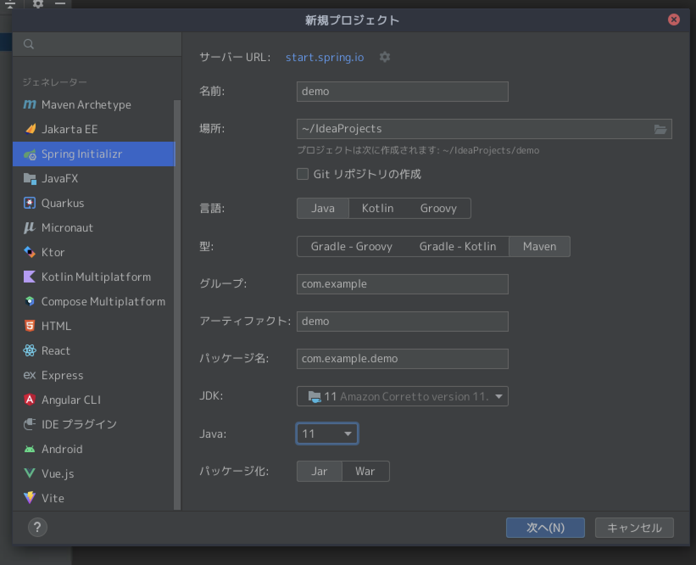
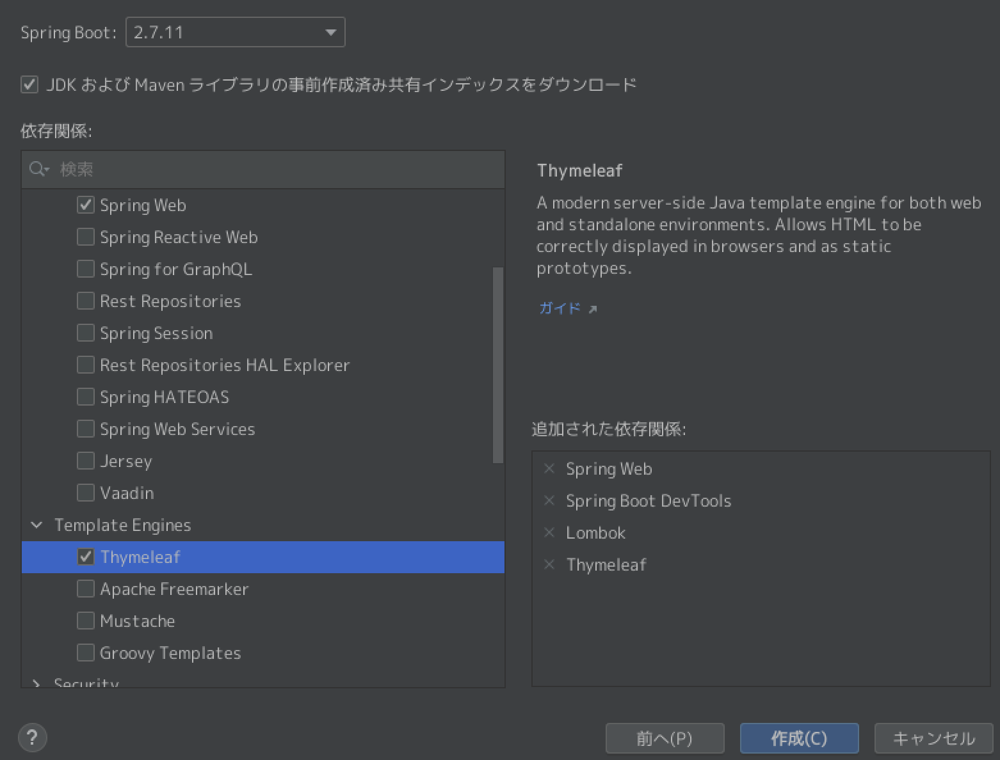
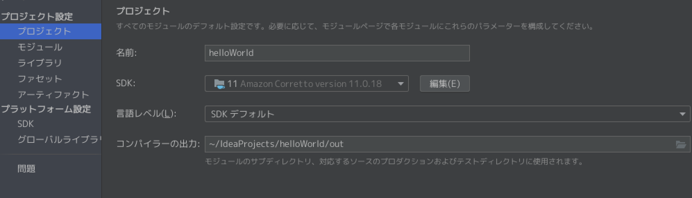
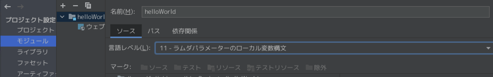
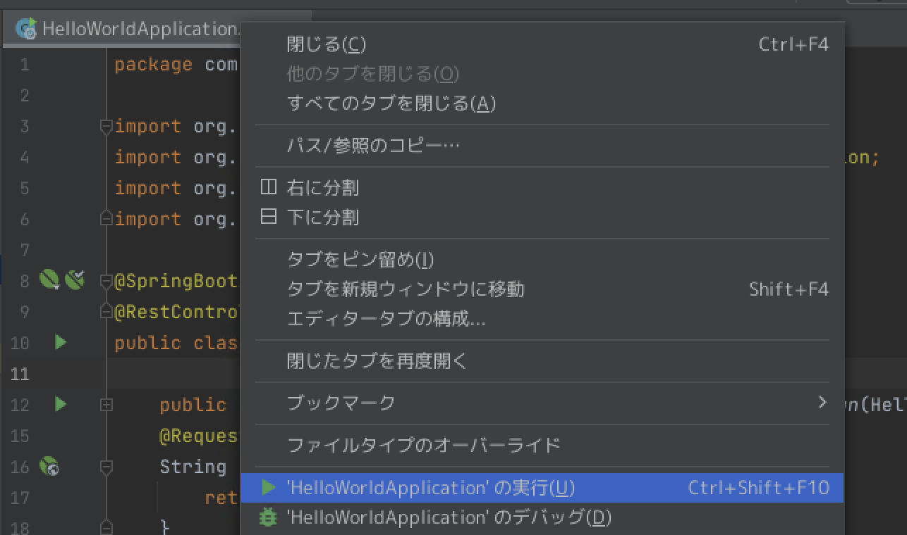
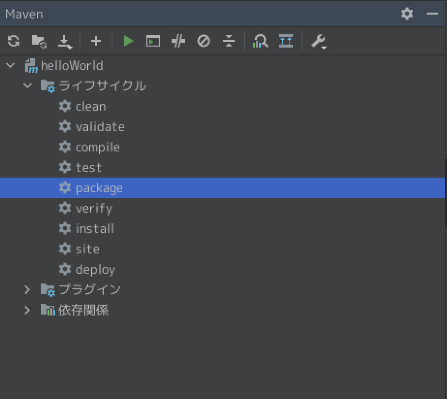
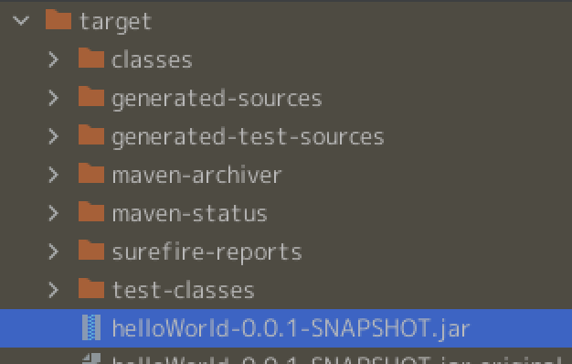
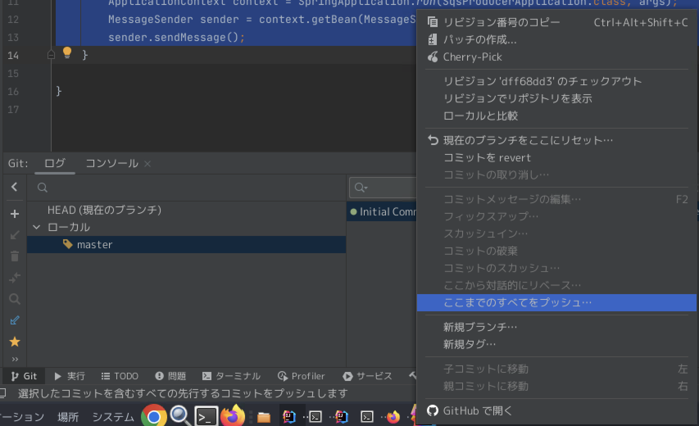

## IntteliJでhelloworldしてみる
IntelliJを利用してブラウザ上にhellow worldを表示するアプリケーションを作成します。
そのアプリケーションをjarファイルに固める方法およびapplication.yamlを利用することで、実行時に、設定を変更する方法をまとめます。

[参考サイト](https://www.tairaengineer-note.com/intellij-idea-springboot-hello-world/)
### javaのバージョンについて
PJを作成する際にjavaのバージョンと関連して、spring bootやspring frameworkのバージョンを指定する必要がある。

利用するjavaのバージョンを決めたら、[対応表](https://qiita.com/gate9/items/7351557829d7e1e668e9)を確認して、spring bootのバージョンなどをIDEで指定する。

### 新規プロジェクトの作成
新規プロジェクトで、作成Javaのバージョンは11を利用する



それに伴って、spring bootのバージョンは2.Xを指定する。
また、必要なライブラリも最初に指定する。



### 各種設定の確認
[Javaのバージョン指定](https://amateur-engineer.com/intellij-gradle-java11-error/)が参考になる

- プロジェクトを右クリック > Open Module Settings > `Project` > Project SDK を確認します。



- プロジェクトを右クリック > Open Module Settings > Modules> `Sources` > Language level のJavaバージョン を確認します。


- プロジェクトを右クリック > Open Module Settings > Modules> `Dependencies` > Module SDK のJavaバージョン を確認します。




### コーディング
作成したプロジェクトで、src/main/javaの配下にあるHelloWorldApplication.javaを以下に書き換える。

```
package com.example.helloworld;

import org.springframework.boot.SpringApplication;
import org.springframework.boot.autoconfigure.SpringBootApplication;
import org.springframework.web.bind.annotation.RequestMapping;
import org.springframework.web.bind.annotation.RestController;

@SpringBootApplication
@RestController
public class HelloWorldApplication {

    public static void main(String[] args) {
        SpringApplication.run(HelloWorldApplication.class, args);
    }
    @RequestMapping("/hello")
    String index(){
        return "Hello World!";
    }
}

```


ファイルのタブを右クリックして、実行を



以下にアクセス`http://localhost:8080/hello`するとhello worldが表示される。

### jarファイルに固める
[参考サイト](https://note.com/latte_c/n/n0f4e78c4c4a5)

作成したPJをjarファイルに固めて、別環境で実行するためには、右のmavenというタブを選択してpackeageを実行する



結果として、target配下にjarファイルが作成されている



cliから以下を実行すると、作成したPJを実行することができる
```
java -jar xxx.jar
```


### application.ymlの切り替え
jarファイルを実行時に、利用するapplication.ymlを指定することで、環境ごとにコードの振る舞いを変更することができる。
例えば、検証時はlocalhostを参照して、本番環境ではawsを参照するなど。

まず、デフォルトでどの設定をを利用するのかapplication.ymlに記述
```
spring:
  profiles:
    active: dev
```

次にapplication-dev.ymlとapplication-prd.ymlを作成し、設定を記述

application-dev.yml
```
app:
  message: Hello Dev!
server:
  port: 8080
```

application-prd.yml
```
app:
  message: Hello Prd!
server:
  port: 8081
```

#### コーディング
以下のコードをHelloWorldApplication.javaに貼り付ける。
```
package com.example.helloworld;

import org.springframework.beans.factory.annotation.Value;
import org.springframework.boot.SpringApplication;
import org.springframework.boot.autoconfigure.SpringBootApplication;
import org.springframework.web.bind.annotation.RequestMapping;
import org.springframework.web.bind.annotation.RestController;

@SpringBootApplication
@RestController
public class HelloWorldApplication {

    @Value("${app.message}")
    private String message;

    public static void main(String[] args) {
        SpringApplication.run(HelloWorldApplication.class, args);
    }
    @RequestMapping("/hello")
    String index(){
        return message;
    }
}

```

何も指定せずに実行すると、デフォルトでdevが有効となっているのでdevの設定ファイルによりHello Devとなる。明示的にprdを利用するとHello Prdとなる。指定方法は以下のセクション


#### jarファイルの実行時
jarファイルを実行する際に指定する。
```
java -jar -Dspring.profiles.active=prd XXXX.jar
```

上記を実行することで
- devの場合はlocalhost:port8080にHello Devと表示される
- prdの場合はlocalhost:port8081にHello Prdと表示される


## IntelliJとgithubの連携
IntelliJとGithubアカウントとの連携は、[参考サイト](https://kj-tech.net/intellij-github/)に従えば設定できる。


IntelliJ側で作成したPJをgithubにあげる方法
- github側でリポジトリを作成
- IntelliJ側のターミナルでgit init
```
git init
```
- git commitまで実施
```
git add .
git commit -m "Initial Commit"
```
- リモートブランチの設定
```
git remote add origin https://github.com/your-name/project-name.git
```
- ローカルのリポジトリをpushするときは、IntelliJのGUIからやるとうまくいく



