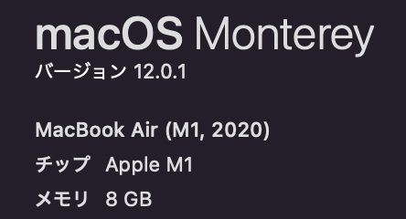
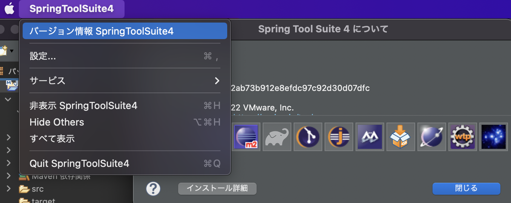
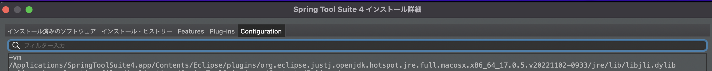
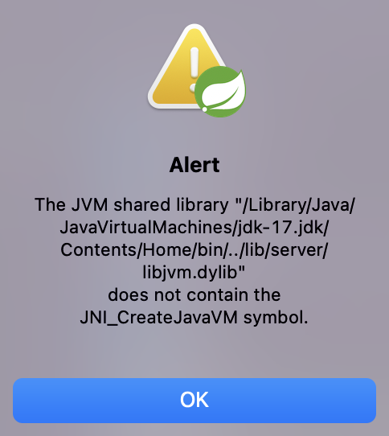
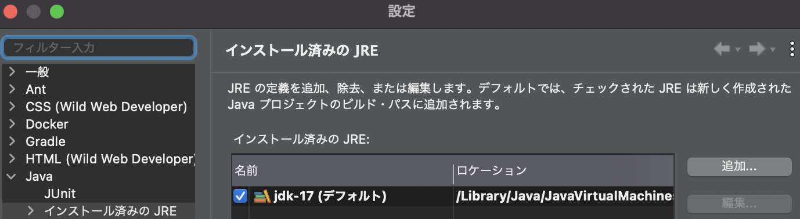
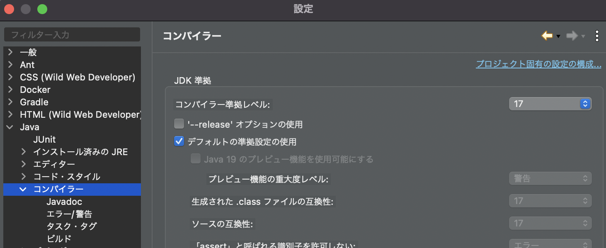

# Javaとは
[2022年のJavaまるわかり！最新バージョンからJavaを取り巻く環境まで](https://gihyo.jp/article/2022/07/java2022-0701)
[qiiita](https://qiita.com/nowokay/items/c1de127354cd1b0ddc5e)
## JDKとは

## JREとは


# 環境構築手順
## Javaのインストール
- [Oracle](https://www.oracle.com/java/technologies/downloads/)
- [azul](https://www.azul.com/downloads/?version=java-17-lts&os=macos&architecture=arm-64-bit&package=jdk)
からダウンロードするが、Installerの選択にはPCの確認が必要


### MACのバージョン確認
Macの場合、`M1`か`Interl`の確認をしてからDLする必要がある。
Macの「このMacについて」からチップを確認する。
- M1の場合：`Arm 64` DMG Installerを選択
- Intelの場合：`x64` DMG Installerを選択

DL後は展開して、承認すれば、インストール完了



### Javaのバージョン確認
現在使われているjavaのバージョン確認
> java -version

インストールされているすべてのJavaの確認
> /usr/libexec/java_home -V

出力例。バージョンとJavaがインストールされているパスが返却される
```
Matching Java Virtual Machines (4):
    17.0.6 (arm64) "Oracle Corporation" - "Java SE 17.0.6" /Library/Java/JavaVirtualMachines/jdk-17.jdk/Contents/Home
    1.8.351.10 (x86_64) "Oracle Corporation" - "Java" /Library/Internet Plug-Ins/JavaAppletPlugin.plugin/Contents/Home
    1.8.0_352 (x86_64) "Eclipse Temurin" - "Eclipse Temurin 8" /Library/Java/JavaVirtualMachines/temurin-8.jdk/Contents/Home
    1.8.0_351 (x86_64) "Oracle Corporation" - "Java SE 8" /Library/Java/JavaVirtualMachines/jdk1.8.0_351.jdk/Contents/Home
/Library/Java/JavaVirtualMachines/jdk-17.jdk/Contents/Home
```


### Javaのアンインストール
javaがインストールされているパスのフォルダを指定することで、環境をアンインストールすることが可能
> sudo rm -fr [path_to_jdk]


### Javaの切り替え
JAVA＿HOMEを設定する。[ver]の部分に切り替えたいjavaのバージョンを入れる
```
export JAVA_HOME=`/usr/libexec/java_home -v "[ver]"`
```

パスを通す。
> PATH=$JAVA_HOME/bin:$PATH

改めてjavaのバージョンを確認すると、バージョンが変更されている。


## STSのインストール（MAC）
### STSとは
Springの公式ツールでEclipseベースのIDE

### インストール
sts4.xは、[公式サイト](https://spring.io/tools)    
sts3.xは、[公式サイト](https://dist.springsource.com/release/STS/index.html)


### STSのVM
STS(eclips)はJavaVMというJavaプログラムを実行するソフト内で起動する。

STSが起動すると読み込まれる`.ini`ファイルでvm環境をしている。

自分のPC上のjavaのバージョンとSTSのVMのバージョンを一致させておく必要があるので、注意。

#### iniファイルの確認
STSのアプリケーションを`control`を押しながらクリックすると`パッケージの内容を表示`が選択できるので選択し、以下のパスを確認する

STS3の場合
> Contents/Eclips/STS.ini

STS4の場合
> Contents/Eclips/StringToolSuite4.ini


#### 立ち上がっているSTSからvmの確認
ウィンドウのSTSから「バージョン情報」を選択「インストール詳細」から「Configuration」を選択


`-vm`の項目に記載されているのがvmで利用されているjavaのパス



### トラブルシューティング
#### STS3の環境構築
iniファイルにおいて`-vm`で指定されているパスがvmで利用しているjavaのパス

STS3の場合、Javaのver17をiniファイルで指定すると以下のエラーが出る
```
-vm
/Library/Java/JavaVirtualMachines/jdk-17.jdk/Contents/Home/bin
```




Javaのver1.8を指定する場合、M1対応のjdkがないためか、立ち上がっても、うまく開発できない。(stringすらインストールできていないポイ)
```
-vm
/Library/Java/JavaVirtualMachines/jdk1.8.0_351.jdk/Contents/Home
```


#### STS4の環境構築
iniファイルでは、STS内で指定されているver17のjavaが動いている。
```
-vm
../Eclipse/plugins/org.eclipse.justj.openjdk.hotspot.jre.full.macosx.x86_64_17.0.5.v20221102-0933/jre/lib/libjli.dylib
```

なので、PC側のjavaのバージョンもver17とする。


### STS内部でjavaバージョンを指定
ウィンドウから`設定`を選択。

ナビゲーションペインから、`Java/インストール済みのJRE`で利用するJREを指定する。



また、ナビゲーションペインから`Java/コンパイラー`でコンパイルするときのjavaのバージョンを指定する。




### STSの特徴
STS内部にWebサーバーを含んでいるため、Tomcatの設定などをしなくても、STS内でアプリを実行することができる。

#### jarファイルとwarファイル
warファイルの中身は、アプリのみが格納されているため、WebServer(Tomcat)に配置して、実行する必要があった。
jarファイルの中身は、アプリとWebサーバーが格納されているため、jarファイルのみでアプリの実行が可能となる。

#### jarファイルの作成
> 実行/Mavenのインストール

stsプロジェクトのtargetフォルダにjarファイルが作成される。
作成されたjarファイルに対して、実行することでもアプリを立ち上げることができる。
> java -jar xxx.jar


### ライブラリを追加する
pom.xmlに依存関係を追加する

例えばThymeleafを追加したい場合、pomの[dependencies]に以下を追加する
```
<dependency>
    <groupId>org.thymeleaf</groupId>
    <artifactId>thymeleaf-spring6</artifactId>
    <scope>compile</scope>
</dependency>
```

追加して、pom.xmlを保存するだけで、Maven依存関係のフォルダに必要なライブラリたちをDLしておいてくれる。


## mavenとは
POM(Project Object Model)という考え方に基づいて、プロジェクトのビルド、テスト、ドキュメンテーション、成果物の配備などプロジェクトのライフサイクルを管理するもの。
プロジェクトに関わる情報はPOMに集約する。
### インストール
インストールできるApach Maveを確認
> brew search maven

インストール

> brew install maven

動作確認

> mvn --version

### mavenの各コマンド
#### mvn compile
src/main/java/配下のソースファイルのコンパイルが行われます。
コンパイルにより作成されたクラスファイルはtarger/classesディレクトリに出力されます。

#### mvn test
デフォルてで、以下のパターンにマッチするファイルが実行される
- ＊＊/Test＊.java
- ＊＊/＊Test.java
- ＊＊/＊TestCase.java

#### mvn packege
成功すると、targetディレクトリに**.jarファイルが作成される。  
作成されるjarファイルの名前はpom.xmlに記述されているartifactIdとversionできまる。


## 参考
- [Spring Tool Suite (STS)の環境構築(for Mac)](https://zenn.dev/nakohama/articles/7ed3953bae7f33)
- [Mavenとは何ぞや](https://qiita.com/ASHITSUBO/items/6c2aa8dd55043781c6b4)
- [初心者必見】Mavenまとめ](https://qiita.com/enzen/items/8546357f4e67357fe730)
- [java複数バージョンの切り替え](https://style.potepan.com/articles/16344.html)
- [pomの設定](http://www.code-magagine.com/?p=2346)