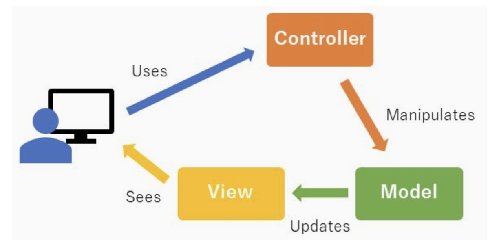
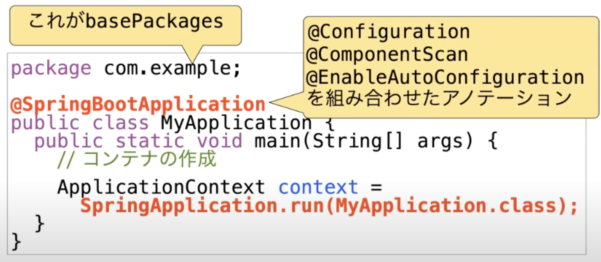
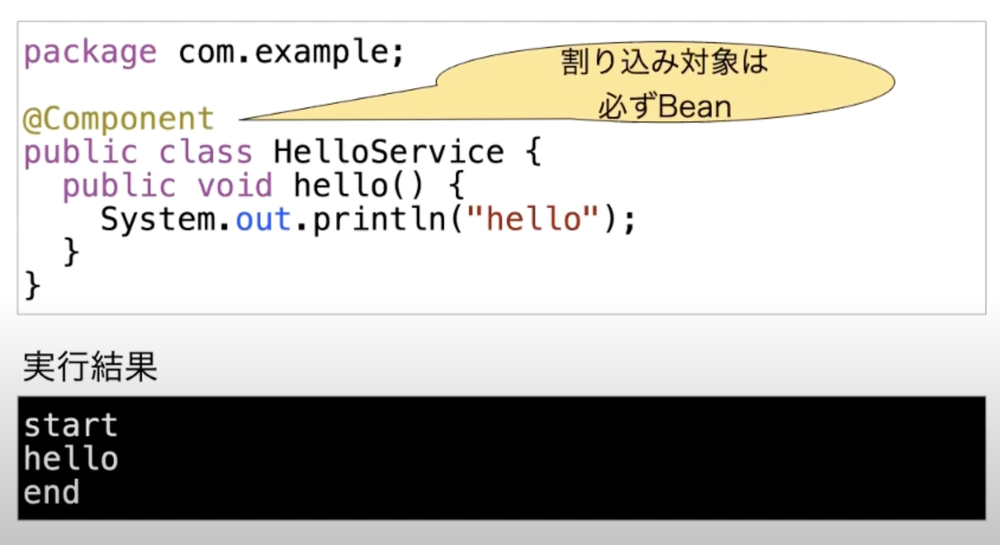

# java spring
## javaの学習目標
プロジェクト作る。必要なライブラリを準備する。実装していく。このプロセスを理解することができれば、どのようなAPPの全体設計であろうと実装することができていく。
最初に何をすれば良いのかという雛形を理解していくことがファーストステップとしての学習目標になるはず。


## MVCとは
アプリケーションフレームワークの一つ。アプリケーションの処理を Model/View/Controllerの３つに分ける。  
ユーザーに提供するUI部分とデータを処理・操作するバックエンド部分に分ける



### Model
データやDBへのアクセスなどを担う

DBから取得したデータをアプリで扱いやすい変換する処理も担う。

### View
クライアントからの入力の受付やクライアントへの出力などを担う

レイアウトやボタン操作なども担い、WebブラウザにHTMLを返す。
MVCではThyeleafを利用して、テンプレートとデータを組み合わせてHTMLを生成する。

### Controller
ModelとViewをつなぐ。

Viewが受け取るクライアントからの入力をModelへ渡して処理を行い、Viewへ処理内容を連携する。


## レイヤ構造
### アプリケーション層
ControllerとViewを作成する。
- Controllerでは、pathとメソッドの紐付け、viewとやり取りするためにmodelへのAttributeの追加などを記述。
- Viewでは、JSPなどを記述して画面表示する内容を記述。


### ドメイン層
#### Service
処理の開始と終了までで、一つのトランザクション単位であることを目安とする

#### Repository
DBにアクセスするものをRepositoryとしてまとめている。
ドメイン層では、Interfaceだけを定義して、実態はインフラストラクチャ層のImplで実装する。
どのようにデータアクセスしているかは隠蔽されている。

### インフラストラクチャ層
#### Repository Implement
Domain Objectのライフサイクル管理を行う。


## Springとは
MVCの考え方からSpring MVCという考え方が生まれる。
SpringMVCはライブラリなどが多くて、扱いが難しかった。
SpringMVCを使いやすくしたフレームワークとしてSpringBootが生まれた。

## DI（依存性の注入とは）
依存性の注入とは、分解して具体的に言語化すると

依存性＝必要なインスタンス

注入＝自動的代入

すなわち、依存しているメソッド間のインスタンスのやり取りをコンテナが担うことで、依存性を下げてあげますよという考え方。

### Springのコンテナ
Springではコンテナを持っている。コンテナとは、Javaのインスタンスの入れ物である。
コンテナで管理されるインスタンスをBeanと呼ぶ  
コンテナはDispacherServletの中で管理されている。


#### Beanの定義方法
コンテナに対して、自分はコンテナに管理してほしいインスタンスですと教える方法が４つあり、２つが主流。
1. ★Component-scan★
2. ★Java Config★
3. 関数型Bean定義
4. XML

##### コンポーネントスキャン
メソッド側で、僕はBeanになりたいですと立候補しておくイメージ。

対象となっているパッケージから＠Componentが付いたクラスを探す。
見つけたら、インスタンス化して、Beanとしてコンテナに保存する

以下のアノテーションは@Componentをつけたのと同じ効果がある
- @Repository
- @Service
- @Configuration
- @Controller
- @RestController
- @ControllerAdvice
- @RestControllerAdvice

対象とするパッケージは、設定クラス(JavaConfig)で定義してあげる必要がある
以下で指定した場合、com.example配下の全てのパッケージがスキャン範囲となる。  
※basePackeageを明示的に指定しないと、ConfigのパッケージがbasePackageとなる。（今回だとcom.example.config)
```
packege com.example.config;

@Configuration
@ComponentScan(basePackage="com.example")
public class AppConfig{}
```


##### Java Config
Java Configという集会所を作っておいて、そこにBeanになりたい人にきてもらうイメージ

Java Configクラスを作成して、JavaConfigのなかで、@Beanをつけてメソッドを作成すると、戻り値がBeanになる。
以下の例だと、返り値がBeanとなる
```
@Configuration
public class AppConfig{
    @Bean
    public Hoge hoge(){
    return new Hoge()
    }
}
```

#### コンテナの作成とBeanの取得方法
Java Configを指定して、コンテナを作成する。 コンテナはApplicationContextとして作成される。

Beanの取得はインスタンスの型を指定してgetBeanメソッドで取得
```
// コンテナ作成
ApplicationContext context = new AnnotationConfigApplicationContext(App.Config.class);

//Beanの取得
Hoge　hoge = context.getBean(Hoge.class);
```

### Spring BootにおけるJavaConfig
SpringBootにおいては`@SpringBootApplication`があるクラスがJavaConfigとなる。

@SpringBootApplicationは以下３つのアノテーションの役割を担う
- @Configuration
- @ComponentScan
- @EnableAutoConfiguration

明示的にbaseComponentが指定されていないので、@SpringBootApplicationのパッケージがbasePackeageとなる



#### コンテナの機能
コンテナの主な機能は３つDI、スコープ定義、プロキシ作成

##### コンテナの機能①DI（依存性の注入）
objectAにobjectBが必要な時、objectAはobjectBに依存している状態である。
objectAの内部で、objectBをnewすると、objectBのメンテナンスや差し替えが大変になる。
ここで、依存性の注入（必要なインスタンスの自動的代入）をすることにより、object同士の結合が疎になるので、メンテナンスがしやすくなる。

Autowiredによる注入はコンストラクタに、@Autowiredのメンションを付与して引数に必要なBeanを指定すると、コンテナが、DIしてくれる。


DIには以下の３つの方法があるが基本的にはコンストラクタインジェクションが主流
1. コンストラクタインジェクション
2. setterインジェクション
3. フィールドインジェクション


##### コンテナの機能②スコープの定義
スコープとはコンテナが管理するBeanの有効範囲である。 基本的に、Beanは使いまわされることが前提のSingletonで生成される。

- Singleton:インスタンスは１つで使いまわされる
- prototype:必要な時にインスタンスが毎回作られる
- session:セッションと同じ単位で使われる
- request:リックエスト同じ谷で使われる

指定の方法としては、@Scopeを@Componentと一緒に指定する
```
@Scope
@Component
public class Hoge{..}
```

##### コンテナの機能③プロキシの作成
Beanを作成するときに元々のメソッドからインスタンスを作成して、それをそのままBeanにするのではなくて、Wrapしてから必要機能を追加したBeanをプロキシと呼ぶ。

AOPを実現するためにも利用されている技術。


## AOP（Aspect Oriented Programming）とは
本来の処理の前後に割り込み処理を行う。
- トランザクションの開始
- トランザクションの終了
- 権限チェック

割り込めるのは開始・終了（正常・異常）・両方のいづれか

### AOPの書き方
JavaConfigクラスに@EnableAspectJAutoProxyを書く必要があるが、springは書かなくてもデフォルトでONになっている。

割り込みしたい処理の書き方は@Aspectをつける


割り込まれる対象の処理は、対象のパッケージは以下にあるBean



## pomとは
Project Object Modelの略  
プロジェクトのビルド内容を設定するファイル


### 基本設定項目
ルートノードで、POMのバージョン指定や読み込み、XMLスキーマの指定
```
<project xmlns="http://maven.apache.org/POM/4.0.0" 
        xmlns:xsi="http://www.w3.org/2001/XMLSchema-instance"
        xsi:schemaLocation="http://maven.apache.org/POM/4.0.0 http://maven.apache.org/xsd/maven-4.0.0.xsd">
```

Mavenモデルのバージョン指定
```
  <modelVersion>4.0.0</modelVersion>
```

プロジェクトの情報
```
  <groupId>com.TEST.PJ</groupId> #プロジェクトの開発者ID
  <artifactId>TESTPJ-APP</artifactId> #プロジェクトのID
  <version>0.0.1-SNAPSHOT</version> # プロジェクトのバージョン
  <packaging>jar</packaging> # パッケージ化する場合の種別
  <name>TEST-app</name> # アプリケーション名（自由）
  <url>http://maven.apache.org</url> # プロジェクトのWebサイト
 ```

pomで利用される属性
```
  <properties>
    <project.build.sourceEncoding>UTF-8</project.build.sourceEncoding>
  </properties>
```


### 依存するライブラリの設定項目
このプログラムがどのプログラムに依存しているかの記述を行う

javaには多くのライブラリが存在している（aws、github連携やjsonを扱うものなど）  
これらのライブラリはさらに他の別のライブラリを利用しており、これらの管理は非常に面倒。  
これを一括で管理してくれるのがmaven君であり、maven君に利用したいライブラリの情報を渡すための窓口がpom.xml

pom.xmlのdependencyで利用したいライブラリを設定しておくとmaven君は必要なライブラリ全てをリポジトリからDLしてくれる。
収集したライブラリはローカルの.m2ファイルに格納してくれる。
mavenで作成したソースをコンパイするすると、jarファイルが作成されるが、jarファイルは早い話がzipファイルであり、jarファイルを解凍するとその中に今回利用するライブラリのjarファイルが格納されている。

```
  <dependencies>
    <dependency>
      <groupId>junit</groupId>  # 必須：依存するグループID
      <artifactId>junit</artifactId># 必須：依存するアーティファクトID
      <version>3.8.1</version>　# 任意：指定しないと最新版
      <scope>test</scope> # テストの場合にのみ指定
    </dependency>
  </dependencies>
```

## アノテーション整理
Springが認識しているアノテーションを付与したパッケージ君はDIコンテナに入れられて使えるようになる。

### @SpringBootApplication
最初に実行されるコマンド。このアノテーションと同階層以下のパッケージについてスキャンされる
スキャンした中で、@Configurationがついているものを設定クラスとして認識する。

### @Controller
SpringBootにおいてControllerのクラスであることを認識させる

#### @RequestMappng
クライアントからのリクエストに対して、メソッドなどの対応付ができる  
`return`で返却されるStringはViewResolverでファイル名に変換されてクライアントに返却される。

### @Service
ServiceImplに記述する。Serviceであることを認識させる。
DIの対象(bean)となり、DIコンテナに登録される

### @Repository
RepositoryImplに記述する。 Repositoryであることを認識させる。

### @Override
親クラスのメソッドをオーバーライドするときに記述する。
オーバーライドするつもりでできていない。していないつもりでしていたというミスを防げる。

### @inject @Autowired
DIするためのメンション。Beanをコンテナから呼び出す

### @Transactional
トランザクション管理が行われる。
メソッド開始時と正常終了時にコミットが行われ、例外時にはロールバックされる。


## 技統本レクチャー

### 20221118　AWSで作るマイクロサービスアーキテクチャ
#### SpringSecurity
HandsONを試すとSpiringSecurityでログインとログアウトするだけのページが作成することができる。
Appのなかに、認証認可の仕組みを組み込むことができる。
OICDの認証認可も設定だけでできる！ただし設定項目は多い・・・
この設定さえ理解できれば、Cognitoでも、KeyCloakでもOktaでも良い
この記事の中にgithubがあって、ブランチが切れているので、セクションごとに分かれている
@Configurationを持っているやつをピックアップして、設定クラスと認定して、その配下にあるやつを対象にアプリを構築する
MVCConfigについては、WebMvcConfigurerを継承しているので、これを継承するだけで、SpringMVCに含まれる全てを使える
いろいろたくさん設定しないといけないのに、Bootのなかで組み込んでくれているので、設定をしてくれるのが便利だよ

コントローラーの@getMappinによって、@timeleafの仕様でhtmlファイルのファイル名を指定すれば、その対象ファイルを表示するようにコントロールしてくれる

SpringSecurityを使うための設定は二つ
1. pomにspring-boot-starter-securityなど３つdependencyを追加
2. securityのConfiguretionを作成する
   - @EnableWebSecurityのアノテーションを追加する（実質こいつは@Configurerationの機能を含んでいる 
   - WebSecurityConfigurerAdapterの関数を継承することで、こいつは設定をいろいろ読み込んでおいてくれる

web.ignoring().anMatchersは、Springの認証認可の対象から外す対象を決めることを意味する。
CustomUserDetaiol→ユーザーデータ
SuccessHandlerはログインが成功した時の挙動


## References
- [DIとAOPの神動画](https://www.youtube.com/watch?v=LGtdpsmMfvI)
- [アプリケーションのレイヤと役割](https://terasolunaorg.github.io/guideline/5.5.1.RELEASE/ja/Overview/ApplicationLayering.html)
- [MVCとSpring・コントローラーのアノテーション](https://qiita.com/TEBASAKI/items/267c261db17f178e33eb)
- [DIについてわかりやすい記事](https://qiita.com/rebi/items/31169e5bcd64b4411f19)
- [SpringBootからDIを説明](https://engineering.linecorp.com/ja/blog/spring-boot-job-report/)
