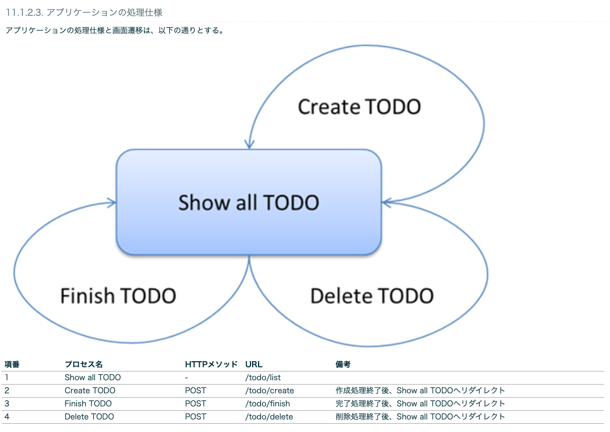

# チュートリアル１：TODOアプリケーション
[実施内容](http://terasolunaorg.github.io/guideline/5.7.0.RELEASE/ja/Tutorial/index.html)

## 環境構築
### PJの作成
`mvn archetype:generate`コマンドは設定したフォーマットのjavaのプロジェクトのひな壇を作成してくれる。
フォーマットを作成することもでき、ベストプラクティスに従った構成を素早く作成できる。

オプションの意味は以下
- archetypeGroupId:テンプレートの提供元ID
- archetypeArtifactId:今回利用するテンプレートのID
- archetypeVersion:テンプレートのバージョン
- groupId:PJの識別子
- artifactId:作成するJavaPJの名称
- version:PJのバージョン名

```
mvn archetype:generate -B\
 -DarchetypeGroupId=org.terasoluna.gfw.blank\
 -DarchetypeArtifactId=terasoluna-gfw-web-blank-archetype\
 -DarchetypeVersion=5.7.0.RELEASE\
 -DgroupId=com.example.todo\
 -DartifactId=todo\
 -Dversion=1.0.0-SNAPSHOT
```

### STSでのPJ立ち上げ
STSでImportする。  
詳細は[チュートリアル](http://terasolunaorg.github.io/guideline/5.7.0.RELEASE/ja/Tutorial/TutorialTodo.html#id13)に有り

### PJ構成
javaのPJ構成とそれぞれの役割
- src/main/java：ここにModel操作やControllerのjavaクラスを格納
- src/main/resources：Viewに当たるリソースを置く
  - static:cssやjsを置く
  - template:htmlを置く
  - application.proparties：ポートの設定など
```
src
  └main
      ├java... (1)
      │  └com
      │    └example
      │      └todo
      │        ├ app 
      │        │   └todo
      │        └domain 
      │            ├model 
      │            ├repository 
      │            │   └todo
      │            └service 
      │                └todo
      ├resources... (2)
      │  └META-INF
      │      └spring 
      └wepapp
          └WEB-INF
              └views 
```

### PJの動作確認
`src/main/java/com/example/todo/app/welcome/HelloController.java`のプロジェクトはトップページが準備されている。

★1
@ControllerのアノテーションによりControllerであることを認識させる

★2
@RequestMappingにより`/`のGETとPOSTに対してhomeというメソッドを紐付け。
処理内容はログの出力、日時の取得、日時情報をモデルに引き渡し、Viewへの連携

★3
ModelにAttribute（変数）を引き渡している。
model側でserverTimeという変数名が使える。

★4
viewのファイル名で、画面を表示先を指定  
ViewResolverで`src/main/webapp/WEB-INF/views/welcome/home.jsp`配下のファイルが指定されている


```

/**
 * Handles requests for the application home page.
 */
 
// ★★★★★1★★★★★
@Controller
public class HelloController {

    private static final Logger logger = LoggerFactory
            .getLogger(HelloController.class);

    /**
     * Simply selects the home view to render by returning its name.
     */

    // ★★★★★2★★★★★
    @RequestMapping(value = "/", method = {RequestMethod.GET, RequestMethod.POST})
    public String home(Locale locale, Model model) {

        logger.info("Welcome home! The client locale is {}.", locale);

        Date date = new Date();
        DateFormat dateFormat = DateFormat.getDateTimeInstance(DateFormat.LONG,
                DateFormat.LONG, locale);

        String formattedDate = dateFormat.format(date);

        // ★★★★★3★★★★★
        model.addAttribute("serverTime", formattedDate);

        // ★★★★★4★★★★★
        return "welcome/home";
    }

}
```


## Todoアプリケーションの作成
ドメイン層とアプリケーション層のステップで作成する。  
ドメイン層では、Model、Repository、Serviceを作成する。
Modelは変数定義を記述 。
RepositoryはInterfaceとImplementを作成して、中身としては業務を含まないCRUD処理を記述。
Serviceは業務まで含んだ、エラーメッセージのハンドリングまで含めて記述。

アプリケーション層では、ControllerとViewを作成する。
Controllerでは、pathごとのメソッド作成や、viewとやり取りするmodelへのAttributeの追加などを記述。
Viewでは、JSPを記述して画面表示する内容を記述。


### Domain層の作成
ドメイン層では、Model、Repository、Serviceを作成する。
Modelは変数定義を記述 。
RepositoryはInterfaceとImplementを作成して、中身としては業務を含まないCRUD処理を記述。
Serviceは業務まで含んだ、エラーメッセージのハンドリングまで含めて記述。


#### Model作成
src/main/java/com/example/todo/domain/model配下に作成

各プロパティとGetter・Setterを作成
- todoId：ID
- todoTitle：タイトル
- finished：完了フラグ
- createdAt：作成日

```
package com.example.todo.domain.model;

import java.io.Serializable;
import java.util.Date;

public class Todo implements Serializable {

    private static final long serialVersionUID = 1L;

    private String todoId;

    private String todoTitle;

    private boolean finished;

    private Date createdAt;

    public String getTodoId() {
        return todoId;
    }

    public void setTodoId(String todoId) {
        this.todoId = todoId;
    }

    public String getTodoTitle() {
        return todoTitle;
    }

    public void setTodoTitle(String todoTitle) {
        this.todoTitle = todoTitle;
    }

    public boolean isFinished() {
        return finished;
    }

    public void setFinished(boolean finished) {
        this.finished = finished;
    }

    public Date getCreatedAt() {
        return createdAt;
    }

    public void setCreatedAt(Date createdAt) {
        this.createdAt = createdAt;
    }
}
```

#### Repository作成
##### Repository Interface作成
Interfaceから作成する

src/main/java/com/example.todo.domain.repository.todo配下にTodoRepository.javaを作成

各関数の引数と返り値のみが定義される。（中身はImplで作成）
記述する機能としては、業務とは独立したデータのCRUD処理のみ記述される
- findById
- findAll
- create
- update
- delete
- countByFinished

```
package com.example.todo.domain.repository.todo;

import java.util.Collection;
import java.util.Optional;

import com.example.todo.domain.model.Todo;

public interface TodoRepository {
    Optional<Todo> findById(String todoId);

    Collection<Todo> findAll();

    void create(Todo todo);

    boolean update(Todo todo);

    void delete(Todo todo);

    long countByFinished(boolean finished);
}
```

##### Repository Implementの作成
Implementを作成する

src/main/java/com/example.todo.domain.repository.todo配下にTodoRepositoryImpl.javaを作成

各関数の具体的な処理内容が記載される。
Interfaceで記述した機能について@Overrideして追記
- findById
- findAll
- create
- update
- delete
- countByFinished


★1  
Impl側に@Repositoryを記述する。

```
package com.example.todo.domain.repository.todo;

import java.util.Collection;
import java.util.Map;
import java.util.Optional;
import java.util.concurrent.ConcurrentHashMap;

import org.springframework.stereotype.Repository;

import com.example.todo.domain.model.Todo;

// ★★★★★1★★★★★
@Repository  
public class TodoRepositoryImpl implements TodoRepository {
    private static final Map<String, Todo> TODO_MAP = new ConcurrentHashMap<String, Todo>();

    @Override
    public Optional<Todo> findById(String todoId) {
        return Optional.ofNullable(TODO_MAP.get(todoId));
    }

    @Override
    public Collection<Todo> findAll() {
        return TODO_MAP.values();
    }

    @Override
    public void create(Todo todo) {
        TODO_MAP.put(todo.getTodoId(), todo);
    }

    @Override
    public boolean update(Todo todo) {
        TODO_MAP.put(todo.getTodoId(), todo);
        return true;
    }

    @Override
    public void delete(Todo todo) {
        TODO_MAP.remove(todo.getTodoId());
    }

    @Override
    public long countByFinished(boolean finished) {
        long count = 0;
        for (Todo todo : TODO_MAP.values()) {
            if (finished == todo.isFinished()) {
                count++;
            }
        }
        return count;
    }
}
```

#### Service作成
##### Service Interfaceの作成
Interfaceから作成する。

src/main/java/com/example/todo/service/todo配下にTodoService.javaを作成する。

各関数の引数と返り値のみが定義される。（中身はImplで作成）
- findAll
- create
- finish
- delete

記述する機能としては、アプリケーションとしての業務処理を行うメソッド



```
package com.example.todo.domain.service.todo;

import java.util.Collection;

import com.example.todo.domain.model.Todo;

public interface TodoService {
    Collection<Todo> findAll();

    Todo create(Todo todo);

    Todo finish(String todoId);

    void delete(String todoId);
}
```


##### Service Implementの作成
Implementを作成する。

src/main/java/com/example/todo/service/todo配下にTodoServiceImpl.javaを作成する。

エラーメッセージのハンドリングなど、業務的なロジックについて実装している


★1  
ServiceImpl側でアノテーションを付与する

★2  
@Transactionalはトランザクション管理で、３章のみを行う処理にreadOnly=trueを付与する

★3  
@InjectでRepositoryで実装した機能を利用する

```
package com.example.todo.domain.service.todo;

import java.util.Collection;
import java.util.Date;
import java.util.UUID;

import javax.inject.Inject;

import org.springframework.stereotype.Service;
import org.springframework.transaction.annotation.Transactional;
import org.terasoluna.gfw.common.exception.BusinessException;
import org.terasoluna.gfw.common.exception.ResourceNotFoundException;
import org.terasoluna.gfw.common.message.ResultMessage;
import org.terasoluna.gfw.common.message.ResultMessages;

import com.example.todo.domain.model.Todo;
import com.example.todo.domain.repository.todo.TodoRepository;

// ★★★★★1★★★★★
@Service

// ★★★★★2★★★★★
@Transactional 
public class TodoServiceImpl implements TodoService {

    private static final long MAX_UNFINISHED_COUNT = 5;

    // ★★★★★3★★★★★
    @Inject
    TodoRepository todoRepository;

    @Override
    @Transactional(readOnly = true) 
    public Collection<Todo> findAll() {
        return todoRepository.findAll();
    }

    @Override
    public Todo create(Todo todo) {
        long unfinishedCount = todoRepository.countByFinished(false);
        if (unfinishedCount >= MAX_UNFINISHED_COUNT) {
            ResultMessages messages = ResultMessages.error();
            messages.add(ResultMessage
                    .fromText("[E001] The count of un-finished Todo must not be over "
                            + MAX_UNFINISHED_COUNT + "."));
            
            throw new BusinessException(messages);
        }

        
        String todoId = UUID.randomUUID().toString();
        Date createdAt = new Date();

        todo.setTodoId(todoId);
        todo.setCreatedAt(createdAt);
        todo.setFinished(false);

        todoRepository.create(todo);
        return todo;
    }

    @Override
    public Todo finish(String todoId) {
        Todo todo = findOne(todoId);
        if (todo.isFinished()) {
            ResultMessages messages = ResultMessages.error();
            messages.add(ResultMessage
                    .fromText("[E002] The requested Todo is already finished. (id="
                            + todoId + ")"));
            throw new BusinessException(messages);
        }
        todo.setFinished(true);
        todoRepository.update(todo);
        return todo;
    }

    @Override
    public void delete(String todoId) {
        Todo todo = findOne(todoId);
        todoRepository.delete(todo);
    }

    
    private Todo findOne(String todoId) {
        
        return todoRepository.findById(todoId).orElseThrow(() -> {
            ResultMessages messages = ResultMessages.error();
            messages.add(ResultMessage
                    .fromText("[E404] The requested Todo is not found. (id="
                            + todoId + ")"));
            return new ResourceNotFoundException(messages);
        });
    }
}
```

### アプリケーション層の作成
アプリケーション層では、ControllerとViewを作成する。
Controllerでは、pathごとのメソッド作成や、viewとやり取りするmodelへのAttributeの追加などを記述。
Viewでは、JSPを記述して画面表示する内容を記述。


#### Controllerの作成
src/main/java/com/example/todo/app/todo配下にTodoController.javaを作成する。

★1
@RequestMappngでTodoControllerで扱うパスの設定をしていく。
全ての処理はtodoの配下に設定される
```
package com.example.todo.app.todo;

import org.springframework.stereotype.Controller;
import org.springframework.web.bind.annotation.RequestMapping;

@Controller
// ★★★★★1★★★★★
@RequestMapping("todo") 
public class TodoController {

}
```

#### Show all Todoの作成
新規作成フォームとTODOの全件表示の機能を実装

src/main/java/com/example/todo/app/todo配下にTodoForm.javaを作成する。
```
package com.example.todo.app.todo;

import java.io.Serializable;

public class TodoForm implements Serializable {
    private static final long serialVersionUID = 1L;

    private String todoTitle;

    public String getTodoTitle() {
        return todoTitle;
    }

    public void setTodoTitle(String todoTitle) {
        this.todoTitle = todoTitle;
    }

}
```

##### TodoFormを作成する
TodoTitleのプロパティを追加する。
```
package com.example.todo.app.todo;

import java.io.Serializable;

public class TodoForm implements Serializable {
    private static final long serialVersionUID = 1L;

    private String todoTitle;

    public String getTodoTitle() {
        return todoTitle;
    }

    public void setTodoTitle(String todoTitle) {
        this.todoTitle = todoTitle;
    }

}
```
##### Controllerの修正
@modelAttributeで画面側に渡す変数を設定。

★1  
@ModelAttributeでmodelを作成して、formというvalueがtodoFormとしてAttributeに追加されている。


★2  
@GetMapping("list")の設定により todo/listへのアクセスがあると、findallの結果をattributeに追加して、画面はtodo/listに遷移

```
package com.example.todo.app.todo;

import java.util.Collection;

import javax.inject.Inject;

import org.springframework.stereotype.Controller;
import org.springframework.ui.Model;
import org.springframework.web.bind.annotation.GetMapping;
import org.springframework.web.bind.annotation.ModelAttribute;
import org.springframework.web.bind.annotation.RequestMapping;

import com.example.todo.domain.model.Todo;
import com.example.todo.domain.service.todo.TodoService;


@Controller
@RequestMapping("todo")
public class TodoController {
    @Inject 
    TodoService todoService;
    
    // ★★★★★1★★★★★
    @ModelAttribute 
    public TodoForm setUpForm() {
        TodoForm form = new TodoForm();
        return form;
    }
    
    
    // ★★★★★2★★★★★
    @GetMapping("list") 
    public String list(Model model) {
        Collection<Todo> todos = todoService.findAll();
        model.addAttribute("todos", todos); 
        return "todo/list"; 
    }
}
```


##### jspの修正
Controllerで受け取った変数を展開して、TODOのタイトルを表示する

src/main/webapp/WEB-INF-views/todo配下にlist.jspを作成する。

★1  
model.Attributeで渡されてtodosについてfor文で展開して、画面表示している。

```
<!DOCTYPE html>
<html>
<head>
<meta http-equiv="Content-Type" content="text/html; charset=UTF-8">
<title>Todo List</title>
<style type="text/css">
.strike {
    text-decoration: line-through;
}
</style>
</head>
<body>
    <h1>Todo List</h1>
    <hr />
    <div id="todoList">
        <ul>
            <!-- ★★★★★1★★★★★-->
            <c:forEach items="${todos}" var="todo">
                <li><c:choose>
                        <c:when test="${todo.finished}">
                            <span class="strike">
                            ${f:h(todo.todoTitle)}
                            </span>
                        </c:when>
                        <c:otherwise>
                            ${f:h(todo.todoTitle)}
                         </c:otherwise>
                    </c:choose></li>
            </c:forEach>
        </ul>
    </div>
</body>
</html>
```


## References
- [mvn archetype:generateコマンド](https://shunyaueta.com/posts/2021-07-18/)
- [javaPJの構成](https://qiita.com/aaaaaayyymmm/items/f5458d2302c11202136d)