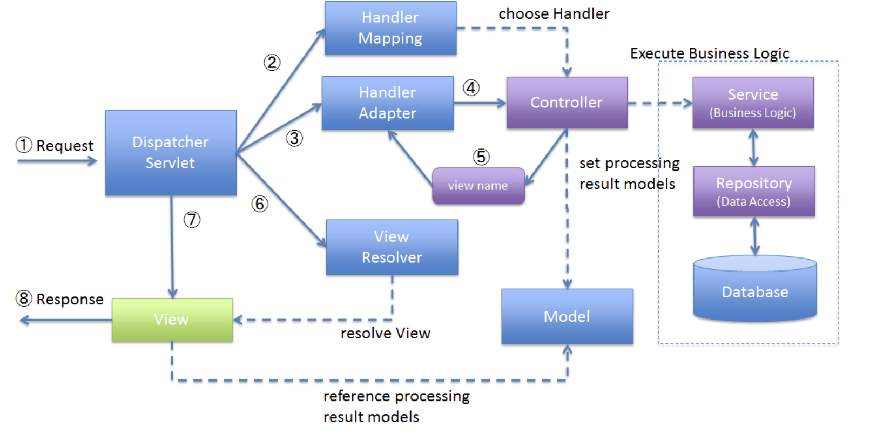

# チュートリアル11.2：RESTでのTODOアプリケーション
## REST API(REpresentational State Transfer)
Webシステムの設計思想であり、RESTであるための原則は4つ
- 統一インターフェース  
情報のやり取りについてあらかじめ定義されていること
「GET／POST／DELETE／PUT」などのHTTPリクエストを利用することやJSON形式であることなどを決めている。
- アドレス可能性  
全ての情報がURIを持つこと
- 接続性  
各エンドポイント間で接続できること
- ステートレス性  
やり取りが一回ずつで完結すること

## チュートリアルでやりたいこと
全件取得・一件取得・削除・完了状態などをRESTで設定できるようにする。

- GET api/v1/todos：全件取得
- GET api/v1/todos/{id}:一件取得
- POST api/v1/todos:新規作成
- Put api/v1/todos/{id}:完了状態
- DELETE api/v1/todos/{id}:削除

エラーメッセージもHTTPのレスポンスで返すようにする。エラーコードをキーとしてプロパティファイルから取得

## 実装
### DispatcherServletの設定
DispatherServletは、フロントでリクエストを受け取って裏側のjavaたちに処理を流していく。



#### web.xmlの修正
`src/main/webapp/WEB-INF/web.xml`に設定を追加する
REST用のMVC設定ファイルを`META-INF/spring/spring-mvc-rest.xml`に書き込むことを指定する。  
DispatcherServletにマッピングするURLを指定する。今回は`/api/v1/*`へのURLはDispathcerServletにマッピングする。  
```
<servlet>
    <servlet-name>restApiServlet</servlet-name>
    <servlet-class>org.springframework.web.servlet.DispatcherServlet</servlet-class>
    <init-param>
        <param-name>contextConfigLocation</param-name>
        <!-- ApplicationContext for Spring MVC (REST) -->
        <param-value>classpath*:META-INF/spring/spring-mvc-rest.xml</param-value>
    </init-param>
    <load-on-startup>1</load-on-startup>
</servlet>

<servlet-mapping>
    <servlet-name>restApiServlet</servlet-name>
    <url-pattern>/api/v1/*</url-pattern>
</servlet-mapping>
```

#### rest用の設定ファイルの作成
`META-INF/spring/spring-mvc-rest.xml`を作成  
component-scanの対象などを指定する。`com.example.todo.api`配下を指定して、apiの開発はこちらで実施する。

### REST APIのパッケージ作成
`com.example.todo.api.todo`というパッケージを作成する。  
api.todoパッケージの配下として作成するクラスは以下
- [NAME]Resource
- [NAME]RestController
- [NAME]Helper(必要なら)

### TodoResourceの実装
`src/main/java/com/example/todo/api/todo/TodoResource.java`を作成する

Domain層で作成した`com.example.todo.domain.model`のTodo.javaと同様の指定に見えるが、TodoResoueceではクライアントとのやり取りの中で扱う情報が定義されている。
Todo.javaで定義するのは、業務処理の中で扱うデータであるので、ここは明確に分ける。

### TodoRestControllerの実装
`src/main/java/com/example/todo/api/todo/TodoRestController.java`を作成する

この中で、各RESTの処理を記述していく

#### GETメソッド


#### POSTメソッド
#### PUTメソッド
#### DELETEメソッド


### 例外ハンドリングの実装
