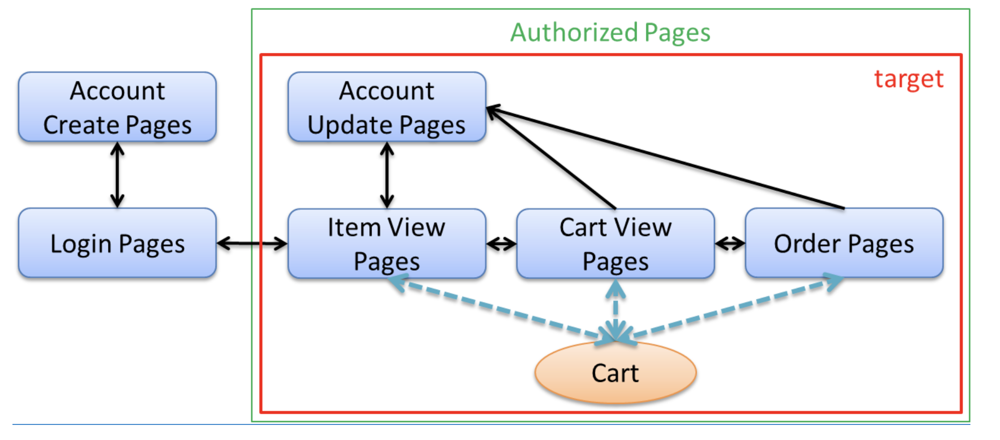

# チュートリアル11.3：セッション
## セッション管理
セッションを含むデータの管理設計やセッションを利用した実装の[チュートリアル](http://terasolunaorg.github.io/guideline/5.7.0.RELEASE/ja/Tutorial/TutorialSession.html)

セッションで管理対処となるデータについての設計
- セッションに格納するデータの選択
- セッションの中のデータの破棄

具体的な利用方法
- `@SessionAttributes`の利用
- Beanを利用する方法

## 作成するアプリケーションと設計

設計手順
1. 画面イメージにそって、各画面のURLとパラメータを設定する。
2. URLが決まれば、URLを制御するControllerも設定する。
3. 各画面で扱うデータを洗い出す
4. 洗い出したデータのライフサイクルを整理する  
    データがいつ作成されて、いつ破棄されるか、複数画面でやり取りするか
5. セッションの利用をメリデメから検討する
6. セッションをどのように実現するか検討するか
    
## セッションのメリットデメリット
セッションを利用すると複数画面のデータのやり取りが容易になるがデメリットもある。 基本的には使わない方針で、必要な時にセッションは使う
### メリット
セッションを利用するのは、クレジットカードなどのマスクが必要な情報
多数画面で利用される情報

### デメリット
- クライアント側が複数タブを利用していると整合性の担保を考慮する必要がある。
- 管理するデータのサイズによってはメモリが枯渇する
- サーバーがスケーリングなどで多重実行の場合に整合性の担保を考慮する必要がある。

## セッションをどのように実現するか
実現方法としては３つ挙げられる
- `@SessionAttributes` ：１つのController内で扱う情報である
- `SpringのセッションスコープのBean`：複数のControllerで扱う情報である
- `SpringSecurity`：認証情報に関わる情報である

実現方法に沿って、以下の内容についても考慮する
- 複数リクエストでセッション情報に同時アクセスする場合
- セッションのタイムアウトをどのように扱うか

## 実装
Controllerで@SessionControllerを定義してあげる。

BeanのスコープをSessionにするために@Componentの下で定義してあげる