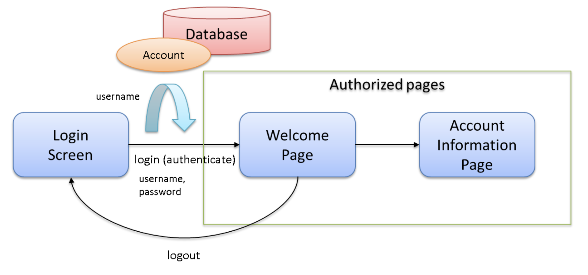

# チュートリアル11.4：Spring Security

## 作成するアプリケーション


- ログインページでID/Pass認証を行う。
- ID/PassはDBで管理しており、認証問い合わせを行う。(Spring Security)
- 認証しないとアクセスできないウェルカムページがある。
- ログアウトすることができる。(Spring Security)

## 基本的な処理の流れ
1. usernameを画面から受け取り、ユーザー情報を検索
2. ユーザー情報からusernameが見つかれば、passwordをハッシュ化したもので比較
3. パスワード比較が一致すれば認証、ユーザー情報がなかったり、パスワード一致しないと認証失敗

## アプリケーションの作成
プロジェクトを作成する。
DBを利用するのでmybatisのプロジェクトとする
```
mvn archetype:generate -B\
 -DarchetypeGroupId=org.terasoluna.gfw.blank\
 -DarchetypeArtifactId=terasoluna-gfw-web-blank-mybatis3-archetype\
 -DarchetypeVersion=5.7.0.RELEASE\
 -DgroupId=com.example.security\
 -DartifactId=first-springsecurity\
 -Dversion=1.0.0-SNAPSHOT
```

## ドメイン層の実装
Model・Repository・Serviceを作成する。

### Modelの作成
認証情報（usernameとpassword)を保持するAccountクラスを作成する。
`src/main/java/com/example/security/domain/model/Account.java`


### Repositoryの作成
Accountのオブジェクトをデータベースに問い合わせる処理を実装する。

まずは、Interfaceを実装する。
`src/main/java/com/example/security/domain/repository/account/AccountRepository.java`
```
package com.example.security.domain.repository.account;

import com.example.security.domain.model.Account;

import java.util.Optional;

public interface AccountRepository {
    Optional<Account> findById(String username);
}

```


次に、Implを実装する。Mybatisに問い合わせるSQLをMapperファイルに記述する。
`src/main/java/com/example/security/domain/reporitory/account/AccountRepository.xml`
```
<?xml version="1.0" encoding="UTF-8"?>
<!DOCTYPE mapper PUBLIC "-//mybatis.org//DTD Mapper 3.0//EN"
    "http://mybatis.org/dtd/mybatis-3-mapper.dtd">
<mapper namespace="com.example.security.domain.repository.account.AccountRepository">

    <resultMap id="accountResultMap" type="Account">
        <id property="username" column="username" />
        <result property="password" column="password" />
        <result property="firstName" column="first_name" />
        <result property="lastName" column="last_name" />
    </resultMap>

    <select id="findById" parameterType="String" resultMap="accountResultMap">
        SELECT
            username,
            password,
            first_name,
            last_name
        FROM
            account
        WHERE
            username = #{username}
    </select>
</mapper>
```
### Serviceの作成
ユーザー名から、Accountオブジェクトを取得する処理を実装する。
今回の処理は、SpirngSecurityの認証サービスから呼び出されるため、共通処理であるShareを名前につける

業務処理的な中身を記述するので、usernameが見つからなかった場合にエラーメッセージを発行する。

まずは、Interfaceを実装する。
`src/main/java/com/example/security/domain/service/account/AccountShareService.java`

次に、Implを実装する
`src/main/java/com/example/security/domain/service/account/AccountShareServiceImpl.java`
```
@Service
public class AccountSharedServiceImpl implements AccountSharedService {
    @Inject
    AccountRepository accountRepository;

    @Transactional(readOnly=true)
    @Override
    public Account findOne(String username) {
        // (1)
        return accountRepository.findById(username).orElseThrow(() -> {
            ResultMessages messages = ResultMessages.error();
            messages.add(ResultMessage.fromText(
                    "The given account is not found! username=" + username));
            return new ResourceNotFoundException(messages);
        });
    }
```

### 認証サービスの作成
SpringSecurityで利用する、アカウント情報を保持するクラスを作成する。
このクラスに、本プロジェクトで扱うアカウント情報が渡されると、SpringSecurityで利用するアカウント情報に変換してくれる。
`src/main/com/example/security/domain/service/userdetails/SampleUserDetail.java`

★1  
org.springframework.security.core.userdetails.Userを継承して、実装

★2  
親クラスのメソッドを呼び出して、SpringSecurityで扱うAccountオブジェクトを作成

★3  
getterを用意することで、ログインユーザーのAccountオブジェクトを取得

```
import org.springframework.security.core.authority.AuthorityUtils;
import org.springframework.security.core.userdetails.User;
import com.example.security.domain.model.Account;

public class SampleUserDetails extends User { //★★★★★1
    private static final long serialVersionUID = 1L;

    private final Account account; 
    
    public SampleUserDetails(Account account) {
        //★★★★★2
        super(account.getUsername(), account.getPassword(), AuthorityUtils.createAuthorityList("ROLE_USER")); 
        this.account = account;
    }
    
     //★★★★★3
    public Account getAccount() { 
        return account;
    }
}
```

---
Spring Securityで利用する認証ユーザーの情報を取得するサービスを作成する。
このプロジェクトでは、UserShareServiceを利用して、usernameからアカウントを特定。
アカウントをSampleUserDetailsを利用してSpringSecurityに利用できるアカウントに変換。
`src/main/com/example/security/domain/service/userdetails/SampleUserDetailService.java`

★1  
accountShareServiceを利用して、ユーザアカウントを特定

★2  
SampleUserDetailsに渡して、SpringSecurityで扱えるアカウント情報に変換

```
@Service
public class SampleUserDetailsService implements UserDetailsService { 
    @Inject
    AccountSharedService accountSharedService; 

    @Transactional(readOnly=true)
    @Override
    public UserDetails loadUserByUsername(String username) throws UsernameNotFoundException {
        try {
            //★★★★★1
            Account account = accountSharedService.findOne(username);
            //★★★★★2 
            return new SampleUserDetails(account); 
        } catch (ResourceNotFoundException e) {
            throw new UsernameNotFoundException("user not found", e); 
        }
    }
```


### DB初期化スクリプト
本チュートリアルでは、インメモリDBを利用しているのでプロジェクト実行時に、毎回DBを作成する必要がある。
ブランクPJでは、`jdbc:initialize-database`が設定されているので、ここにDDLとDMLを設定すれば初期に実行される
`src/main/resources/META-INF/spring/first-springsecurity-env.xml`
```
<jdbc:initialize-database data-source="dataSource"
    ignore-failures="ALL">
    <jdbc:script location="classpath:/database/${database}-schema.sql" encoding="UTF-8" />
    <jdbc:script location="classpath:/database/${database}-dataload.sql" encoding="UTF-8" />
</jdbc:initialize-database>
```

`src/main/resouces/database/H2-schema.sql`にDDLを設定する。
`src/main/resouces/database/H2-dataload.sql`にDMLを設定する。


## アプリケーション層の実装
### Spring Securityの設定
Spring Securityの設定ファイルに認証認可の設定を書き込む。  
各種URLの遷移制御や、認証に合わせた画面表示の認可の設定を行う。

`sec/main/resources/META-INF/spring/spring-security.xml`

★1  
ログインフォームのURLと認証に失敗した場合の遷移先を設定

★2  
ログアウトした際の遷移先URLと削除するCookie名

★3  
認可の設定。isAuthenticatedがあると、認証しないとアクセスできない。

★4  
認証設定で、sampleUserDetailsServiceを利用することを設定。

```
<!-- (1) -->
<sec:form-login
    login-page="/login/loginForm"
    authentication-failure-url="/login/loginForm?error=true" />

<!-- (2) -->
<sec:logout
    logout-success-url="/"
    delete-cookies="JSESSIONID" />

<!-- (3) -->
<sec:intercept-url pattern="/login/**" access="permitAll" />
<sec:intercept-url pattern="/**" access="isAuthenticated()" />
</sec:http>

<!-- (4) -->
<sec:authentication-provider user-service-ref="sampleUserDetailsService" />
</sec:authentication-manager>

```

### LoginFormを返すControllerの作成
loginのフォームに遷移させるControllerを作成
`src/main/com/example/security/app/login/LoginController.java`
```
@Controller
@RequestMapping("/login")
public class LoginController {

    @GetMapping("/loginForm") 
    public String view() {
        return "login/loginForm";
    }
}
```

Login用のJSPを作成
`src/main/webapp/WEB-INF/views/login/loginForm.jsp`

セッションスコープに格納される認証エラーの例外オブジェクトをJSPから取得できるようにする。
`src/main/webapp/WEB-INF/views/common/include.jsp`

### Welcomeページの作成
認証さればページで、ログインユーザーのオブジェクトにアクセスする。
アカウント情報を使って、ログインユーザーにWelcomeしてみよう

`src/main/webapp/WEB-INF/views/welcome/home.jsp`
```
<!DOCTYPE html>
<html>
<head>
<meta charset="utf-8">
<title>Home</title>
<link rel="stylesheet" href="${pageContext.request.contextPath}/resources/app/css/styles.css">
</head>

<!-- 認証情報を取得 -->
<sec:authentication property="principal.account" var="account" />

<body>
    <div id="wrapper">
        <h1>Hello world!</h1>
        <p>The time on the server is ${serverTime}.</p>
        
        <!-- 取得した情報から名前を表示 -->
        <p>Welcome ${f:h(account.firstName)} ${f:h(account.lastName)} !!</p>
        
        <!-- ログアウト用のフォーム -->
        <p>
            <form:form action="${pageContext.request.contextPath}/logout">
                <button type="submit">Logout</button>
            </form:form>
        </p>
        <ul>
            <li><a href="${pageContext.request.contextPath}/account">view account</a></li>
        </ul>
    </div>
</body>
</html>
```
